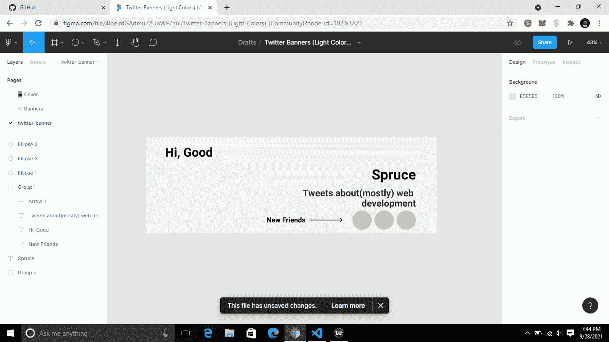
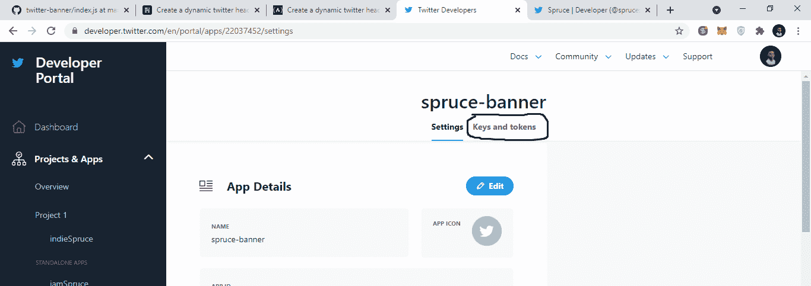
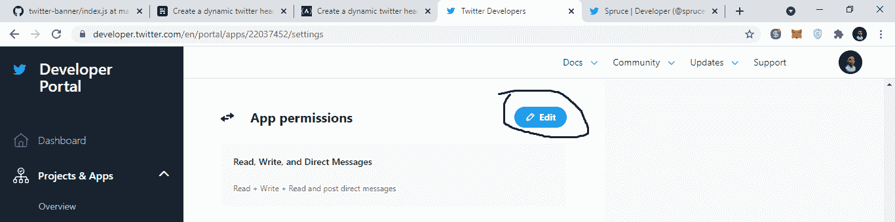
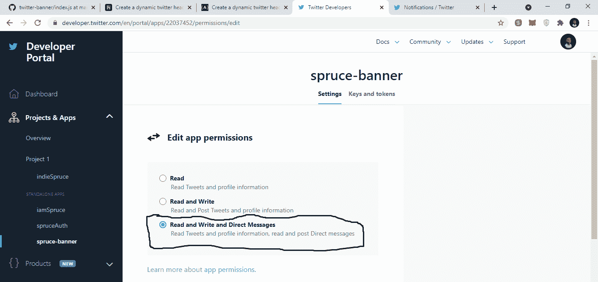
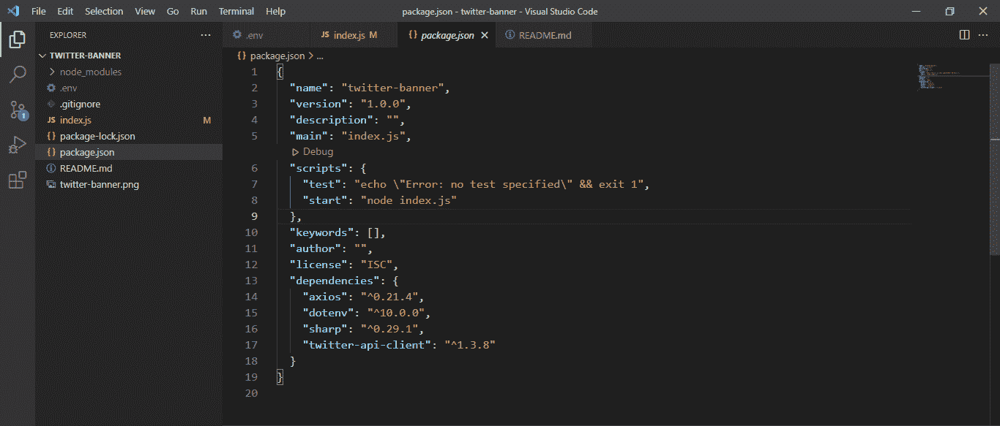
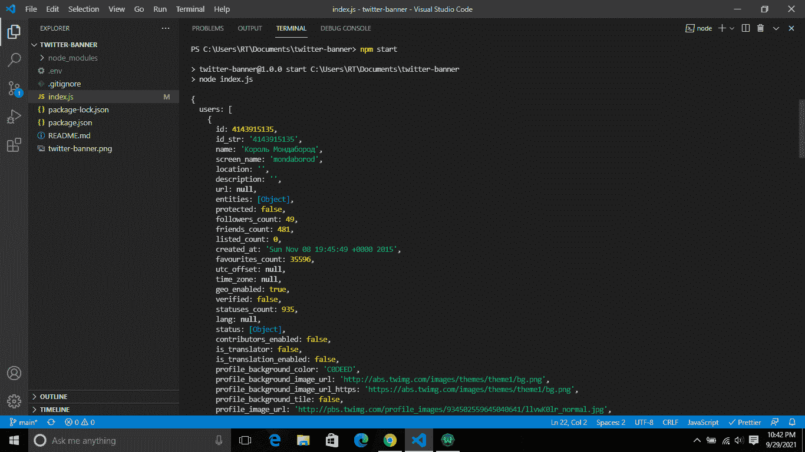
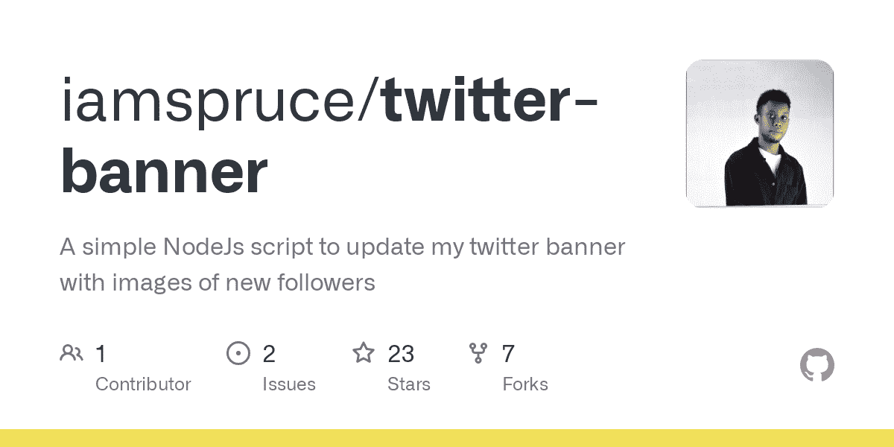
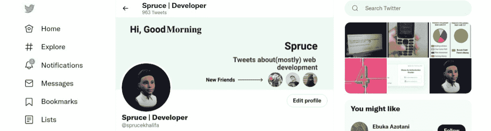

# 如何创建动态 Twitter 标题

> 原文：<https://www.freecodecamp.org/news/create-a-dynamic-twitter-header/>

2021 年年中，一种新的 Twitter 设计趋势出现了:动态更新的标题。开发人员认为静态标题很无聊，动态 Twitter 标题才是正确的选择。

从那以后，许多开发人员(包括我)一直在 Twitter 上创建动态横幅。但这实际上意味着什么呢？

这个想法是使用一个图像处理库以编程方式创建和添加多个图像，然后在 Twitter 上上传最终版本


这个想法为 Twitter 用户提供了许多可能性，因为你现在可以使用 Twitter 标题来展示或宣传任何你想要的东西。

事实上，一些开发者已经把它变成了 SaaS 的产品。但是在我的例子中，我只想保持它的最小化，只显示我当前的关注者和一条自定义的问候消息。这是我们将在这里构建的最终结果:


在本教程中，你将学习如何创建一个 Twitter 横幅，每隔 60 秒动态更新你当前关注者的个人资料图片。

那么你需要知道些什么来跟随这个教程呢？Node.js 和 JavaScript 的一些基础知识将非常有帮助，因此您可以从我们在这里学到的内容中获得最大收益。

# 入门指南

为了创建我们的动态 twitter 头，我们将使用`Nodejs`和`sharp`图像处理库。我们将使用`sharp`来创建并合并我们的动态标题。

首先，你需要一个新的横幅。为此你可以使用你最喜欢的图像编辑软件，但我用的是 Figma。

我打开 Figma，创建了一个新的 Twitter 横幅，名为`1500px x 500px`。然后，我添加了虚拟框和文本，以直观显示稍后我将使用`sharp`放置东西的位置。



## 如何创建 Twitter 应用程序

要继续，你需要一个 Twitter 开发者帐户。开发人员帐户允许您与 Twitter API 进行交互。如果你还没有开发者账户，去 Twitter 开发者门户创建一个。

要完全与 Twitter API 交互，比如拉推或者拉关注者，你需要一些访问键。

要获得这些访问密钥，您需要创建一个 Twitter 应用程序。因此，登录到您的仪表板，创建一个新的 Twitter 应用程序，用一个独特的名字。完成后，点击`keys and tokens`选项卡。



复制您的访问令牌，并将它们保存到剪贴板或文本文件中。然后点击`Generate secrets`，也复制这些。


此外，请点击“编辑”按钮更新您的 twitter 应用权限，这一点很重要:



单击“编辑”按钮后，继续选择“读取和写入直接消息”权限:



## 如何设置项目

打开你的代码编辑器，一旦你进入你选择的目录，打开你的终端。我用的是 Visual Studio 代码集成终端。继续创建一个新目录:

```
mkdir twitter-banner
```

然后您必须进入这个新目录，所以继续运行:

```
cd twitter-banner
```

进入该目录后，让我们通过运行以下命令来创建 Node.js 项目:

```
npm init -y
```

现在您有一个空的 Nodejs 项目，所以让我们继续安装我们需要的所有依赖项。

仍然在项目目录和您的终端中运行以下命令:

```
npm i dotenv axios sharp twitter-api-client
```

我们将使用`dotenv`来读取环境变量。`axios`让我们下载远程图像。`twitter-api-client`是我们用来建立和交流 Twitter 的。最后`sharp`是一个图像处理库，我们将在本教程中使用它来创建我们的动态标题。

在继续之前，您需要创建一个`.env`文件，并添加您之前从 Twitter 复制的访问密钥和密码:


用以下代码创建一个`index.js`文件:

```
// step 1
const dotenv = require("dotenv");
dotenv.config();
const { TwitterClient } = require("twitter-api-client");
const axios = require("axios");
const sharp = require("sharp");

// step 2
const twitterClient = new TwitterClient({
  apiKey: process.env.API_KEY,
  apiSecret: process.env.API_SECRET,
  accessToken: process.env.ACCESS_TOKEN,
  accessTokenSecret: process.env.ACCESS_SECRET,
});

// step 3
async function get_followers() {
  const followers = await twitterClient.accountsAndUsers.followersList({
    count: 3,
  });

  console.log(followers);
}

// call function
get_followers()
```

在这段代码中，我们导入已安装的依赖项，并将它们存储在变量中，例如`sharp = require("sharp")`。

第二步，我们连接到 Twitter。

最后，我们创建了一个函数`get_followers()`。使用我们的`twitter-api-client`获取我们的追随者，并使用`count`参数限制获取仅`3`追随者。

💡这里有一个提示:如果你生活在一个目前没有 Twitter 的国家(像我一样)，你可能需要在你的系统上安装一个 VPN。

现在打开您的`package.json`文件，添加一个启动脚本`"start": "node index.js"`，如下所示:



现在运行`npm start`，如果一切正常，你应该会在控制台上看到你的 3 个追随者:



## 如何从 Twitter 上获得关注者

首先，我们将从 Twitter 获取我们最近的关注者，这在上一节中已经做过了。只需用以下代码编辑您的`index.js`文件:

```
...
async function get_followers() {
  const followers = await twitterClient.accountsAndUsers.followersList({
    screen_name: process.env.TWITTER_HANDLE,
    count: 3,
  });

  const image_data = [];
  let count = 0;

  const get_followers_img = new Promise((resolve, reject) => {
    followers.users.forEach((follower, index,arr) => {
      process_image(
        follower.profile_image_url_https,
        `${follower.screen_name}.png`
      ).then(() => {
        const follower_avatar = {
          input: `${follower.screen_name}.png`,
          top: 380,
          left: parseInt(`${1050 + 120 * index}`),
        };
        image_data.push(follower_avatar);
        count++;
        if (count === arr.length) resolve();
      });

    });
  }); 
```

让我们稍微分解一下这段代码:首先我们创建了一个函数`get_followers()`。在这个函数中，我们获取了最近的关注者，并将它们保存在变量`followers`中。接下来，我们创建了一个名为`get_followers_img`的新`Promise`，并为每个追随者调用了一个函数`process_img()`:

```
process_image(
        follower.profile_image_url_https,
        `${follower.screen_name}-${index}.png`
      )
```

该函数接受两个参数:追随者图像 URL 和图像名称(为此我们使用了追随者的屏幕名称`${follower.screen_name}.png`)。

我想指出的另一件事是`follower_img_data`。还记得我说过我们将一起创建和添加多个图像吗？要在`sharp`中做到这一点，您需要三个属性:

1.  输入:文件的路径
2.  顶部:图像的垂直位置
3.  左侧:水平位置

我们将每个`follower_img_data`推到我们的`image_data`数组中:

```
image_data.push(follower_img_data);
```

最后，我们检查所有流程是否完成，然后解决:

```
...
count++;
if (count === arr.length) resolve();
```

## 如何处理图像

在上一步中，我们调用了一个尚未创建的函数`process_img()`。在这一步中，我们将创建该函数。

在您的`index.js`中用下面的代码创建函数:

```
...
async function process_image(url, image_path) {
  await axios({
    url,
    responseType: "arraybuffer",
  }).then(
    (response) =>
      new Promise((resolve, reject) => {
        const rounded_corners = new Buffer.from(
          '<svg><rect x="0" y="0" width="100" height="100" rx="50" ry="50"/></svg>'
        );
        resolve(
          sharp(response.data)
            .resize(100, 100)
            .composite([
              {
                input: rounded_corners,
                blend: "dest-in",
              },
            ])
            .png()
            .toFile(image_path)
        );
      })
  );
}
```

`sharp`不支持使用远程图像(图像不存储在您的文件系统中)，所以我们将使用`axios`从 Twitter 下载远程图像。最后，当我们的承诺兑现时，将使用`sharp`来调整图片大小，并使用`toFile(image_path)`将图片保存到我们的文件系统中。

> 注意:这里的 Buffer 指的是用于临时存储数据(在我们的例子中是图像)的内存存储。您可以像在文件系统中一样使用这些数据。

您还会注意到，我们创建了一个变量`rounded_corners`，其中我们用 svg 绘制了一个矩形:

```
const rounded_corners = new Buffer.from('
    <svg>
        <rect x="0" y="0" width="100" height="100" rx="50" ry="50"/>
    </svg>
');
```

为了使我们创建的矩形模仿圆形图像，它必须:

*   与我们调整后的图像大小相同`100`
*   让它的垂直和水平半径是我们调整后的图像大小的一半`50`

## 如何创建文本

一切都必须是图像，甚至是文本。要用`sharp`创建文本，我们必须将其创建为 SVG 图像，并保存在缓冲存储器中。现在在你的`index.js`文件中创建一个名为`create_text()`的函数:

```
...
async function create_text(width, height, text) {
  try {
    const svg_img = `
    <svg width="${width}" height="${height}">
    <style>
    .text {
      font-size: 64px;
      fill: #000;
      font-weight: 700;
    }
    </style>
    <text x="0%" y="0%" text-anchor="middle" class="text">${text}</text>
    </svg>
    `;
    const svg_img_buffer = Buffer.from(svg_img);
    return svg_img_buffer;
  } catch (error) {
    console.log(error);
  }
}
```

函数`create_text()`接受三个参数:

1.  宽度:图像的宽度
2.  height:图像的高度
3.  文本:您要编写的实际文本，例如 Hello World

## 如何绘制 Twitter 横幅

到目前为止一切顺利！我们一直在创建和处理多个图像，现在有趣的部分来了:将这些图像加在一起创建一个新的图像。

首先，返回到您的`get_followers()`函数，并在末尾添加以下内容:

```
 get_followers_img.then(() => {
     draw_image(image_data);
  });
```

现在让我们创建刚刚调用的`draw_image`函数。在您的`index.js`文件中创建一个新函数`draw_image`，如下所示:

```
...
async function draw_image(image_data) {
  try {
    const hour = new Date().getHours();
    const welcomeTypes = ["Morning", "Afternoon", "Evening"];
    let welcomeText = "";

    if (hour < 12) welcomeText = welcomeTypes[0];
    else if (hour < 18) welcomeText = welcomeTypes[1];
    else welcomeText = welcomeTypes[2];

    const svg_greeting = await create_text(500, 100, welcomeText);

    image_data.push({
      input: svg_greeting,
      top: 52,
      left: 220,
    });

    await sharp("twitter-banner.png")
      .composite(image_data)
      .toFile("new-twitter-banner.png");

    // upload banner to twitter
    upload_banner(image_data);
  } catch (error) {
    console.log(error);
  }
}
```

我们在这段代码中做的第一件事是根据一天中的小时创建一个欢迎问候文本。然后，使用我们之前制作的`create_text()`函数，我们创建了问候语并将其保存为 SVG 缓冲图像:

```
const svg_greeting = await create_text(500, 100, welcomeText);
```

下一步是将新的缓冲区图像添加到图像数据数组中:

```
 image_data.push({
      input: svg_greeting,
      top: 52,
      left: 220,
    });
```

请注意，我从 Figma 设计中获得了顶部和左侧的值(不要瞎编！).

接下来，我们通过使用`.composite(image_data)`将多个图像合并成一个图像，并将其保存到一个名为`new-twitter-banner.png`的新文件中。

```
 await sharp("twitter-banner.png")
      .composite(image_data)
      .toFile("new-twitter-banner.png"); 
```

最后，一旦我们成功地创建了新图像，我们就调用函数`upload_banner()`。顾名思义，它可以让我们把新的 Twitter 横幅上传到 Twitter。

## 如何将横幅上传到 Twitter

为了将我们的新横幅上传到 Twitter，我们需要首先从我们的文件系统中读取图像。所以我们需要一个新的模块。别担心——我们不会安装它，它带有 NodeJs。

在`index.js`顶部我们需要其他模块的地方，添加以下内容:

```
// other modules
const fs = require("fs");
```

然后在`index.js`文件的底部，用下面的代码创建一个`upload_banner()`函数:

```
async function upload_banner(files) {
  try {
    const base64 = await fs.readFileSync("new-twitter-banner.png", {
      encoding: "base64",
    });
    await twitterClient.accountsAndUsers
      .accountUpdateProfileBanner({
        banner: base64,
      })
      .then(() => {
        console.log("Upload to Twitter done");
        delete_files(files);
      });
  } catch (error) {
    console.log(error);
  }
}
```

注意，图片上传到 Twitter 后，我们调用了另一个函数`delete_files()`。这是因为我们不希望我们的服务器被新粉丝的图片填满，所以每次成功上传后，我们都会删除这些图片:

```
...
async function delete_files(files) {
  try {
    files.forEach((file) => {
      if (file.input.includes('.png')) {
        fs.unlinkSync(file.input);
        console.log("File removed");
      }
    });
  } catch (err) {
    console.error(err);
  }
}
```

上面的函数检查我们的`image_data`(现在称为文件)，对于每个`input`，它检查输入是否包括`.png`。这样做是因为我们的一些图像(SVG 文本)是缓冲区，没有保存在我们的文件系统中。所以试图删除它会导致错误。

最后，我们希望每 60 秒运行一次`get_followers()`函数，因为这是一切开始的地方:

```
...
get_followers();
setInterval(() => {
  get_followers();
}, 60000);
```

就是这样！如果您感兴趣，Github 上有完整的代码:

[GitHub - iamspruce/twitter-banner: A simple NodeJs script to update my twitter banner with images of new followersA simple NodeJs script to update my twitter banner with images of new followers - GitHub - iamspruce/twitter-banner: A simple NodeJs script to update my twitter banner with images of new followersiamspruceGitHub](https://github.com/iamspruce/twitter-banner)

## 结论

如果你能走到这一步，恭喜你！现在，您应该可以看到动态 Twitter 标题了。根据一天中的不同时间，您应该会看到一条问候消息——在我写这篇文章时，这里是早上:



剩下的就看你的创造力了。如果你用这个创造了一些美妙的东西，请随意发微博，并给我加标签。别忘了点击“跟随”按钮。

所以我对你们说“走进世界，发挥创造力”。哦，祝编码快乐！