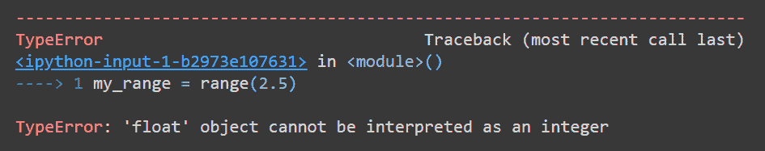
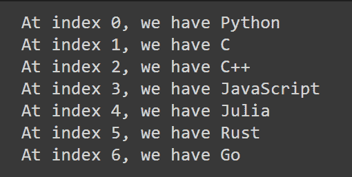

# Python range()函数–用代码示例解释

> 原文：<https://www.freecodecamp.org/news/python-range-function-explained-with-code-examples/>

在 Python 中，可以使用 use`range()`函数来获得一个索引序列，以循环遍历一个 iterable。你将经常使用`range()`和`for`循环。

在本教程中，您将了解使用`range()`函数的不同方式——显式开始和停止索引、自定义步长和负步长。

让我们开始吧。

## 理解 Python 的`range()`函数

在查看使用`range()`功能的不同方法之前，你必须了解它是如何工作的。

> `range()`函数返回一个 range 对象。
> 当您迭代这个 range 对象时，它会依次返回序列中的连续项目。

如上所述，范围函数*不返回索引列表*。相反，它返回一个 range 对象，在需要时返回索引。这也使得它的内存效率更高。

您可以使用以下通用语法的`range()`函数:

```
range(start,stop,step)
```

当您将这个语法与一个循环结合使用时，您可以从`start`开始得到一个索引序列，但不包括`stop`，以`step`为步骤。

*   必须指定*必需的*参数`stop`，可以是任意正整数。如果您指定一个浮点数，您将遇到一个`TypeError`,如下所示:

```
my_range = range(2.5)
```



*   如果不指定`start`索引，则使用`0`的*默认*开始索引。
*   如果不指定`step`值，则使用`1`的*默认*步长。

在接下来的章节中，您将了解使用`range()`函数的不同方式。

## 如何使用 Python 的`range()`函数遍历任何 Iterable

正如前面提到的，使用`range()`函数只需要一个正整数。语法如下所示:

```
range(stop) 
```

你可以使用上面一行代码得到一个从`0`到`stop-1`的序列:`0`、`1`、`2`、`3`，...，`stop-1`。

考虑下面的例子，其中您使用 5 作为参数来调用`range()`。使用一个`for`循环遍历返回的 range 对象，得到预期的索引 0，1，2，3，4。

```
for index in range(5):
  print(index)

#Output
0
1
2
3
4
```

如果你记得的话，Python 中所有的可迭代对象都遵循*零索引*。这就是为什么使用`range()`循环遍历 iterables 很方便。

长度为`len`的条目有`0`、`1`、`2`、...、`len-1`为有效指标。所以要遍历任何一个 iterable，你需要做的就是设置`stop`值等于`len`。你得到的序列是-`0`，`1`，`2`，...，`len-1`–是有效索引的序列。

让我们举一个更有帮助的例子。你有一个列表`my_list`。您可以通过知道它们的索引来访问列表中的所有项目，并且您可以使用如下所示的`range()`来获取这些索引:

```
my_list = ["Python","C","C++","JavaScript","Julia","Rust","Go"]
for index in range(len(my_list)):
  print(f"At index {index}, we have {my_list[index]}")
```

请记住，您可以使用 Python 的内置函数`len`来获取任何 iterable 的长度。在上面的代码中，您既使用了有效的索引，又使用了这些有效索引处的列表项。以下是输出结果:



注意`my_list`有 7 项长，得到的索引是从 0 到 6，和预期的一样。

有时，您可能需要使用负整数来代替。在这种情况下，如果您只使用`stop`参数，您将不会得到想要的输出，尽管代码不会抛出错误。

这是因为默认的`start`值被假定为`0`，你不能从`0`向上计数到`-5`。

```
for index in range(-5):
  print (index)

#Output
#NOTHING HERE
```

## 如何使用 Python 的`range()`函数显式的开始和结束索引

你可能不总是想从零开始。通过将`start`值设置为您想要开始的索引，您可以从任意索引开始。语法如下:

```
range(start,stop)
```

在这种情况下，您将能够得到序列:`start`、`start + 1`、`start + 2`，以此类推，直到`stop-1`。

在下面的例子中，你从 10 开始，一步一步地数到 15，但不包括 15。

```
for index in range(10,15):
  print(index)

#Output
10
11
12
13
14
```

在上一节中，您看到了当您需要负整数时，只使用`stop`参数是行不通的。然而，当您显式指定`start`和`stop`索引时，您也可以使用负整数。

在本例中，您尝试以 1 为步长从-5 开始向上计数。请始终记住，计数会在比`stop`索引小 1 的值处停止。

```
for index in range(-5,0):
  print(index)

#Output
-5
-4
-3
-2
-1
```

## 如何使用 Python 的`range()`函数 ****配合**一**自定义步长****

不是顺序地遍历一个 iterable，有时你可能想跨越它，访问每一个`k`元素。这时可选的`step`参数就派上用场了。通用语法如下所示:

```
range(start,stop,step)
```

当您使用这个语法并遍历 range 对象时，您可以从`start`到`stop-1`，步长为`step`。

*   你会得到这样的顺序:`start`、`start + step`、`start + 2*step`等等，直到`start + k*step`，这样`start + k*step` < `stop`和`start + (k+1)*step` > `stop`。

在下面的例子中，你想以 2 为步长从 0 到 20。注意最后打印出来的索引是 19。这是因为，如果你再往前走一步，你会在 21 岁，这比 20 岁大。

永远记住，你得到的最后一个值可以尽可能接近`stop`，但永远不可能是`stop`。

```
for index in range(1,20,2):
  print(index)

#Output
1
3
5
7
9
11
13
15
17
19
```

## 如何使用 Python 的`range()`函数 ****带**负步长**

到目前为止，您已经学会了使用带有`start`和`stop`索引的`range()`函数，以及一个特定的步长，同时从`start`到`stop`进行计数。

如果需要从整数开始递减计数，可以为`step`指定一个负值。一般语法是:

```
range(start,stop,<negative_step>)
```

*   range 对象现在可以用来返回一个序列，该序列从`start`开始以`negative_step`为步长向下计数，直到但不包括`stop`。
*   返回的顺序是`start`、`start - negative_step`、`start - 2*negative_step`等等，直到`start - k*negative_step`，这样`start - k*negative_step` > `stop`、`start - (k+1)*negative_step` < `stop`。
*   负步长没有默认值-您必须设置`negative_step = -1`来递减计数每个数字。

在本例中，您希望从 20 开始以-2 为步长递减计数。所以顺序是 20，18，16，一直到 2。如果你再往下走两步，你会碰到 0，这是不可能的，因为它小于止损值 1。

```
for index in range(20,1,-2):
  print(index)

#Output
20
18
16
14
12
10
8
6
4
2
```

很容易看出`start` > `stop`能够倒计时。

```
for index in range(10,20,-1):
  print(index)

 #Ouput
 #Nothing is printed - the sequence is empty.
```

在上面的例子中，你试着从 10 数到 20，这是不可能的。你得不到任何预期的输出。

## 如何使用 Python 的`range()`和`reversed()`函数来反转一个序列

如果您需要以相反的顺序访问 iterable 的元素，您可以结合使用`range()`函数和`reversed()`函数。

> Python 的内置`reversed()`函数返回给定序列值的反向迭代器。

让我们举第一个例子，这里我们使用了`range(5)`。在下面的例子中，我们在 range 对象上调用`reversed()`。我们看到我们从 4 倒数到 0。

```
for index in reversed(range(5)):
  print (index)

#Output
4
3
2
1
0
```

如你所见，这相当于使用了`range(4,-1,-1)`。如果您愿意，您可以使用`reversed()`函数来代替前面讨论的`negative_step`参数。

## 结论

在本教程中，您已经学习了使用`range()`功能的不同方式。你可以尝试几个例子，每次得到不同的序列。这个练习将帮助你在遍历 iterables 时有效地使用`range()`。

编码快乐！直到下一个教程。🙂