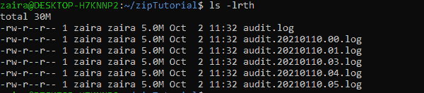
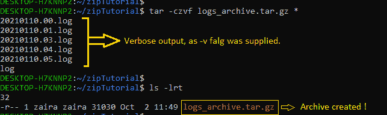
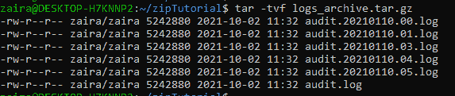
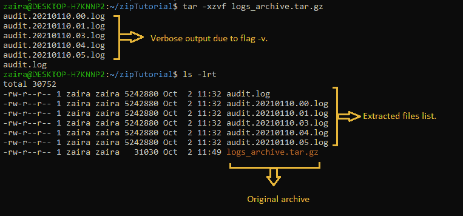
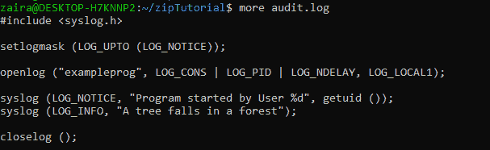
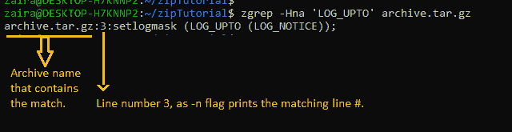

# Linux tar 命令——如何在 Linux 中压缩文件

> 原文：<https://www.freecodecamp.org/news/how-to-compress-files-in-linux-with-tar-command/>

文件压缩是跨所有平台的基本实用工具。它可以帮助您减少文件大小和有效地共享文件。压缩文件也更容易复制到远程服务器。

您还可以压缩旧的和很少使用的文件，并保存它们以供将来使用，这有助于节省磁盘空间。

在这篇文章中，我们将看看如何在 Linux 中使用`tar`命令压缩文件，以及一些使用`tar`的例子。

## 什么是 tar 命令？

我们从命令行使用`tar`命令来压缩和扩展文件。语法如下所示:

```
tar [flags] destinationFileName sourceFileName
```

`tar`命令使用以下标志来自定义命令输入:

| 旗 | 说明 | 使用 |
| --- | --- | --- |
| -丙 | 创建新的归档。 | 每当我们需要创建一个新的归档文件时，我们就使用这个标志。 |
| -z | 使用 gzip 压缩。 | 当我们指定这个标志时，意味着将使用 gzip 压缩来创建归档文件。 |
| -v | 提供详细输出。 | 提供-v 标志可以显示压缩文件的详细信息。 |
| -f | 存档文件名。 | 归档文件名使用-f 标志进行映射。 |
| ［加在以-u 结尾的法语词源的名词之后构成复数］ | 从压缩文件中提取。 | 当需要从归档中提取文件时，我们使用这个标志。 |

### 如何创建归档文件

我们有一个下面的文件列表，我们将使用`tar`对其进行压缩。



List of files to be compressed.

为了压缩它们，我们将像这样使用`tar`:

```
tar -czvf logs_archive.tar.gz *
```

让我们分解这个命令，查看每个标志。

`-c`正在创建和归档。

`-z`正在使用 gzip 压缩。

`-v`正在提供已归档文件的详细信息。

`-f`正在创建一个名为“logs_archive.tar.gz”的归档文件，如上面的命令中所提供的。

在下面的结果中，我们可以看到归档文件已经成功创建。



Archive has been created with supplied command.

### 如何在压缩后删除文件

假设我们不想在创建归档后保留原始文件。为此，我们可以使用`--remove-files`标志。

```
tar -czvf logs_archive.tar.gz * --remove-files
```


Files removed once archive has been created

这里，`-czvf`标志像前面演示的那样工作，但是原始文件也被删除了。一旦我们列出文件，我们只能看到存档。

### 如何查看归档文件的内容

您可能需要查看归档文件的内容，而不需要实际提取它。您可以使用`-t`标志来完成此操作。

```
tar -tvf logs_archive.tar.gz
```

在这个命令中，`-t`标志指定我们只需要查看存档的内容。`-f`指定文件名，`-v`显示详细内容。



Viewing contents of an archive.

### 如何提取归档文件

要从归档文件中提取文件，可以像这样使用`-x`标志:

```
tar -xzvf logs_archive.tar.gz
```

让我们分解这个命令，查看每个标志。

`-x`正在提取和存档。

`-z`指定归档文件为 gzip。

`-v`正在提供已归档文件的详细信息。

`-f`正在从名为“logs_archive.tar.gz”的归档文件中提取。



Extracting an archive.

这里有一个有用的提示:需要很长时间执行的命令可以用`&`在后台继续执行。

向归档文件添加文件和提取归档文件可能需要一段时间。要在您继续工作时保持命令在后台运行，请将命令与`&`配对，如下所示:

```
tar -xzvf logs_archive.tar.gz &
```

### 如何在压缩日志文件中搜索

某些文件存档后，您可能仍需要访问它们。幸运的是，有一种方法可以用来搜索和查看压缩的日志文件，而不需要解压缩它们，也不需要占用磁盘空间。

可以用来在压缩文件中搜索的命令是`zgrep`:



Contents of a file 'audit.log' in an archive.

我们可以使用下面的命令在档案中搜索字符串:

```
 zgrep -Hna 'string-to-search' compressedFile.tar.gz
```

让我们简单看一下标志。

`-H`列出包含匹配的文件名。

`-n`显示包含匹配字符串的行号。

`-a`将所有文件视为文本文件。

这是结果:



## 包扎

文件压缩有助于我们在共享文件时节省时间和资源。服务器几乎总是在轮换和归档巨大的日志文件。

您还可以通过`cron`作业安排文件压缩，以自动清理磁盘。我强烈建议您利用这个工具。

感谢阅读到最后。我很乐意和你联系。你可以在推特上的这里找到我。请分享你的想法。

回头见。