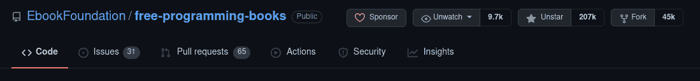
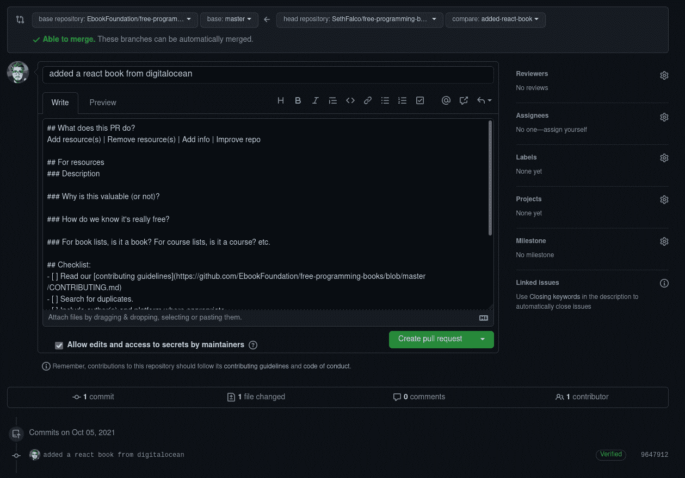

# 如何参加 hack toberfest——即使你不写代码

> 原文：<https://www.freecodecamp.org/news/how-anyone-can-participate-in-hacktoberfest/>

[Hacktoberfest](https://hacktoberfest.digitalocean.com/) 是由[数字海洋](https://www.digitalocean.com/)主办的一项活动，与许多组织合作。目标是回馈和贡献于开源项目。组织者对出色完成的工作没有什么奖励，比如一件衬衫和贴纸。

其他组织也参与进来，提供他们自己的奖励。你可以在 [Hacktoberfest Swag](https://hacktoberfest-swag.com/) 上找到一个由社区提供激励的组织列表。

只有有意义的贡献才会计入所需的总数 4。慢慢来，对维护人员表现出普通的礼貌，以确保您的拉取请求得到合并。在下面的[中有更多关于这方面的内容，让我们避免把它变成 Spamtoberfest](#let-s-avoid-turning-it-into-spamtoberfest) 。

## 如何参与 Hacktoberfest

值得注意的是，Hacktoberfest 是为了对开源项目做出任何**质量**贡献。没人说一定要代码！

每个人都有能力提出一些东西:

*   作者
*   艺术家
*   软件开发人员
*   技术作家
*   翻译者

### Hacktoberfest 投稿推荐项目

我不打算明确列出贡献代码的存储库，因为这很容易找到。以下链接中列出的所有存储库都选择加入 Hacktoberfest。

*   [git lab](https://gitlab.com/explore/projects?topic=hacktoberfest)(git lab 上所有主题为`hacktoberfest`的仓库。)
*   [GitHub](https://github.com/topics/hacktoberfest)(GitHub 上所有主题为`hacktoberfest`的仓库。)

如果你不知道如何编码，但仍然想为开源(或 [Creative Commons](https://creativecommons.org/) )项目做贡献，下面是我推荐的项目。它只包括手动选择加入 Hacktoberfest 的项目。

你不需要知道任何编程语言或 HTML 来为他们做贡献。不过，您应该知道如何用 Git 提交您的工作，这一点我们将在后面介绍。

#### 艺术

需要艺术或动画的项目:

*   派对鹦鹉的狂热崇拜——动画鹦鹉表情符号。
*   Elypia 表情符号——小熊猫表情符号。

#### 令人敬畏的名单

社区维护的资源列表:

*   [牛逼的机械键盘](https://github.com/BenRoe/awesome-mechanical-keyboard) —开源键盘列表。
*   免费编程书籍 —任何人都可以访问的免费书籍列表。
*   免费科学书籍 —任何人都可以访问的免费书籍列表。
*   [远程友好公司](https://github.com/remoteintech/remote-jobs) —远程友好公司列表。

#### 书

免费电子书以文档即代码的方式维护:

*   [Bash 脚本简介](https://github.com/bobbyiliev/introduction-to-bash-scripting)—Bash 的免费电子书。

#### 配置

围绕配置文件的项目。贡献可能只是将一个条目追加到一个 JSON 文件中:

*   [2fa.directory](https://github.com/2factorauth/twofactorauth) —有 2fa 的站点列表。([更多信息](https://github.com/2factorauth/twofactorauth/tree/master/entries)

#### 证明文件

你只需要用简单的英语打字的项目。编程和技术知识会有所帮助，但不需要专业技能。

这仅包括以对大多数用户来说简单的格式维护文档的存储库，比如 [Markdown](https://commonmark.org/help/) 。

*   [。NET 文档](https://github.com/dotnet/docs)——针对. NET 的文档。
*   [GitHub 文档](https://github.com/github/docs)—GitHub 的文档。
*   [jelly fin Docs](https://github.com/jellyfin/jellyfin-docs)—jelly fin 的文档。
*   [Nextcloud 文档](https://github.com/nextcloud/documentation)—next cloud 的文档。
*   tldr-pages—CLI 应用的备忘单。

#### 翻译

需要将文本从英语翻译成其他语言的项目。

这里不包括使用像 [Weblate](https://weblate.org/) 这样的众包翻译平台的项目，因为翻译者不创建拉请求。不幸的是，Hacktoberfest 只考虑打开拉请求的人，而不考虑修改的作者。

请确保您只贡献人工审阅的翻译，因此要么由人工翻译，要么由机器翻译但由人工验证。同样，质量很重要。

*   [免费编程书籍](https://github.com/EbookFoundation/free-programming-books/) —翻译健康档案。
*   tldr-pages —翻译备忘单。

#### 多方面的

独一无二的项目:

*   [哑密码规则](https://github.com/duffn/dumb-password-rules) —具有哑密码规则的站点列表。
*   [Hacktoberfest Swag](https://github.com/benbarth/hacktoberfest-swag) —奖励贡献者的项目列表。

## 让我们避免把它变成 Spamtoberfest

不幸的是，由于垃圾邮件，Hacktoberfest 在一些项目中名声不佳。有时候贡献者可能有点急于完成 Hacktoberfest 而忽略了重点。^-^'

从 2020 年起，如果一个用户发出两个带有单词`spam`或`invalid`标签的拉请求，贡献者将被无限期禁止参加 Hacktoberfest，包括未来的活动。

在我看来，mindustriy 用[Hacktoberfest Hall](https://github.com/Anuken/Mindustry/pulls?q=label%3A%22hacktoberfest+hall+of+shame+%28invalid%29%22+)来处理这件事是最好的。

从 2021 年开始，Hacktoberfest 通过排除那些鼓励没有价值的拉取请求的项目，正在做更多的工作来打击垃圾邮件。


The goal of giving back to open-source gets undermined if most contributions just go to "Complete Hacktoberfest!" repositories.

### 如何为 Hacktoberfest 做出有价值的贡献

*   你有一个月的时间提出 4 个拉动请求。用它！如果您发出的高质量拉取请求较少，它们更有可能被合并。
*   不要假设在 Hacktoberfest 结束之前，你提出的每个 pull 请求都会被合并。可以的话尽量做 4 个以上！

### 实行普通的礼貌

开源维护者也有自己的生活。他们并不总是有时间审查所有的拉请求，尤其是在 Hacktoberfest 快结束的时候。

不要让维护人员难受，不要催他们，不要要求关注。如果他们很忙，就做点别的。

## 如何提交工作和打开拉式请求

现在你知道了如何成为一名有用的 Hacktoberfest 参与者，并且你已经了解了一些你也能够贡献的项目，剩下的唯一事情就是实际学习如何贡献。

GitHub 和 GitLab 都提供了简化小变化的方法。我们不打算使用它们，因为显示一组适用于任何地方的指令比依赖于特定平台的特性更简单。

在继续之前，选择一个您想要贡献的存储库。如果你是多语种的，那么 tldr-pages 将是最容易的，否则考虑免费的编程书籍。

我将在我的例子中使用免费的编程书籍。

### 如何安装 Git

首先，你应该安装 Git，这是一个版本控制系统。这是项目用来管理变更的工具。

Windows 用户可以从 [git-scm](https://git-scm.com/) 网站下载。Linux 用户可以使用他们喜欢的包管理器来安装它。

一旦安装了 Git，用`git --version`验证它是否安装正确。

现在配置您的姓名和电子邮件地址。名称并不重要，但是您应该指定您用于 Hacktoberfest 的相同电子邮件地址。

```
git config --global user.name "Your Name"
git config --global user.email "your@email.org"
```

请注意，一旦您的提取请求被合并，您在此处指定的电子邮件地址将被视为公共信息。任何人都可以查看提交的详细信息，包括作者的详细信息。

例如，当我在一次提交中执行`git log`时，我的电子邮件地址出现在输出中。

```
commit 9647912b202a57474b4cd0ce796126c462c1ecc0 (HEAD -> added-react-book, develop/added-react-book)
Author: Seth Falco <seth@falco.fun>
Date:   Tue Oct 5 14:04:25 2021 +0200

    added a react book from digitalocean
```

如果这是一个问题，那么 [GitHub](https://docs.github.com/en/account-and-profile/setting-up-and-managing-your-github-user-account/managing-email-preferences/setting-your-commit-email-address#setting-your-commit-email-address-on-github) 和 [GitLab](https://docs.gitlab.com/ee/user/profile/index.html#use-an-automatically-generated-private-commit-email) 都提供了一个隐藏你的电子邮件地址的功能，给你一个一次性的。您可以启用该功能，并在`git config`中使用该电子邮件地址。

### 如何派生和克隆存储库

接下来，您将需要派生存储库。您不被允许将变更直接推送到存储库，因此您将创建一个 fork，它是您控制下的项目的副本。



The "Fork" button is at the top-right of the repository page.

接下来，在本地克隆存储库。这将把存储库中的所有内容都复制到您的机器上，这样您就可以开始工作了。

我们将在候机厅做这件事。如果你在 Windows 上，你可以使用命令提示符或 PowerShell。

转到文件系统上的适当位置，比如您的`Downloads`或`Documents`目录，然后执行以下命令:

*   克隆您想要使用的存储库。
*   在终端中输入目录。
*   将存储库与您帐户上的 fork 链接起来。

```
git clone https://github.com/EbookFoundation/free-programming-books.git
cd free-programming-books
git remote add develop https://github.com/{YOUR_USERNAME}/free-programming-books.md
```

### 如何处理项目

现在您已经在本地克隆了存储库，您可以开始使用它了。对于大多数存储库，最好在类似于 [Visual Studio Code](https://code.visualstudio.com/) 的代码编辑器中打开它，但是从技术上讲，您可以使用任何文本编辑器，包括记事本。

在编辑器中打开包含您克隆的存储库的目录。默认情况下，它以存储库名称命名，例如我现在有一个名为`free-programming-books`的文件夹。

现在，您可以进行更改:

*   如果您不确定该做什么，可以通过查看存储库上的“问题”选项卡来检查他们是否需要任何特定的东西。
*   或者，做出你想要的任何有意义的改变。

对于免费编程书籍，它是一个维护免费电子书列表的仓库，所以我们可以向它添加更多的资源。

DigitalOcean 在其网站的社区部分有一些很棒的书籍，所以我们可以将其中的一本或多本添加到知识库中。对于这个例子，我已经选择了[如何在 React.js](https://www.digitalocean.com/community/books/how-to-code-in-react-js-ebook) 中编码。

我可以转到项目中的相应部分，即`books/free-programming-books-langs.md`文件，并在文档的`React`部分下添加资源。

我添加的行看起来像这样:

```
* [How To Code in React.js](https://www.digitalocean.com/community/books/how-to-code-in-react-js-ebook) - Joe Morgan
```

`* [Resource Title](URL to Resource) - Author Name`

### 如何提交您的工作

现在你已经做出了改变，你会想要真正的承诺并把你的工作推回来。

到目前为止，您只在本地进行了更改*——现在我们要发送一个拉取请求。这基本上意味着您将发送一个请求，要求存储库的维护者将您的更改包含在他们的存储库中。*

在您的终端中，我们将执行以下命令:

*   创建一个新分支。
*   告诉 Git 您想要保存所有的更改。
*   用一条描述你所做的事情的消息来提交更改。
*   把变化推到你的叉子上。

```
git checkout -b added-react-book
git add .
git commit -m "added a react book from digitalocean"
git push develop added-react-book
```

这应该有望产生如下输出:

```
Enumerating objects: 7, done.
Counting objects: 100% (7/7), done.
Delta compression using up to 8 threads
Compressing objects: 100% (4/4), done.
Writing objects: 100% (4/4), 1.07 KiB | 1.07 MiB/s, done.
Total 4 (delta 3), reused 0 (delta 0)
remote: Resolving deltas: 100% (3/3), completed with 3 local objects.
remote: 
remote: Create a pull request for 'added-react-book' on GitHub by visiting:
remote:      https://github.com/SethFalco/free-programming-books/pull/new/added-react-book
remote: 
To github.com:SethFalco/free-programming-books.git
 * [new branch]        added-react-book -> added-react-book
```

Clicking `https://github.com/SethFalco/free-programming-books/pull/new/added-react-book` will take you to the pull request page.

### 如何创建拉式请求

GitHub 和 GitLab 都会在上面命令的输出中删除一个链接，带您打开一个 pull 请求。

如果您单击该链接(您可能需要按住`CTRL`)，它会将您带到一个页面，在那里您可以提供更多信息并提交您的拉取请求。



只需填写所需的详细信息，然后单击“创建拉动式请求”。剩下的就是等维护人员来审核了。

### 清理代码

一旦您完成了一个拉请求，您就应该离开您的分支，回到存储库的主分支。

在终端中执行以下命令:

*   检查主分支是`main`还是`master`。
*   切换到存储库的主分支。
*   更新您的本地副本以与存储库同步。

```
git branch
git checkout main
git pull
```

Check the output of `git branch` to determine if you should use `main` or `master`.

从“如何使用项目”步骤重新开始，进行更多的更改。

## 结论

我希望这能提供更多关于 Hacktoberfest 的信息，并且即使你不写软件，你也会更有信心参与开源社区。

祝您的拉动请求好运！