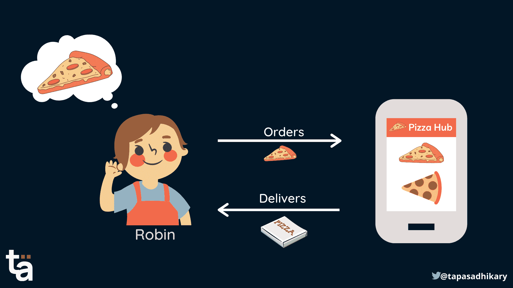

# JavaScript 回调函数——用简单的英语解释

> 原文：<https://www.freecodecamp.org/news/javascript-callback-function-plain-english/>

每个 JavaScript 初学者都会至少面对一次这个问题:“什么是回调函数？”

好吧，我们可以在**回调**这个词本身找到答案。这都是关于在任务成功完成或失败后通知调用方。

在本文中，我将较少关注回调的技术方面，并尝试解释它们在自然语言中是如何工作的。这应该有助于你理解什么是`callback function`以及它为什么存在。

如果您是 JavaScript 初学者，那么这篇文章绝对适合您。

如果您也喜欢从视频内容中学习，本文也可以作为视频教程在此处获得:🙂

[https://www.youtube.com/embed/AUCavCH7FTw?feature=oembed](https://www.youtube.com/embed/AUCavCH7FTw?feature=oembed)

# 一、什么是函数？

JavaScript 中的函数是执行任务的一组语句。这组语句可以在没有函数的情况下存在，但是在函数中包含它们有助于我们在多个地方重用任务。

下面是一个函数示例，如果一个值是偶数，该函数会将该值加倍。我们将一个数字作为参数传递给函数。函数中的语句检查参数是否为偶数。如果是，它将它加倍并返回结果。否则，它返回原始数字。

```
function doubleEven(n) {
    if (n % 2 === 0) {
    	return n * 2;
    }
    return n;
} 
```

现在，您可以在任何需要的地方使用该功能:

```
doubleEven(10); // Output, 20
doubleEven(5); // Output, 5
```

## 您可以将一个函数作为参数传递给另一个函数

在上面的例子中，我们看到您可以将一个数字作为参数传递给一个函数。同样，您也可以将函数作为参数传递。看看这个:

```
/** 
Let's create a foo function that takes a
function as an argument. Here we invoke 
the passed function bar inside foo's body.
*/
function foo(bar) {
    bar();
} 
```

好的，那么我们现在如何调用 foo？

```
/**
Invoke foo by passing a function as an argument.
*/
foo(function() {
    console.log('bar');
}); // Output, bar
```

注意，我们已经将整个函数定义作为参数传递给了`foo`。传递的函数没有名称。它被称为`anonymous function`。

# 什么是回调函数？

JavaScript 函数接受另一个函数作为参数的能力是该语言的一个强大方面。

函数的调用者可以根据任何触发器将另一个函数作为参数进行传递。下面就用`Robin and PizzaHub`的故事来理解一下吧。



Robin and the PizzaHub Story

罗宾，一个来自仙境的小男孩，喜欢吃比萨饼。一天早上，他拿起母亲的电话，用 PizzaHub 应用程序点了披萨。罗宾选择了他最喜欢的奶酪烧烤比萨饼，并按下了订单按钮。

PizzaHub 应用程序注册订单，并通知 Robin，当披萨准备好并在路上时，它会`notify`通知他。快乐的小男孩罗宾等了一会儿，终于收到了确认披萨已经在路上的`notification`！

所以，如果我们分解这个故事，事件的顺序是这样的:

*   罗宾:披萨
*   app `notes down`订单
*   比萨饼，过一会儿就好了。
*   应用程序`notifies` Robin 确认披萨已经在路上了。

通过使用`callback`函数，通知 Robin 关于比萨饼的机制起作用。

## 让我们用编程语言写这个故事

好的，我们开始吧。上面的事件序列是我们可以逻辑地放入函数中的一组语句。

首先罗宾点了披萨。应用程序通过调用函数来注册订单，如下所示:

```
orderPizza('Veg', 'Cheese Barbeque');
```

现在，位于 PizzaHub 服务器上的`orderPizza()`函数可能会执行其中一些操作(它实际上可能会执行更多的操作，但让我们保持简单):

```
function orderPizza(type, name) {
    console.log('Pizza ordered...');
    console.log('Pizza is for preparation');
    setTimeout(function () {
        let msg = `Your ${type} ${name} Pizza is ready! The total bill is $13`;
        console.log(`On the Pizzahub server ${msg}`);
    }, 3000);
}
```

`setTimeout`功能演示了比萨饼的准备需要一些时间。披萨做好之后，我们会在控制台中记录一条消息。但是，有一个问题！

该消息被记录在`PizzaHub`端，而可怜的罗宾对此一无所知。我们需要让他说披萨已经做好了。

## 引入回调函数

我们现在需要引入一个回调函数，让 Robin 知道比萨饼的状态。让我们更改`orderPizza`函数，将回调函数作为参数传递。还要注意，我们正在调用`callback`函数，并在披萨准备好的时候显示消息:

```
function orderPizza(type, name, callback) {
    console.log('Pizza ordered...');
    console.log('Pizza is for preparation');
    setTimeout(function () {
        let msg = `Your ${type} ${name} Pizza is ready! The total bill is $13`;
        callback(msg);
    }, 3000);
}
```

现在，让我们修改对`orderPizza`函数的调用:

```
orderPizza('Veg', 'Cheese Barbeque', function(message){
	console.log(message);
});
```

所以现在，一旦比萨饼做好了，调用方就会收到回调函数的通知。那不是很有用吗？

# 概括起来

总结一下:

*   JavaScript 函数可以接受另一个函数作为参数。
*   将函数作为参数传递是一个强大的编程概念，可以用来通知调用者发生了一些事情。它也被称为回调函数。
*   您可以根据用例使用回调函数来通知调用者。回调也用于根据其他任务的状态(通过、失败)来执行某些任务。
*   但是要小心——嵌套太多的回调函数可能不是一个好主意，并且可能会创建`Callback Hell`。我们将在下一篇文章中了解更多。

感谢阅读！您可以从这个开源存储库中了解更多关于异步编程的知识。别忘了试试小测验。

[GitHub - atapas/promise-interview-ready: Learn JavaScript Promises in a new way. This repository contains all the source code and examples that make you ready with promises, especially for your interviews 😉.Learn JavaScript Promises in a new way. This repository contains all the source code and examples that make you ready with promises, especially for your interviews 😉. - GitHub - atapas/promise-inte...atapasGitHub](https://github.com/atapas/promise-interview-ready)

Don't forget to give a ⭐. It motivates.

# 在结束之前...

目前就这些。我希望你觉得这篇文章很有见地，内容丰富。

我们来连线。你可以在 [Twitter (@tapasadhikary)](https://twitter.com/tapasadhikary) ，我的 [YouTube 频道](https://youtube.com/c/TapasAdhikary?sub_confirmation=1)，以及 [GitHub (atapas)](https://github.com/atapas) 上关注我。

您有兴趣了解更多关于 JavaScript 异步概念的知识吗？这里有几个链接可以帮助你:

*   [同步与异步 JavaScript——调用堆栈、承诺等等](https://www.freecodecamp.org/news/synchronous-vs-asynchronous-in-javascript/)
*   一个关于 JavaScript 的系列文章承诺&异步/等待
*   [关于 JavaScript 异步编程的视频系列](https://www.youtube.com/watch?v=pIjfzjsoVw4&list=PLIJrr73KDmRyCanrlIS8PEOF0kPKgI8jN)