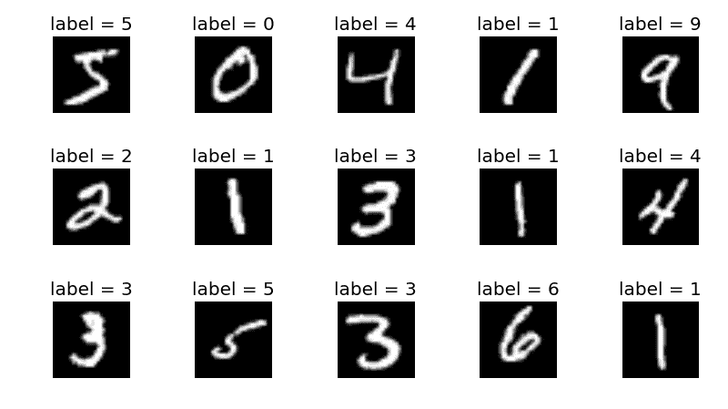

# tensor flow for Computer Vision–机器学习 Python 的完整课程

> 原文：<https://www.freecodecamp.org/news/how-to-use-tensorflow-for-computer-vision/>

在计算机视觉方面，TensorFlow 可以做一些令人惊叹的事情。

我们刚刚在 freeCodeCamp.org YouTube 频道上发布了一个完整的课程，将教你如何使用 TensorFlow 2 进行计算机视觉应用。

努尔·伊斯拉姆·莫赫塔里创建了这门课程。Nour 是一名机器学习工程师，也是一名经验丰富的教师。

本课程向你展示如何创建两个计算机视觉项目。第一个包括一个准备好的数据集的图像分类模型。第二个是更现实的问题，在使用数据集之前，您必须清理和准备数据集。

MNIST Dataset with labels

以下是本课程涵盖的主题:

*   Why learn Tensorflow
*   我们将使用 IDE，而不是笔记本
*   Visual Studio 代码(如何下载和安装)
*   Miniconda -如何安装
*   迷你康达-为什么我们需要它
*   我们如何在 VS 代码中使用 conda 虚拟环境？
*   安装 Tensorflow 2 (CPU 版本)
*   安装 Tensorflow 2 (GPU 版本)
*   我们想要实现什么？
*   探索 MNIST 数据集
*   Tensorflow layers
*   按顺序建立神经网络
*   编译模型并拟合数据
*   用函数方式建立神经网络
*   以模型类的方式构建神经网络
*   我们应该添加的内容
*   重构我们的代码以提高可读性
*   第一部分总结
*   我们想要达到的目标
*   下载和浏览数据集
*   准备训练和验证集
*   准备测试集
*   用函数方式建立神经网络
*   创建数据生成器
*   实例化生成器
*   编译模型并拟合数据
*   添加回拨
*   评估模型
*   潜在的改进
*   对单个图像进行预测

观看以下全部课程或在 freeCodeCamp.org YouTube 频道观看[(4.5 小时观看)。](https://youtu.be/cPmjQ9V6Hbk)

[https://www.youtube.com/embed/cPmjQ9V6Hbk?feature=oembed](https://www.youtube.com/embed/cPmjQ9V6Hbk?feature=oembed)