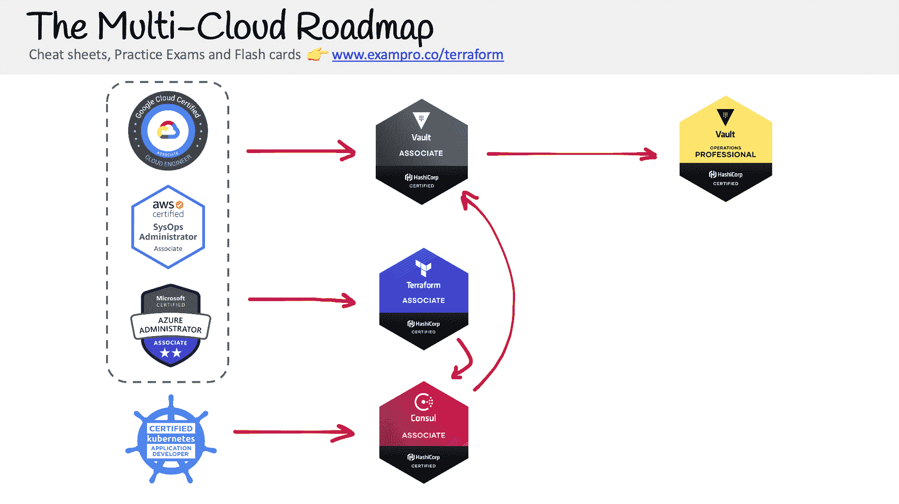
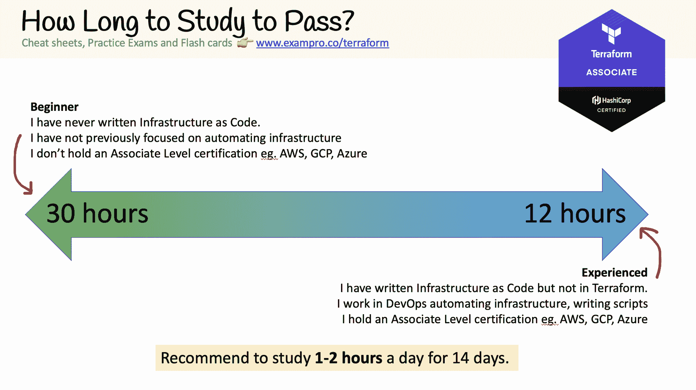

# HashiCorp Terraform 助理认证学习课程-通过 12 个多小时的免费课程考试

> 原文：<https://www.freecodecamp.org/news/hashicorp-terraform-associate-certification-study-course-pass-the-exam-with-this-free-12-hour-course/>

通过这门 12 小时的免费课程，了解如何通过 HashiCorp Terraform 助理认证。

## **什么是 HashiCorp Terraform Associate？**

HashiCorp 是一家专注于多云工作负载开源工具的公司。HashiCorp 最受欢迎的工具是 Terraform，它允许 DevOps 工程师编写代码，为多个云服务提供商(CSP)提供基础架构，例如 AWS、Azure 和 GCP。

HashiCorp Terraform Associate 是一项认证，证明工程师对 Terraform 工具以及被称为 Terraform Cloud 的 SaaS 产品有实际的理解。

对于那些寻求 DevOps 工程师职业的人来说，Terraform 助理是必不可少的，因为 Terraform 已经成为基础设施代码(IaC)的行业标准，并经常作为一项预期技能出现在 DevOps 的招聘信息中。

Terraform 助理考试并不难，但非常依赖于 Terraform 的实践知识。这就是本学习课程长达 12 个多小时的原因——我们添加了许多后续内容和常见边缘案例，您只能在实践中体验。

## **************概述************地形关联**

Terraform Associate 由以下域组成:

1.  将基础设施理解为代码(IaC)概念
2.  了解 Terraform 的目的(相对于其他 IaC)
3.  了解地形基础
4.  使用 Terraform CLI(核心工作流程之外)
5.  与 Terraform 模块交互
6.  导航 Terraform 工作流
7.  实现和维护状态
8.  读取、生成和修改配置
9.  了解 Terraform 云和企业功能

虽然 Terraform 认证比其他云认证有更多的领域，但它们在每个领域的预期要求方面都是有限的，几乎所有你在考试指南中看到的内容都会出现在考试中。

## ******如何获得认证？******

HashiCorp 使用 PSI Online 作为其测试中心。你可以亲自参加考试，也可以在网上参加。

有 57 道 ****选择题**** 和多项选择题，简单填写银行题，你必须得分 ****70%才能通过****

谷歌云数字龙头是 ****$** 70.50 **美元。****

## ******我可以简单的看视频通过考试吗？******

是的，HashiCorp Terraform Associate 非常简单，只需观看视频并通过考试即可。

然而，由于考试总是基于 Terraform 的最后三个次要版本，如果你不在你的机器上做以下操作，你可能会错过新出现的 Terraform 边缘案例。

## 这门课的自由练习考试和备忘单在哪里？

本课程有一个包含 57 个问题的[免费练习考试，以及可在 ExamPro](https://www.exampro.co/terraform) 上下载的备忘单。不需要信用卡，没有试用限制。

前往 freeCodeCamp 的 YouTube 频道开始学习 6.0 小时的课程。

[https://www.youtube.com/embed/V4waklkBC38?feature=oembed](https://www.youtube.com/embed/V4waklkBC38?feature=oembed)