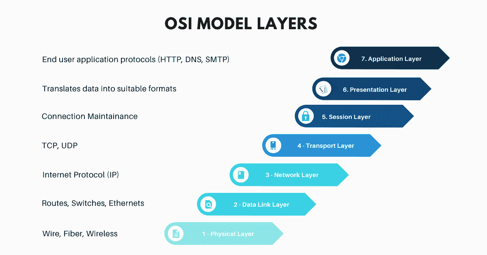
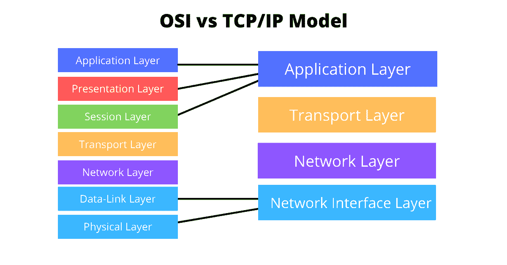
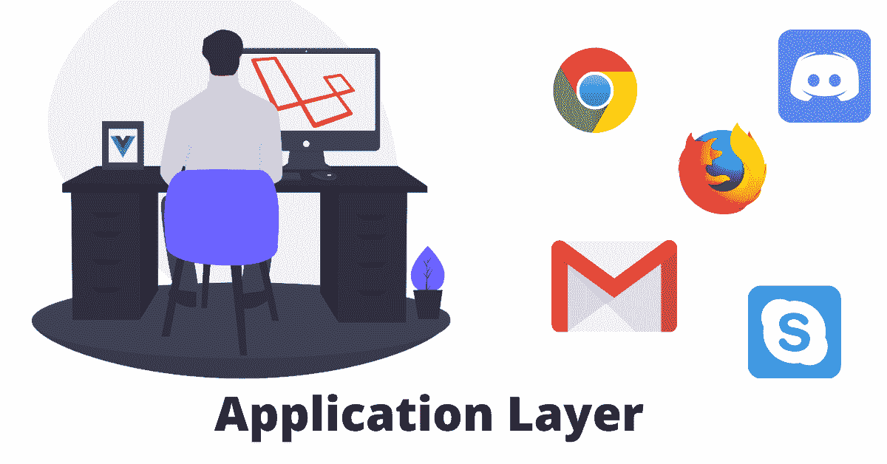
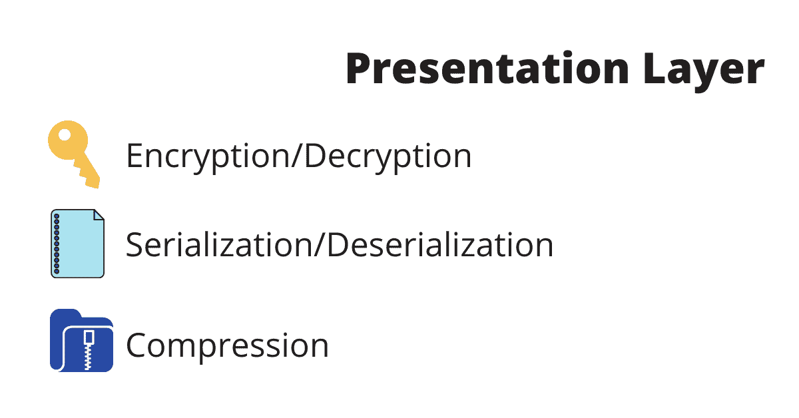
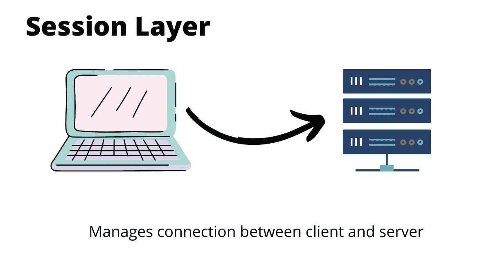
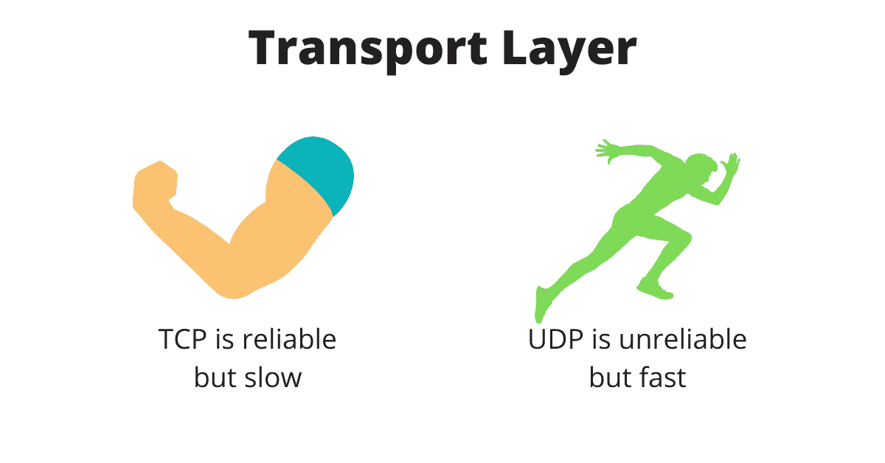
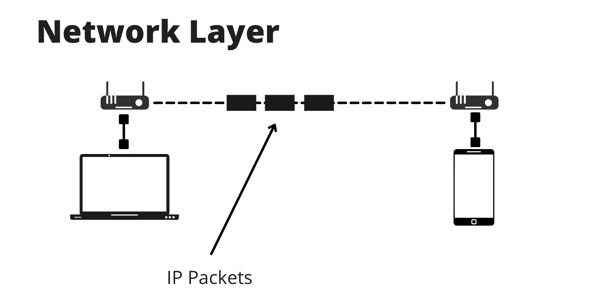
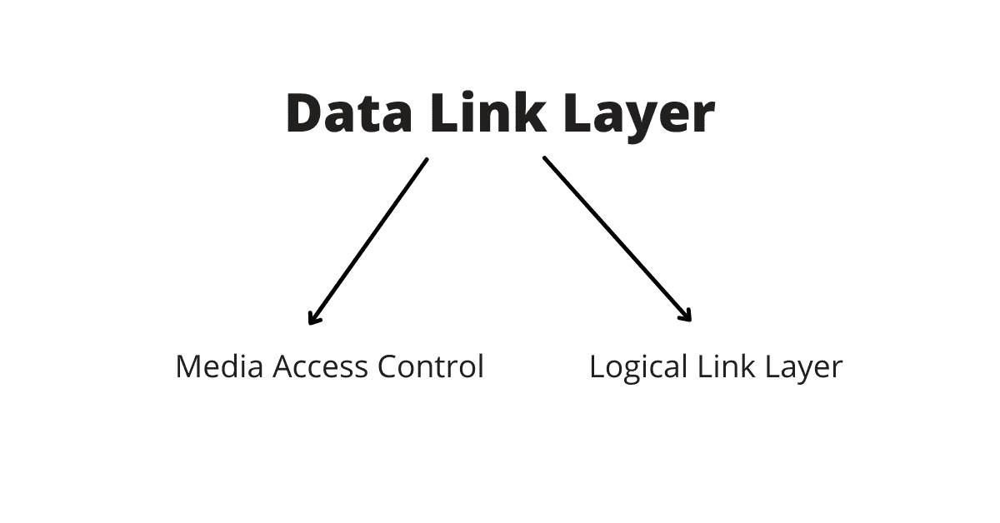
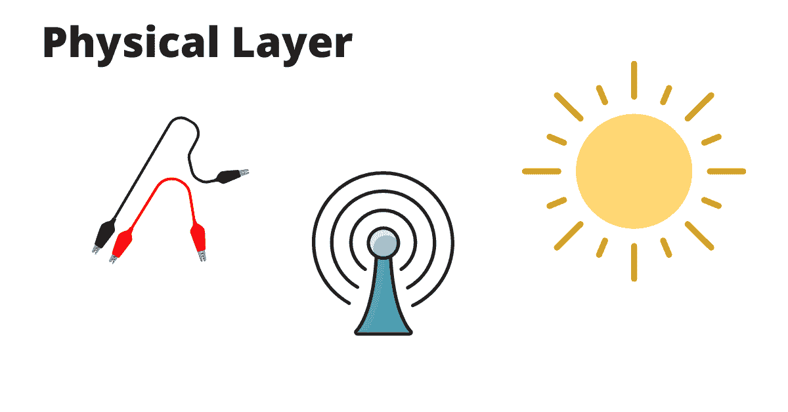

# 什么是 OSI 模型？初学者计算机网络

> 原文：<https://www.freecodecamp.org/news/osi-model-computer-networking-for-beginners/>

在本文中，您将以一种简单易行的方式了解开放系统互连(OSI)模型的核心概念。

作为一名开发人员，学习“幕后”的工作原理是一个好主意。这样你就能理解你的代码和你使用的工具实际上在做什么。

但是依赖黑盒抽象而忽略内部工作似乎更容易。

一个流行的黑盒抽象是互联网。

当然，我们中的许多人可能知道互联网是什么以及它是如何工作的。有一个客户机和一个服务器，它们只是使用一种叫做 HTTP 或 HTTPS 的东西相互“通信”?

但这是大多数人的知识范围。

我不是说我们不应该使用抽象——我只是说我们应该对事物如何工作有一些基本的概念。

这就是我写这篇文章的原因:揭开这个黑匣子的神秘面纱，帮助你了解计算机如何通过网络相互通信。

## 什么是 OSI 模型？

The Seven Layers of OSI

开放系统互连或 OSI 模型本质上是一个参考系统，它展示了计算机如何通过网络相互通信。

它由电信公司的代表于 1983 年创建，并于 1984 年由国际标准化组织(ISO)正式标准化。

它分为七层。每一层都有自己的域，从上一层接收数据，同时将数据传递给下一层。

这七层是:

1.  应用层
2.  表示层
3.  会话层
4.  传输层
5.  网路层
6.  数据链路层
7.  物理层

如果我们从编码的角度来考虑，每一层都是一个具有一些核心功能的类，每个类只与它上面或下面的类通信。

请记住，这是一个**参考**模型，意味着我们在现实生活中实际上并不使用它。还有一种模型与 OSI 模型非常相似，但它封装了前三层和后两层。

这种“现实生活”模型被称为 TCP/IP 模型，这是互联网运行的基础。

OSI vs TCP/IP Model diagram

但是在我们开始一层一层地讨论每一层之前，让我们先回顾一下，如果 OSI 模型在现实生活中甚至都没有使用过，为什么还要学习它。

## 为什么要学习 OSI 模型

在过去 20 年左右的时间里，世界发生了巨大的变化。

互联网出现了，“网络”出现了，在网络生态系统中，许多事情都发生了变化。我们从简单的 HTML 页面开始，然后是 JavaScript，现在我们有了所有这些框架，有时感觉如此势不可挡。

但是，你要记住这个:

> 学习基本原理，从基本原则开始学习。

让我们以网络为例，除了我们在过去 20 年中看到的所有这些变化。

网络的工作方式实际上并没有改变多少。

我们仍然使用 HTTP 协议。

HTTP 协议确实更新了，但没那么多。

即使我们分解了 HTTP，它也是由 TCP 构成的，而 TCP 也没有太大变化。

我的观点是，你应该停止盯着闪亮的新事物，而把注意力放在这些闪亮的新事物建立的基础上。

例如，我记得当 web sockets 很流行的时候。

但是如果我们把它分解，它们是基于 TCP 协议的。

如果你了解 TCP，你可以很容易理解 web 套接字是如何工作的，并且不必依赖于黑盒抽象。

我希望我已经说服了你为什么应该从基本原则开始学习。这不仅适用于软件工程，也适用于许多其他领域。

完成后，让我们来看一下 OSI 模型的七层。

## OSI 模型的七层

### 应用层

This is the layer where the end user exists

应用层是大多数软件工程师工作的地方。这是你的浏览器生活的地方。

但我说的不是具体的应用，比如 Chrome、Skype 或 Outlook。

我说的是更基础的东西，比如协议。

例如:

*   您的浏览器使用 HTTP 协议向 web 服务器发出请求。
*   你的电子邮件应用程序使用 SMTP 协议发送和接收电子邮件。
*   如果没有 DNS 协议，您将不得不键入 142.250.150.138 而不是 google.com。

简而言之，应用层处理几乎所有最终用户应用程序使用的基础。

### 表示层

一旦客户端发出 HTTP 请求，请求本身就会被传递到表示层(也称为语法层)。

这一层处理三个主要功能:

#### 加密和解密

你不希望你的数据公开，这就是聪明人创造传输层安全(TLS)的原因。它本质上是加密你的数据。

它还负责解密来自其他服务器的请求，供应用层使用。

#### 序列化和反序列化

这是一些大词，但它们本质上的意思是“翻译”。

我们希望将数据“翻译”成应用程序能够理解的形式。

例如，简单的数据结构可以被翻译成我们的 JavaScript 应用程序能够理解的“对象”。

另一方面，如果我们希望我们的数据向下传递，我们将把我们的对象转换成较低层可以理解的简单数据结构。

#### 压缩

这是显而易见的:发送的比特越少，请求就越快。

这也是表示层的主要功能之一。请记住，这是一种无损压缩，意味着在此过程中不会丢失任何信息。

公平地说，在现实世界中，大多数这些事情都是在应用层完成的。

这就是为什么在 TCP/IP 模型中表示层是应用层的一部分。

### 会话层

The session layer is responsible for opening, closing and maintaining connections between client and server 

这个有点混乱。事实上，我找不到它的很多用例。

会话层的主要功能是管理客户端和服务器之间的连接。

但这实际上意味着什么呢？

假设你想去 google.com

要做到这一点，你首先必须与 google.com 建立连接，所以你说“嘿，服务器，你好，我想连接到 Google . com”。

服务员回答:“是的，当然。”

恭喜您，您已经与 google.com 的服务器建立了连接，可以自由地发送 GET 请求来获取页面。

长话短说，这一层用于:

*   打开连接
*   保持联系
*   关闭连接。

现在来看看现实:在现实生活中，这几乎不存在，它是传输层的一部分——我们将在接下来讨论。

### 传输层

TCP and UDP visualized

这是有趣的事情发生的地方。

传输层通常是根据正在使用的协议来定义的。

最受欢迎的两个是:

*   传输控制协议
*   用户数据报协议

TCP 是互联网套件中的主要协议之一。它用于 IP(互联网协议)之上，以确保数据包的可靠传输。

TCP 修复了使用 IP 时出现的许多问题，如数据包丢失、数据包乱序、重复数据包和损坏的数据包。

您可以在要求所有数据包都没有错误的应用程序中使用 TCP，例如文本消息。

另一方面，UDP 是无状态的，这意味着它不保存客户端和服务器之间的任何状态，它也很轻，使它很快。但缺点是它不可靠，数据包可能会丢失、损坏等等。

UDP 通常用在你不在乎是否会丢失一些数据包的时候，比如视频流。

还要记住，这一层中的数据称为段。

长话短说，TCP 可靠但速度慢，UDP 不可靠但速度快。

### 网路层

The network layer is responsible for sending packets from network to network

我真的不知道这为什么叫网络层。

它应该被称为互联网层，因为这里最重要的协议是互联网协议(IP)

IP 的基本功能是从传输协议中提取数据段，并添加元数据，帮助识别您的客户端在本地网络中的位置。

网络层的另一个功能是消息转发，这意味着它将数据包从一个网络发送到另一个网络。

这一层的数据称为数据包。

### 数据链路层

The data link layer is made of two parts: MAC and LLC

这一层定义了数据如何在两个系统之间传输。

它负责诸如两个系统相互对话多长时间，可以发送多少数据，以及如果有任何错误会发生什么。所有这些都在数据链路层处理。

数据链路层分为两个子层:

*   逻辑链路层(LLC)–这一层提供流量控制、确认和错误处理，以防出错。
*   媒体访问控制(MAC)-这一层负责根据您的网卡分配一个唯一的 id 号，称为 MAC 地址。这意味着没有两台设备具有相同的 MAC 地址。

数据包来自网络层，封装时添加了客户端和服务器 MAC 地址的新报头。

在数据包的末尾还添加了另一个数据子集，用于错误检测。这叫做尾巴。

一旦添加了这些元数据，这些数据现在就被称为帧。

### 物理层

Bits can be transferred using electricity, radio waves, or even light

最后，这是物理层。

不要与物理这个词混淆，我们不只是在谈论电线。

数据可以通过许多不同的方式传输，例如无线电波甚至光。

不幸的是，这些运输方式不知道“框架”，它们只知道位。

这一层的功能是简单地将帧转换成字节(8 位)并通过某种传输方法(电、波、光等)发送它们。

最后，我们的请求将被传输到服务器，服务器将经历相同的过程，但方向相反。

## 结论

在本文中，您了解了:

*   OSI 模型是两个系统如何通过网络相互通信的参考模型。
*   我们在现实生活中不使用这个模型。相反，我们使用另一个类似的模型，称为 TCP/IP 模型。
*   OSI 模式由七个部分组成，每个部分都有特定的功能。

我希望你今天学到了一些东西，并感谢你到达终点。

我计划在 Twitter 上发布类似的内容片段，所以如果你感兴趣，请关注我。