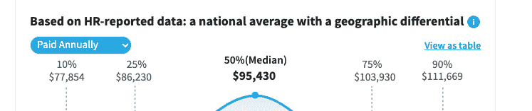

# 什么是 UX 设计？用简单的英语解释用户体验设计

> 原文：<https://www.freecodecamp.org/news/user-experience-design-what-does-a-ux-designer-do/>

你可能听说过用户体验或 UX 设计这个术语。但是它到底是什么意思呢？

在这篇文章中，我将解释什么是 UX 设计，并谈谈如何成为一名 UX 设计师。

## 什么是 UX 设计？

术语用户体验指的是用户如何与产品或服务进行交互。每当你登录一个网站，或在你的手机上玩游戏，你与该应用程序的互动被认为是用户体验。

UX 设计超越数字应用。用户体验与用户交互的任何产品或服务都相关。

其他例子包括组装家具的组装指南或餐厅用餐体验。

如果你发现一个产品易于使用和理解，那么这将被认为是一个积极的用户体验。但是如果产品令人困惑和沮丧，那么这将被认为是一个负面的用户体验。

专业的 UX 设计师对用户如何与产品互动投入了大量的思考，以确保他们有积极的体验。如果用户基于他们的体验决定不再使用该产品或服务，负面体验会导致公司的收入损失。

## UX 设计史

用户体验设计这个术语是由唐纳德·阿瑟·诺曼在 20 世纪 90 年代初首次提出的。1993 年，唐纳德决定将自己的头衔改为用户体验架构师，当时他是苹果公司的用户界面架构师。

这是唐纳德在发明术语“用户体验”时所说的话:

> “我发明了这个术语，因为我认为人机界面和可用性太狭隘了:我想涵盖人们对系统体验的所有方面，包括工业设计、图形、界面、物理交互和手册。”

唐纳德被认为是用户体验设计的领导者和教育家。他也是一位有成就的作家，出版了他的畅销书《日常用品的设计》。

尽管用户体验设计这个术语直到 90 年代早期才被引入，但 UX 设计的例子可以追溯到更早。

许多人认为华特·迪士尼是第一批 UX 设计师之一，因为他的公园和度假村。

在 20 世纪 50 年代，华特·迪士尼想建立一个对成人和儿童都有趣的游乐园。在那个时候，娱乐公园被认为是肮脏和肮脏的地方，不适合儿童。

但是迪斯尼想改变这一切，给公园游客提供积极的体验。设计师和工程师(“迪士尼幻想工程师”)在公园的建设上投入了很多心血。

公园里强烈的 UX 设计的一个例子是参与者可以选择的选项的数量。这些公园旨在吸引各种类型的游客。

无论你是寻求惊险刺激的青少年，还是希望乘坐小飞象或茶杯的年轻家庭，每个人都有适合的东西。

## 糟糕的 UX 设计的例子

任何被认为过于复杂、混乱和难以操作的东西都是糟糕的 UX 设计。

网站中不良 UX 的一个例子是断开或无效的链接。

我已经创建了一个带有虚拟文本和链接的例子。

[https://codepen.io/jessica-wilkins/embed/preview/PojvBvv?default-tabs=html%2Cresult&height=300&host=https%3A%2F%2Fcodepen.io&slug-hash=PojvBvv](https://codepen.io/jessica-wilkins/embed/preview/PojvBvv?default-tabs=html%2Cresult&height=300&host=https%3A%2F%2Fcodepen.io&slug-hash=PojvBvv)

如果这是一个真实的网站，用户体验会很差，因为很多时间都浪费在点击不起作用的链接上。这可能会令人沮丧，因为用户需要访问这些信息，但却得不到。

用户体验差的另一个例子是不断弹出广告和消息。这些类型的网站很难享受内容，因为你不断被弹出窗口打断。

在这个例子中，我创建了一个假的博客站点，在那里有三个不同的弹出消息敦促您订阅。

[https://codepen.io/jessica-wilkins/embed/preview/qBjGMvw?default-tabs=html%2Cresult&height=300&host=https%3A%2F%2Fcodepen.io&slug-hash=qBjGMvw](https://codepen.io/jessica-wilkins/embed/preview/qBjGMvw?default-tabs=html%2Cresult&height=300&host=https%3A%2F%2Fcodepen.io&slug-hash=qBjGMvw)

这显然让用户很恼火，因为他们甚至不能阅读博客文章，现在想离开页面。

## UX 设计师是做什么的？

UX 设计师将进行测试和研究，以确保产品和服务创造积极的用户体验。设计新产品或服务时，第一步是进行用户研究，以更好地了解受众。

在第一阶段，UX 设计师需要了解用户希望从产品中获得什么，并确定用户可能面临的产品或服务挑战。

下一阶段是创建用户角色，作为使用产品或服务的客户的示例角色。这种类型的工具帮助 UX 设计师识别用户从产品中寻找什么，并产生积极的体验。

下一个阶段是考虑产品的结构和布局，这样用户可以很容易地找到他们正在寻找的信息。UX 设计师将开始关注用户流，即用户在与产品互动时经历的完整过程。

最后一步是创建一个原型并执行用户测试。UX 的设计师将研究这些测试的结果，并对产品进行必要的修改。

## 在哪里学习 UX 设计？

有很多免费的高质量课程，你可以在网上开始学习 UX 设计。

我建议去 Coursera 上的[谷歌 UX 设计专业证书](https://www.coursera.org/professional-certificates/google-ux-design)看看。七个类中的每一个都可以自由审计。

你也可以[阅读这篇文章并观看相关的 YouTube 课程](https://www.freecodecamp.org/news/ui-ux-design-tutorial-from-zero-to-hero-with-wireframe-prototype-figma/)来很好地了解 UX 和 UI 设计。

## UX 设计师的薪水

用户体验有很多不同的职称。

以下是一些常见的职位名称:

*   用户体验架构师
*   用户体验研究员
*   用户体验设计师

重要的是要注意，工资会根据你的位置而有所不同。你可以使用像[或](https://www.indeed.com/) [Glassdoor](https://www.glassdoor.com/index.htm) 这样的网站来研究薪水。

这些是美国 UX 设计师的薪水示例。这些数据来自 Salary.com 的。

我希望你喜欢这篇文章，并祝你的 UX 之旅好运。