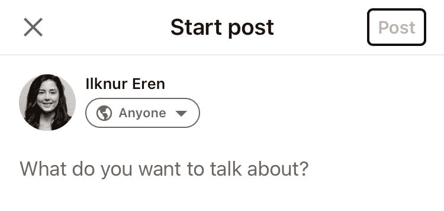
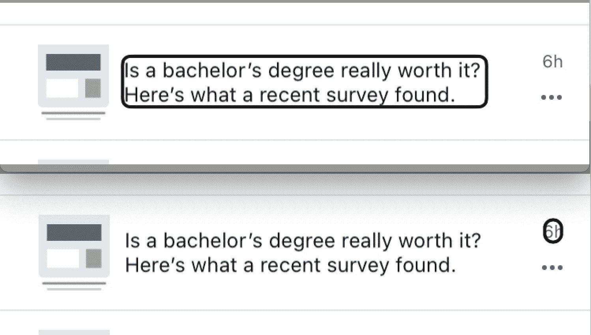
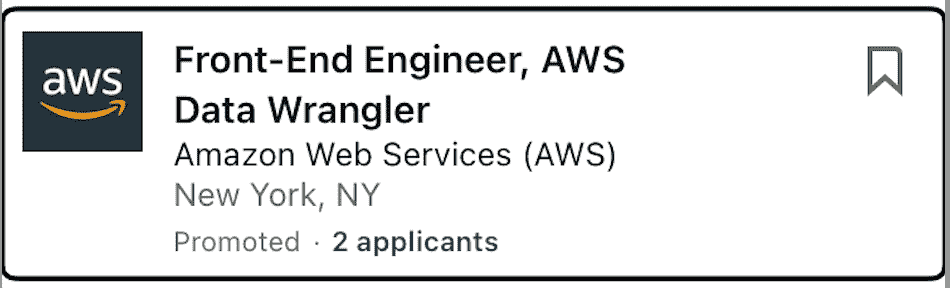

# 移动应用程序开发的可访问性最佳实践

> 原文：<https://www.freecodecamp.org/news/mobile-accessibility/>

美国人口普查局估计，超过 12%的美国人口患有残疾。残疾可能包括视觉困难、听觉困难、行动困难等等。

一个人在生命的任何阶段都可能残疾。

由于很大一部分人都有这样或那样的残疾，所以开发每个人都能使用的技术非常重要。这样，我们都可以消费科技内容，没有人被落下。

在本文中，我们将介绍一些最佳的可访问性实践，以及如何让您的移动应用程序更易访问。

## 为每个元素添加有用的描述

[疾病控制和预防中心的视觉健康倡议](https://www.cdc.gov/visionhealth/risk/burden.htm#Estimates)指出，

> 2015 年，共有 102 万人失明，美国约有 322 万人患有视力障碍(VI)，根据视力较好的眼睛的最佳矫正视力来定义。
> 
> 此外，还有 820 万人因未矫正的屈光不正而发生 VI。到 2050 年，这些疾病的数量预计将增加一倍，达到大约 201 万人失明，或具有 20/200 或更差的 VI，695 万人患有 VI，以及 1640 万人由于未矫正的屈光不正而患有 VI。(瓦尔马，2015 年)

对于视力很差或没有视力的人来说，一个有用的辅助工具是语音工具。这允许用户在他们的电话上收听网页的内容。

我想把你放在一个可能在电话上使用语音的人的位置上。

以下是 Facebook Marketplace 的“降价”列表。只需听 22 秒的画外音，就能听到使用该工具的人听到的那一部分。

[https://w.soundcloud.com/player/?visual=true&url=https%3A%2F%2Fapi.soundcloud.com%2Ftracks%2F1130482105&show_artwork=true&maxwidth=1280](https://w.soundcloud.com/player/?visual=true&url=https%3A%2F%2Fapi.soundcloud.com%2Ftracks%2F1130482105&show_artwork=true&maxwidth=1280)

画外音说“降价，按钮”,以向用户指示此部分是降价商品，并且在特定焦点上有一个他们可以采取的点击动作。

接下来，聚焦的元素说，“隐藏类别，按钮”，这再次表明在这个聚焦的元素中，用户可以采取行动来隐藏类别。

接下来，“查看全部，按钮”获得焦点。这表明他们可以对该元素执行操作，以查看该类别中的所有项目。

在下一个焦点，我们听到，“没有可用的照片描述，按钮，图像”。这个东西会是什么？目前我们还不知道。

对于下一个聚焦的元素，我们听到同样的事情，“没有可用的照片描述，按钮，图像”。现在这个列表中的两个元素没有描述的内容。

下一个聚焦的元素说，“可能是珠宝、纽扣、图片的图像”。句子前面的单词“maybe”表示 voiceover 工具不确定元素可能是什么。

“珠宝的形象”是一个宽泛的描述，尤其是如果你是在一个网站上购物。是项链吗？是戒指吗？是耳环吗？是一套首饰吗？它是什么材料的？它看起来像什么？这件首饰开始要多少钱？

最后一个焦点元素说的是我们从前两个中听到的，“没有可用的照片描述、按钮、图像”。

这就是几乎没有视觉的用户导航应用程序的方式。这里有四个按钮，没有一个有描述。如果你正在使用这个应用程序，你会点击哪一个？

现在，我想给你看同一页的视频记录，你可以在下面看到:

[https://www.youtube.com/embed/g0PS_DdgwGU?feature=oembed](https://www.youtube.com/embed/g0PS_DdgwGU?feature=oembed)

voiceover 提到的第一个项目“没有可用的照片描述、按钮、图像”实际上是一张 20 世纪 60 年代的老式桌子的图像，而且是免费的。

第二件物品是一张价值 3 美元的贴纸，上面写着“我永远和你在一起”，旁边还有一只红色的小鸟。

第三件只有部分描述的物品(“可能是珠宝、纽扣、图片的图片”)是一只售价 8 美元的珍珠耳环。

最后，第四个项目说，“没有可用的照片描述，按钮，图像”是皮卡丘的 Pokeman 卡，价格为 9.50 美元。

在第一个音频剪辑之后，你是否期望这样？大概不会。如果你没有看到图片或阅读标题，你就不会知道脸书市场上卖的是什么。

解决这个问题的一个方法是确保每个元素都有一个`accessibilityLabel`,其中包含您在没有看到它的情况下了解它是什么所需的基本信息。当地的 T2 医生告诉你，

> 要使用，请将`accessibilityLabel`属性设置为视图、文本或可触摸的自定义字符串。

对于屏幕阅读器用户来说，`accessibilityLabel`是一种简单但有效的描述元素的方式。

为了向您展示这是如何工作的，让我们一起编写一个更简单的示例。

例如，我们可以通过向`TouchableOpacity`元素添加一个`accessibilityLabel`来制作脸书市场表列表。

**示例代码:**

```
<TouchableOpacity
  accessible={true}
  accessibilityLabel="Free, vintage table from the 1960s"
  >
....
</TouchableOpacity> 
```

上面的代码将`accessibilityLabel`添加到包含整个按钮的元素中。我们添加了“20 世纪 60 年代的免费古董表”作为可访问标签。

当屏幕阅读器悬停在具有该属性的元素上时，它将读取“免费的，来自 1960 年的老式表，按钮”。这将让用户知道价格、简要描述，以及这是一个他们可以点击的按钮。

这使得这个特殊的元素对于那些依赖屏幕阅读器的人来说更容易访问。

## 确保描述元素的状态

在某些元素中，您需要向用户描述组件的当前状态。

例如，如果你有一个复选框，你应该让用户知道这个复选框是否被选中。

您想要描述的另一个常见元素是页面上的按钮是否被禁用。如果用户不能点击按钮，那么你应该让用户知道有一个按钮，但它是禁用的。

下面的 LinkedIn 帖子页面有一个禁用按钮的例子。除非用户在文章正文中键入某些内容，否则该按钮是不活动的:

**举例:**



LinkedIn post page with focus on dimmed post button. 

在上图中，焦点在禁用的 Post 按钮上。当画外音聚焦在该部分时，它会说，“发布，变暗，按钮”。这让用户知道这是一个按钮，但他们不能点击它，因为它是灰色的。

**示例代码:**

在下面的代码中，当你把焦点放在按钮上时，如果它是禁用的按钮，它会说，“按钮，变暗”。

```
<Button accessibilityState={disabled ? {disabled: true} : {disabled: false}}>
```

下面是让用户了解元素状态的一些其他方法。如果菜单项或复选框被选中，屏幕阅读器将显示“菜单项，已选中”或“复选框，已选中”。

```
//Menu Item
<Button accessibilityRole={"menuitem"} accessibilityState={selected ? { selected: true } : { selected: false }} />

//Checkbox
<Checkbox label="Checkbox" selected={checked} accessibilityState={checked ? { checked: true } : { checked: false }} />
```

## 背景很重要

因为人们在使用 voiceover 时会听页面的描述，所以元素的上下文要有意义，不能混淆，这一点很重要。

这意味着有时将某些元素组合在一起更有意义。如果在特定情况下用户可以采取不止一个动作，我们应该给它加上`[accessibilityActions](https://reactnative.dev/docs/accessibility#accessibility-actions)`。

### 无益的例子:

下面是我从我的 LinkedIn 应用程序中截取的截图。这个部分是一个链接，如果我点击它，我会转到应用程序的另一个部分。这个组件还有一个按钮，我可以在这个按钮上对这个特定的元素执行更多的操作。



LinkedIn notification that says, "Is a bachelor's degree really worth it? Here's what a recent survey found."In first image, focus is on the title text. On second image, focus is on "6h" which is next to the title.

一、画外音重点关注标题“本科学历真的值得吗？以下是最近的一项调查发现。获得焦点的下一个元素是“6h”，然后焦点会转移到用户可以采取更多操作的三个点上。

当屏幕阅读器显示“6h”时，这是什么意思呢？可以看到该元素的用户可以理解这是 6 小时前发布的。但是屏幕阅读器只显示“6h ”,这很令人困惑。

此外，在这一个元素中，用户需要关注它的三个不同部分，以获得所有预期的含义。

对于可访问性来说更好的是，如果这个组件被组合在一起，读作“一个学士学位真的值得吗？以下是 6 小时前发布的一项最新调查结果，可采取的行动”。这样，整个元素就有了更好的上下文。

### 更好的例子:



Focused component that reads, "Front-End Engineer, AWS Data Wrangler, Amazon Web Services (AWS), New York, NY," with bookmark button on the right corner.

以上是 LinkedIn 应用程序中另一部分的示例。此部分内容为“前端工程师，AWS 数据管理人员，公司，亚马逊网络服务(AWS)，地点，纽约州纽约市，可用操作”。

虽然“公司”和“位置”这两个词不在屏幕上，但 voiceover 会读出它们，以便为用户提供更好的上下文。此外，书签按钮不是用户需要滚动才能关注的另一个元素——它被组合在一起，为用户提供了更好的上下文。

**示例代码:**

```
<View
  accessible={true}
  accessibilityActions={[
    { name: 'navigate', label: 'navigate' },
    { name: 'bookmark', label: 'bookmark' },
  ]}
  onAccessibilityAction={(event) => {
    switch (event.nativeEvent.actionName) {
      case 'navigate':
        Alert.alert('Alert', 'Navigated to another page');
        break;
      case 'bookmark':
        Alert.alert('Alert', 'Bookmarked this link');
        break;
    }
  }}
/> 
```

在上面的示例代码中，屏幕阅读器会说，“动作可用，上下滑动以查看自定义动作”。

当用户向上滑动时，他们会听到“导航”。之后，当他们再次滑动时，他们会听到“书签”。如果用户想要选择任一选项，他们可以在听到他们想要的选项时双击。这样，动作就有了更好的上下文。

## 包扎

只需对代码做些小改动，你就可以让所有用户更容易访问应用。12%的美国人口患有残疾，没有人应该被落下。

残障人士可能会使用屏幕阅读器等工具，让这些工具访问您的应用程序取决于您。

确保每个人都能获得技术是每个人的责任。感谢阅读！