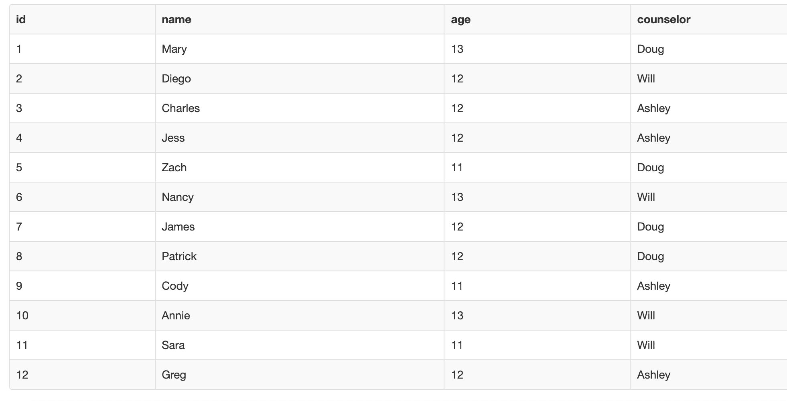
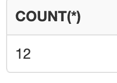
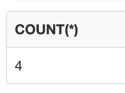
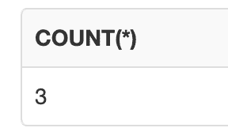
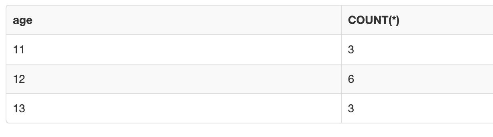
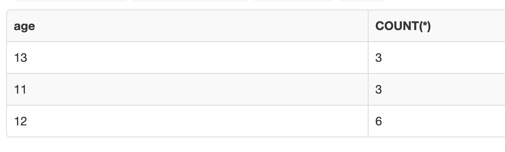
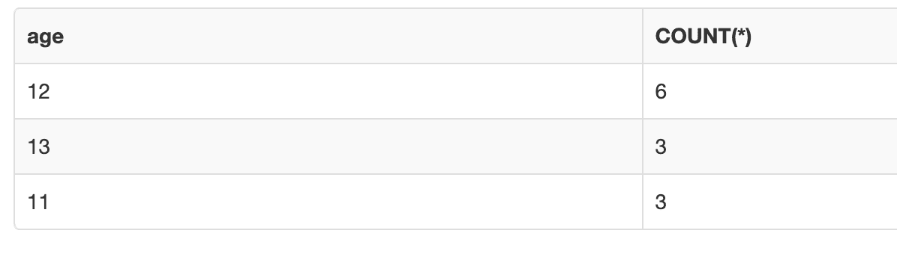
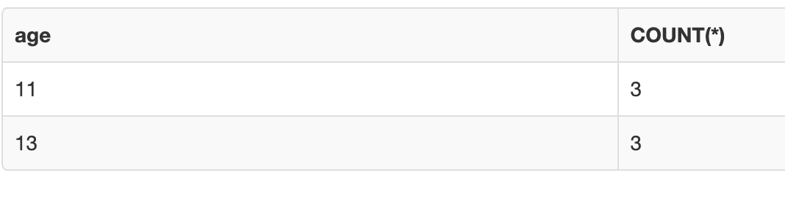

# SQL Distinct 语句–如何查询、选择和计数

> 原文：<https://www.freecodecamp.org/news/sql-distinct-statement-how-to-query-select-and-count/>

在 SQL 中，您可以进行数据库查询，并使用`COUNT`函数来获取表中特定组的行数。

在本文中，我将通过几个代码示例向您展示如何使用`COUNT`函数。

## SQL 中的 COUNT 函数是什么？

这个 SQL 函数将返回给定组的行数。

下面是基本语法:

```
SELECT COUNT(column_name) FROM table_name;
```

SQL 中的`SELECT`语句告诉计算机从表中获取数据。

`COUNT(column_name)`不会将`NULL`值作为计数的一部分。

SQL 中的一个`NULL`值引用了表中不存在的值。

有时您可以在`COUNT`函数的括号内使用`*`。

```
SELECT COUNT(*) FROM table_name;
```

`COUNT(*)`函数将返回该组中的项目总数，包括`NULL`值。

SQL 中的`FROM`子句指定了我们想要列出哪个表。

也可以在`COUNT`函数中使用`ALL`关键字。

```
SELECT COUNT(ALL column_name) FROM table_name;
```

`ALL`关键字将计算表中的所有值，包括重复值。您可以省略这个关键字，因为无论您是否编写了关键字`COUNT`,函数都会使用`ALL`作为默认关键字。

有时你会看到`DISTINCT`关键字和`COUNT`函数一起使用。

```
SELECT COUNT(DISTINCT column_name) FROM table_name;
```

`DISTINCT`关键字将只计算属于`NOT NULL`的唯一值。计算机将忽略任何重复的值。

## 如何在 SQL 中使用 COUNT 函数

在这个例子中，我们为年轻的露营者准备了一个表格，其中有`id`、`name`、`age`和`counselor`列。



如果我们想要选择表中的所有行，那么我们可以使用以下语法:

```
SELECT COUNT(*) FROM campers;
```



如您所见，该查询返回了数字 12，它表示我们的`campers`表中的总行数。

### 使用`WHERE`子句

我们可以使用`WHERE`子句来指定特定营地辅导员姓名的行数。

在本例中，我们希望计算名为 Ashley 的营地辅导员的行数。

在`WHERE`子句中，我们需要用值`"Ashley"`指定`counselor`。

```
 WHERE counselor="Ashley";
```

这是完整的代码:

```
SELECT COUNT(*) FROM campers WHERE counselor="Ashley";
```

这是结果将返回的内容:



如果我们看一下前面的表格，我们可以看到`"Ashley"`只出现了 4 次。


我们可以修改我们的结果来计算 11 岁的露营者有多少行。

在`WHERE`子句中，我们需要用值`11`指定`age`。

```
WHERE age=11;
```

这是完整的代码:

```
SELECT COUNT(*) FROM campers WHERE age=11;
```

这是结果将返回的内容:



如果我们看一下之前的表格，我们可以看到只有三个 11 岁的营员。

### 如何使用`GROUP BY`子句

我们可以使用`GROUP BY`子句和`COUNT`函数来查看表中 11 岁、12 岁和 13 岁的露营者的数量。

我们首先必须选择`age`列并使用`COUNT`函数:

```
SELECT age, COUNT(*)
```

然后，我们必须指定`campers`表，并按`age`对结果进行分组:

```
FROM campers GROUP BY age;
```

这是所有代码的外观:

```
SELECT age, COUNT(*) FROM campers GROUP BY age;
```

结果是这样的:



### 如何使用`ORDER BY`子句

我们可以修改年龄列表的示例，使用`ORDER BY`子句从最小到最大列出结果。

这是`ORDER BY`子句的代码:

```
ORDER BY COUNT(*);
```

我们将该子句添加到`SELECT`语句的末尾，如下所示:

```
SELECT age, COUNT(*) FROM campers GROUP BY age ORDER BY COUNT(*);
```

修改后的示例如下所示:



如果我们希望计数结果从最大到最小排序，那么我们可以使用`DESC`关键字。

这是使用`DESC`关键字的`ORDER BY`子句的代码:

```
ORDER BY COUNT(*) DESC;
```

这是完整的代码:

```
SELECT age, COUNT(*) FROM campers GROUP BY age ORDER BY COUNT(*) DESC;
```

这是新结果的样子:



### 如何使用`HAVING`子句

我们可以使用`HAVING`子句为`COUNT`函数指定一个条件。

我们可以修改代码，只显示计数小于 5 的年龄的结果。

下面是针对`HAVING`子句的代码:

```
HAVING COUNT(*)<5; 
```

完整的代码如下所示:

```
SELECT age, COUNT(*) FROM campers GROUP BY age HAVING COUNT(*)<5; 
```

修改后的结果如下所示:



我们可以看到，12 岁的孩子被排除在结果之外，因为计数大于 5。

## 结论

在 SQL 中，您可以进行数据库查询，并使用`COUNT`函数来获取表中特定组的行数。

下面是基本语法:

```
SELECT COUNT(column_name) FROM table_name;
```

`COUNT(column_name)`不会将`NULL`值作为计数的一部分。

SQL 中的一个`NULL`值引用了表中不存在的值。

有时您可以在`COUNT`函数的括号内使用`*`。

```
SELECT COUNT(*) FROM table_name;
```

`COUNT(*)`函数将返回该组中的项目总数，包括`NULL`值。

我希望您喜欢这篇文章，并祝您的 SQL 之旅好运。