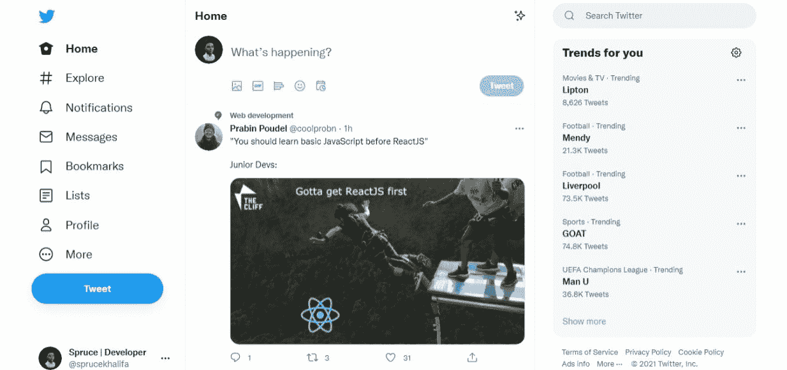

# CSS Flexbox 教程——如何构建一个固定的侧边和底部导航栏

> 原文：<https://www.freecodecamp.org/news/fixed-side-and-bottom-navbar-with-css-flexbox/>

Flexbox 可以帮助您简化创建基本和高级布局的过程。用 CSS `flexbox`或`Grid`创建侧边和底部导航菜单非常简单。

这些布局非常受欢迎，几乎出现在网络的任何地方。例如，看看 Twitter 的侧边栏，它激发了这篇文章:



通常，要用 CSS 创建一个固定菜单，你必须使用值为`fixed`或`sticky`的`position`属性。

这种方法的问题是，它将整个元素从文档流中移除，就像它根本不存在一样。对于初学者甚至专家来说，这是 CSS 中令人沮丧的时刻之一。

在本教程中，你将学习如何用 CSS `flexbox`创建一个固定的侧边栏和底部导航菜单。我将在 Codepen 上托管所有代码和演示，这样您就可以看到我们将构建的内容的实时预览。

## 入门指南

要使用 Flexbox 创建固定元素，首先需要禁用要固定的项目的父元素上的滚动。在我们的例子中，父元素是`body`:

```
body {
    overflow: hidden;
    height: 100vh;
}
```

## 加价

我们将使用 HTML 创建一个包含在名为`wrapper`的`div`中的两列布局。

```
<body>
<div class="wrapper">
  <aside>
    <ul>
      <li>Item</li>
      ...
    </ul>
  </aside>
  <main>
    <div class="wrapper_inner">
      <p>
        ...  
       </p>
     </div>
   </main>
 </div>
</body> 
```

## CSS

要修复侧边栏，我们只需禁用父元素`body`上的滚动，并使`main`元素可滚动。

```
body {
  overflow: hidden;
  height: 100vh;
}
main {
  overflow-y: auto;
}
aside {
  flex: 1 0 10%;
}
.wrapper {
  display: flex;
  height: 100%;
}
```

让我们稍微分解一下这段代码。

首先我们让`body`不可滚动，并用下面的代码隐藏滚动条:

```
body {
    overflow: hidden;
}
```

然后使用`overflow: auto`，我们将滚动条添加回`main`元素。

最后，我们创建了一个 flex 容器`wrapper`，并使用`height: 100%`赋予它与父容器相等的高度:

```
.wrapper {
    display: flex;
    height: 100%;
}
```

## 如何使它对移动设备友好

但是在宽度小于`500px`的手机屏幕上，我们希望侧边栏固定在底部或顶部，视情况而定。为此，您将添加以下 CSS:

```
@media (max-width: 500px) {
  .wrapper {
    flex-direction: column-reverse;
  }
  ul {
    display: flex;
    align-items: center;
    justify-content: space-between;
  }

}
```

在移动屏幕上，我们将 flex 包装器的方向从行改为列。然后，为了使它固定在底部，我们添加以下内容:

```
.wrapper {
    flex-direction: column-reverse;
}
```

另一方面，要将它固定在顶部，您只需移除`column-reverse`并将其更改为`column`，如下所示:

```
.wrapper {
    flex-direction: column;
}
```

你可以在下面用 Codepen 创建的笔中看到一个实时预览。您可以调整窗口大小来查看固定的底部导航:

[https://codepen.io/Spruce_khalifa/embed/preview/XWgxabX?default-tabs=html%2Cresult&height=300&host=https%3A%2F%2Fcodepen.io&slug-hash=XWgxabX](https://codepen.io/Spruce_khalifa/embed/preview/XWgxabX?default-tabs=html%2Cresult&height=300&host=https%3A%2F%2Fcodepen.io&slug-hash=XWgxabX)

## 结论

在本教程中，你学习了如何用`flexbox`创建一个响应性的固定侧边栏。以下是一些需要记住的重要步骤:

1.  要用 flexbox 固定一个元素，您必须用`overflow: hidden`禁用父元素上的滚动
2.  然后，您需要创建一个高度等于父容器的 flex 容器
3.  将`overflow: auto`添加到您不想修复的元素

就是这样！

如果你觉得本教程有用或者有任何问题，请随时在 Twitter 上与我联系(别忘了点击关注按钮) [@sprucekhalifa](https://twitter.com/iamspruce.dev/) 。

哦，祝编码快乐！