# 如何在 Netlify 或 GitHub 页面上发布 HTML 网站

> 原文：<https://www.freecodecamp.org/news/publish-your-website-netlify-github/>

你已经完成了 HTML 网站的创建，你对自己的努力感到自豪。但是还有一点没有做到:你不知道如何发布你的网站。

在本教程中，你将学习如何使用两个流行的平台发布一个 HTML 网站——**Netlify**和 **GitHub** 。

在我们开始之前，确保您有一个 [GitHub 帐户](https://github.com),因为您需要在 GitHub 上托管您的库(您的源代码)。没有它，你将无法按照本教程发布你的 HTML 网站。

## 如何在 Netlify 上发布网站

我们要探索的第一种方法是如何在 [Netlify](https://www.netlify.com/) 上发布你的网站。

Netlify 是一个托管网站的平台。在 Netlify 上托管站点很容易，因为你不需要手动配置它——最重要的是，它是免费的。如果你还没有注册账户，现在是注册的好时机。

以下是在 Netlify 上发布网站的一步一步的过程:

### 步骤 1:添加新站点

登录后，它会将您带到一个主仪表盘。点击 git 中的**新网站按钮，将您的新网站添加到 Netlify 中。**

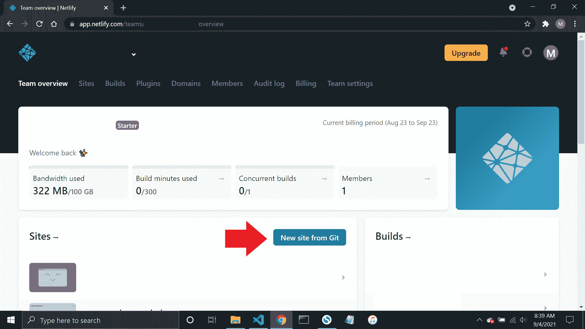

### 步骤 2:链接到你的 GitHub

当你点击 git 中的**新站点按钮时，它会将你带到“创建新站点”页面。确保你在 GitHub 上推送你的库，这样 Netlify 就可以链接到你的 GitHub 账户。**

点击 **GitHub** 按钮，如下图截图所示:

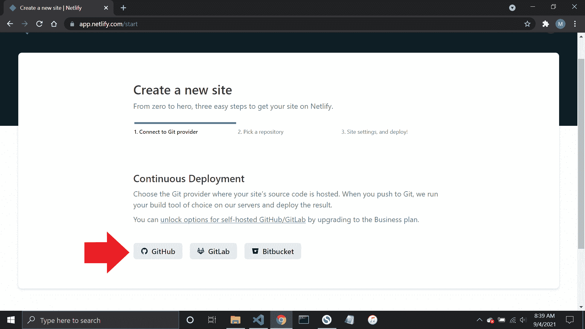

### 步骤 3:授权网络生活

接下来，点击**授权 Netlify by Netlify** 按钮。需要此权限，以便 Netlify 和 GitHub 都可以连接。

### 步骤 4:选择您的存储库

授予 Netlify 权限后，您可以看到所有存储库的列表。选择您要发布的网站。您可以通过向下滚动列表或使用搜索栏缩小列表来找到它。

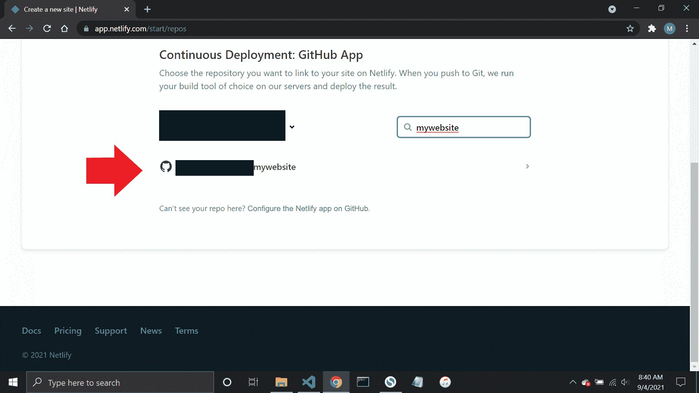

### 步骤 5:配置您的设置

选择您的网站后，将提示您配置用于部署网站的设置。因为你的网站只是一个静态的网站，所以这里没什么可做的。只需点击**部署站点**继续。

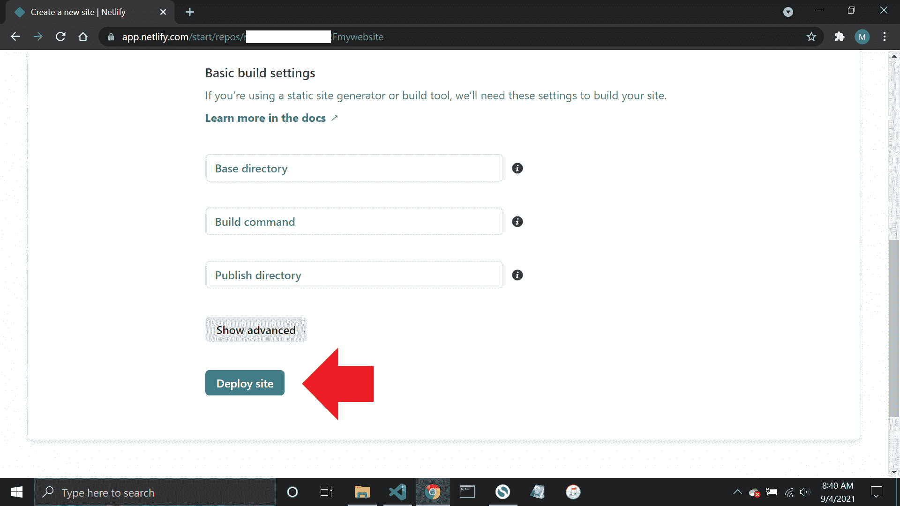

### 第六步:发布你的网站

您的网站现在可以发布了！Netlify 会为您完成剩下的工作，完成这个过程只需要一分钟左右的时间。

现在你完成了！您的新网站已发布，您可以通过单击绿色链接来查看它。

现在，你的 URL 看起来是随机的，但是你可以通过点击**站点设置**按钮，然后点击**更改站点名称**按钮来编辑它。

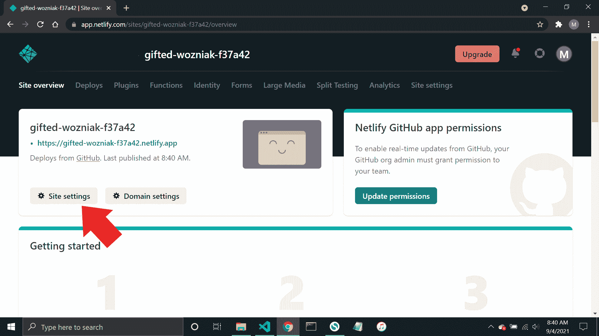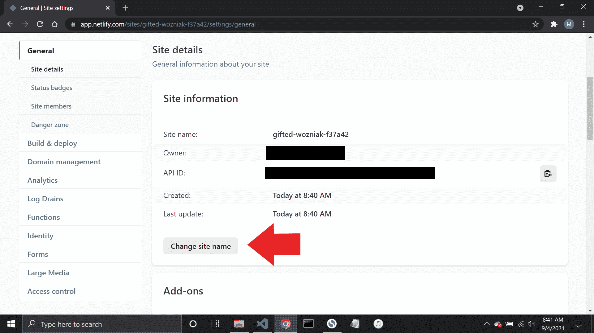

祝贺你发布了你的第一个新网站！现在我们将学习如何使用 GitHub 发布网站。

## 如何在 GitHub 上发布网站

我们要看的第二种方法是使用 GitHub 来发布你的站点。GitHub 是一个存储、跟踪和管理项目源代码的平台。它也是你发布 HTML 网站的地方——和 Netlify 一样，它在这里是免费的。

以下是在 GitHub 上发布您的网站的一步一步的过程:

> 注意:如果您将资源库的可见性设置为 public，那么您只能在 GitHub 上发布您的网站。如果您想部署一个私人网站，请将您的帐户升级到 Pro 或使用 Netlify 托管。

### 第一步:去你网站的知识库

登录后，转到左侧边栏的存储库，选择您想要发布的存储库。

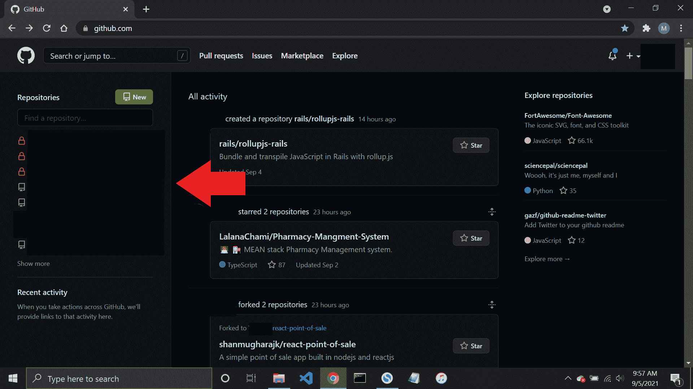

### 步骤 2:选择设置

在您的存储库中，单击**设置**链接，它会将您带到存储库的设置页面。

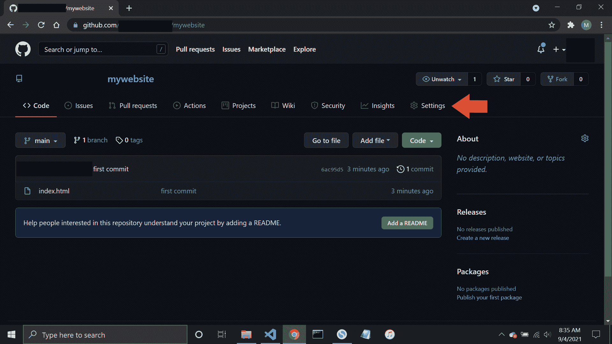

### 第三步:转到 GitHub 页面

当你进入一个存储库的设置时，向下滚动一点直到你在左边栏看到**页面**链接。点击它，它会把你带到 GitHub 页面。

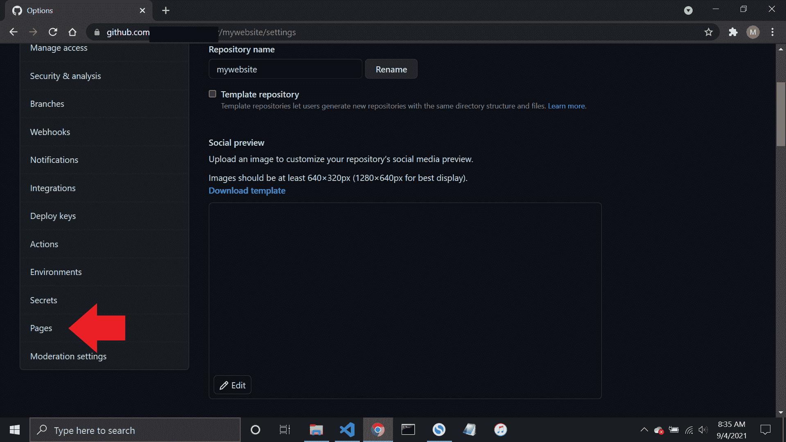

### 步骤 4:选择分支

在 source 部分，单击下拉菜单，选择主分支并保存它。取决于你如何称呼它，它可以是**主人**或**主**。

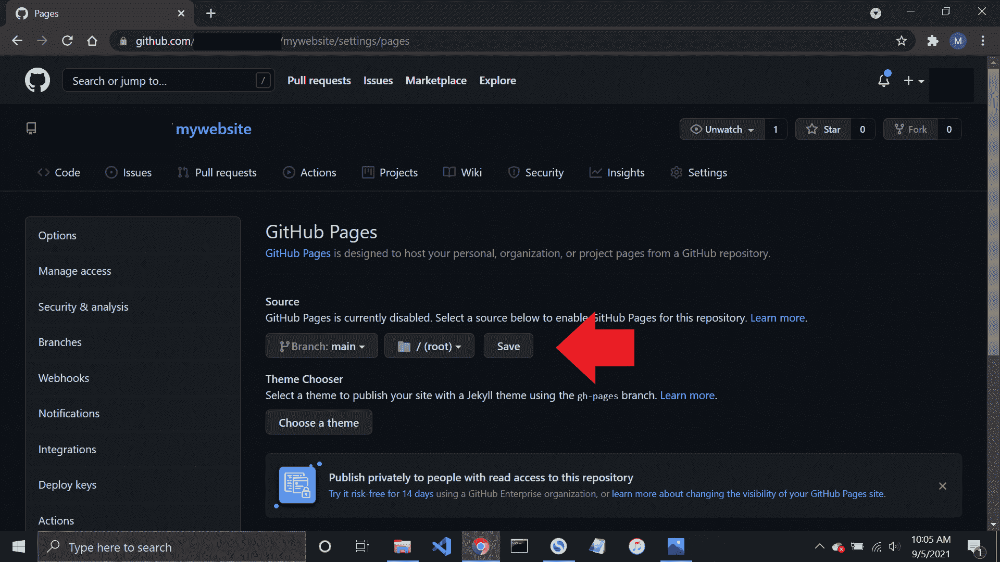

### 第五步:全部完成

你完了！您的网站将被发布，只需一分钟左右即可完成。刷新页面，您将看到一个指向您新发布的网站的链接。

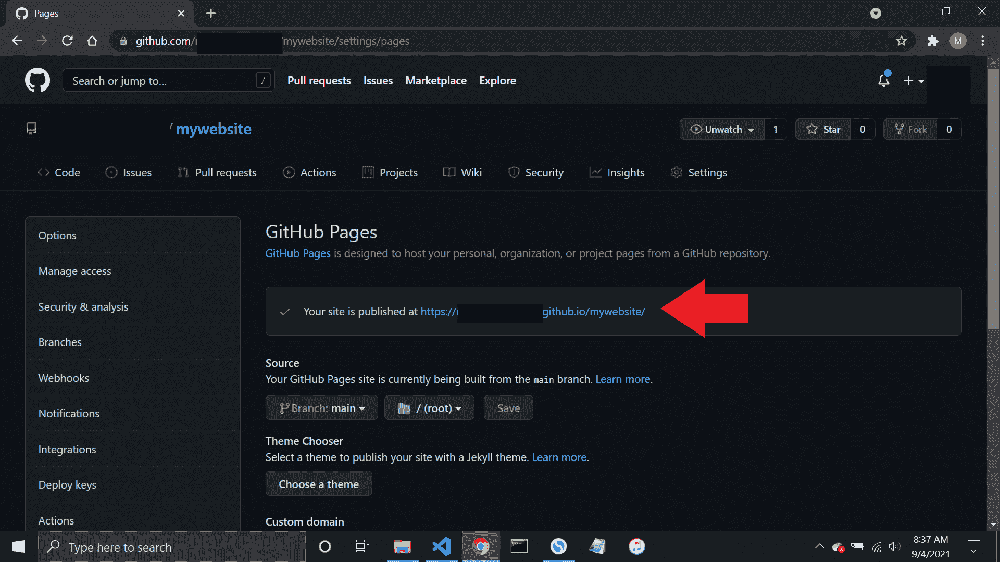

## 结论

我希望这篇教程对你有所帮助。你已经学会了如何用 Netlify 和 GitHub 发布你的 HTML 网站。现在你可以开始向世界展示你不可思议的作品了。

如果你想了解更多关于现代网络开发的知识，我邀请你参加我的[全栈 JavaScript 课程](https://js.coderslang.com)或者[在我的编程博客上阅读更多关于 JS、HTML 和 CSS 的文章。](https://learn.coderslang.com)