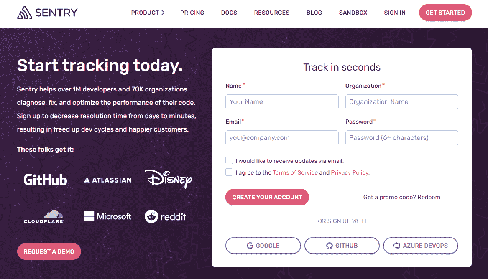
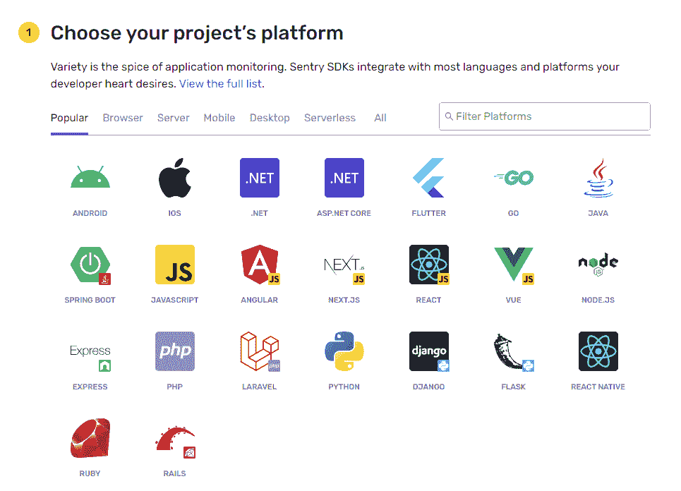
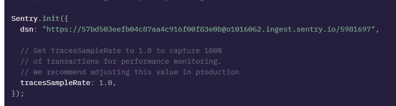
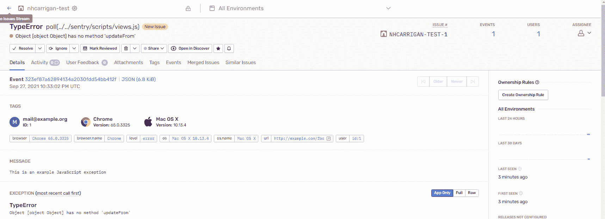
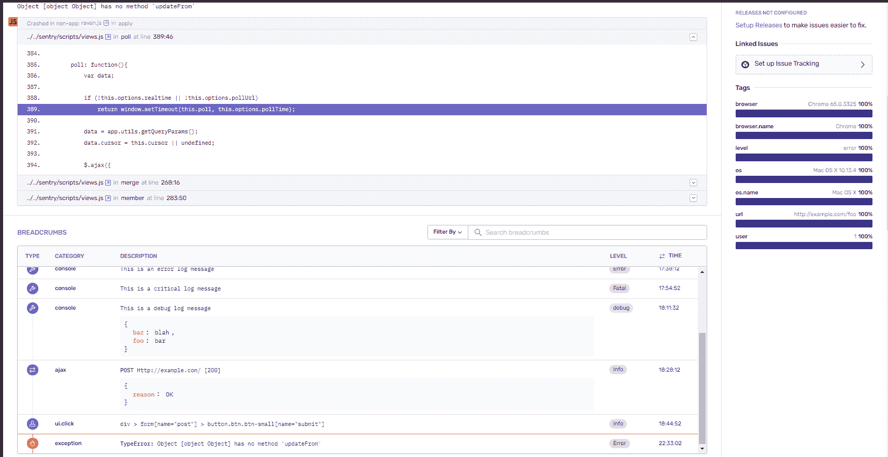
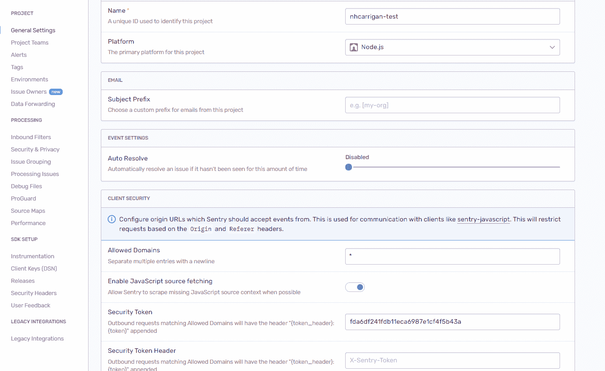
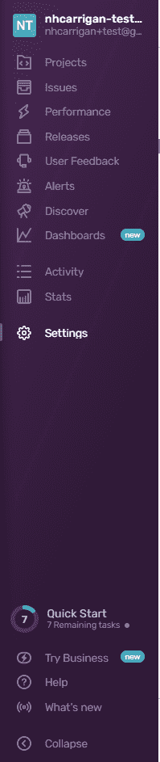

# 如何使用 TypeScript 向 Node.js 项目添加 Sentry

> 原文：<https://www.freecodecamp.org/news/how-to-add-sentry-to-your-node-js-project-with-typescript/>

Sentry.io 是一个外部监控和日志记录服务，可以帮助您识别和分类代码中的错误。

这些日志提供诸如跟踪堆栈、面包屑和(假设这是一个 web 应用程序)浏览器数据等信息。这可以帮助您更快地筛选问题和解决 bug，同时减少调查开销。

## 如何准备你的哨兵账户

首先导航到[岗哨](https://sentry.io)，点击“开始”。您将进入帐户创建屏幕:



您可以注册 OAuth 或者为 Sentry 创建单独的凭证。如果您选择创建单独的凭据，您需要现在输入组织名称(以后可以更改)。我用我的用户名作为我的组织名称。一旦你创建了你的帐户，哨兵将带你通过一个教程来设置你的第一个项目。点击“我准备好了”进入第一步。



出于我们的目的，`NODE.JS`选项是您应该选择的平台。然后点击“创建项目”。

这将带您进入准备 SDK 与您的代码库集成的说明。保持该页面打开，因为您将需要您的`dsn`值。

## 如何在你的代码中使用哨兵

下一步是安装 essay sentry 软件包:

```
npm install @sentry/node @sentry/integrations
```

`@sentry/node`包是 Node.js 项目的核心 SDK，而`@sentry/integrations`包包含一个用于映射文件路径的工具。

您的哨兵工具应该在您的代码流中尽早加载。理想情况下，这意味着您应该在应用程序的入口点(即`index.ts`)内初始化它。

从导入包开始:

```
import * as Sentry from "@sentry/node";
import { RewriteFrames } from "@sentry/integrations";
```

第一个导入引入了哨兵节点工具，第二个导入提供了对`RewriteFrames`集成的访问。这种集成允许您调整堆栈跟踪的路径，这对于正确指向您编译的 JavaScript 文件是必要的。

现在您需要实例化 Sentry 监视器并提供配置:

```
Sentry.init({
  dsn: process.env.SENTRY_DSN,
  tracesSampleRate: 1.0,
  integrations: [
    new RewriteFrames({
      root: global.__dirname,
    }),
  ],
});
```

这里您已经将一个配置对象传递给了`Sentry.init()`方法(用于实例化和初始化 Sentry 进程)。要分解这些选项:

*   `dsn`是一个唯一的 URL，用于将您的 Sentry 实例连接到您的仪表板。我们稍后将对此进行探讨。
*   `tracesSampleRate`确定监视器应发送到仪表板的事件百分比。值`1.0`发送 100%的捕获事件-但是如果您发现这太嘈杂，您可以减少这个数字。
*   `integrations`加载您想要使用的集成。在这种情况下，您加载了`RewriteFrames`选项，并将堆栈跟踪的`root`路径设置为`global.__dirname`(解析为您运行应用程序的目录)。

然后，在你记录错误的代码库中的任何地方(比如一个`try / catch`块或者一个`.catch()`链)，添加`Sentry.captureException(error)`(用代表你的错误对象的变量替换`error`)来将错误传递给你的哨兵监视器。

## 如何将您的代码连接到仪表板

回到项目设置页面，您将看到配置中`dsn`选项 URL 值。



你的`dsn`应该被视为秘密，不要与任何人分享。您可以通过将它添加到您的`.env`文件中来实现这一点(将它分配给`SENTRY_DSN`以匹配我们上一步的配置)。

`dsn`告诉 Sentry 将捕获的错误发送到哪里，仪表板使用它将这些错误链接到您的新项目。

> 前端项目的注意事项:
> 因为你不能访问前端的`.env`，你将需要公开暴露你的`dsn`。我们将在下一步讨论如何处理这个问题。

一旦设置好了，你就可以点击 Sentry 页面底部的小字“查看该 SDK 的示例事件”。这将生成一个假的错误事件，并把您带到仪表板。

## 如何配置您的哨兵仪表板

Sentry 网站将为您提供仪表板的快速浏览，如果您愿意，您可以跟随它，或者您可以跳过它，继续本文。



该视图显示了捕获的错误事件的具体细节。在本例中，它是 Sentry 从上一步中生成的示例事件。

上半部分提供了触发错误的用户的浏览器数据、错误消息和错误类型等信息。下半部分提供了堆栈跟踪和 breadcrumbs(触发此错误所发生的操作)——两者都有助于在 triage 中重现此错误。

在最顶端，您应该看到您的项目名称(默认为您的组织名称)和一个齿轮。点按齿轮以进入您项目的设置。



这里您可以看到您的项目的一些配置。“名称”决定了项目的名称。更改“平台”会影响堆栈跟踪的呈现方式。欢迎您根据需要尝试其他设置。

> 对于前端项目:
> 如前所述，您将需要公开暴露您的 DSN。您可以在“允许的域”中设定网页的 URL，以防止从任何其他来源发送数据。

边栏上有几个附加选项。选择“客户端密钥(DSN)”会将您带到一个页面，如果需要，您可以在该页面再次复制您的 DSN。如果您不小心暴露了它，也可以将其删除并重新生成。

选择“警报”将允许您配置接收错误事件通知的方式。我将我的设置发送给一个 [Discord Webhook](https://github.com/nhcarrigan/discord-integrations) ，但是你可以配置一些集成选项来接收你的提醒。



最后，你有主侧栏。在这里，您可以配置您的组织设置，包括重命名您的组织或创建其他组织和项目。

## 结论

现在，您已经成功地将 Sentry 与 Node.js-Typescript 项目集成在一起。现在，您可以开始接收错误信息，对问题进行分类，并提高项目的稳定性。

请随意尝试 Sentry 的设置和功能，以个性化您的体验来满足您的需求。编码快乐！