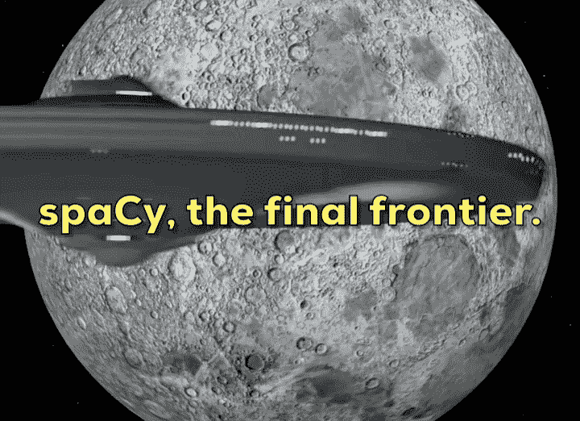

# spaCy 和 Python 的自然语言处理-完整课程

> 原文：<https://www.freecodecamp.org/news/natural-language-processing-with-spacy-python-full-course/>

自然语言处理(NLP)是语言学的一个分支，它试图在计算机系统中解析人类语言。spaCy 是一个用于 NLP 的流行 Python 库。

我们刚刚在 freeCodeCamp.org YouTube 频道上发布了一个 NLP 和 spaCy 课程。在本课程中，您将学习所有关于自然语言处理的知识，以及如何使用 Python 空间库将其应用于现实世界的问题。

W.J.B .马丁利博士创立了这门课程。马丁利博士是史密森学会数据科学实验室的博士后研究员。他也是一位优秀的老师。

马丁利博士创作了一系列 Jupyter 笔记本来配合课程。它们在课程的网站上。

因为 NLP 对于计算机来说是一个如此复杂的问题，它需要一个复杂的解决方案。答案已经在人工神经网络，或简称为 ann 或神经网络中找到了。新的训练方法，如变压器模型，进一步推动了这一领域。在本课程中，您将了解到这些方法。

A spaCy gif I made. :)

本课程包括以下几个部分:

*   课程介绍
*   自然语言处理简介
*   如何安装 spaCy
*   散装容器
*   语言注释
*   命名实体识别
*   词向量
*   管道
*   EntityRuler
*   制榫机
*   定制组件
*   正则表达式(基础)
*   正则表达式(多单词标记)
*   NER 应用空间金融公司

观看以下课程或 freeCodeCamp.org YouTube 频道上的[(3 小时观看)。](https://youtu.be/dIUTsFT2MeQ)

[https://www.youtube.com/embed/dIUTsFT2MeQ?feature=oembed](https://www.youtube.com/embed/dIUTsFT2MeQ?feature=oembed)

## 副本

(自动生成)

在本课程中，您将学习所有关于自然语言处理的知识，以及如何使用 spacey 库将其应用于现实世界的问题。

马丁利博士在这方面知识渊博，他是个优秀的老师。

嗨，欢迎收看这个视频。

我是 William Mattingly 博士，我专门研究多语言自然语言处理，我从人文的角度来研究 NLP，我有中世纪历史的博士学位，但我经常使用 spacey 来满足我所有的 NLP 需求。

因此，在接下来的几个小时里，你将从这个视频中获得对什么是自然语言处理或 NLP 的基本理解，以及如何将其应用于特定领域的问题，或存在于你自己专业领域内的问题。

我碰巧一直用这个来分析历史文件，或者我个人投资的财务文件。

在接下来的几个小时里，你会学到很多关于 NLP 语言的知识，最重要的是，spacey 库。

我喜欢 spacey 库，因为它很容易使用，也很容易用现成的模型来实现解决一般问题的通用解决方案。

在本视频系列的第一部分，我将带您了解如何充分利用这些现成的功能。

在第二部分中，我们将开始处理一些现成模型中不存在的特性。

我将向您展示如何在 spacey 中使用基于规则的管道或组件来实际解决特定领域的问题以及您自己的领域，从实体标尺到匹配器，到实际注入健壮的复杂正则表达式或 regex 模式，以及目前实际上不存在的自定义 spacey 组件。

我将在第二部分向您展示所有这些，这样在第三部分，我们可以吸取在第一部分和第二部分中学到的经验，并实际应用它们来解决 NLP 中存在的一个非常常见的问题，即从金融文档中提取信息。

所以找到相关的东西，比如股票、市场、指数和股票交易所。

如果您在接下来的几个小时里和我一起学习，您将会对 spacey 的地位有一个很好的了解，对现成的组件也有一个很好的了解，并且知道如何将现成的组件应用到您自己的领域。

如果你也和我一起看这个视频，并且你喜欢它，请在下面的评论中让我知道，因为我对制作这个视频的第二部分感兴趣，这部分不仅将探索 spacey 基于规则的方面，而且还将探索 spacey 基于机器学习的方面。

所以教你如何训练你自己的模型来做你自己的事情，比如训练一个依赖解析器，训练一个命名实体识别器之类的事情，这在这个视频中没有涉及。

然而，如果你和我一起看这一部，并且你喜欢它，你会发现第二部更容易理解。

因此，请坐好，放松，让我们进入什么是 NLP，你可以用 NLP 做什么样的事情，如信息提取，以及什么是 spacey 库，以及这门课程将如何布局。

如果你喜欢这个视频，也可以考虑订阅我的数字人文科学频道 Python 教程，链接在下面的描述中。

即使你不是像我一样的数字人文主义者，你也会发现这些 Python 教程很有用，因为它们采用了 Python，并使所有水平的学生都可以使用它。

特别是那些初学者，我不仅会带你了解 Python 的基础，还会一步一步地带你了解一些你需要的更常见的库。

许多频道处理文本或基于文本的问题。

但其他内容涉及机器学习、图像分类和 OCR 等内容，都是用 Python 编写的。

所以在我们开始 spacey 之前，我想我们应该花一点时间讨论一下 NLP 或者自然语言处理到底是什么。

自然语言处理是我们试图让计算机系统理解、解析和提取人类语言(通常是原始文本)的过程。

自然语言处理有几个不同的领域。

有命名实体识别，词性标注，句法分析，文本分类，也称为文本分类，共指解析机器翻译。

与 NLP 相邻的是另一种计算语言学领域，称为自然语言理解 NLU。这是我们训练计算机系统做关系提取，语义解析，问答等事情的地方。这是机器人真正发挥作用的地方，概括，情感分析和解释。

NLP 和 NLU 被广泛的行业使用，从金融行业，一直到法律和学术界，研究人员试图从文本中提取信息。

在 LP 中，有几个不同的应用程序。

第一个也可能是最重要的是信息提取。

这是我们试图让计算机系统提取与我们自己的研究或需求相关的信息的过程。

例如，我们将在本视频的第三部分看到，当我们需要将 spacey 应用于金融领域时，一个对金融感兴趣的人可能需要 LP 来浏览和提取公司名称、股票、指数等信息，这些信息可能会在新闻文章中引用，从路透社到《纽约时报》再到《华尔街日报》。

这是一个使用 NLP 提取信息的例子。

考虑 NLP 在这一领域的应用的一个好方法是，它接收一些非结构化数据，在这种情况下是原始文本，并从中提取结构化数据或元数据。

所以它会找到你想让它找到的东西并帮你提取出来。

现在，虽然有很多方法可以通过地名词典和列表匹配来做到这一点，但使用 NLP 框架，如 spacey，我马上就要谈到它，有一定的优势，主要是你可以使用和利用已经过语法或语义解析的东西。

因此，像单词的词性，像它的依存关系，像它的共同引用，这些都是 spacey 框架允许你做的事情，也可以训练成机器学习模型，并通过规则工作到管道中。

这是自然语言处理的一个方面。

它的一种用法是。

它的另一种用法是读入数据并进行分类。

这就是所谓的文本分类。

我们看到在这张图片的左边，是文本分类。

我们在这个情感分析中得出的结论也是，在很大程度上，是我们将信息输入计算机系统的一种方式，同样，非结构化数据或原始文本，我们以某种方式对其进行分类。

几十年来，你已经看到了这一点，通过垃圾邮件检测，垃圾邮件检测几乎是完美的，它需要不断更新。

但在大多数情况下，这是一个已经解决的问题。

你的邮件之所以会自动转到垃圾邮件文件夹，是因为你的邮件服务器后端有一个机器学习模型。

它所做的是实际查看电子邮件，查看它是否符合之前被视为垃圾邮件的模式，并为其分配垃圾邮件标签。

这就是所谓的分类。

研究人员也使用这种方法，尤其是在法律行业，律师经常会收到成百上千的文档，如果没有几百万的文档，他们也不一定有足够的时间逐字浏览和分析每一个文档。

不需要一页一页地浏览和阅读，就能对文档有一个大概的了解是很重要的。

因此，律师通常会使用 NLP 来进行分类和信息提取，他们会找到与他们的案件相关的关键词，或者他们会找到根据他们案件的相关领域分类的文档。

这样的话，他们可以把一百万份文件缩减到可能只有几份，可能 1000 份，他们必须逐字阅读。

这是自然语言处理的真实应用。

这两项任务都可以通过 spacey 框架来完成。

spacey 是现在做 NLP 的一个框架。

截至 2021 年，它只可用我相信 Python，我认为有一个社区正在用 R 开发应用程序，但我不确定。

但是 spacey 是 Python 可用的许多 NLP 框架之一。

如果你有兴趣看所有这些，你可以探索像 NLT·凯，自然语言工具包 stanza 这样的东西，我相信它来自斯坦福大学的同一个项目。

有很多，但我发现斯派西是最好的，有几个不同的原因。

原因之一是它们为您提供现成的模型，这些模型的基准测试非常好，这意味着它们的执行速度非常快。

它们还具有非常好的准确性指标，如精确召回率和 F 值。

而且我现在也不会过多谈论我们衡量机器学习准确度的方式，但是知道它们相当不错。

第二，spacey 能够利用当前的自然语言处理方法，特别是 transformer 模型，也称为 Bert 模型，尽管这并不完全准确，但它允许您使用现成的 transformer 模型。

第三，与现有的其他 NLP 框架相比，它提供了一个相对容易进行定制训练的框架。

最后，我选择 spacey 而不是其他 NLP 框架的第四个原因是因为它的伸缩性很好。

spacey 是由 explosion AI 设计的，spacey 的整个目的是在规模 AI 上工作，我们的意思是高效、有效和准确地处理大量文档。

spacey 的伸缩性很好，因为它可以在相对较短的时间内相对轻松地处理成百上千个文档，特别是如果您坚持使用更多基于规则的管道，这将在本视频的第二部分中讨论。

这是你真正需要了解的关于 NLP 和 spacey 的两件事，我们将在这个视频中深入讨论 spacey。

我为这个视频提供了免费的教科书，它位于 humanities.com 的空间点 python 网站。

它应该在这段视频下面的描述中与我打算合作的教科书联系起来。

我在视频中提到的一些东西可能不一定会出现在教科书中，因为它不太适合文本表达。

相反的情况也是如此，有些东西我没有时间在这个视频中逐字讲述，我会在视频中更深入地讲述。

在这本书里，我认为你应该尝试使用这两种方法，我建议你浏览整个视频，看完整个视频，对你能做的所有事情有一个大概的了解。

对于我们将要讲述的所有内容，我会回过头来尝试在一个单独的窗口或单独的屏幕上复制这个过程的每个阶段，并尝试进行跟踪和编码，然后我会第三次回过头来尝试观看第一部分，为什么要谈论我们将要做的事情，并尝试在不看教科书或视频的情况下自己完成。

如果你能在第三次通过时做到这一点，你就能很好地开始使用 spacey 来解决你自己领域的具体问题。

NLP 是一个复杂的领域，应用 NLP 非常复杂。

但幸运的是，像 spacey 这样的框架使这个项目和这个过程变得容易得多。

我鼓励你在这个视频中花几个小时来了解 spacey，我想你会发现你可以做一些你认为不可能的事情，而且相对来说很快。

所以，请坐好，放松，享受这一系列的视频。

为了使用 spacey，你首先要安装 spacey。

现在有几种不同的方法可以做到这一点。

根据您的环境和操作系统，我建议您访问 spacey.io 反斜杠用法，并进入您正在使用的正确框架。

因此，如果您使用的是 Mac OS，而不是 windows 或 Linux，您可以在这种非常方便的用户界面中浏览并选择对您最重要的不同功能。

我正在使用 Windows，在这种情况下，我将使用 PIP，并且我将在 CPU 上执行所有操作。

我将会用英语工作。

所以我建立了所有这些不同的参数。

它会告诉我如何在终端中使用 PIP 进行安装。

所以我鼓励你现在就浏览并暂停视频，继续安装你想安装的 Windows。

我将介绍如何在 Jupyter 笔记本电脑中安装它，稍后我们将介绍这款笔记本电脑。

我希望你不要使用图形处理器。

在 GPU 上与 spacey 合作需要更多地了解 GPU 的具体用途，即训练机器学习模型。

它要求你正确安装 CUDA。

它需要几个其他的东西，我真的没有时间在这个视频中进入，但我们将在一个更高级的 spacey 教程视频中解决。

所以现在，我建议选择你的操作系统选择可以使用 PIP 或 conda，然后选择 CPU。

由于您将通过英语文本学习本视频，我建议您现在就选择英语，继续安装或下载 N core web SM 模型。

这是小模型。

我马上会谈到这一点。

因此，我们在 Jupyter 笔记本中要做的第一件事是，我们将在单元格中使用感叹号来描述这是一个终端命令，我们将说 pip install spacey，当您执行此单元格时，您的输出将与我的略有不同。

我已经在这个环境中安装了 spacey。

因此，mind 会通过并看起来像这样，您将实际通过，而不是说需求已经满足，它将实际传递它实际安装的不同东西，以安装 spacey 及其所有依赖项。

接下来，您将再次按照说明进行操作，您将执行 Python dash m space spacey、space download，然后是您想要下载的模型。

所以让我们现在就开始吧。

所以我们继续说 Python m 间距。

这是一个 spacey 终端命令。

我们将下载 N core web SM，同样，我已经下载了这个模型，所以在我这边，spacey 看起来会与您这边在 Jupyter 笔记本上打印出来的有所不同。

如果我们给它一点时间，所有的东西都会通过，它说它已经收集了它，正在下载它。

我们现在都很开心。

现在我们已经正确安装了 spacey，并且已经正确下载了小模型，我们可以开始实际使用 spacey 并确保一切都是正确的。

我们要做的第一件事是像导入任何其他 Python 库一样导入 spacey 库。

如果您对此不熟悉，库只是一组可以导入 Python 脚本的类和函数，这样您就不必编写大量额外的代码。

库是你可以调用的类和函数的大规模集合。

因此，当我们导入 spacey 时，我们正在导入整个 spacey 库，现在我们已经看到了类似这样的内容，我们知道 spacey 已正确导入，只要您没有收到错误消息，所有内容都已顺利导入。

下一件事，我们需要做的是，我们要确保我们的英语核心网站 SM 是小英语模型下载正确。

因此，我们需要做的下一件事是，我们需要创建一个 NLP 对象。

随着我们的发展，我将更多地谈论这一点。

现在，这只是故障排除，以确保我们已经正确安装了 spacey，并且我们已经正确下载了我们的模型。

因此，我们将使用 spacey 点加载命令。

这需要一个参数，它是一个字符串，对应于你安装的模型。

这个案子是关于网络的。

如果您执行这个单元并且没有错误，您就成功地正确安装了 spacey，并且正确下载了英语核心 web SM 模型。

所以继续吧，花点时间，把这些东西都准备好。

如果需要，暂停视频，然后返回，我们将开始实际学习 spacey 的基础知识。

现在，我将大致介绍一下 spacey 的内容，它为什么有用，以及您需要熟悉的一些基本功能。

我将从我讲过的 Jupyter 笔记本和这个视频的介绍开始工作。

如果我们向下滚动到第一章的底部，spacey 的基础知识，然后你通过安装部分，你得到关于容器的这一部分。

那么什么是容器呢？spacey 中的容器是包含大量文本数据的对象。

有几种不同的容器可供您使用。

在 spacey 中，有 doc，doc Ben 示例，语言，词素 span，span 组和 token，我们将在这个视频系列中稍微处理一下词素。

在这个视频系列中，我们将会涉及到语言容器。

但实际上，我们将反复讨论的三件大事是坞站、跨度和令牌。

我认为当你第一次来到 spacey 时，有一点点关于这些东西是什么，它们做什么，它们是如何分层结构的学习曲线。

因此，我创造了这个，在我看来，有点容易理解的不同容器的图像。

所以，如果你把 spacey 想象成一个金字塔，一个分层系统，我们有所有这些不同的容器，实际上是 dock 对象，你的 Docker 容器，或者你的 dock 对象包含一整串关于你传递给 spacey 管道的文本的元数据，我们将在实践中看到，只需几分钟。

doc 对象包含许多不同的东西。

它包含属性。

这些属性可以是句子。

因此，如果您迭代 doc 点分，您实际上可以访问在该 doc 对象中找到的所有不同的句子。

如果您迭代每个单独的项，或者索引和您的 doc 对象，您可以获得单独的令牌。

记号将会是像单词或标点符号这样的东西，在你的句子或文本中，有着独立的重要价值，无论是在语法上还是语义上。

所以这将会是一些东西，比如单词，逗号，分号，引号，诸如此类的东西，这些都是你的记号。

我们将会看到令牌与传统的字符串方法和 Python 中的单词拆分有所不同。

下一件你应该熟悉的事情是跨度。

所以跨度很重要，因为它们存在于 doc 对象的内部和外部。

与标记不同，标记是 doc 对象的索引，span 本身可以是一个标记，但它也可以是多个标记的序列，我们将看到这一点。

所以想象一下，如果你在它的类别中有一个跨度，也许第一组是我们的位置。

因此，单个令牌可能就像柏林这样的城市，但在第二组中，这可能就像完整的专有名称一样。

例如，人也是如此。

所以这可能就像，我们将要看到马丁·路德·金，这将是一个记号序列，一个句子中三个不同项目的序列，组成一个跨度，或者一个独立的项目。

所以马丁·路德·金，是一系列个人标志的集合。

如果这没有意义，现在，随着我们在实践中对 spacey 的深入了解，这个形象将得到加强。

现在，我想让你明白 doc 对象是所有 spacey 都围绕着的东西，这将是你创建的对象。

这将是包含您需要访问的所有元数据的对象。

这将是您试图通过不同的定制组件、工厂和管道进行本质改进的对象。

当您使用 spacey 进行更高级的操作时，我们将在几秒钟内看到 dock 对象与文本本身的相似之处。

但是它是多么的不同，多么的强大。

我们现在将进入本教材的第二章，这一章将涉及如何适应间距的深层特征。

如果你想暂停视频，或者打开笔记本或书，从视频中分离出来，跟着视频走。

当我们在实时编码中浏览和探索它时，我们将在探索第二章时讨论一些不同的事情，这将比第一章长得多，我们不仅要导入 spacey，还要实际浏览和加载一个模型，围绕该模型创建一个 dog 对象。

所以我们要用容器和练习。

然后，我们将看到该容器如何存储大量关于文本的不同特征或元数据属性。

虽然它们表面上看起来一样，但实际上却大不相同。

因此，让我们继续在同一个 Jupyter 笔记本中工作，我们已经导入了 spacey，并且已经创建了 NLP 对象。

我想做的第一件事是，我想打开一个文本，开始在这个回购中工作，我们有一个数据文件夹。

在这个数据子文件夹中，我有几个不同的维基百科的开口，我有一个关于 MLK 的，我们稍后会在这个视频中用到。

然后我有一个关于美国的，这是维基强调我们。

这将是我们现在的工作。

所以让我们使用宽度操作符，打开数据反斜杠 wiki 下划线 us dot txt。

我们把它读作 f。

然后我们要创建这个文本对象，它等于 F 点读数。

现在我们已经创建了我们的文本对象，让我们来看看它是什么样子的。

所以让我们打印文本。

我们看到，这是一篇标准的维基百科文章，遵循同样的介绍性格式，大约有四到五段，保留了许多功能，例如描述脚注的括号。

我们现在不会太担心清理这个问题，因为我们感兴趣的不是清理我们的数据，而是开始使用 spacey 中的 doc 对象。

所以你要做的第一件事就是创建一个 doc 对象