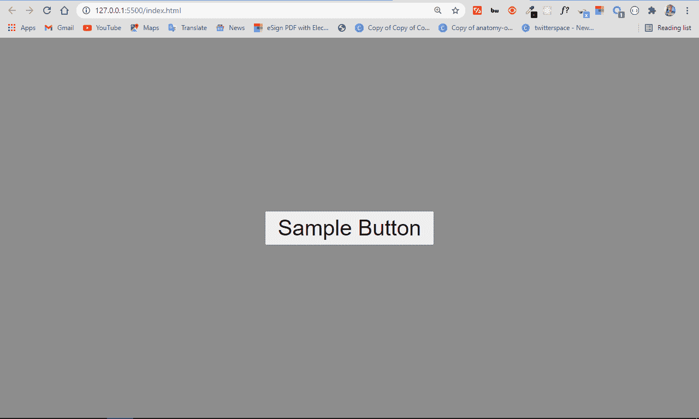
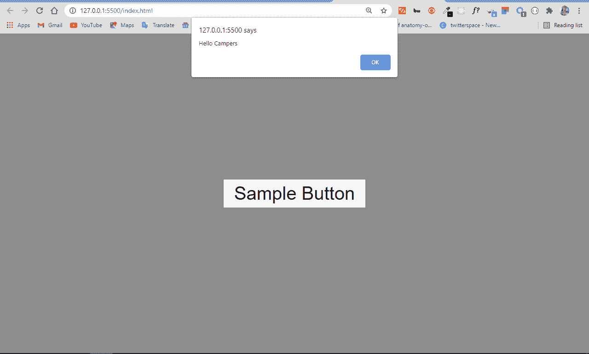
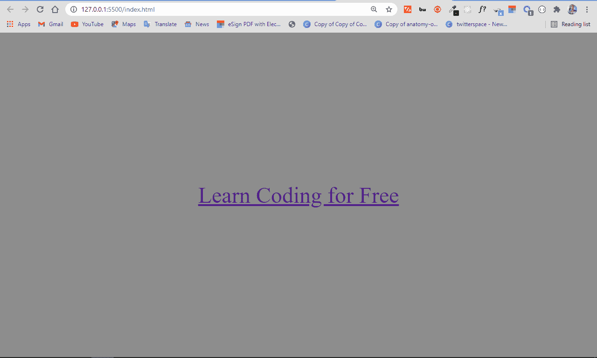
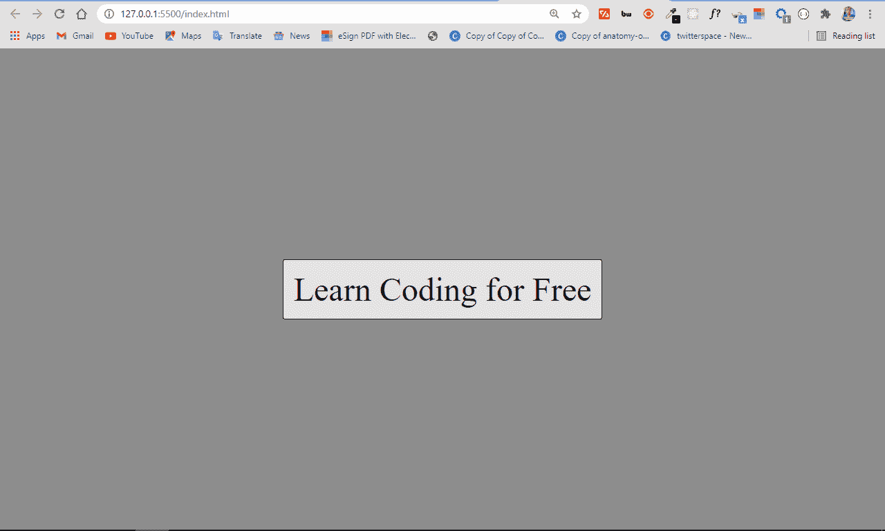
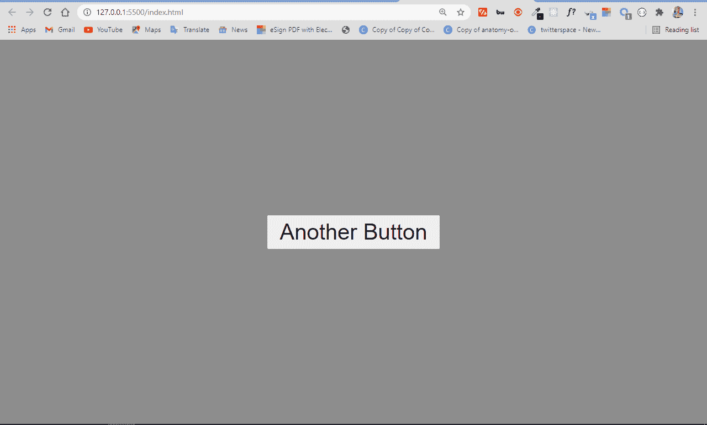
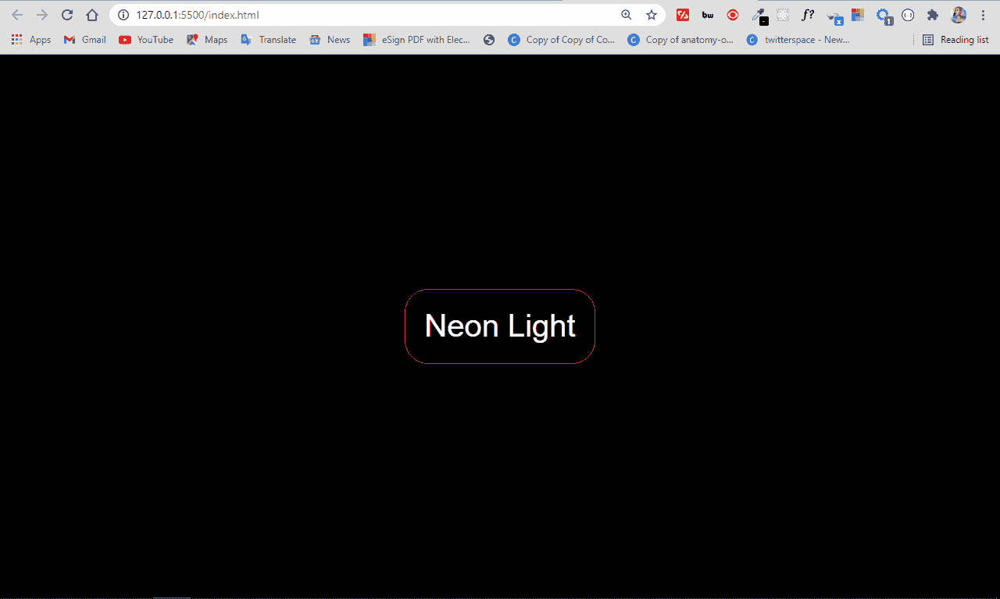
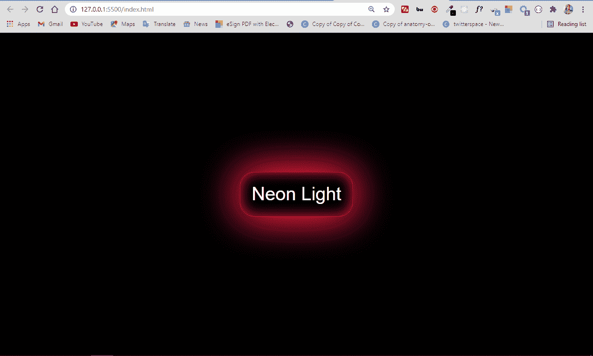

# HTML 按钮类型——如何在你的网站上添加按钮

> 原文：<https://www.freecodecamp.org/news/html-button-type-how-to-add-buttons-to-your-website/>

按钮是网站的重要组成部分。您需要它们来实现各种功能，从提交信息和访问更多内容到链接到网页和其他网站的不同部分。

HTML 给了你几种在网站上添加按钮的方法——按钮标签、锚链接以及输入类型`button`和`submit`。

在这篇文章中，我将向你介绍其中的 4 种方法，这样你就可以开始轻松地在你的网站上添加按钮了。

## 如何用按钮标签给你的网站添加按钮

按钮标签是向网站添加按钮的最简单的方法之一。要使用它，你所要做的就是把你想要的文本放在开始和结束标签之间，就像这样:

```
<button>Sample Button</button> 
```



我已经使用 flexbox、margin 和 height 属性将按钮水平和垂直放置在中心:

```
body {
        background-color: #8d8d8d;
        display: flex;
        align-items: center;
        justify-content: center;
        margin: 0 auto;
        height: 100vh;
      } 
```

随着我们的前进，页面上的所有内容都将以这个 CSS 为中心。

要激活这种按钮，必须添加一些 JavaScript。在下面的代码片段中，通过一些内嵌的 JavaScript，我让按钮在任何时候被点击时都在浏览器中显示一个警告框:

```
<button onclick="alert('Hello Campers')">Sample Button</button> 
```



## 如何用锚标签给你的网站添加按钮

您也可以使用锚定标签将按钮添加到您的网站。anchor 标签主要用于添加链接到你的网站，但是你可以用 CSS 样式化它，使它看起来像一个真正的按钮。

这种方法的优点是您可以链接到一个没有任何 JavaScript 的页面。

在下面的例子中，我用 anchor 标签制作了一个按钮，并将其链接到 freeCodeCamp 官方网站:

```
<a href="https://freecodecamp.org">Learn Coding for Free</a> 
```

看起来像是浏览器中的一个链接:


通过删除默认的下划线和文本颜色，用 color 属性设置背景色和前景色，并添加填充和边框半径，可以使它看起来像一个带有 CSS 的按钮:

```
 a {
        text-decoration: none;
        border: 0.2px solid #000;
        color: #000;
        background: #e6e4e4;
        padding: 5px;
        border-radius: 1px;
      } 
```

我在 CSS 中所做的只是试图模仿 HTML 中按钮的默认外观。

锚标记现在看起来像这样:


## 如何使用输入类型`Button`向您的网站添加按钮

您也可以使用按钮输入类型将按钮添加到您的网站。它的行为与按钮标签完全一样。

输入标记是一个空元素，这意味着它没有结束标记。那么如何在按钮中显示文本呢？你用 value 属性做！

```
<input type="button" value="Sample Button" /> 
```


## 如何使用输入类型`Submit`向您的网站添加按钮

您通常在表单元素中使用输入类型 submit，以便用户填写的数据在单击按钮时被提交。

就像按钮的输入类型一样，它是一个空元素，所以您需要一个 value 属性来告诉用户按钮是关于什么的。

```
<input type="submit" value="Another Button" /> 
```



输入类型按钮和输入类型提交之间的区别在于，当您在表单中使用提交按钮类型时，数据无需任何 JavaScript 操作即可提交。

但是另一方面，输入类型按钮需要一些 JavaScript 操作才能工作。因此，当您在表单元素中使用输入类型的按钮时，数据不会在被单击时自动提交。

## 迷你项目:如何用 HTML 和 CSS 制作一个霓虹灯按钮

霓虹灯按钮是一种设计趋势，因为它很漂亮而引起了轰动。根据您在本文中学到的知识，您可以用一个按钮标签和一些 CSS 来制作一个。

首先，您必须更改按钮的默认样式:

```
<button>Neon Light</button> 
```

```
 button {
        background-color: #000;
        border: .5px solid crimson;
        border-radius: 10px;
        color: #fff;
        padding: 8px;
      } 
```

到目前为止，按钮看起来是这样的:


要实现霓虹灯效果，可以使用`box-shadow`属性。它允许多个值，这将有助于制作霓虹灯效果。

```
button {
        background-color: #000;
        border: .5px solid crimson;
        border-radius: 10px;
        color: #fff;
        padding: 8px;
        box-shadow: 0 0 30px 0 crimson,
                    0 0 30px 0 crimson,
                    0 0 10px 0 crimson inset;
      } 
```

在`box-shadow`属性中:

*   第一个值表示 x 轴上的偏移量
*   第二个值表示 y 轴上的偏移量
*   第三个值代表模糊半径
*   第四个值代表扩散半径
*   第五个值是应用于阴影的颜色

我只想要扩散半径和颜色，所以我将其他值设置为零。然后，我将最后一个框阴影值添加到按钮的内部。

现在按钮上有了霓虹灯效果:



## 结论

这篇文章向你展示了几种在网站上添加按钮的方法。在 HTML 和 CSS 中，总是有多种方法来做同一件事——这就是为什么你可以在网站上添加按钮，甚至是一个锚标签。

您甚至可以通过在按钮周围包裹一个锚标记来使按钮表现得像一个链接。

您还可以添加带有几乎任何其他标签的按钮，例如 div、span，甚至 p 标签。但是，你应该避免这样做的可访问性，这样你就不会伤害你的网站的搜索引擎优化。毕竟，你也必须让网络爬虫的生活变得简单。

感谢阅读，继续编码。