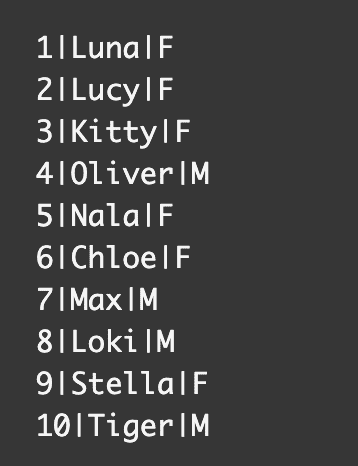
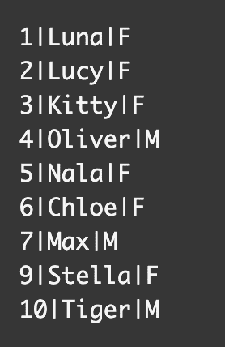
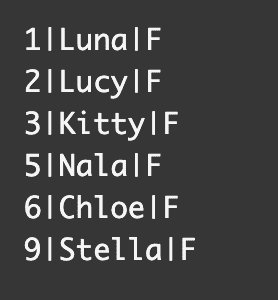
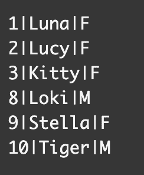
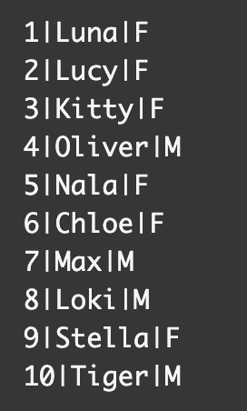
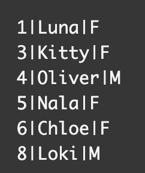

# 如何在 SQL 示例查询中删除行

> 原文：<https://www.freecodecamp.org/news/how-to-delete-a-row-in-sql-example-query/>

在 SQL 中，可以使用`DELETE`查询和`WHERE`子句删除表中的一行。

在本文中，我将带您了解如何使用`DELETE`查询和`WHERE`子句删除行。我还将向您展示如何一次从一个表中删除多行。

## 如何在 SQL 中使用删除查询

这是使用`DELETE`查询的基本语法:

```
DELETE FROM table_name
WHERE condition of which row(s) to delete;
```

在这个例子中，我们有一个名为`cats`的表，其中目前有 10 行。这些列将是`id`、`name`和`gender`。



我们想要删除带有 8 的`id`的行，这是 Loki 的行。


`DELETE`查询的第一行如下所示:

```
DELETE FROM cats
```

在第二行中，我们将通过在`WHERE`子句后使用`id=8`来指定哪一行。

```
WHERE id=8;
```

以下是删除 Loki 行的完整语法:

```
DELETE FROM cats
WHERE id=8;
```

这是新的`cats`表格的外观:



我们可以看到我们的`DELETE`查询成功了，因为 Loki 的信息不再存在。


## 如何在 SQL 中从一个表中删除多行

我们可以从`cats`表中删除多行的一种方法是将条件从`id`改为`gender`。

如果我们想删除只有公猫的行，那么我们可以使用`gender="M"`条件。

```
DELETE FROM cats
WHERE gender="M";
```

我们的新`cats`表将如下所示:



现在`cats`表只显示母猫。

## 如何在 SQL 中使用 BETWEEN 运算符和 AND 运算符删除多行

如果我们想删除一个范围内的许多行，我们可以使用带有`BETWEEN`操作符的`AND`操作符。

在这个例子中，我们想要删除包含 4-7 的`id`的行。

下面是它的语法:

```
DELETE FROM cats
WHERE id BETWEEN 4 AND 7;
```

这是那个`DELETE`查询的结果:



我们可以看到表中剩下了第 1-3 行和第 8-10 行。4-7 的`id`已被成功删除。

## 如何在 SQL 中使用 IN 运算符删除多行

我们可以使用`IN`操作符指定从`cats`表中删除哪些名字。

在本例中，我想从我们原来的`cats`表中删除 Lucy、Stella、Max 和 Tiger 的名字:



我们需要指定列并使用`IN`操作符列出我们想要删除的名字。

```
DELETE FROM cats
WHERE name IN ("Lucy","Stella","Max","Tiger");
```

这是新结果的样子:



我们的查询成功了，因为那四只猫不再出现在表中。

## 如何在 SQL 中删除表中的所有记录

如果要删除表中的所有信息，可以使用以下语法:

```
DELETE FROM table_name;
```

为了从我们的`cats`表中删除所有的猫，我们将使用下面的代码。

```
DELETE FROM cats;
```

## 结论

在本文中，我们学习了从 SQL 表中删除信息的不同方法。

这是使用`DELETE`查询的基本语法:

```
DELETE FROM table_name
WHERE condition of which row(s) to delete;
```

如果您想从表中删除一行，那么您必须指定一个条件。

```
WHERE id=8;
```

有几种方法可以删除表中的多行。

如果您想删除一个范围内的许多行，您可以将`AND`操作符与`BETWEEN`操作符结合使用。

```
DELETE FROM table_name
WHERE column_name BETWEEN value 1 AND value 2;
```

另一种删除多行的方法是使用`IN`操作符。

```
DELETE FROM table_name
WHERE column_name IN (value 1, value 2, value 3, etc...);
```

如果想删除表中的所有记录，可以使用以下语法。

```
DELETE FROM table_name;
```

我希望您喜欢这篇文章，并祝您的 SQL 之旅好运。