# 学习 JavaScript 表单验证——为初学者✨构建一个 JS 项目

> 原文：<https://www.freecodecamp.org/news/learn-javascript-form-validation-by-making-a-form/>

今天我们将学习如何在 JavaScript 中进行**表单验证**。我们还将添加图像和媒体查询来构建整个项目，并将其作为**作品集**。

这是我们要做的项目演示👇

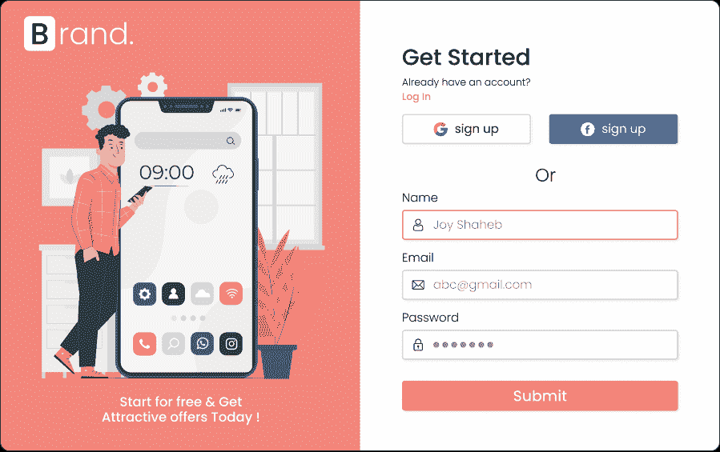

**Desktop design**

下面是表单工作方式的一个小示例👇

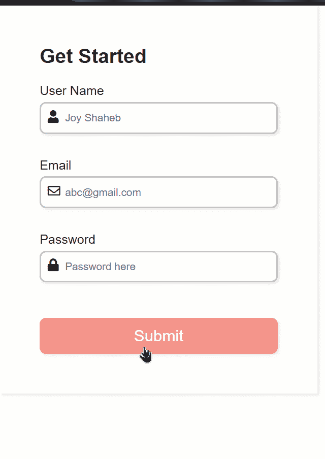

**project sample**

## **************喜欢的话也可以在 YouTube 上看这个教程:**************

[https://www.youtube.com/embed/VufN46OyFng?feature=oembed](https://www.youtube.com/embed/VufN46OyFng?feature=oembed)

## 源代码

您可以从这里获得源代码，包括图片:

*   [密码笔](https://codepen.io/joyshaheb/pen/XWgdOyY)
*   [GitHub](https://github.com/JoyShaheb/Project-image-repo/tree/main/Form-Validation)

# 如何设置项目

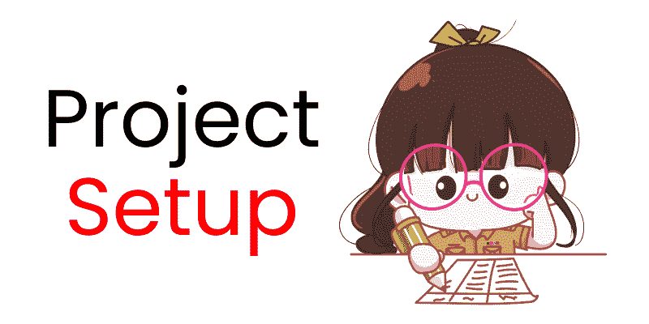

按照以下步骤设置我们的项目:👇

*   创建一个名为“项目”的新文件夹，打开 VS 代码
*   创建 index.html、style.css 和 main.js 文件
*   链接 HTML 中的文件
*   从我的 GitHub 库下载[图片](https://github.com/JoyShaheb/Project-image-repo/tree/main/Form-Validation)
*   将这个字体很棒的链接粘贴到 head 标签中。然后，我们可以访问字体很棒的图标👇👇

```
<link
      rel="stylesheet"
      href="https://cdnjs.cloudflare.com/ajax/libs/font-awesome/5.15.4/css/all.min.css"
      crossorigin="anonymous"
    />
```


# 以下是我们将要介绍的内容:

*   编写 HTML
*   添加 CSS
*   编写 JavaScript
*   添加社交媒体按钮
*   添加图像
*   移动版本的媒体查询(响应)

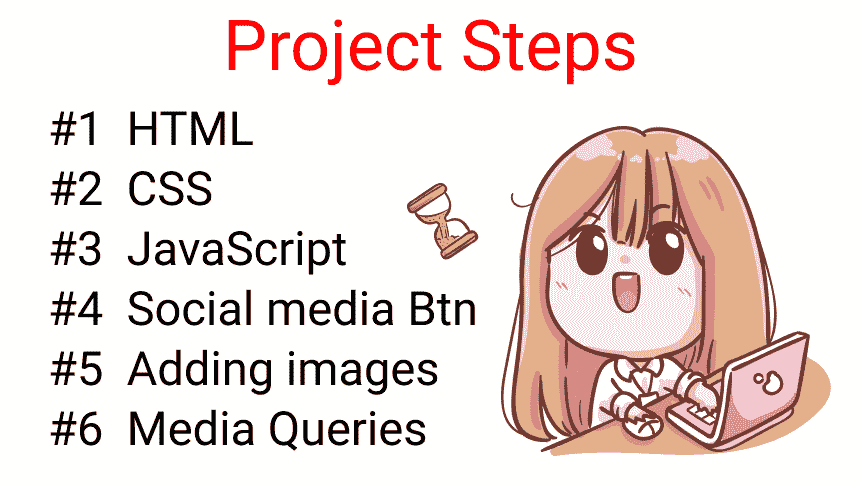

**Table of contents**

# 如何编写 HTML


在 body 标签中创建一个名为`.container`的类，并托管一个 id 为 form 的 form 标签👇

```
<div class="container">

	<form id="form"></form>

</div>
```

在表单标签中，创建 4 个`div`,如下所示👇

```
<form id="form">

    <div class="title">Get Started</div>

    <div></div>
    <div></div>
    <div></div>

</form>
```

在这 3 个空的 div 标签中，让我们创建 3 个输入(用户名、电子邮件和密码)以及图标和标签。

**注意** : 我们正在创建一个`.error`类名。我们将使用 JavaScript 在这里插入错误消息。

#### 用户名输入

```
<!-- User Name input -->

<div>
	<label for="username">User Name</label>
    <i class="fas fa-user"></i>

    <input
        type="text"
        name="username"
        id="username"
        placeholder="Joy Shaheb"
     />

    <i class="fas fa-exclamation-circle failure-icon"></i>
    <i class="far fa-check-circle success-icon"></i>

    <div class="error"></div>

</div>
```

#### 电子邮件输入

```
<!-- Email input -->

<div>
	<label for="email">Email</label>
    <i class="far fa-envelope"></i>

    <input
        type="email"
        name="email"
        id="email"
        placeholder="abc@gmail.com"
     />

    <i class="fas fa-exclamation-circle failure-icon"></i>
    <i class="far fa-check-circle success-icon"></i>

    <div class="error"></div>

</div>
```

#### 密码输入

```
<!--   Password input -->

<div>
	<label for="password">Password</label>
    <i class="fas fa-lock"></i>

    <input
        type="password"
        name="password"
        id="password"
        placeholder="Password here"
     />

    <i class="fas fa-exclamation-circle failure-icon"></i>
    <i class="far fa-check-circle success-icon"></i>

    <div class="error"></div>

</div>
```

#### 如何制作按钮

最后，在表单结束标记前添加按钮，如下所示:

```
<form>
    <!-- other codes are here -->

    <button id="btn" type="submit">Submit</button>

</form>
```

这是目前为止的结果👇

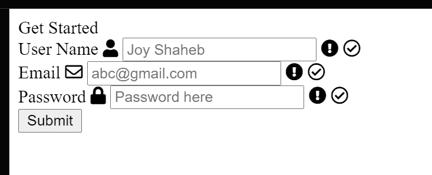

**Result So far**

祝贺你完成了 HTML 部分！🍾🎉🥂


# 如何添加 CSS


让我们添加 CSS 来设计我们的表单。首先，让我们删除浏览器的默认样式，包括字体系列👇

```
/**
* ! changing default styles of brower
**/

* {
  margin: 0;
  padding: 0;
  box-sizing: border-box;
}

body {
  font-family: sans-serif;
}
```

现在，将这些样式应用于表单标签:

```
/**
* ! style rules for form section
**/

form {
  display: flex;
  flex-direction: column;
  justify-content: center;
  max-width: 400px;
  box-shadow: 2px 2px 4px rgba(0, 0, 0, 0.1);
  padding: 50px;
}
```

接下来，对标题文本进行以下更改:👇👇

```
.title {
  font-size: 25px;
  font-weight: bold;
  margin-bottom: 20px;
}
```

你目前的结果👇👇

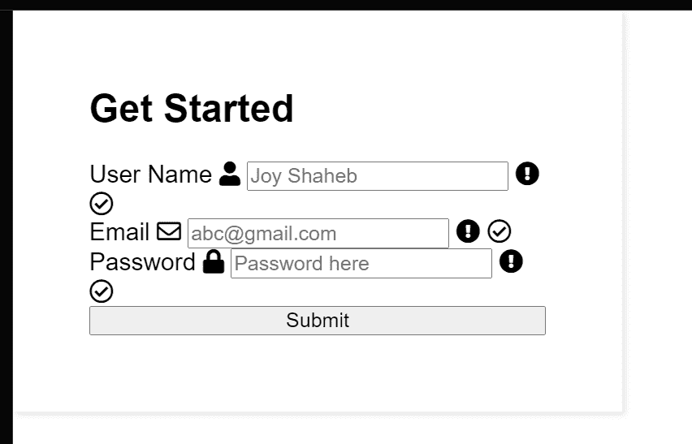

**Result so far**

现在，在标签文本的底部添加一个空白，如下所示:

```
label {
  display: block;
  margin-bottom: 5px;
}
```

并添加这些样式来改变我们的输入标签的外观👇👇

```
form div input {
  width: 100%;
  height: 40px;
  border-radius: 8px;
  outline: none;
  border: 2px solid #c4c4c4;
  padding: 0 30px;
  box-shadow: 2px 2px 4px rgba(0, 0, 0, 0.1);
} 
```

添加此代码以添加一些空间和颜色变化效果:

```
form div {
  position: relative;
  margin-bottom: 15px;
}

input:focus {
  border: 2px solid #f2796e;
}
```

结果到目前为止👇👇

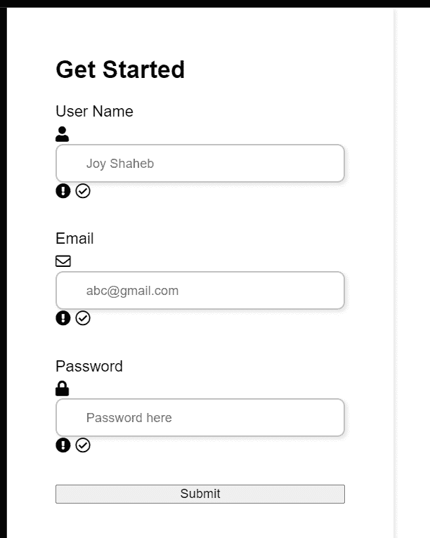

**Result so far**

## 如何设计图标的样式

现在我们要对从字体导入的图标进行样式化——棒极了。跟随代码:✨✨

```
/**
* ! style rules for form icons
**/

form div i {
  position: absolute;
  padding: 10px;
} 
```

这是这两行相加的结果👇👇

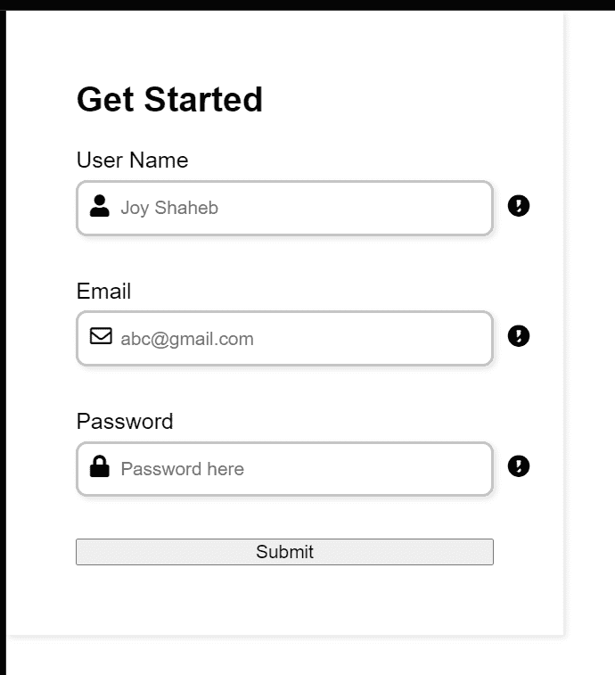

**Result so far**

现在，添加这些样式来样式化错误类，以及成功和失败图标👇👇

```
.failure-icon,
.error {
  color: red;
}

.success-icon {
  color: green;
}

.error {
  font-size: 14.5px;
  margin-top: 5px;
}
```

这是目前为止的结果👇👇

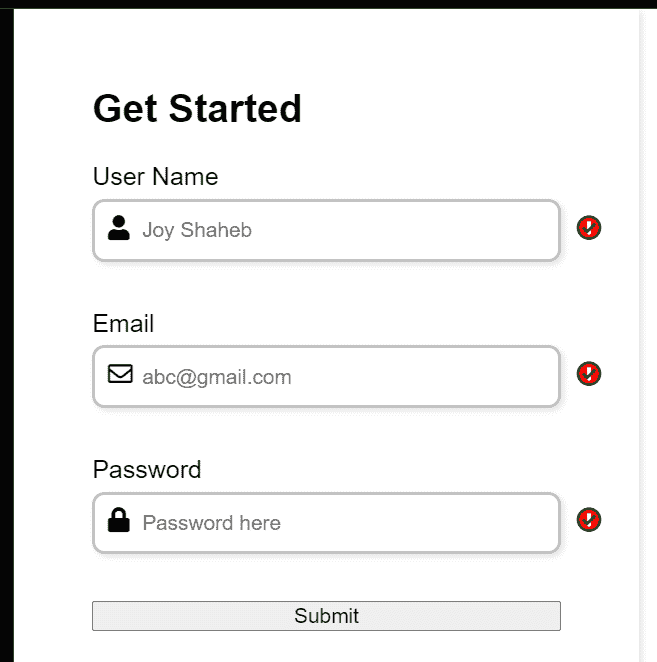

**Result so far**

看，成功和失败的图标互相重叠。别担心，我们会用 JavaScript 来处理这些。现在，您可以像这样隐藏它们👇👇

```
.success-icon,
.failure-icon {
  right: 0;
  opacity: 0;
} 
```

现在，让我们设计提交按钮的样式，就像这样👇

```
/* Style rules for submit btn */

button {
  margin-top: 15px;
  width: 100%;
  height: 45px;
  background-color: #f2796e;
  border: 2px solid #f2796e;
  border-radius: 8px;
  color: #fff;
  font-size: 20px;
  cursor: pointer;
  box-shadow: 2px 2px 4px rgba(0, 0, 0, 0.1);
  transition: all 0.1s ease;
}
```

如果你想添加悬停效果，那么当然，添加这些样式👇👇

```
button:hover {
  opacity: 0.8;
}
```

# 休息一下！

到目前为止一切顺利。休息一下，这是你应得的。

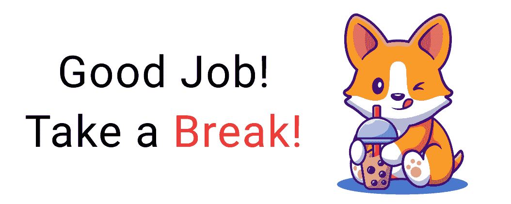

# 如何添加 JavaScript


首先，我们需要将 JavaScript 中 HTML 的所有类和 id 作为目标。为了有效地完成这项任务，请创建这两个函数👇👇

```
let id = (id) => document.getElementById(id);

let classes = (classes) => document.getElementsByClassName(classes);
```

然后，将类和 id 存储在这些变量中👇

**注意:**尽量不要出现拼写错误。否则，您的 JavaScript 将无法工作。

```
let username = id("username"),
  email = id("email"),
  password = id("password"),
  form = id("form"),

  errorMsg = classes("error"),
  successIcon = classes("success-icon"),
  failureIcon = classes("failure-icon");
```

现在，我们将针对我们的表单添加**提交**事件监听器👇

```
 form.addEventListener("submit", (e) => {
  e.preventDefault();
}); 
```

现在，我们将创建一个名为 engine 的函数，它将为我们完成各种表单验证工作。它将有三个参数——如下所示:👇

```
let engine = (id, serial, message) => {}
```

这些参数表示以下内容:

*   `id`将目标锁定我们的 id
*   `serial`将我们的类作为目标【错误类，成功和失败图标】
*   `message`将在我们的内部打印一条消息。误差等级

现在创建一个像这样的`if, else`语句👇

```
let engine = (id, serial, message) => {

  if (id.value.trim() === "") {
  } 

  else {
  }
}
```

**注意:****`id.value.trim()`**会从用户输入的值中去掉所有多余的空格。通过看这幅插图，你可以了解它是如何工作的👇

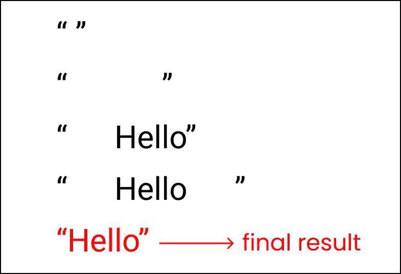

**trim() used to remove extra spaces**

现在，看看我们的目标👇

*   我们希望每当用户**提交空白的** **表单**时，JavaScript 在**错误**类中打印一条消息。同时，我们希望**故障**图标也高亮显示。
*   但是，如果用户**填写所有输入**并提交，我们希望**成功**图标可见。

要实现这一点，请编写以下逻辑👇要打印邮件:

```
let engine = (id, serial, message) => {

  if (id.value.trim() === "") {
    errorMsg[serial].innerHTML = message;
  } 

  else {
    errorMsg[serial].innerHTML = "";
  }
}
```

要使图标正常工作，请添加以下代码:👇👇

```
let engine = (id, serial, message) => {

  if (id.value.trim() === "") {
    errorMsg[serial].innerHTML = message;
    id.style.border = "2px solid red";

    // icons
    failureIcon[serial].style.opacity = "1";
    successIcon[serial].style.opacity = "0";
  } 

  else {
    errorMsg[serial].innerHTML = "";
    id.style.border = "2px solid green";

    // icons
    failureIcon[serial].style.opacity = "0";
    successIcon[serial].style.opacity = "1";
  }
}
```

是时候实现我们新创建的功能了。将这些代码写在我们添加提交事件监听器的地方👇

```
form.addEventListener("submit", (e) => {
  e.preventDefault();

  engine(username, 0, "Username cannot be blank");
  engine(email, 1, "Email cannot be blank");
  engine(password, 2, "Password cannot be blank");
});
```

这里，我们传递 id 名、类名的序列号，并传递当用户提交表单时发现错误时应该打印的消息。

这是目前为止的结果👇


**The Result so far**

## 如何添加社交媒体按钮


到目前为止一切顺利，让我们添加社交媒体注册选项。跟着这里走。👇

在表单标签中，创建一个新的`div`，类名为`social`:

```
<form id="form">

    <div class="social">

      <div class="title">Get Started</div>

      <div class="question">
        Already Have an Account? <br />
        <span>Sign In</span>
      </div>

      <div class="btn"></div>

      <div class="or">Or</div>
    </div>

    <!-- other codes are here-->
</form>
```

在`.btn`类中，我们创建了另外两个 div，它们的类名分别是`.btn-1`和`.btn-2`,同样包含图像和文本

```
<div class="btn">
  <div class="btn-1">
     
     Sign Up
  </div>

  <div class="btn-2">
    
     Sign Up
   </div>
</div>
```

这是目前为止的结果👇👇

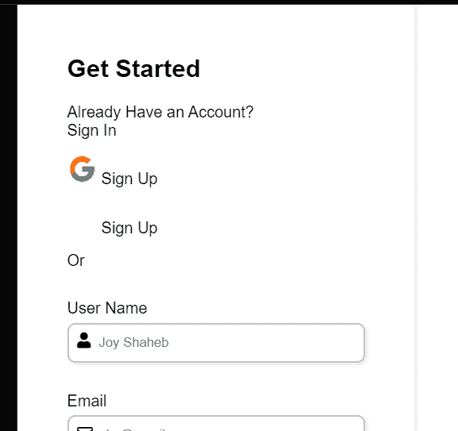

**The Result so far**

现在，让我们首先设计`.btn-1`和`.btn-2`的样式。我们将把按钮的对齐方式改为逐列对齐👇

```
/**
* ! style rules for social section
**/

.btn {
  display: flex;
  flex-direction: row;
  justify-content: space-between;
  gap: 15px;
}
```

现在看起来是这样的:

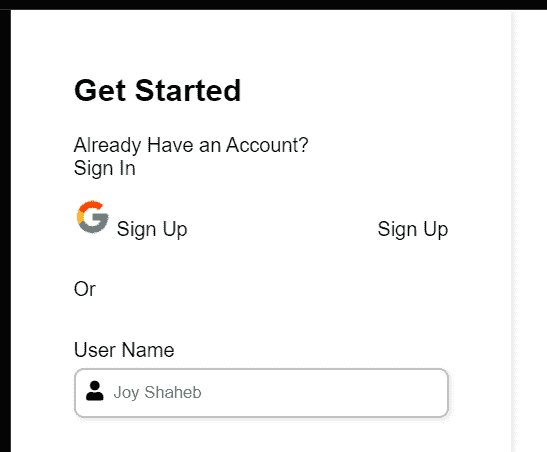

**The Result so far**

现在，为按钮添加样式，如下所示:👇

```
.btn-1,
.btn-2 {
  padding: 10px 5px;
  width: 100%;
  display: flex;
  gap: 15px;
  justify-content: center;
  align-items: center;
  border: 2px solid #c4c4c4;
  border-radius: 8px;
  box-shadow: 2px 2px 4px rgba(0, 0, 0, 0.1);
  cursor: pointer;
}
```

像这样改变`.btn-2`的图标颜色和文本颜色:👇

```
.btn-2 {
  background-color: #4f70b5;
  color: white;
}
```

然后添加这些小改动，使组件看起来更好:

```
.or {
  text-align: center;
}

.question {
  font-size: 15px;
}

span {
  color: #f2796e;
  cursor: pointer;
}
```

目前的结果是:

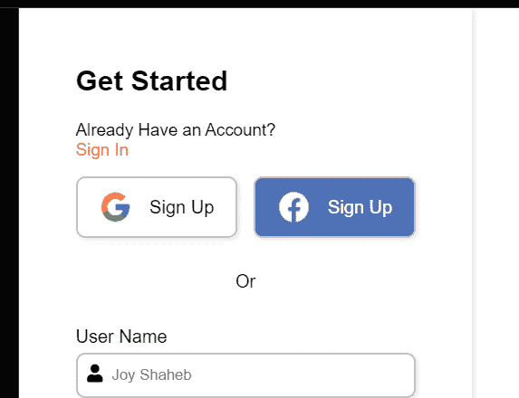

**Result so far**

## 如何添加图像


现在，让我们添加图像到我们的项目。首先，让我们写 HTML👇

```
<div class="container">

      <div class="content">
        <div class="logo">
          
        </div>

        <div class="image"></div>

        <div class="text">
          Start for free & get <br />
          attractive offers today !
        </div>  
      </div>

   <form id="form">
   <!--other codes are here -->
   </form>

</div>
```

结果到目前为止👇

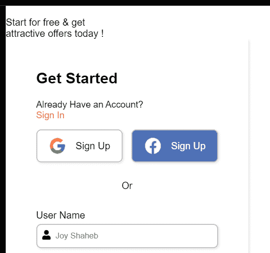

**Result so far**

现在我们需要将内容的方向从列改为行。跟着走👇

```
.container {
  display: flex;
  flex-direction: row;
}
```

为内容部分添加以下样式规则:

```
/**
* ! style rules for content section
**/

.content {
  display: flex;
  flex-direction: column;
  justify-content: space-around;
  background-color: #f2796e;
  width: 55%;
  min-height: 100vh;
  padding: 10px 20px;
}

form {
   width: 45%;
   max-width: none;
}
```

结果到目前为止👇

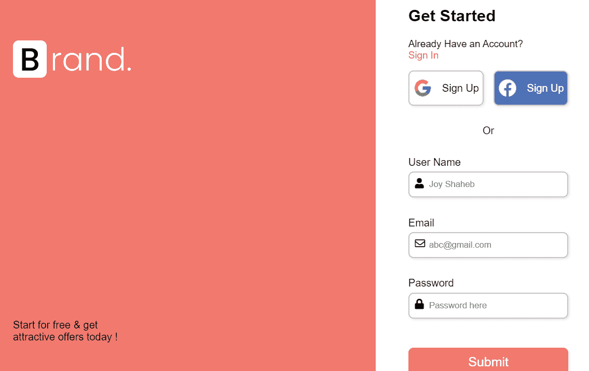

**Result so far**

在 CSS 中添加主插图:

```
.image {
  background-image: url("https://svgshare.com/i/_gZ.svg");
  background-repeat: no-repeat;
  background-size: contain;
  background-position: center;
  /* border: 2px solid black; */
  height: 65%;
} 
```

并为`.text`类添加这些样式:

```
.text {
  text-align: center;
  color: white;
  font-size: 18px;
}

form {
   width: 45%;
   max-width: none;
}
```

结果到目前为止👇

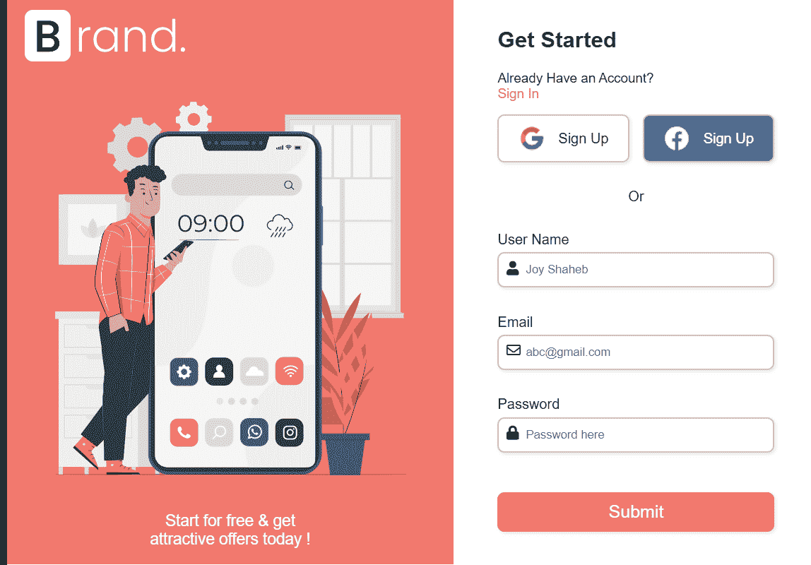

**Result so far**

## 如何为移动版本添加媒体查询


我们想让它变得有响应性。因此，我们将添加媒体查询来帮助我们。

对于宽度从 900px 开始的屏幕，我们将添加这些样式。跟着走👇👇

```
@media (max-width: 900px) {
  .container {
    flex-direction: column;
  }

  form,
  .content {
    width: 100%;
  }

  .btn {
    flex-direction: column;
  }
  .image {
    height: 70vh;
  }
}
```

对于宽度从 425 像素开始的屏幕，我们将做一些小的改动👇

```
@media (max-width: 425px) {
  form {
    padding: 20px;
  }
} 
```

这是最终结果👇👇

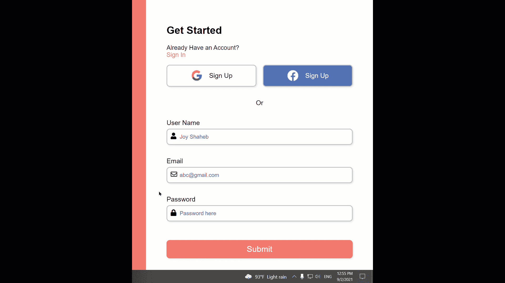

**The final result**

# 结论


**Congratulations !**

恭喜你读到最后。现在，您可以轻松高效地使用 JavaScript 来处理表单验证。不仅如此，你还有一个项目可以展示给你当地的招聘人员！

这是你的阅读到最后的奖章，❤️

### 建议和批评是高度赞赏❤️

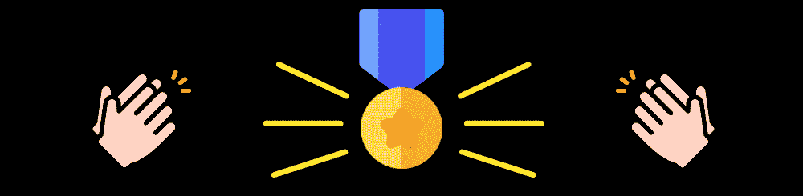

*   [**LinkedIn/JoyShaheb**](https://www.linkedin.com/in/joyshaheb/)
*   **[YouTube/JoyShaheb](https://www.youtube.com/c/joyshaheb)**
*   **[Twitter/JoyShaheb](https://twitter.com/JoyShaheb)**
*   **[insta gram/JoyShaheb](https://www.instagram.com/joyshaheb/)**