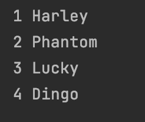
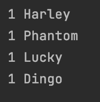
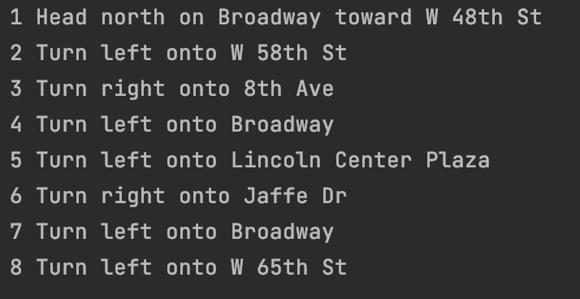

# Python 枚举–循环索引的 Python 枚举示例

> 原文：<https://www.freecodecamp.org/news/python-enumerate-python-enum-for-loop-index-example/>

当你用 Python 编码时，你可以使用`enumerate()`函数和一个`for loop`用一个计数器打印出一个 iterable 的每个值。

在本文中，我将向您展示如何将 Python 的`enumerate()`函数与`for loop`一起使用，并解释为什么它是比创建自己的递增计数器更好的选择。

但是首先，让我们看看在没有`enumerate()`函数的情况下如何完成这个。

## 如何在 Python 中使用不带`enumerate()`函数的`for loop`

在 Python 中，iterable 是一个对象，您可以在其中迭代并一次返回一个值。可迭代的例子包括列表、元组和字符串。

在这个例子中，我们有一个狗名列表和一个名为`count`的变量。

```
dogs = ['Harley', 'Phantom', 'Lucky', 'Dingo']
count = 1
```

我们可以使用一个`for loop`来浏览列表并打印每个名字。我们还将每次将`count`变量递增 1，以记录我们在列表上迭代了多少次。

```
for name in dogs:
    print(count, name)
    count += 1
```

这是打印到屏幕上的结果:



虽然这种方法确实可行，但它可能会带来一个错误。

一个常见的错误是忘记增加`count`变量。

如果我修改了代码，那么这将是打印到控制台的新结果:

```
dogs = ['Harley', 'Phantom', 'Lucky', 'Dingo']
count = 1
for name in dogs:
    print(count, name)
```



现在,`count`变量不再精确地记录我们在列表中循环了多少次。

我们可以使用带有`for loop`的`enumerate()`函数，而不是自己增加一个`count`变量。

## Python 中的`enumerate()`函数是什么？

Python 的内置`enumerate()`函数接受一个 iterable 和一个可选的 start 参数。

```
enumerate(iterable, optional start argument)
```

如果省略可选的`start`参数，那么计数被设置为零。

`enumerate()`函数的返回值是一个对象。

这个函数跟踪迭代，所以你不必记得更新变量`count`。

我们可以使用带有`for loop`的`enumerate()`函数来打印带有计数器的 iterable 的值。

## 如何在 Python 中使用`for loop`和`enumerate()`函数

在本例中，我们希望打印出从时代广场到纽约市茱莉亚音乐学院的路线列表。

我们首先要创建`directions`的列表:

```
directions = [
    'Head north on Broadway toward W 48th St',
    'Turn left onto W 58th St',
    'Turn right onto 8th Ave',
    'Turn left onto Broadway',
    'Turn left onto Lincoln Center Plaza',
    'Turn right onto Jaffe Dr',
    'Turn left onto Broadway',
    'Turn left onto W 65th St'
]
```

然后在`for loop`中，我们创建了`count`和`direction`循环变量。

`enumerate()`函数将接受`directions`列表和`start`参数。我们希望从 1 开始计数，而不是默认的 0。

```
for count, direction in enumerate(directions, start=1):
```

在循环内部，我们将打印出`count`和`direction`循环变量。

```
print(count, direction)
```

这是看起来像所有放在一起:

```
directions = [
    'Head north on Broadway toward W 48th St',
    'Turn left onto W 58th St',
    'Turn right onto 8th Ave',
    'Turn left onto Broadway',
    'Turn left onto Lincoln Center Plaza',
    'Turn right onto Jaffe Dr',
    'Turn left onto Broadway',
    'Turn left onto W 65th St'
]

for count, direction in enumerate(directions, start=1):
    print(count, direction)
```

控制台中的结果如下所示:



如您所见，`count`变量是用`enumerate()`函数自动更新的。

如果我们忘记增加`count`变量，这就消除了出错的可能性。

## 结论

您可以使用`enumerate()`函数和一个`for loop`用计数器打印出一个 iterable 的每个值。

`enumerate()`函数接受一个 iterable 和一个可选的 start 参数。

```
enumerate(iterable, optional start argument)
```

如果可选的`start`参数被省略，那么计数被设置为零。

使用`enumerate()`函数比在`for loop`中创建自己的递增计数器更好。

`enumerate()`功能自动更新计数，这消除了您可能忘记增加计数器的可能性。

我希望您喜欢这篇文章，并祝您的 Python 之旅好运。