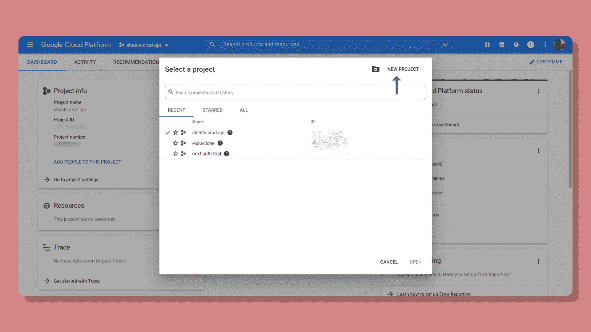
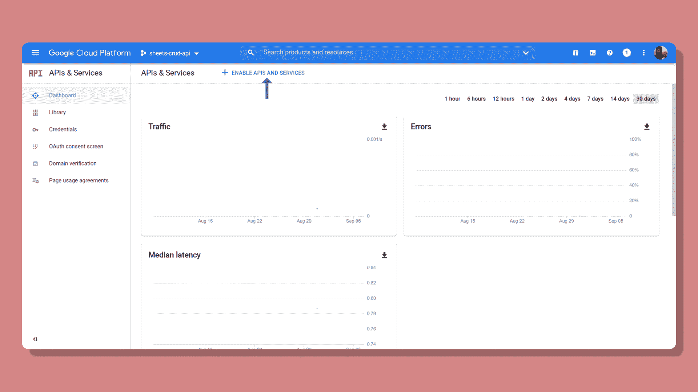
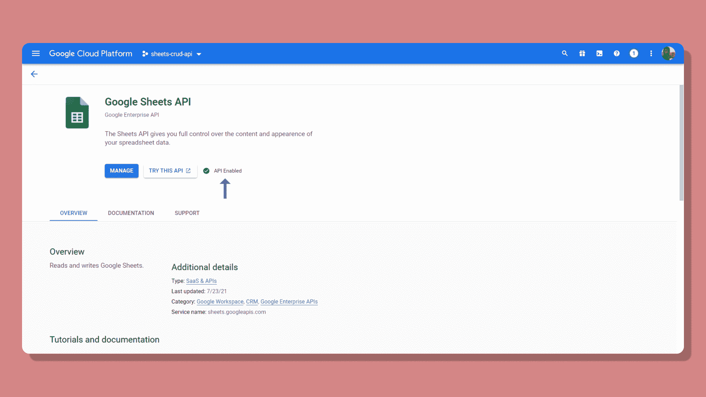
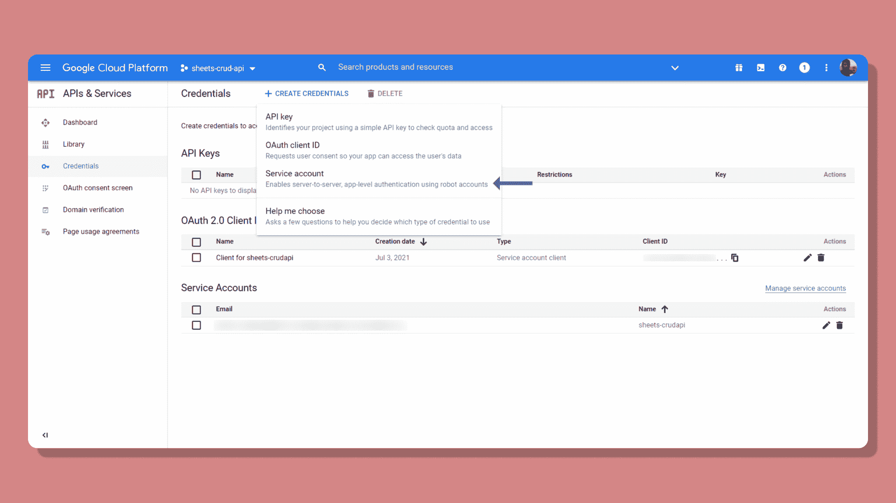
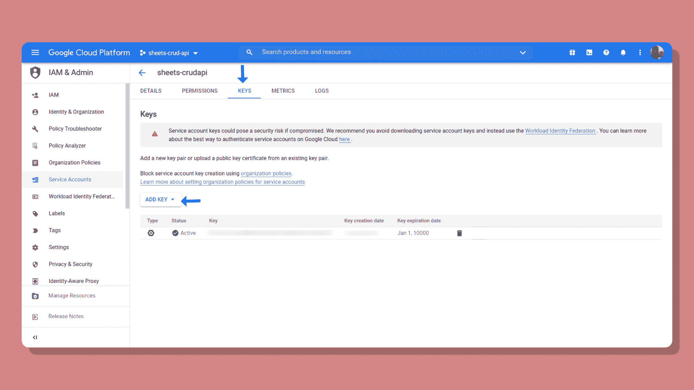
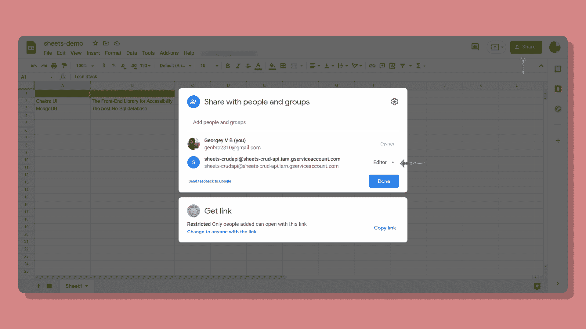
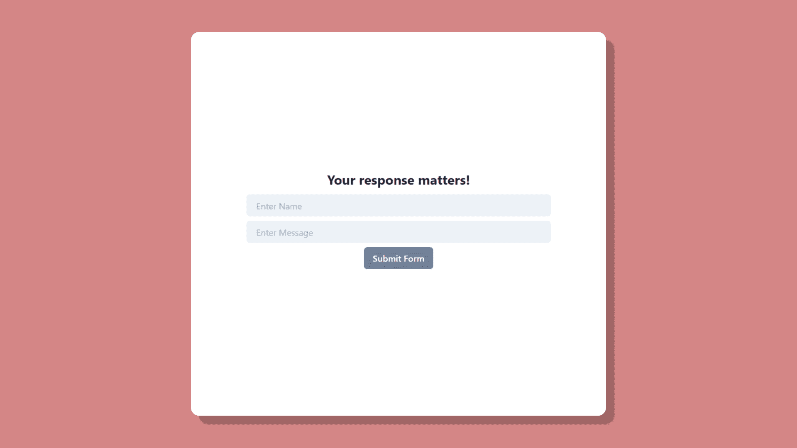
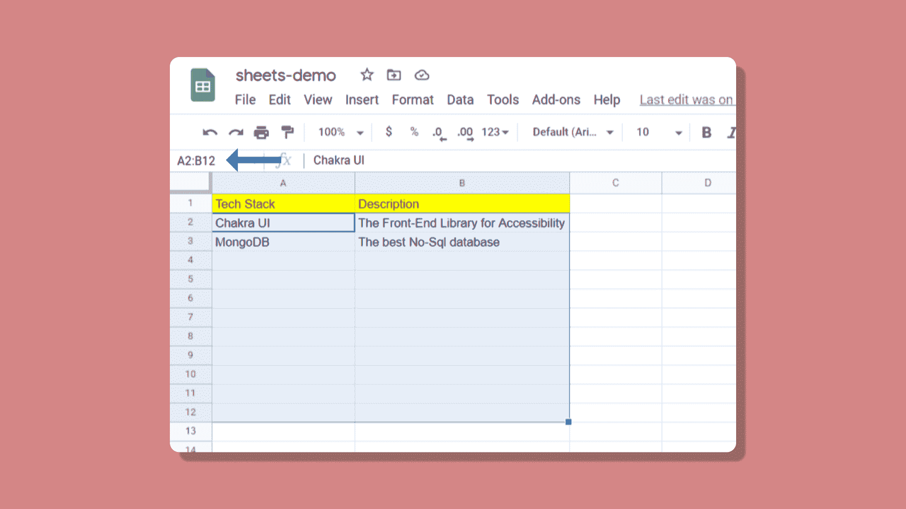

# 如何使用 Google Sheets API 创建反馈表单

> 原文：<https://www.freecodecamp.org/news/create-a-feedback-form-using-nextjs-and-google-sheets-api/>

Google Sheets 提供了一种创建在线表单和收集用户数据的简单方法。在本教程中，我们将使用 Google Sheets 和 Next.js 来构建一个简单的表单。

我们将使用 Next.js 作为我们的前端，我们将使用 Google Sheets 作为后端，通过表单发送我们收到的数据。这样我们可以学习如何使用 Next.js 和 Google Sheets 来构建一个简单的表单。

以下是我们将在本教程中涵盖的内容:

1.  如何在谷歌云控制台中建立新项目
2.  如何将新项目与 Google Sheet 连接起来
3.  如何在 Next.js 应用程序中创建前端表单？
4.  如何将表单连接到 Google Sheet

> 为了帮助你跟进，我制作了一个 [GitHub repo](https://github.com/GeoBrodas/nextjs-form-using-google-sheets-api) 。如果你迷路了，四处看看。

# 如何在谷歌云控制台中建立新项目

要访问 Google Sheets API，我们首先需要在 Google Cloud Console 上设置一个新项目。前往[地点](https://cloud.google.com)，前往[控制台](https://console.cloud.google.com)，制作一个新项目。



在新项目建立之后，进入**API 和服务**并点击**启用 API 和服务。**



从库中搜索 Google Sheets 并启用它。



现在，转到 API 和服务，然后点击**凭证**并点击**新凭证。**创建新的服务账户。



给它一个合适的名字，并填写所有的细节。生成服务帐户后，将电子邮件 ID 复制到某个地方。之后，我们需要将它添加到我们的 Google 表单中。我们刚刚创建了一个 Bot 帐户来处理将从前端发送的各种请求。

接下来，在**凭证中点击服务账户**并将其移至**键。**点击**添加键。**确保将其设置为 JSON 格式。



创建新密钥时会下载一个文件。它包含了我们将前端应用程序连接到 Google Sheets 时需要的所有环境变量。

# 如何将新项目连接到 Google 工作表

现在让我们用 Google Sheet 连接 Google Cloud Console 上新创建的项目。前往 [Google Sheets](http://sheets.google.com/) 并创建一个新的电子表格。

在我们继续之前，请随意放入一些原始数据，以便我们在下一节调用请求时有所获取。

完成后，点击“共享”并添加我们刚刚创建的服务帐户电子邮件。确保你给它**编辑权限**并且取消勾选**通知人**。



现在是有趣的部分。让我们转到代码编辑器，为我们的表单创建前端。

# 如何创建前端表单

为了构建前端，我们将使用 Next.js 并使用 API-routes 特性向我们的 Google Sheet 发送 POST 请求。

使用以下命令安装下一个:

```
npx create-next-app 
```

为了构建表单并加快开发过程，我们将使用一些第三方包。因此，请继续安装以下软件:

```
npm i @chakra-ui/react @emotion/react@^11 @emotion/styled@^11 framer-motion@^4 react-hook-form 
```

*   Chakra-UI:一个可访问的框架，它亲自帮助我加快了大多数应用程序的前端设计。
*   React-Hook-Form:帮助您动态构建带有客户端验证的高效表单。

在本教程中，我将更多地关注执行表单的功能，而不是构建客户端验证。这里的是关于使用 [React-Hook-Form](https://react-hook-form.com/) 添加客户端验证的完整指南。当然，也可以随意访问[脉轮-UI](https://chakra-ui.com/docs/getting-started) 文档。

安装完所有包后，使用任何代码编辑器打开它。在 Next.js 中，您在`/pages`文件夹中创建的每个文件都是一个单独的路径。您可以创建一个新的文件，但这里我将使用根文件本身，即`/pages/index.js`。

清除所有预先生成的代码行。现在，让我们为表单创建一个基本结构。

```
import { VStack, Text, Input } from "@chakra-ui/react"

function Home () {
    function submitHandler () {
     // POST request
    }

    return (
        <VStack>
          <Text fontSize="2xl" fontWeight="bold">
            Your response matters!
          </Text>

          <form onSubmit={submitHandler}>
              <Input placeholder="Enter Name" />
              <Button>Submit!</Button>
          </form>
        </VStack>
    )
} 
```

VStack 垂直包装所有元素。这是`flex-direction: column`的简单简写。代码的其余部分应该是不言自明的

Chakra-UI 的美妙之处在于它的每一个组件都非常类似于实际的 HTML 元素，大大缩短了学习曲线。

您可以添加更多您选择的输入字段。以下是最终结果:



现在让我们来处理用户提交时的表单响应。为此我们将使用`react-hook-form`。

为了从表单中获得响应，我们必须导入`useForm`钩子，就像这样:

```
import { useForm } from 'react-hook-form'; 
```

从挂钩中，析构以下内容:

```
const {
    register,
    handleSubmit
  } = useForm();
```

用`handleSubmit`环绕我们之前创建的`submitHandler`:

```
<form onSubmit={handleSubmit(submitHandler)}>
   {/* Input fields here */}               
</form>
```

现在将`register`添加到所有输入字段，如下所示:

```
<Input placeholder="Enter your message" {...register('name') />
```

现在，当点击按钮时，我们应该能够看到输入的数据。现在，只需将数据记录到控制台，如下所示:

```
function submitHandler (data) {
	console.log(data);
}
```

完成之后，现在让我们为从表单发送的 POST 请求创建一个新的 API-route。

# 如何将表单连接到 Google Sheet

在`./pages/api/`路径中创建一个新文件。您在这个路径中创建的每个文件都是一个 api-route，它提供了对所有 Node.js 特性的访问。

继续在路径中创建一个新文件，比如说`./pages/api/sheet.js`。构建一个基本的 GET 请求，看看是否一切正常:

```
function handler (req, res) {
	res.json({message: "It works!"});
}

export default handler;
```

要检查 API 请求此时是否工作，请转至`http://localhost:3000/api/sheet`。

完成之后，让我们首先使用本机的`Fetch`方法设置从前端发送的 POST 请求。

```
async function submitHandler (data) {
	const response = await fetch("/api/sheet", {
    		method: "POST",
        	body: JSON.stringify(data),
        	headers: {
        		'Content-Type': 'application/json',
      		},
    	})
}
```

在做任何事情之前，我们必须下载另一个包:

```
npm install googleapis
```

在 API-route ( `/pages/api/sheet`)上，解构我们从前端得到的数据。

```
import {google} from "googleapis"

async function handler (req, res) {
    if (req.method === "POST"){
    		const {name, message} = req.body;
		res.json({message: "It works!"});
    }
}

export default handler;
```

注意:缺省情况下，API 路由将监听 GET 请求。所以我们必须明确地检查这个方法是否是 POST 请求。

在继续之前，还有最后一件事要设置，那就是环境变量。在我们创建新密钥时，打开包含所有凭证的 JSON 文件。

在根目录下创建一个新文件`.env.local`。继续并输入以下变量。

```
CLIENT_EMAIL=yourclientemail
CLIENT_ID=yourclientid
PRIVATE_KEY=yourprivatekey
SPREADSHEET_ID=yourspreadsheetid 
```

这样，我们就基本上完成了设置 API 路由来处理我们将发送到 Google Sheet 的请求。首先，让我们创建一个身份验证令牌:

```
const auth = new google.auth.GoogleAuth({
    credentials: {
      client_email: process.env.CLIENT_EMAIL,
      client_id: process.env.CLIENT_ID,
      private_key: process.env.PRIVATE_KEY.replace(/\\n/g, '\n'),
    },
    scopes: [
      'https://www.googleapis.com/auth/drive',
      'https://www.googleapis.com/auth/drive.file',
      'https://www.googleapis.com/auth/spreadsheets',
    ],
  }); 
```

为了访问 Google Sheet，我们的应用程序需要首先提供一些作用域——通常是读写访问。

你可以在官方的 Google Sheets 文档中找到更多关于 scopes 的信息。

您可能想知道我在第三个环境变量中使用的`replace`方法。这是由于我之前遇到的一个典型错误。在浏览了堆栈溢出之后，我终于找到了解决方法。看起来需要通过删除原始键中的斜线来正确解析`PRIVATE_KEY`。使用`replace`方法可以很容易地解决这个问题。

你可以在我打开的这个拉取请求的[中找到这个错误。](https://github.com/leerob/leerob.io/pull/342)

接下来，传入 auth 令牌并指定 API 的版本。最新的是 v4。

```
const sheets = google.sheets({
    auth,
    version: 'v4',
  });
```

然后我们调用`spreadsheets.value.append`方法将用户输入追加到电子表格的单元格中。

```
const response = await sheets.spreadsheets.values.append({
      spreadsheetId: process.env.DATABASE_ID,
      range: 'Sheet1!A2:C',
      valueInputOption: 'USER_ENTERED',
      requestBody: {
        values: [[name, message]],
      },
    });
```

您可以从 URL 本身找到电子表格 ID:

```
https://docs.google.com/spreadsheets/d/{spreadsheetID}/edit#gid=0
```

该范围决定了应用程序必须读取或写入哪些行和列。如果您对如何找到范围感到困惑，您可以使用用户界面使用 Google Sheets 本身来确定。



第三个属性`valueInputOption`决定了如何将用户输入的值解析到电子表格中。

例如，如果用户输入了一个数字，那么电子表格也会将其作为数字读取。

第四个属性携带要追加到特定单元格中的数据。要追加多个值，可以将它们全部放在一个数组中，就像本例中的名称和消息。

要结束 API-route，最后向前端发回一个响应:

```
res.status(201).json({response, result: "Feedback posted to spreadsheet!"})
```

如果一切顺利，您应该能够发出 POST 请求，并成功地将新的单元格值添加到电子表格中。

# 结论

恭喜你！您已经准备好开始收集反馈了。你可以在你的网站上建立自己的反馈表。或者您可以与现有的服务(如 Typeform)集成。

但是你想把你的反馈表放在你的网站上，放在你的页面上。这就是与 Google Sheets API 集成的便利之处。

Google Sheets API 非常简单——它可以读写电子表格。此外，它是完全免费的，尽管在特定的时间框架内你可以发出的 API 请求是有限制的。

因此，Google Sheets API 对于受众较少的小规模应用程序和平台来说是理想的。如果你有任何问题，请发微博给我。