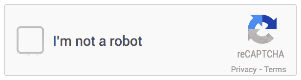
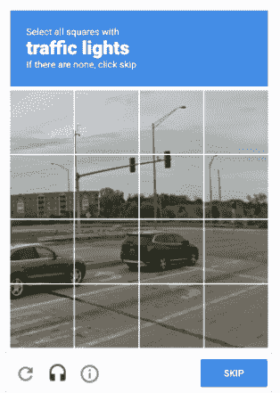
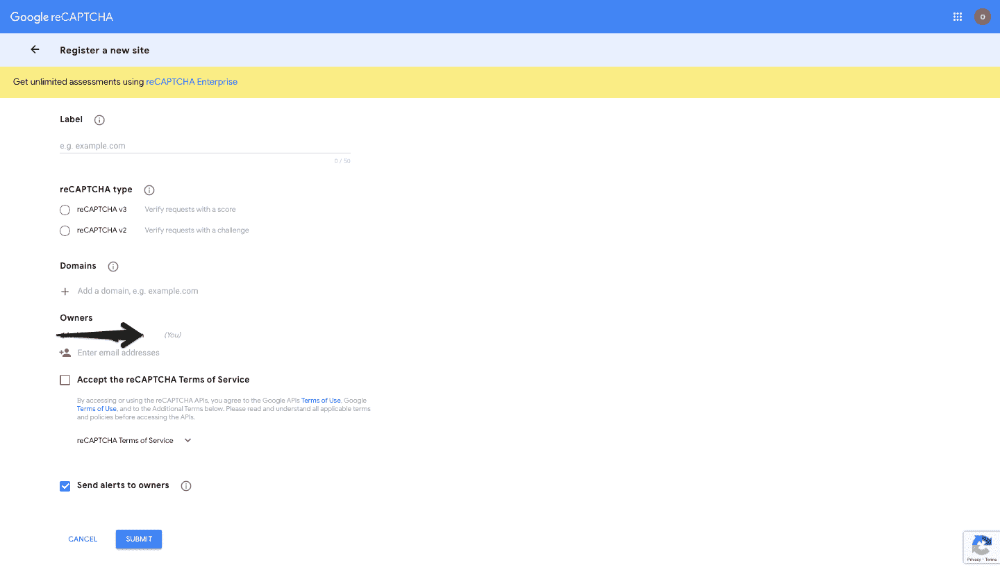
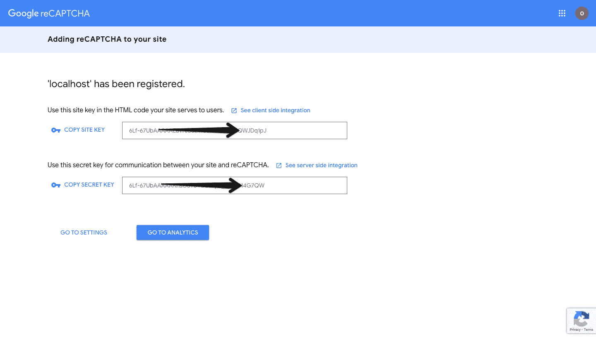
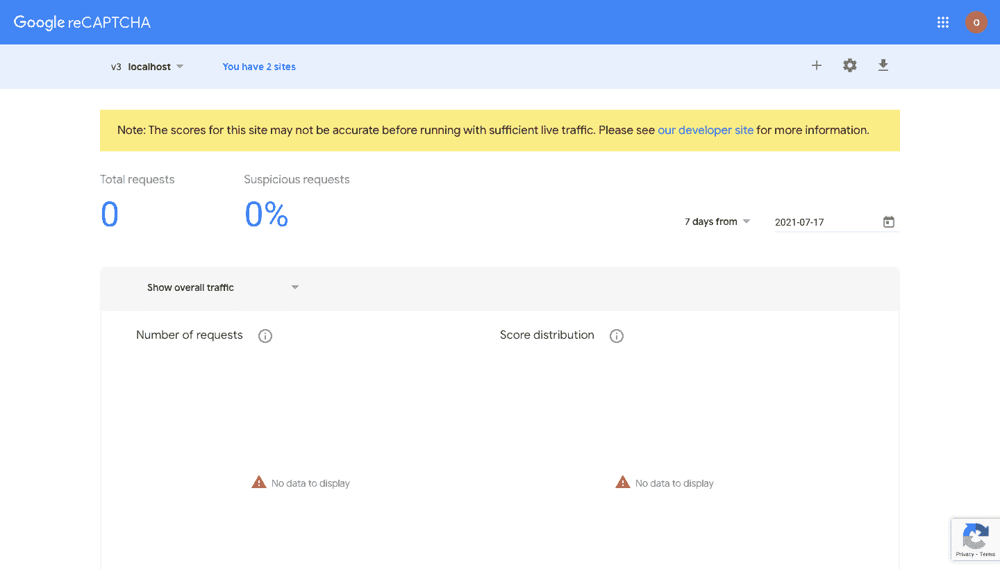
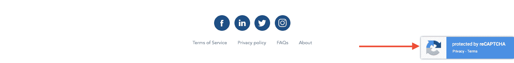

# 如何在 Laravel 项目中设置 reCAPTCHA v3

> 原文：<https://www.freecodecamp.org/news/how-to-setup-recaptcha-v3-in-laravel/>

在本文中，您将学习如何在您的 Laravel 项目中设置 reCAPTCHA v3。这可能有点棘手，所以我将在这里帮助您简化这个过程。

## 什么是 reCaptcha？

reCaptcha 是谷歌免费提供的一项服务，可以帮助你保护你的网站免受垃圾邮件和恶意攻击。

由于新的验证码挑战，新版本 V3 比以前的版本有许多改进。它返回一个分数和分析，你可以用它来为你的网站采取适当的行动。

这是 reCaptcha 的上一个版本——但在最新版本(v3)中，reCaptcha 发生了很大变化，用户体验更好。



Previous reCaptcha Version



Previous reCaptcha Version

## 你会学到什么

在本文结束时，您将会学到以下内容:

1.  如何将 reCaptcha v3 集成到您的 Laravel 项目中
2.  如何设置谷歌 reCaptcha 管理仪表板
3.  如何查看您的网站 reCaptcha 分数和分析，以帮助您做出更好的安全决策

## 如何在 Laravel 项目中设置 reCaptcha

您可以按照这些简单的步骤在您的项目上设置 reCaptcha。

1.  如果您还没有安装这个 [laravel 项目](https://laravel.com/docs/8.x/installation)的话，请安装它
2.  在终端中，使用 composer 将开源包拉入您的项目中。

```
composer require biscolab/laravel-recaptcha
```

3.用这个命令发布`recaptcha.php`:

```
php artisan vendor:publish --provider="Biscolab\ReCaptcha\ReCaptchaServiceProvider"
```

这将在 config 目录中创建一个名为`config\recaptcha.php`的文件，我们将在其中添加更多的 reCaptcha 配置。

4.[访问此链接](https://www.google.com/recaptcha/admin/create)为自己创建一个 reCaptcha 管理帐户。



Register reCaptcha v3

要创建 reCaptcha 管理，您可以执行以下操作:

*   将您的网站名称添加到标签中—`localhost`或`examplesite.com`
*   选择 v3 作为 reCaptcha 类型
*   在域部分包含域(`localhost`或`examplesite.com`)
*   将所有者的电子邮件地址添加到所有者部分
*   选中“接受条款和服务”框

注意 localhost 的唯一目的是在本地开发。因此，在转移到生产环境之前，应该对其进行更新。

5.将 reCaptcha 添加到您的站点

单击提交按钮并保存您的密钥。



Adding reCaptcha to your site within the .env

6.将站点密钥添加到项目的`.env`文件中:

```
RECAPTCHA_SITE_KEY=ADD_YOUR_SITE_KEY
RECAPTCHA_SECRET_KEY=ADD_YOUR_SECRET_KEY
RECAPTCHA_SITE=https://www.google.com/recaptcha/admin/
```

因为您已经对`.env`进行了更改，所以最好清除所有缓存的配置，以便新的更改生效。在您的终端中使用`php artisan optimize:clear`。

7.在`config > recaptcha.php`文件中，将版本的属性更新为 V3。同样重要的是要注意，通过管理仪表板生成的`api_site_key`和`api_secret_key`将从我们在。项目的 env 文件。

```
return [
	'version'                      => 'v3'
]
```

现在，您可以前往 reCaptcha admin 的分析页面，查看您的网站表现如何，查看您的分数，并在生产环境中做出决策。



reCaptcha analytics page

下图显示 reCaptcha 已经实现。



## 结论

在这篇文章的结尾，我希望你会发现设置 reCaptcha 会更容易，并且你会对它有更好的理解。现在您应该能够在您的 Laravel 项目中设置最新的版本了。

### 资源

*   什么是 [reCaptcha](https://developers.google.com/recaptcha/) ？
*   Laravel reCaptcha [回购](https://github.com/biscolab/laravel-recaptcha)
*   Laravel reCaptcha [文档](https://laravel-recaptcha-docs.biscolab.com/docs/configuration)