# Spring Boot 教程——如何构建快速现代的 Java 应用程序

> 原文：<https://www.freecodecamp.org/news/spring-boot-tutorial-build-fast-modern-java-app/>

在这篇文章中，我将带你和 Spring Boot 一起构建一个原型。把它想象成在有限的时间内为一个黑客马拉松或你的创业公司建立一个原型项目。

换句话说，我们并不试图构建完美的东西，而是构建可行的东西。

如果你陷入了本教程的任何部分，或者如果我忘记提到什么，你可以查看我在**结论**中包含的 GitHub 库。

### 先决条件

*   Java 和面向对象的基础
*   关系数据库的基础知识(一对多、多对多等)
*   Spring 的基本原理会有所帮助
*   基本级 HTML

此外，请确保您具备以下条件:

*   [JDK (Java 开发工具包)](https://www.oracle.com/java/technologies/javase-downloads.html)最新
*   IntelliJ IDEA 或其他 Java IDE

## 我们在建造什么？

我们将建立一个礼仪预订系统，用户将登录并预订时间使用服务，如健身中心，游泳池，或桑拿。

每个便利设施都有一定的容量(可以同时使用该服务的人数)，以便人们可以在新冠肺炎疫情期间安全地使用这些便利设施。

### 应用程序的功能列表

我们可以把我们的应用程序想象成一个公寓楼的预订系统。

*   用户应该能够登录。
*   我们将假设居民的帐户是预先创建的，不会有注册功能。
*   用户应该能够查看他们的预订。
*   用户应该能够通过选择礼仪类型、日期和时间来创建新的预订。
*   **只有登录的** **用户**才能看到预订页面并创建预订。
*   我们应该检查容量，只有在当前预订数量没有超过容量时才创建新的预订。

### 我们将使用的技术

我们将了解许多有用的技术，这些技术将使您作为 Spring Boot 开发人员更加高效。我将简要介绍它们是什么以及它们有什么好处，然后我们将看到它们的实际应用。

*   Bootify
*   冬眠
*   Spring Boot
*   专家
*   作业的装配区（JobPackArea）
*   时髦的
*   H2 内存数据库
*   百里香叶
*   引导程序
*   春天安全

## 为什么是 Spring Boot？

Spring 框架通常用于企业级/大规模作业。对于较小的项目来说，这通常不是第一个想到的选择——但是我认为这对于原型开发来说是非常快的。

它具有以下优点:

*   基于注释的开发会在幕后为您生成大量代码。尤其是有了 Lombok 这样的库，关注业务逻辑变得容易多了。
*   它有很好的内存数据库支持，所以我们不需要创建一个真正的数据库并连接到它。(H2)
*   它有一个成熟的生态系统，所以你可以很容易地找到大多数问题的答案。
*   几乎“不需要配置”。在 Spring Boot 的帮助下，我们摆脱了 Spring 方面难看的 XML 配置，配置应用程序变得非常容易。
*   幕后发生了很多事情。春天提供了如此多的魔力，做了如此多的事情来让事情运转起来。所以你通常不需要关心这些东西，让框架来处理就可以了。
*   我们有春季安全措施。拥有最全面、久经考验的安全框架之一，让您对应用的安全性更有信心。它也为你照顾好了一份辛苦。

## 如何用 Bootify 创建项目

要创建这个项目，你将使用[](https://bootify.io/)**。这是一项免费增值服务，通过为您生成大量样板代码并让您专注于业务逻辑，使 Spring Boot 开发更快。**

****Bootify** 允许我们指定自己的偏好，并自动导入类似于 **Spring Initializr** 的依赖项。**

**但是不止如此。你也可以指定你的实体，它会生成相应的模型和 DTO 类。它甚至可以为常见的 **CRUD** 操作生成服务和控制器级代码。**

**我相信它是一个比 MVC 更方便的 API 开发工具，因为它默认生成 REST API 代码。但是，即使有了包含视图的 Spring Boot MVC 应用程序，它仍然会使我们的生活变得更容易。我们只需要对生成的代码做一些调整。**

**让我们打开 **Bootify** 网站，点击右上角的“开始项目”按钮。**

**您应该选择:**

*   ****Maven** 作为构建类型**
*   **Java 版本:14**
*   **勾选启用**龙目****
*   **数据库管理系统: **H2** 数据库**
*   **勾选**添加** **日期创建/最后更新**到实体**
*   **包装:技术**
*   **启用 **OpenAPI/Swagger UI****
*   **将**org . spring framework . boot:spring-boot-dev tools**添加到更多依赖项中**

**完成后，您应该会看到以下内容:**

**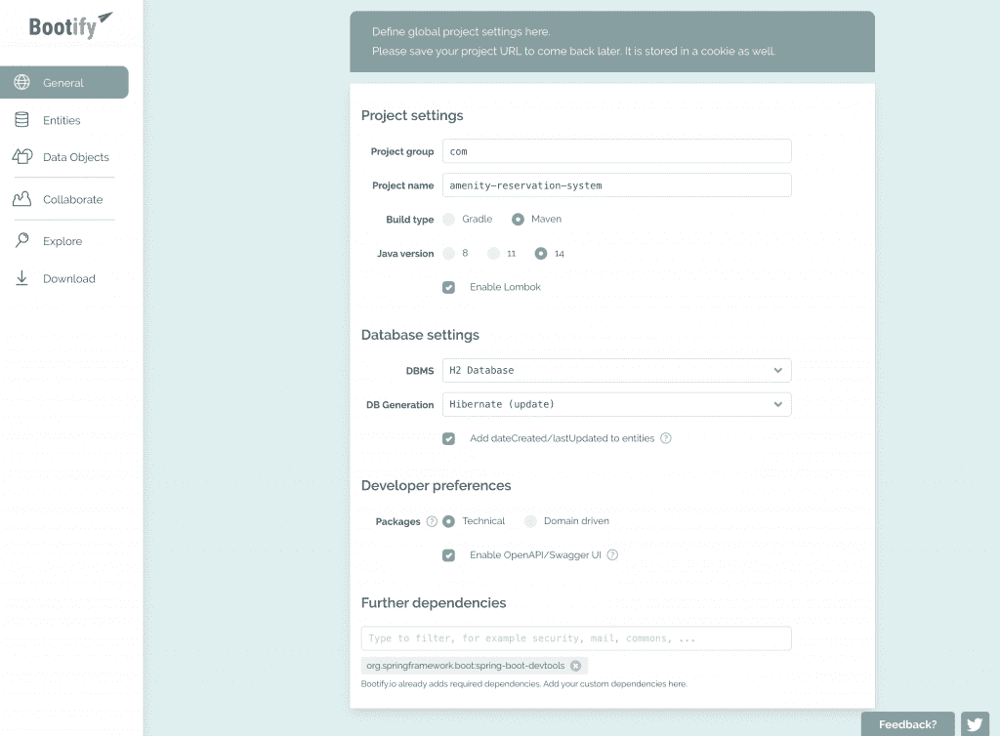**

**现在让我们指定我们的实体。首先点击左侧菜单上的**实体**选项卡。**

**我们将拥有以下实体和关系:**

1.  ****预订**包含与每个预订相关的数据，例如预订日期、预订开始时间、结束时间以及拥有该预订的用户。**
2.  **包含我们的用户模型的**用户**实体，将与**预订**发生关系。**
3.  ****便利设施**实体，用于保存便利设施的类型及其容量(特定时间的最大预订次数，例如两个人可以同时使用和预订桑拿浴室)。**

**让我们如下定义我们的 **Reservation** 实体，并保持选中“Add REST endpoints ”(即使我们将修改输出)。然后点击保存按钮。**

**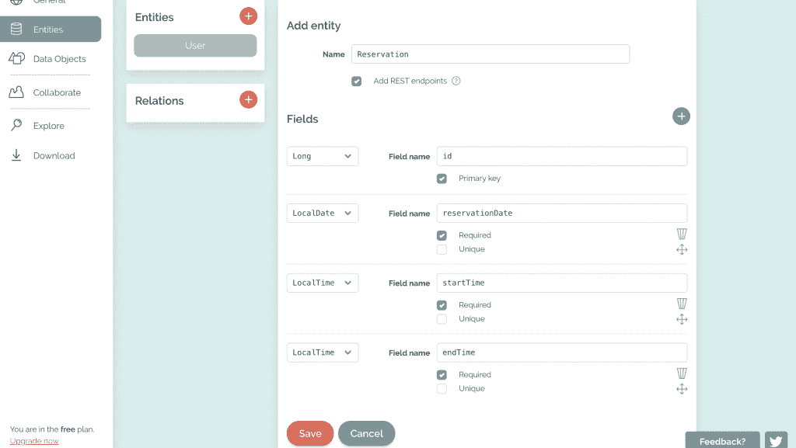**

**我们稍后将指定关系，因此我们的用户实体仅有的字段是 id 字段。**

**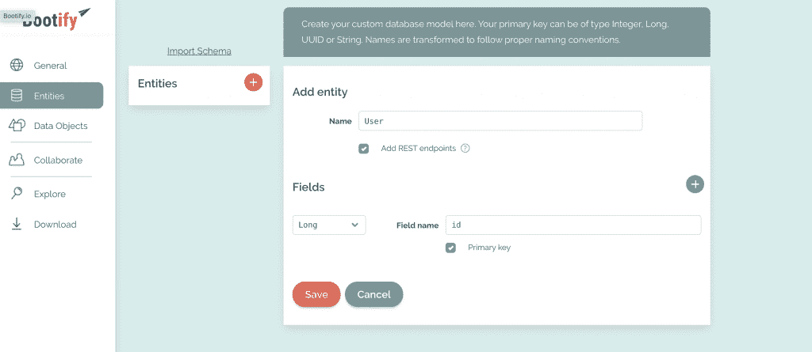**

**我们可以为便利设施创建一个实体来存储便利设施名称及其容量的数据，然后我们可以从**预订**中引用它。但是舒适和预订之间的关系是一对一的。**

**因此，为了简单起见，我们将创建一个名为 **AmenityType** 的枚举，并将 **AmenityType** 存储在 **Reservation** 中。**

**现在让我们通过点击**关系**菜单旁边的+按钮，在**用户**和**预订**实体之间创建一个关系。**

**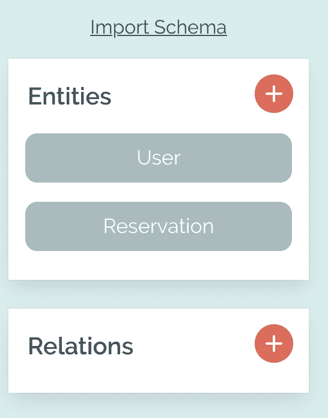

Menu to create relations** 

**这将是一个**多对一**的关系，因为一个用户可以有许多预订，但一个预订必须有且只有一个用户。我们将通过选中所需的框来确保这一点。**

**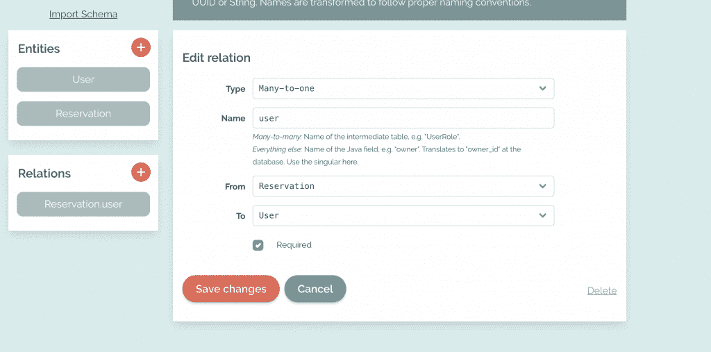

User-Reservation Relation** 

**我们单击“保存更改”就完成了。您的最终模型应该是这样的:**

**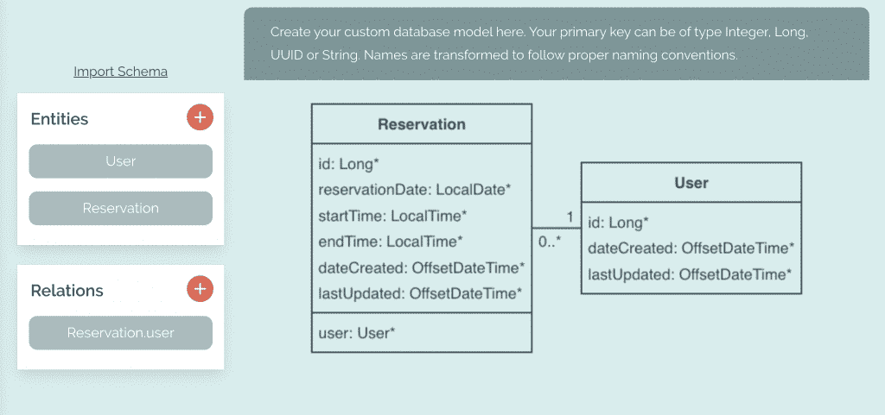**

**现在，单击左侧菜单中的下载按钮，下载生成的项目代码，这样我们就可以开始工作了。如果有任何问题，您可以在项目存储库上看到第一次提交，并与您的进行比较。**

**下载完项目后，在 IDE 中打开它——我将使用 **IntelliJ IDEA** 。您的文件结构应该如下所示:**

```
`├── amenity-reservation-system.iml
├── mvnw
├── mvnw.cmd
├── pom.xml
├── src
│   └── main
│       ├── java
│       │   └── com
│       │       └── amenity_reservation_system
│       │           ├── AmenityReservationSystemApplication.java
│       │           ├── HomeController.java
│       │           ├── config
│       │           │   ├── DomainConfig.java
│       │           │   ├── JacksonConfig.java
│       │           │   └── RestExceptionHandler.java
│       │           ├── domain
│       │           │   ├── Reservation.java
│       │           │   └── User.java
│       │           ├── model
│       │           │   ├── ErrorResponse.java
│       │           │   ├── FieldError.java
│       │           │   ├── ReservationDTO.java
│       │           │   └── UserDTO.java
│       │           ├── repos
│       │           │   ├── ReservationRepository.java
│       │           │   └── UserRepository.java
│       │           ├── rest
│       │           │   ├── ReservationController.java
│       │           │   └── UserController.java
│       │           └── service
│       │               ├── ReservationService.java
│       │               └── UserService.java
│       └── resources
│           └── application.yml
└── target
    ├── classes
    │   ├── application.yml
    │   └── com
    │       └── amenity_reservation_system
    │           ├── AmenityReservationSystemApplication.class
    │           ├── HomeController.class
    │           ├── config
    │           │   ├── DomainConfig.class
    │           │   ├── JacksonConfig.class
    │           │   └── RestExceptionHandler.class
    │           ├── domain
    │           │   ├── Reservation.class
    │           │   └── User.class
    │           ├── model
    │           │   ├── ErrorResponse.class
    │           │   ├── FieldError.class
    │           │   ├── ReservationDTO.class
    │           │   └── UserDTO.class
    │           ├── repos
    │           │   ├── ReservationRepository.class
    │           │   └── UserRepository.class
    │           ├── rest
    │           │   ├── ReservationController.class
    │           │   └── UserController.class
    │           └── service
    │               ├── ReservationService.class
    │               └── UserService.class
    └── generated-sources
        └── annotations`
```

## **如何测试和探索生成的代码**

**让我们花点时间来试验生成的代码，并一层一层地理解它。**

****Repos** 文件夹包含数据访问层的代码，即我们的存储库。我们将使用 **JPA** 方法来检索我们的数据，这些方法是预制的查询方法，您可以通过在存储库接口中定义它们来使用。**

**注意，我们的存储库类扩展了 **JpaRepository** 接口。这是允许我们使用上述方法的接口。**

**JPA 查询遵循一定的约定，当我们创建遵守约定的方法时，它会在幕后自动知道您想要检索什么数据。如果你还不明白，不要担心，我们会看到例子。**

**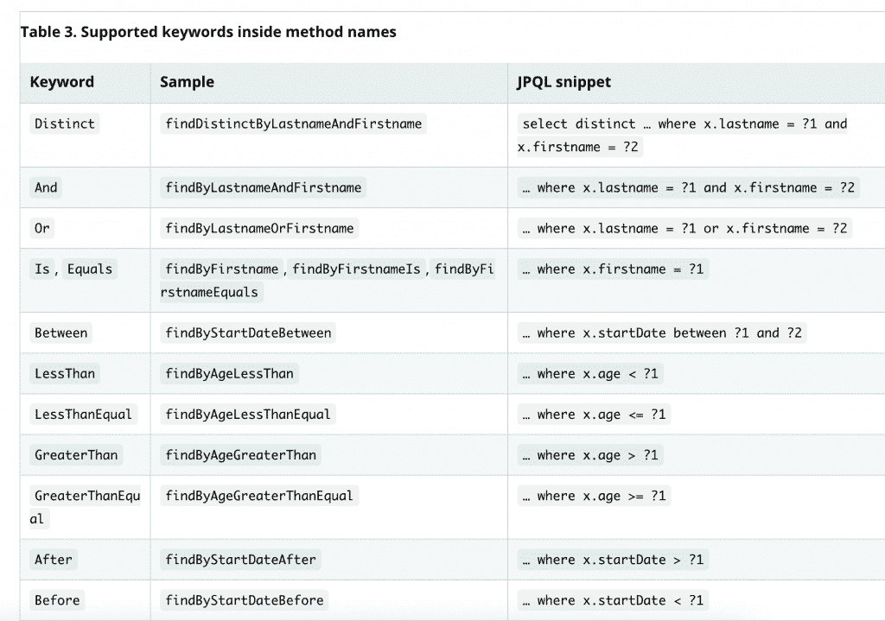

Example keywords, sample phrases and their corresponding JPQL snippets (queries)** 

****模型**类表示我们的数据模型，以及哪些类将拥有哪些字段。**

**每个模型类对应于一个同名的数据库表，模型类中的字段将是相应表中的列。**

**注意我们模型类顶部的注释 **@Entity** 。这个注释由 [**Hibernate**](https://hibernate.org/) 处理，每当 Hibernate 看到 **@Entity** ，时，它会使用我们的类名作为表名来创建一个表。**

**如果你想知道，“Hibernate 到底是什么？”，它是一个用于 Java 的对象关系映射工具，允许我们将 T2 对象映射到数据库表。它还可以提供数据验证约束等特性，但我们不会在本文中深入探讨 Hibernate，因为它本身就是一个庞大的主题。**

**Hibernate 的一个很棒的特性是它处理所有的表创建和删除操作，所以你不必使用额外的 **SQL** 脚本。**

**我们还在模型类中表示对象之间的关系。要查看示例，请看我们的**用户**类:**

```
 `@OneToMany(mappedBy = "user")
    private Set<Reservation> userReservations;`
```

**它有一个 **userReservations** 对象，该对象保存一组类似于这个特定用户的预订的引用。在**预订**类中，我们有相反的关系:**

```
`@ManyToOne(fetch = FetchType.LAZY)
@JoinColumn(name = "user_id", nullable = false)
private User user;`
```

**两边都有引用使得访问关系的另一边成为可能(用户反对预订，反之亦然)。**

**在这种情况下，**控制器**将处理请求处理器传递给控制器的请求，并返回相应的视图。**

**由 Bootify 生成的控制器被配置为返回 JSON 响应，我们将在下一节中修改它们以返回我们的视图。**

****服务**将保存我们应用程序的逻辑。最佳实践是通过将业务逻辑放在一个单独的地方，即服务类，来保持控制器的精简。**

**控制器不应该直接与存储库交互，而是调用将与存储库交互的服务，执行任何附加操作，并将结果返回给控制器。**

### **让我们试试这个 API**

**现在，让我们开始有趣的部分，并尝试我们的 API 来看看它的运行情况。在您喜欢的 IDE 上运行 Spring 应用程序。打开浏览器，转到以下地址:**

```
`http://localhost:8080/swagger-ui/index.html?configUrl=/v3/api-docs/swagger-config#/`
```

**Swagger 自动记录我们的代码，并允许您轻松发送请求。你应该会看到这个:**

**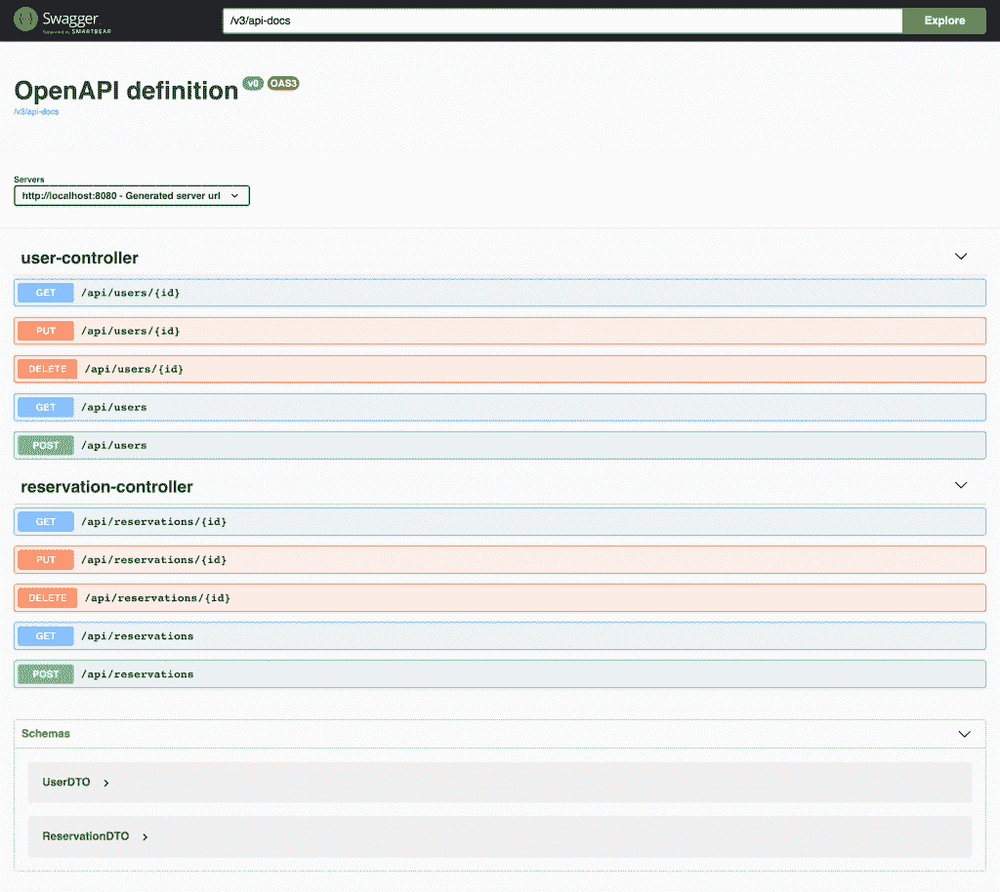**

**让我们首先通过向**用户控制器**发送一个 **POST** 请求来创建一个用户。我们将通过单击用户控制器列表下的最后一个框(绿色框)来完成。**

**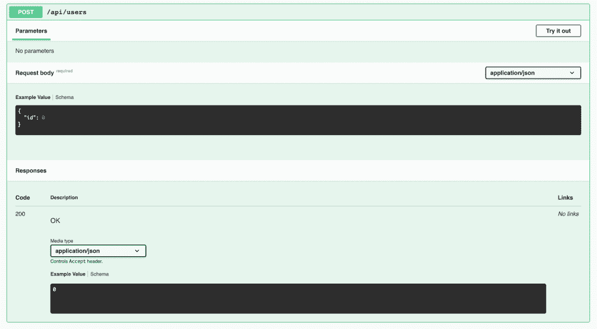**

****Swagger** 向我们展示了这个端点期望的参数——目前只有 id——以及 API 返回的响应。**

**点击右上角的“试用”按钮。它要求您输入一个 id。我知道这是无意义的，代码甚至不会使用您输入的 id，但我们将在下一节中修复它(这只是生成的代码的一个问题)。**

**为了便于试验，可以输入任意数字，比如 1 作为 id，然后单击 execute 按钮。**

****

**响应正文包含所创建对象的 id。我们可以通过检查 H2 控制台来确认它是在数据库上创建的。**

**但是在此之前，我们需要对包含应用程序设置和配置的 **application.yml** 文件做一个小的调整。打开您的 **application.yml** 文件并粘贴以下代码:**

```
`spring:
  datasource:
    url: ${JDBC_DATABASE_URL:jdbc:h2:mem:amenity-reservation-system}
    username: ${JDBC_DATABASE_USERNAME:sa}
    password: ${JDBC_DATABASE_PASSWORD:}
  dbcp2:
    max-wait-millis: 30000
    validation-query: "SELECT 1"
    validation-query-timeout: 30
  jpa:
    hibernate:
      ddl-auto: update
    open-in-view: false
    properties:
      hibernate:
        jdbc:
          lob:
            non_contextual_creation: true
        id:
          new_generator_mappings: true
springdoc:
  pathsToMatch: /api/**`
```

**然后，我们应该能够通过以下地址访问 H2 控制台:**

```
`http://localhost:8080/h2-console/`
```

**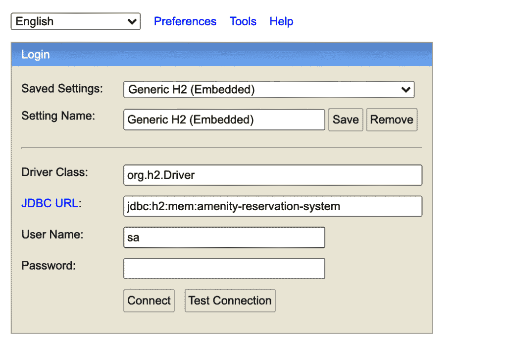**

**在这里，您需要检查用户名是否为“sa ”,然后单击 Connect 按钮。**

**单击左侧菜单中的用户表，控制台将为您编写 select all 查询。**

**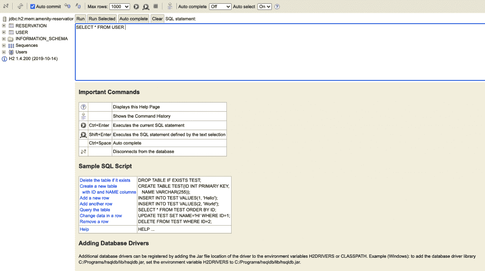

H2 Admin Panel** 

**让我们点击查询上方的**运行**按钮。**

**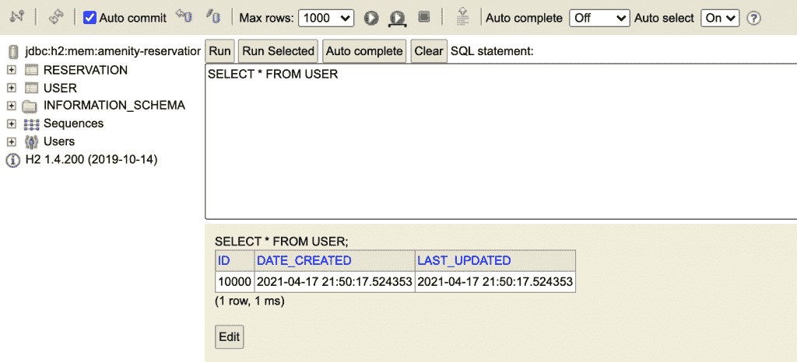**

**我们可以看到**用户**对象确实被创建了——太棒了！**

**在这一点上，我们已经有了一个工作的 API，我们还没有写一行代码。**

### **如何为我们的用例调整代码**

**正如我前面提到的，生成的代码并不完全适合我们的用例，我们需要对它进行一些调整。**

**让我们删除包含 dto 和我们不会使用的东西的模型文件夹。我们将在视图中显示数据。**

```
`cd src/main/java/com/amenity_reservation_system/ 
rm -rf model`
```

**由于代码使用了 DTO 类，我们现在会有很多错误，但是在移除控制器类之后，我们会消除大部分错误。**

**我们将删除控制器，因为我们不想再公开修改数据的功能。我们的用户应该能够通过与我们的 UI 交互来做到这一点，我们将在下一节创建新的控制器来返回视图组件。**

```
`rm -rf rest`
```

**最后，我们需要对服务类进行一些重构，因为 d to 类已经不存在了:**

```
`package com.amenity_reservation_system.service;

import com.amenity_reservation_system.domain.User;
import com.amenity_reservation_system.repos.UserRepository;
import java.util.List;
import java.util.stream.Collectors;
import org.springframework.http.HttpStatus;
import org.springframework.stereotype.Service;
import org.springframework.web.server.ResponseStatusException;

@Service
public class UserService {

    private final UserRepository userRepository;

    public UserService(final UserRepository userRepository) {
        this.userRepository = userRepository;
    }

    public List<User> findAll() {
        return userRepository.findAll();
    }

    public User get(final Long id) {
        return userRepository.findById(id)
                .orElseThrow(() -> new ResponseStatusException(HttpStatus.NOT_FOUND));
    }

    public Long create(final User user) {
        return userRepository.save(user).getId();
    }

    public void update(final Long id, final User user) {
        final User existingUser = userRepository.findById(id)
                .orElseThrow(() -> new ResponseStatusException(HttpStatus.NOT_FOUND));

        userRepository.save(user);
    }

    public void delete(final Long id) {
        userRepository.deleteById(id);
    }
}`
```

**我们基本上从 **UserService** 类中移除了与 DTO 相关的代码，并用 **User** 替换了返回类型。让我们对**预订服务**做同样的事情。**

```
`package com.amenity_reservation_system.service;

import com.amenity_reservation_system.domain.Reservation;
import com.amenity_reservation_system.domain.User;
import com.amenity_reservation_system.repos.ReservationRepository;
import com.amenity_reservation_system.repos.UserRepository;
import java.util.List;
import java.util.stream.Collectors;
import org.springframework.http.HttpStatus;
import org.springframework.stereotype.Service;
import org.springframework.web.server.ResponseStatusException;

@Service
public class ReservationService {

    private final ReservationRepository reservationRepository;
    private final UserRepository userRepository;

    public ReservationService(final ReservationRepository reservationRepository,
            final UserRepository userRepository) {
        this.reservationRepository = reservationRepository;
        this.userRepository = userRepository;
    }

    public List<Reservation> findAll() {
        return reservationRepository.findAll();
    }

    public Reservation get(final Long id) {
        return reservationRepository.findById(id)
                .orElseThrow(() -> new ResponseStatusException(HttpStatus.NOT_FOUND));
    }

    public Long create(final Reservation reservation) {
        return reservationRepository.save(reservation).getId();
    }

    public void update(final Long id, final Reservation reservation) {
        final Reservation existingReservation = reservationRepository.findById(id)
                .orElseThrow(() -> new ResponseStatusException(HttpStatus.NOT_FOUND));
        reservationRepository.save(reservation);
    }

    public void delete(final Long id) {
        reservationRepository.deleteById(id);
    }

}`
```

**让我们也删除配置类:**

```
`rm -rf config`
```

**并将域文件夹重命名为 model。如果您使用的是 IDE，我强烈建议您使用 IDE 的重命名功能来重命名该文件夹，因为它会自动重命名导入以匹配新的包名。**

```
`mv domain model`
```

**此外，确保您的模型类(**用户**和**预订**)在这个操作之后有正确的包名。这两个文件的第一行应该是:**

```
`package com.amenity_reservation_system.model;`
```

**如果它仍然是域包，您可能会有错误。**

**此时，您应该能够编译和运行该项目，而不会出现任何问题。**

## **如何创建控制器和查看文件来显示数据**

**百里香叶是 Spring 的一个模板引擎，允许我们创建 ui 并向用户显示我们的模型数据。**

**我们可以访问百里香模板中的 Java 对象，也可以使用普通的 HTML、CSS 和 JavaScript。如果你了解 JSP，这就是类固醇上的 JSP。**

**现在，让我们创建一些除了显示数据之外什么也不做的百里香模板。我们将在下一节中设计它们的样式。我们还将创建返回这些视图的控制器。**

**在开始使用百里香模板之前，我们需要为 Spring Boot 百里香添加一个 Maven 依赖项。您的依赖项在您的 **pom.xml** 文件中应该是这样的:**

```
`<?xml version="1.0" encoding="UTF-8"?>
<project  xmlns:xsi="http://www.w3.org/2001/XMLSchema-instance"
        xsi:schemaLocation="http://maven.apache.org/POM/4.0.0 https://maven.apache.org/xsd/maven-4.0.0.xsd">
    <modelVersion>4.0.0</modelVersion>
    <parent>
        <groupId>org.springframework.boot</groupId>
        <artifactId>spring-boot-starter-parent</artifactId>
        <version>2.4.4</version>
        <relativePath /><!-- lookup parent from repository -->
    </parent>
    <groupId>com</groupId>
    <artifactId>amenity-reservation-system</artifactId>
    <version>0.0.1-SNAPSHOT</version>
    <name>amenity-reservation-system</name>

    <properties>
        <java.version>14</java.version>
    </properties>

    <dependencies>
        <dependency>
            <groupId>org.springframework.boot</groupId>
            <artifactId>spring-boot-starter-web</artifactId>
        </dependency>
        <dependency>
            <groupId>org.springframework.boot</groupId>
            <artifactId>spring-boot-starter-validation</artifactId>
        </dependency>
        <dependency>
            <groupId>org.springframework.boot</groupId>
            <artifactId>spring-boot-starter-data-jpa</artifactId>
        </dependency>
        <dependency>
            <groupId>com.h2database</groupId>
            <artifactId>h2</artifactId>
            <scope>runtime</scope>
        </dependency>
        <dependency>
            <groupId>org.springdoc</groupId>
            <artifactId>springdoc-openapi-ui</artifactId>
            <version>1.5.2</version>
        </dependency>
        <dependency>
            <groupId>org.springframework.boot</groupId>
            <artifactId>spring-boot-devtools</artifactId>
        </dependency>
        <dependency>
            <groupId>org.projectlombok</groupId>
            <artifactId>lombok</artifactId>
            <version>1.18.20</version>
            <scope>provided</scope>
        </dependency>
        <dependency>
            <groupId>org.springframework.boot</groupId>
            <artifactId>spring-boot-starter-test</artifactId>
            <scope>test</scope>
        </dependency>
        <dependency>
            <groupId>org.springframework.boot</groupId>
            <artifactId>spring-boot-starter-thymeleaf</artifactId>
        </dependency>

    </dependencies>

    <build>
        <plugins>
            <plugin>
                <groupId>org.springframework.boot</groupId>
                <artifactId>spring-boot-maven-plugin</artifactId>
            </plugin>
        </plugins>
    </build>
</project>` 
```

**您可以复制并粘贴 dependencies 标记的内部内容。现在让我们告诉 Maven 安装依赖项:**

```
`mvn clean install`
```

**我们现在准备创建我们的视图。让我们在 resources 下创建一个目录来保存我们的视图模板文件，如下所示:**

```
`cd ../../../resources
mkdir templates`
```

**并创建一个视图文件:**

```
`cd templates
touch index.html`
```

**将下面的代码片段复制并粘贴到其中。这个文件将来会成为我们的主页。**

```
`<!DOCTYPE HTML>
<html lang="en" xmlns:th="http://www.thymeleaf.org">
<head>
    <meta charset="UTF-8"/>
    <title>Amenities Reservation App</title>

    <link th:rel="stylesheet" th:href="@{/webjars/bootstrap/4.0.0-2/css/bootstrap.min.css} "/>
</head>
<body>

<div>
hello world!
</div>

<script th:src="@{/webjars/jquery/3.0.0/jquery.min.js}"></script>
<script th:src="@{/webjars/popper.js/1.12.9-1/umd/popper.min.js}"></script>
<script th:src="@{/webjars/bootstrap/4.0.0-2/js/bootstrap.min.js}"></script>

</body>
</html>`
```

**我们还需要创建一个控制器来返回这个视图，这样我们就可以在浏览器中看到它。**

```
`cd ../java/com/amenity_reservation_system
mkdir controller && cd controller
touch HomeController`
```

**将此代码粘贴到 HomeController 中:**

```
`package com.amenity_reservation_system.controller;

import org.springframework.stereotype.Controller;
import org.springframework.ui.Model;
import org.springframework.web.bind.annotation.GetMapping;
import org.springframework.web.bind.annotation.ResponseBody;

@Controller
public class HomeController {

    @GetMapping("/")
    public String index(Model model) {

        return "index";
    }
}` 
```

**注意我们这次是如何用 **@Controller** 而不是 **@RestController** 来注释我们的方法的。@RestController 注释暗示控制器将返回 REST 响应，而**@控制器**可以返回预呈现(SSR)视图/HTML。**

**当一个请求到达我们的应用程序时，Spring 将自动运行这个控制器方法。然后，它会找到我们之前在资源下创建的**index.html**文件，并将该文件发送给客户端。**

**让我们通过向我们的应用程序发送一个请求来确认它正在工作。不要忘记首先重新启动，然后发送以下请求:**

```
`GET localhost:8080`
```

**您应该能够在浏览器上看到 Hello World 消息。**

## **如何定义不同类型的娱乐设施**

**我们有 **Reservation** 类，但是我们还没有创建一种方法来指定哪种类型的设施被预订(游泳池、桑拿浴室或健身房)。**

**有多种方法可以做到这一点。其中之一是创建一个名为 Amenity 的实体来存储实体间的共享数据。然后我们将创建 **PoolAmenity** 、 **SaunaAmenity** 和 **GymAmenity** 类，这些类将扩展 Amenity 类。**

**这是一个很好的可扩展的解决方案，但是对于我们简单的应用程序来说，感觉有点矫枉过正，因为我们没有太多特定于舒适类型的数据。我们只能容纳每种类型的设施。**

**为了简单起见，不要用表继承和其他复杂的东西来打扰我们自己，让我们创建一个 enum 来以字符串形式表示舒适类型，并让每个预订都有一个这样的类型。**

**让我们从控制器目录切换到模型目录，并为 **AmenityType** 创建枚举:**

```
`cd ../model
touch AmenityType.java`
```

```
`public enum AmenityType {
    POOL("POOL"), SAUNA("SAUNA"), GYM("GYM");

    private final String name;

    private AmenityType(String value) {
        name = value;
    }

    @Override
    public String toString() {
        return name;
    }
}`
```

**在这个枚举中，我们定义了一个名称变量来保存枚举的名称，并创建了一个私有构造函数来只允许有限的类型集。请注意，类型声明使用它们的名称值从类中调用构造函数。**

**现在我们需要修改 Reservation 类来保存对 **AmenityType** 的引用:**

```
`@Enumerated(EnumType.STRING)
@Column(nullable = false)
private AmenityType amenityType;`
```

**我们使用 **@Enumerated** 注释来描述我们希望如何在数据库中存储枚举。我们还将使其不可为空，因为每个**预订**都必须有一个**舒适类型**。**

## **如何显示用户的预订**

**我们的应用程序最重要的功能是什么？创建预订并显示用户的预订。**

**我们还没有一种方法来验证用户，所以我们不能真正要求用户登录，然后显示他们的预订。但是我们仍然希望实现和测试预订设施和显示预订的功能。**

**为此，我们可以要求 Spring 在应用程序运行时将一些初始数据放入数据库。然后我们可以查询这些数据来测试我们的查询是否有效。然后，我们可以继续从我们的**视图**中调用这些服务，并在接下来的部分中向我们的应用程序添加身份验证。**

**我们将使用一个 **CommandLineRunner** bean 来运行初始代码。每当 Spring Container 找到 CommandLineRunner 类型的 bean 时，它就会运行其中的代码。在这一步之前，让我们在模型类中添加一些方法，使对象创建更容易，更简洁。**

**看一下模型类的注释，您应该会看到类似于 **@Getter** 和 **@Setter** 的注释。这些是**龙目岛**的注解。**

**Lombok 是一个注释处理器，通过让它为我们生成代码，我们可以使用它来改善我们的编码体验。当我们用 **@Getter** 和 **@Setter** 注释一个类时，它为这个类的每个字段生成 Getter 和 Setter。**

**Spring 在后台使用 getter 和 setter 方法进行许多琐碎的操作，所以这些几乎总是必需的。如果没有 Lombok 的帮助，为每个实体创建它们很容易成为一件麻烦的事情。**

**不过，龙目岛能做的不止这些。我们还将向我们的**预订**和**用户**类添加以下注释:**

```
`@Builder
@NoArgsConstructor
@AllArgsConstructor`
```

**有了这些注释，Lombok 实现了这个类的 builder 创建模式，并创建了两个构造函数:一个不带参数(默认构造函数),另一个带所有参数。我认为我们可以通过添加一些注释来做这么多事情，这太棒了。**

**我们现在准备添加一些初始数据。转到您的主类(**AmenityReservationSystemApplication.java**)并添加这个方法:**

```
`package com.amenity_reservation_system;

import com.amenity_reservation_system.model.AmenityType;
import com.amenity_reservation_system.model.Reservation;
import com.amenity_reservation_system.model.User;
import com.amenity_reservation_system.repos.ReservationRepository;
import com.amenity_reservation_system.repos.UserRepository;
import org.springframework.boot.CommandLineRunner;
import org.springframework.boot.SpringApplication;
import org.springframework.boot.autoconfigure.SpringBootApplication;
import org.springframework.context.annotation.Bean;

import java.text.DateFormat;
import java.text.SimpleDateFormat;
import java.time.LocalDate;
import java.time.LocalTime;
import java.time.ZoneId;
import java.util.Date;

@SpringBootApplication
public class AmenityReservationSystemApplication {

    public static void main(String[] args) {
        SpringApplication.run(AmenityReservationSystemApplication.class, args);
    }

    @Bean
    public CommandLineRunner loadData(UserRepository userRepository,
                                      ReservationRepository reservationRepository) {
        return (args) -> {
            User user = userRepository.save(new User());
            DateFormat dateFormat = new SimpleDateFormat("dd/MM/yyyy HH:mm:ss");
            Date date = new Date();
            LocalDate localDate = date.toInstant().atZone(ZoneId.systemDefault()).toLocalDate();
            Reservation reservation = Reservation.builder()
                    .reservationDate(localDate)
                    .startTime(LocalTime.of(12, 00))
                    .endTime(LocalTime.of(13, 00))
                    .user(user)
                    .amenityType(AmenityType.POOL)
                    .build();

            reservationRepository.save(reservation);
        };
    }
}` 
```

**如果您得到一个关于保存操作的错误，例如参数的“推断类型”...不匹配”，这是因为我们将域目录重命名为模型。转到存储库类并修复到**模型的导入路径。用户**和**型号。预约**。**

**注意我们如何使用**构建器模式**轻松创建预订对象。当对象创建变得复杂，并且一个构造函数需要如此多的参数时，很容易忘记参数的顺序或者把顺序弄乱。**

**如果没有 builder 模式，我们要么需要调用一个有这么多参数的构造函数，要么调用默认的构造函数并编写#properties 代码来调用 setters。**

**完成后，再次运行您的应用程序以插入初始数据，并像我们之前所学的那样连接到 **H2 控制台**以确认我们的日期确实被插入。如果没有任何错误，您应该能够看到用户和预订被成功插入。**

**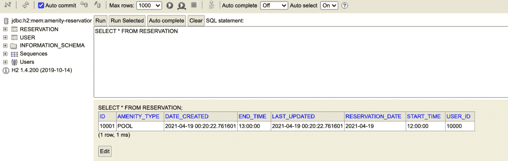**

**我们已经插入了一个预订来测试列出预订的功能，但是我们的视图目前还没有显示预订和添加预订的方法。我们需要为此创建 UI。**

**我们还没有身份验证或注册机制，所以就像 ID 为 10001 的用户登录一样。稍后，我们将对此进行改进，动态检查谁登录了，如果用户没有登录，则显示不同的页面。**

### **如何用百里香叶创建视图**

**让我们从为自己创建一个简单的主页和导航栏开始。我们将使用百里香叶碎片作为导航条码。**

**百里香叶片段允许我们创建类似 React/Vue 组件的可重用组件结构，如果你熟悉它们的话。让我们为模板下的片段创建一个文件夹，并将其命名为片段。**

```
`mkdir fragments
touch nav.html`
```

**我们将把我们的导航栏放在 nav.html 的文件中。复制并粘贴以下代码:**

```
`<!DOCTYPE html>
<html lang="en" xmlns:th="http://www.thymeleaf.org">
<body>
<nav th:fragment="nav" class="navbar navbar-expand navbar-dark bg-primary">
    <div class="navbar-nav w-100">
        <a class="navbar-brand text-color" href="/">Amenities Reservation System</a>
    </div>
</nav>
</body>
</html>`
```

**它在目前的状态下做的不多，但我们可能会在未来添加一个登录按钮或一些链接。**

**现在让我们创建一个简单的主页，为未登录的用户提供服务。我们将我们的 navbar 片段放在顶部，并有一个登录按钮，要求用户在使用应用程序之前登录。**

```
`<!DOCTYPE HTML>
<html lang="en" xmlns:th="http://www.thymeleaf.org">
<head>
    <meta charset="UTF-8"/>
    <title>Amenities Reservation App</title>

    <link th:rel="stylesheet" th:href="@{/webjars/bootstrap/4.0.0-2/css/bootstrap.min.css} "/>
</head>
<body>

<div>
    <div th:insert="fragments/nav :: nav"></div>
    <div class="text-light" style="background-image: url('https://source.unsplash.com/1920x1080/?nature');
                                   position: absolute;
                                   left: 0;
                                   top: 0;
                                   opacity: 0.6;
                                   z-index: -1;
                                   min-height: 100vh;
                                   min-width: 100vw;">
    </div>

    <div class="container" style="padding-top: 20vh; display: flex; flex-direction: column; align-items: center;">
        <h1 class="display-3">Reservation management made easy.</h1>
        <p class="lead">Lorem, ipsum dolor sit amet consectetur adipisicing elit.
            Numquam in quia natus magnam ducimus quas molestias velit vero maiores.
            Eaque sunt laudantium voluptas. Fugiat molestiae ipsa delectus iusto vel quod.</p>
        <a href="/reservations" class="btn btn-success btn-lg my-2">Reserve an Amenity</a>
    </div>
</div>

<script th:src="@{/webjars/jquery/3.0.0/jquery.min.js}"></script>
<script th:src="@{/webjars/popper.js/1.12.9-1/umd/popper.min.js}"></script>
<script th:src="@{/webjars/bootstrap/4.0.0-2/js/bootstrap.min.js}"></script>

</body>
</html>`
```

**nav.html**

**它应该是这样的:**

**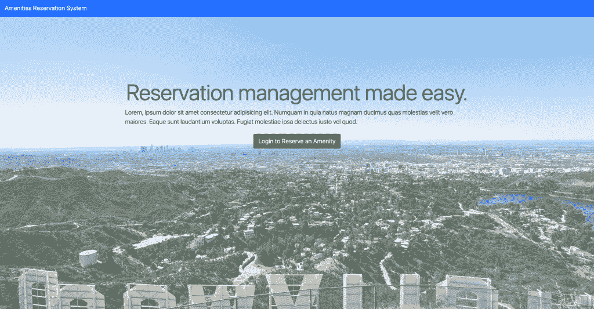**

**我们将创建另一个页面来显示用户是否已经登录。为了简单起见，我们也将它视为一个主页，如果用户登录，他们将能够在主页上看到他们的预订。**

**对于用户来说，它在实用性方面也很好，因为它减少了他们查看预订所需的步骤。**

**我们现在将创建这个页面作为另一个端点。但是在将登录添加到我们的应用程序之后，如果用户没有登录，我们将显示上一页，如果用户登录了，我们将动态显示下一页。**

**在我们开始我们的新页面之前，让我们添加另一个映射到 **HomeController** 来返回我们的新页面。我们稍后将合并这两个控制器:**

```
`package com.amenity_reservation_system;

import com.amenity_reservation_system.domain.User;
import com.amenity_reservation_system.service.UserService;
import org.springframework.beans.factory.annotation.Autowired;
import org.springframework.stereotype.Controller;
import org.springframework.ui.Model;
import org.springframework.web.bind.annotation.GetMapping;
import org.springframework.web.bind.annotation.ResponseBody;

@Controller
public class HomeController {

    final UserService userService;

    public HomeController(UserService userService) {
        this.userService = userService;
    }

    @GetMapping("/")
    public String index(Model model) {
        return "index";
    }

    @GetMapping("/reservations")
    public String reservations(Model model) {
        User user = userService.get(10000L);
        model.addAttribute("user", user);

        return "reservations";
    }
}`
```

**HomeController.java**

**如果在“/reservations”处收到请求，该代码将调用我们的用户服务并要求 id 为 10000L 的用户。然后它会将这个用户添加到**模型**中。**

**视图将访问该模型，并显示有关该用户预订的信息。我们还自动连接了用户服务来使用它。**

**如果不在 templates 文件夹中，请导航到该文件夹，并创建另一个名为“reservations.html”的文件:**

```
`touch reservations.html`
```

**复制并粘贴以下代码:**

```
`<!DOCTYPE HTML>
<html lang="en" xmlns:th="http://www.thymeleaf.org">
<head>
    <meta charset="UTF-8"/>
    <title>Reservations</title>

    <link th:rel="stylesheet" th:href="@{/webjars/bootstrap/4.0.0-2/css/bootstrap.min.css} "/>
</head>
<body>

<div>
    <div th:insert="fragments/nav :: nav"></div>
    <div class="container" style="padding-top: 10vh; display: flex; flex-direction: column; align-items: center;">
        <h3>Welcome <span th:text=" ${user.getFullName()}"></span></h3>
        <br>
        <table class="table">
            <thead>
                <tr>
                    <th scope="col">Amenity</th>
                    <th scope="col">Date</th>
                    <th scope="col">Start Time</th>
                    <th scope="col">End Time</th>
                </tr>
            </thead>
            <tbody>
                <tr th:each="reservation : ${user.getReservations()}">
                    <td th:text="${reservation.getAmenityType()}"></td>
                    <td th:text="${reservation.getReservationDate()}"></td>
                    <td th:text="${reservation.getStartTime()}"></td>
                    <td th:text="${reservation.getEndTime()}"></td>
                </tr>
            </tbody>
        </table>
    </div>
</div>

<script th:src="@{/webjars/jquery/3.0.0/jquery.min.js}"></script>
<script th:src="@{/webjars/popper.js/1.12.9-1/umd/popper.min.js}"></script>
<script th:src="@{/webjars/bootstrap/4.0.0-2/js/bootstrap.min.js}"></script>

</body>
</html>`
```

**在这个**百里香叶**模板中，我们像以前一样导入 **Bootstrap** 和**百里香叶**，并且我们通过使用${}语法访问添加到我们的控制器中的模型的用户变量。**

**为了访问数据，Thymeleaf 使用对象的 getter 方法，我们可以通过使用`th:text`属性打印该信息。百里香叶也支持循环。在`tbody`中，我们有一个`th:each`循环，我们可以把它看作是对用户预订的 foreach 循环。所以我们遍历预订，并在一个表中显示它们。**

**您可能会看到类似“无法初始化代理，...懒装”。这是因为视图试图访问尚不存在的预订对象。为了消除这种情况，我们可以修改**User.java**中的以下代码行:**

```
 `@OneToMany(mappedBy = "user", fetch = FetchType.EAGER)
    private Set<Reservation> reservations = new HashSet<>();`
```

**我们添加了一个语句来告诉 Java 急切地获取这个对象。**

**现在，您应该能够查看预订页面:**

**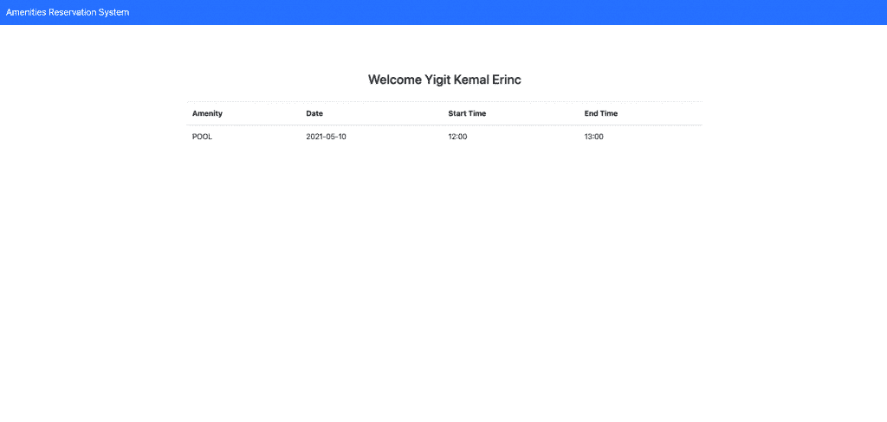**

### **如何创建预订**

**我们还需要一种创建新预订的方法，所以让我们为预先创建的用户构建该机制，就像显示预订一样。然后我们可以修改它来显示当前登录用户的预订。**

**在继续之前，我们需要更新我们的**Reservation.java**文件中的日期格式，以避免任何格式不匹配的问题。确保这些变量的格式相同:**

```
 `@DateTimeFormat(pattern = "yyyy-MM-dd")
    @Column(nullable = false)
    private LocalDate reservationDate;

    @DateTimeFormat(pattern = "HH:mm")
    @Column
    private LocalTime startTime;

    @DateTimeFormat(pattern = "HH:mm")
    @Column
    private LocalTime endTime;`
```

**在上一节中，我们创建了我们的**预订**控制器。现在，我们需要对它进行一点修改，为模型添加另一个属性。**

**我们学习了如何使用${}语法来访问添加到模型中的对象。现在我们要做一些类似的事情:**

```
`@GetMapping("/reservations")
    public String reservations(Model model, HttpSession session) {
        User user = userService.get(10000L);
        session.setAttribute("user", user);
        Reservation reservation = new Reservation();
        model.addAttribute("reservation", reservation);

        return "reservations";
    }`
```

**我们正在更新预订控制器，以便将用户对象移动到会话中，因为我们希望可以从另一个控制器方法中访问它，而不仅仅是从模板中访问。**

**可以这样想:一旦一个用户登录，这个用户的帐户将负责此后的每一个动作。您可以将 Session 视为一个全局变量，可以从任何地方访问它。**

**我们还创建了一个**预订**对象，并将其添加到模型中。**百里香叶**将使用这个模型在我们的视图模板中访问这个新创建的对象，它将调用 setters 来设置它的字段。**

**现在让我们创建用于创建预订的视图。我们将使用 [Bootstrap Modal](https://getbootstrap.com/docs/4.0/components/modal/) 在点击按钮后显示一个表单模态。**

**我们可以首先处理代码来调用我们将在下一步中创建的模态，移动到 reservations.html 文件，并在我们之前添加的表标记后添加以下代码片段:**

```
`<button
  type="button"
  class="btn btn-primary"
  data-toggle="modal"
  data-target="#createReservationModal"
>
  Create Reservation
</button>

<!-- Modal -->
<div
  th:insert="fragments/modal :: modal"
  th:with="reservation=${reservation}"
></div>`
```

**这个按钮将触发我们的模态。在 div 中，我们插入这个我们将要创建的模型，并使用`th:with`标签来传递放置在控制器模型中的 reservation 对象。如果我们不这样做，这个片段就不知道这个预订对象。**

**我们还需要改变我们访问用户以打印他们的名字的方式，因为我们不再将它存储在模态中，而是存储在会话中:**

```
`<h3>Welcome <span th:text=" ${session.user.getFullName()}"></span></h3>` 
```

**因此，您的最终**reservations.html**文件应该是这样的:**

```
`<!DOCTYPE html>
<html lang="en" xmlns:th="http://www.thymeleaf.org">
  <head>
    <meta charset="UTF-8" />
    <title>Reservations</title>

    <link
      th:rel="stylesheet"
      th:href="@{/webjars/bootstrap/4.0.0-2/css/bootstrap.min.css} "
    />
  </head>
  <body>
    <div>
      <div th:insert="fragments/nav :: nav"></div>
      <div
        class="container"
        style="padding-top: 10vh; display: flex; flex-direction: column; align-items: center;"
      >
        <h3>Welcome <span th:text=" ${session.user.getFullName()}"></span></h3>
        <br />
        <table class="table">
          <thead>
            <tr>
              <th scope="col">Amenity</th>
              <th scope="col">Date</th>
              <th scope="col">Start Time</th>
              <th scope="col">End Time</th>
            </tr>
          </thead>
          <tbody>
            <tr th:each="reservation : ${session.user.getReservations()}">
              <td th:text="${reservation.getAmenityType()}"></td>
              <td th:text="${reservation.getReservationDate()}"></td>
              <td th:text="${reservation.getStartTime()}"></td>
              <td th:text="${reservation.getEndTime()}"></td>
            </tr>
          </tbody>
        </table>

        <button
          type="button"
          class="btn btn-primary"
          data-toggle="modal"
          data-target="#createReservationModal"
        >
          Create Reservation
        </button>

        <!-- Modal -->
        <div
          th:insert="fragments/modal :: modal"
          th:with="reservation=${reservation}"
        ></div>
      </div>
    </div>

    <script th:src="@{/webjars/jquery/3.0.0/jquery.min.js}"></script>
    <script th:src="@{/webjars/popper.js/1.12.9-1/umd/popper.min.js}"></script>
    <script th:src="@{/webjars/bootstrap/4.0.0-2/js/bootstrap.min.js}"></script>
  </body>
</html>`
```

**我们现在准备创建模态片段。我们可以为模态创建一个片段，就像我们对导航所做的那样:**

```
`pwd
/src/main/resources
cd templates/fragments
touch modal.html` 
```

**Creating modal.html**

**并粘贴以下模板代码:**

```
`<html lang="en" xmlns:th="http://www.thymeleaf.org">
  <body>
    <div
      class="modal fade"
      th:fragment="modal"
      id="createReservationModal"
      tabindex="-1"
      role="dialog"
      aria-labelledby="createReservationModalTitle"
      aria-hidden="true"
    >
      <div class="modal-dialog" role="document">
        <div class="modal-content">
          <div class="modal-header">
            <h5 class="modal-title" id="createReservationModalTitle">
              Create Reservation
            </h5>
            <button
              type="button"
              class="close"
              data-dismiss="modal"
              aria-label="Close"
            >
              <span aria-hidden="true">&times;</span>
            </button>
          </div>

          <div class="modal-body">
            <form
              action="#"
              th:action="@{/reservations-submit}"
              th:object="${reservation}"
              method="post"
            >
              <div class="form-group row">
                <label for="type-select" class="col-2 col-form-label"
                  >Amenity</label
                >
                <div class="col-10">
                  <select
                    class="form-control"
                    id="type-select"
                    th:field="*{amenityType}"
                  >
                    <option value="POOL">POOL</option>
                    <option value="SAUNA">SAUNA</option>
                    <option value="GYM">GYM</option>
                  </select>
                </div>
              </div>
              <div class="form-group row">
                <label for="start-date" class="col-2 col-form-label"
                  >Date</label
                >
                <div class="col-10">
                  <input
                    class="form-control"
                    type="date"
                    id="start-date"
                    name="trip-start"
                    th:field="*{reservationDate}"
                    value="2018-07-22"
                    min="2021-05-01"
                    max="2021-12-31"
                  />
                </div>
              </div>
              <div class="form-group row">
                <label for="start-time" class="col-2 col-form-label"
                  >From</label
                >
                <div class="col-10">
                  <input
                    class="form-control"
                    type="time"
                    id="start-time"
                    name="time"
                    th:field="*{startTime}"
                    min="08:00"
                    max="19:30"
                    required
                  />
                </div>
              </div>
              <div class="form-group row">
                <label for="end-time" class="col-2 col-form-label">To</label>
                <div class="col-10">
                  <input
                    class="form-control"
                    type="time"
                    id="end-time"
                    name="time"
                    th:field="*{endTime}"
                    min="08:30"
                    max="20:00"
                    required
                  />
                  <small>Amenities are available from 8 am to 8 pm</small>
                </div>
              </div>
              <div class="modal-footer">
                <button
                  type="button"
                  class="btn btn-secondary"
                  data-dismiss="modal"
                >
                  Close
                </button>
                <button type="submit" class="btn btn-primary" value="Submit">
                  Save changes
                </button>
              </div>
            </form>
          </div>
        </div>
      </div>
    </div>
  </body>
</html>`
```

**这里有几个要点你需要注意。**

**注意我们是如何访问表单标签中的 reservation 对象的:**

```
`<form
  action="#"
  th:action="@{/reservations-submit}"
  th:object="${reservation}"
  method="post"
></form>`
```

 ****`th:object`**标签将这个表单与我们之前创建的预订对象相关联。 **`th:action`** 决定了表单提交时该对象将被发送到哪里，我们的提交方式将是 **POST** 。在这个步骤之后，我们将使用到 **/reservations-submit** 的映射来创建这个控制器。**

**我们使用 **`th:field`** 标签将输入绑定到预订对象的字段。每当输入字段的值改变时，百里香就会调用 reservation 对象的 setters。**

**现在让我们创建一个接收这个表单的控制器。转到 **HomeController** 并添加以下方法:**

```
`@PostMapping("/reservations-submit")
    public String reservationsSubmit(@ModelAttribute Reservation reservation,
                                     @SessionAttribute("user") User user) {

        // Save to DB after updating
        assert user != null;
        reservation.setUser(user);
        reservationService.create(reservation);
        Set<Reservation> userReservations = user.getReservations();
        userReservations.add(reservation);
        user.setReservations(userReservations);
        userService.update(user.getId(), user);
        return "redirect:/reservations";
    }`
```

**并且还将 **ReservationService** 添加到我们的依赖项中:**

```
 `final UserService userService;
    final ReservationService reservationService;

    public HomeController(UserService userService, ReservationService reservationService) {
        this.userService = userService;
        this.reservationService = reservationService;
    }`
```

**在我们的模态片段将预订对象发送到这个控制器之后，该对象将被绑定到 **@ModelAttribute** 注释。我们还需要用户，所以我们使用 **@SessionAttribute** 来获取对它的引用。**

**预订对象的字段应该全部由表单设置。现在我们只需要将它保存到数据库中。**

**我们通过调用 **create** 方法来实现。然后，我们将新的预订添加到用户的预订列表中，并更新用户以反映这些更改。然后，我们将用户重定向到预订页面，显示更新后的预订列表。**

**您的预订页面应该如下所示:**

**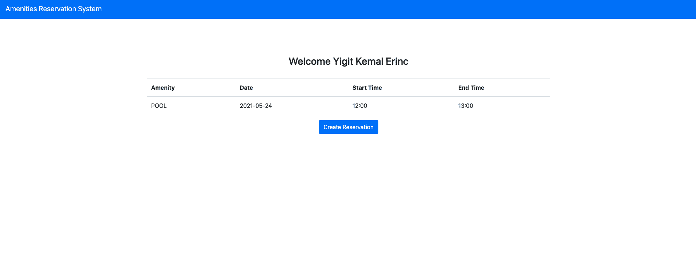**

**当您单击按钮时，应该会弹出创建预订模式。**

**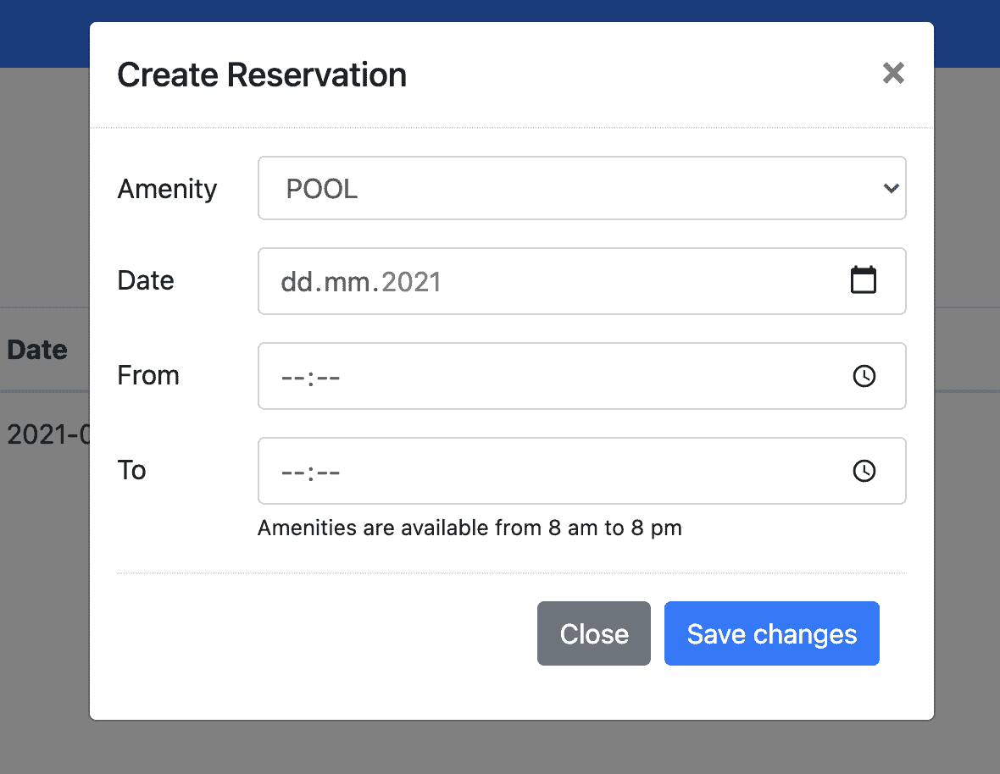**

## **如何向应用程序添加身份验证和授权**

**我们将使用 **Spring Security** 为我们的应用程序添加认证和授权。我们希望确保没有人可以看到彼此的预订，并且用户必须登录才能创建预订。**

**如果你想了解更多，我写了一篇文章，提供了一个关于 [Spring Security](https://auth0.com/blog/spring-security-overview/) 的概述。**

**我们将保持简单，主要使用默认值，因为这本身就是一个困难的话题。如果你想学习如何正确设置 Spring 安全认证，你可以看看我的文章。**

**我们需要将“Spring Security”和“百里香 Spring Security”添加到我们的依赖项中，所以打开 pom.xml，将以下内容添加到依赖项列表中:**

```
`<dependency>
    <groupId>org.springframework.boot</groupId>
    <artifactId>spring-boot-starter-security</artifactId>
</dependency>

<dependency>
    <groupId>org.thymeleaf.extras</groupId>
    <artifactId>thymeleaf-extras-springsecurity5</artifactId>
    <version>3.0.4.RELEASE</version>
</dependency>`
```

**现在，默认情况下，Spring Security 使所有的端点都受到保护，所以我们需要将其配置为允许查看主页。**

**让我们创建一个 config 文件夹来包含我们的 **WebSecurityConfig** 文件。假设您在根文件夹中:**

```
`cd /src/main/java/com/amenity_reservation_system
mkdir config && cd config
touch WebSecurityConfig.java`
```

**这应该是您的配置文件的内容:**

```
`package com.amenity_reservation_system.config;

import com.amenity_reservation_system.service.UserDetailsServiceImpl;
import org.springframework.context.annotation.Configuration;
import org.springframework.security.config.annotation.authentication.builders.AuthenticationManagerBuilder;
import org.springframework.security.config.annotation.web.builders.HttpSecurity;
import org.springframework.security.config.annotation.web.configuration.EnableWebSecurity;
import org.springframework.security.config.annotation.web.configuration.WebSecurityConfigurerAdapter;
import org.springframework.security.crypto.bcrypt.BCryptPasswordEncoder;

@Configuration
@EnableWebSecurity
public class WebSecurityConfig extends WebSecurityConfigurerAdapter {

    private final UserDetailsServiceImpl userDetailsService;

    private final BCryptPasswordEncoder bCryptPasswordEncoder;

    public WebSecurityConfig(UserDetailsServiceImpl userDetailsService, BCryptPasswordEncoder bCryptPasswordEncoder) {
        this.userDetailsService = userDetailsService;
        this.bCryptPasswordEncoder = bCryptPasswordEncoder;
    }

    @Override
    protected void configure(HttpSecurity http) throws Exception {
        http
                .authorizeRequests()
                .antMatchers("/", "/webjars/**").permitAll()
                .anyRequest().authenticated()
                .and()
                .formLogin()
                .permitAll()
                .and()
                .logout()
                .permitAll()
                .logoutSuccessUrl("/");
    }

    public void configure(AuthenticationManagerBuilder auth) throws Exception {
        auth.userDetailsService(userDetailsService).passwordEncoder(bCryptPasswordEncoder);
    }

}`
```

**WebSecurityConfig.java**

**我不会深入细节，但这里有一个发生在这里的事情的总结:**

*   **我们配置了 Spring Security 来允许对主页的所有请求(“/”)**
*   **我们配置了我们的样式("/webjars/** ")**
*   **我们要求它为我们提供登录和注销表单**
*   **我们要求它也允许对他们的请求，并在注销成功后重定向到主页**

**仅凭几句话就能取得如此成就，这难道不令人惊讶吗？**

**我们还配置了我们的**AuthenticationManagerBuilder**来使用 bCryptPasswordEncoder 和 userDetailsService。但是等等，我们还没有得到它们，你的 IDE 可能已经在抱怨了。所以让我们来创造它们。**

**在我们继续之前，向我们的**用户**类添加**用户名**和 passwordHash 字段可能是个好主意。我们将使用它们来验证用户，而不是使用他们的全名。然后我们将它添加到构造函数中。**

```
`package com.amenity_reservation_system.model;

import java.time.OffsetDateTime;
import java.util.HashSet;
import java.util.Set;
import javax.persistence.*;

import lombok.AllArgsConstructor;
import lombok.Getter;
import lombok.NoArgsConstructor;
import lombok.Setter;

@Entity
@Getter
@Setter
@AllArgsConstructor
@NoArgsConstructor
public class User {

    @Id
    @Column(nullable = false, updatable = false)
    @SequenceGenerator(
            name = "primary_sequence",
            sequenceName = "primary_sequence",
            allocationSize = 1,
            initialValue = 10000
    )
    @GeneratedValue(
            strategy = GenerationType.SEQUENCE,
            generator = "primary_sequence"
    )
    private Long id;

    @Column(nullable = false, unique = true)
    private String fullName;

    @Column(nullable = false, unique = true)
    private String username;

    @Column
    private String passwordHash;

    @OneToMany(mappedBy = "user", fetch = FetchType.EAGER)
    private Set<Reservation> reservations = new HashSet<>();

    @Column(nullable = false, updatable = false)
    private OffsetDateTime dateCreated;

    @Column(nullable = false)
    private OffsetDateTime lastUpdated;

    @PrePersist
    public void prePersist() {
        dateCreated = OffsetDateTime.now();
        lastUpdated = dateCreated;
    }

    @PreUpdate
    public void preUpdate() {
        lastUpdated = OffsetDateTime.now();
    }

    public User(String fullName, String username, String passwordHash) {
        this.fullName = fullName;
        this.username = username;
        this.passwordHash = passwordHash;
    }
}`
```

**User.java**

**在 services 文件夹下创建一个名为 **UserDetailsServiceImpl** 的文件:**

```
`cd service
touch UserDetailsServiceImpl.java`
```

```
`package com.amenity_reservation_system.service;

import com.amenity_reservation_system.model.User;
import com.amenity_reservation_system.repos.UserRepository;
import org.springframework.security.core.userdetails.UserDetails;
import org.springframework.security.core.userdetails.UserDetailsService;
import org.springframework.security.core.userdetails.UsernameNotFoundException;
import org.springframework.stereotype.Service;

@Service
public class UserDetailsServiceImpl implements UserDetailsService {

    private UserRepository userRepository;

    public UserDetailsServiceImpl(UserRepository userRepository) {
        this.userRepository = userRepository;
    }

    public UserDetails loadUserByUsername(String username) throws UsernameNotFoundException {
        final User user = userRepository.findUserByUsername(username);

        if (user == null) {
            throw new UsernameNotFoundException(username);
        }

        UserDetails userDetails = org.springframework.security.core.userdetails.User.withUsername(
                user.getUsername()).password(user.getPwHash()).roles("USER").build();

        return userDetails;
    }
}` 
```

**UserDetailsServiceImpl.java**

**这基本上告诉 Spring Security，我们想要使用我们之前通过从我们的数据库获取**用户**对象并在我们的存储库上使用 JPA 方法而创建的**用户**实体。但是同样，我们的**用户存储库**上没有 **findUserByUsername** 方法。你可以试着自己解决这个问题，这很简单。**

**记住，我们不需要编写查询。提供签名并让 JPA 完成工作就足够了。**

```
`package com.amenity_reservation_system.repos;

import com.amenity_reservation_system.model.User;
import org.springframework.data.jpa.repository.JpaRepository;

public interface UserRepository extends JpaRepository<User, Long> {

    User findUserByUsername(String username);
}` 
```

**UserRepository.java**

**我们还需要一个**BCryptPasswordEncoder**bean 来满足 **WebSecurityConfig** 中的依赖性并使其工作。让我们修改我们的主类，添加一个 bean，并更改构造函数参数，给我们预定义的**用户**一个用户名。**

```
`package com.amenity_reservation_system;

import com.amenity_reservation_system.model.AmenityType;
import com.amenity_reservation_system.model.Reservation;
import com.amenity_reservation_system.model.User;
import com.amenity_reservation_system.repos.ReservationRepository;
import com.amenity_reservation_system.repos.UserRepository;
import org.springframework.boot.CommandLineRunner;
import org.springframework.boot.SpringApplication;
import org.springframework.boot.autoconfigure.SpringBootApplication;
import org.springframework.context.annotation.Bean;
import org.springframework.security.crypto.bcrypt.BCryptPasswordEncoder;

import java.text.DateFormat;
import java.text.SimpleDateFormat;
import java.time.LocalDate;
import java.time.LocalTime;
import java.time.ZoneId;
import java.util.Date;

@SpringBootApplication
public class AmenityReservationSystemApplication {

    public static void main(String[] args) {
        SpringApplication.run(AmenityReservationSystemApplication.class, args);
    }

    @Bean
    public CommandLineRunner loadData(UserRepository userRepository,
                                      ReservationRepository reservationRepository) {
    return (args) -> {
      User user =
          userRepository.save(
              new User("Yigit Kemal Erinc",
                      "yigiterinc",
                      bCryptPasswordEncoder().encode("12345")));
      DateFormat dateFormat = new SimpleDateFormat("dd/MM/yyyy HH:mm:ss");
      Date date = new Date();
      LocalDate localDate = date.toInstant().atZone(ZoneId.systemDefault()).toLocalDate();
      Reservation reservation =
          Reservation.builder()
              .reservationDate(localDate)
              .startTime(LocalTime.of(12, 00))
              .endTime(LocalTime.of(13, 00))
              .user(user)
              .amenityType(AmenityType.POOL)
              .build();

      reservationRepository.save(reservation);
    };
    }

    @Bean
    public BCryptPasswordEncoder bCryptPasswordEncoder() {
        return new BCryptPasswordEncoder();
    }
}`
```

**您的应用程序现在应该可以编译了，如果您向“/reservations”发送请求，它应该已经将您重定向到登录页面。**

**如果在导航栏上有登录和注销按钮就好了，如果用户没有通过验证，我们希望显示登录，否则就注销。我们可以在 nav.html 这样做:**

```
`<!DOCTYPE html>
<html lang="en" xmlns:th="http://www.thymeleaf.org" xmlns:sec="http://www.w3.org/1999/xhtml">
<body>
<nav th:fragment="nav" class="navbar navbar-expand navbar-dark bg-primary">
    <div class="navbar-nav w-100">
        <a class="navbar-brand text-color" href="/">Amenities Reservation System</a>
    </div>
        <a sec:authorize="isAnonymous()"
           class="navbar-brand text-color" th:href="@{/login}">Log in</a>
        <a sec:authorize="isAuthenticated()"
               class="navbar-brand text-color" th:href="@{/logout}">Log out</a>
</nav>
</body>
</html>`
```

**nav.html**

**登录链接现在应该可以在导航栏上看到了。**

**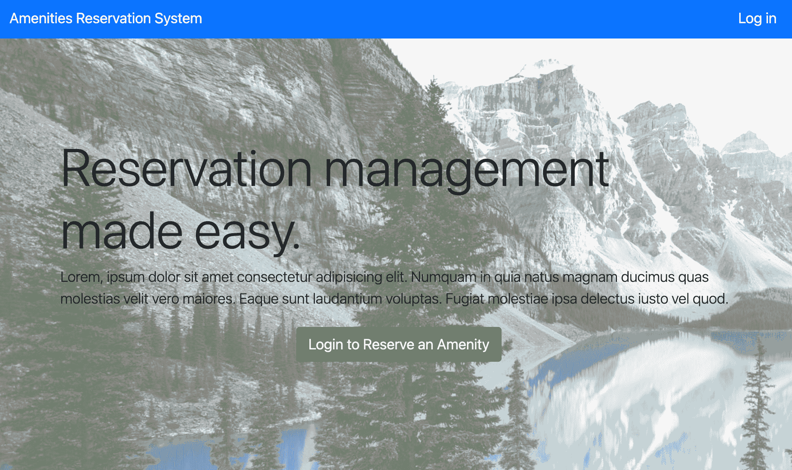

Home page when you are not logged in** 

## **如何显示登录用户的预订**

**我们的预订页面当前显示一个硬编码用户的预订，而不是登录用户的预订。**

```
 `@GetMapping("/reservations")
    public String reservations(Model model, HttpSession session) {
        User user = userService.get(10000L);
        session.setAttribute("user", user);
        Reservation reservation = new Reservation();
        model.addAttribute("reservation", reservation);

        return "reservations";
    }` 
```

**Current reservations controller**

**我们需要显示当前登录用户的预订。为了实现这一点，我们应该使用一些 Spring 安全。**

**转到 **HomeController** (我知道，这个名字现在有点问题)类，用下面的代码修改它:**

```
`@GetMapping("/reservations")
    public String reservations(Model model, HttpSession session) {
        UserDetails principal = (UserDetails) SecurityContextHolder.getContext().getAuthentication().getPrincipal();
        String name = principal.getUsername();
        User user = userService.getUserByUsername(name);

        // This should always be the case 
        if (user != null) {
            session.setAttribute("user", user);

            // Empty reservation object in case the user creates a new reservation
            Reservation reservation = new Reservation();
            model.addAttribute("reservation", reservation);

            return "reservations";
        }

        return "index";    
        }`
```

**Reservations controller**

**由于我们已经在项目中添加了 Spring Security，它会在幕后自动创建**身份验证**对象——我们从 **SecurityContextHolder** 那里得到这个对象。**

**我们正在抓取 **[UserDetails](https://docs.spring.io/spring-security/site/docs/current/api/org/springframework/security/core/userdetails/UserDetails.html#:~:text=Interface%20UserDetails&text=Provides%20core%20user%20information.,later%20encapsulated%20into%20Authentication%20objects.)** 对象，该对象存储了与用户相关的信息。然后我们检查用户对象是否为空。由于*预订*是一个受保护的端点，用户必须登录才能看到该页面，所以这种情况应该始终存在——但确保一切如预期一样总是好的。**

**然后我们调用 **UserService** 类来获取拥有这个用户名的**用户**对象——但是我们还没有添加**getuserbysusername**方法。所以让我们转到**用户服务**并添加这个简单的方法。**

```
 `public User getUserByUsername(String username) {
        return userRepository.findUserByUsername(username);
    }`
```

**现在，您应该能够看到登录用户的预订。您可以尝试添加另一个用户，并为该用户创建预订。**

### **如何检查容量**

**我们目前没有一种机制来存储每种设施类型的容量。我们需要以某种方式存储它们，并在批准预订之前检查是否有足够的容量。**

**为此，让我们在模型文件夹下创建一个名为 **Capacity** 的类。**

```
`package com.amenity_reservation_system.model;

import lombok.AllArgsConstructor;
import lombok.Getter;
import lombok.NoArgsConstructor;
import lombok.Setter;

import javax.persistence.*;

@Entity
@Getter
@Setter
@AllArgsConstructor
@NoArgsConstructor
public class Capacity {

    @Id
    @Column(nullable = false, updatable = false)
    @SequenceGenerator(
            name = "primary_sequence",
            sequenceName = "primary_sequence",
            allocationSize = 1,
            initialValue = 10000
    )
    @GeneratedValue(
            strategy = GenerationType.SEQUENCE,
            generator = "primary_sequence"
    )
    private Long id;

    @Column(nullable = false, unique = true)
    @Enumerated(EnumType.STRING)
    private AmenityType amenityType;

    @Column(nullable = false)
    private int capacity;

    public Capacity(AmenityType amenityType, int capacity) {
        this.amenityType = amenityType;
        this.capacity = capacity;
    }
}`
```

**Capacity.java**

**这是一个实体，它将代表我们存储在数据库中的逻辑结构。它基本上是一个带有 AmenityType 及其相应容量的地图条目。**

**我们还需要一个存储库来存储 **Capacity** 条目，所以让我们在 **repos** 文件夹下创建 CapacityRepository。**

```
`package com.amenity_reservation_system.repos;

import com.amenity_reservation_system.model.Capacity;
import org.springframework.data.jpa.repository.JpaRepository;

public interface CapacityRepository extends JpaRepository<Capacity, Long> {
}` 
```

**我们需要用初始容量填充这个新表。我们可以从配置文件或其他文件中读取初始容量，但让我们保持简单，并在我们的 main 方法中使用 loadData 对其进行硬编码。**

```
`package com.amenity_reservation_system;

import com.amenity_reservation_system.model.AmenityType;
import com.amenity_reservation_system.model.Capacity;
import com.amenity_reservation_system.model.Reservation;
import com.amenity_reservation_system.model.User;
import com.amenity_reservation_system.repos.CapacityRepository;
import com.amenity_reservation_system.repos.ReservationRepository;
import com.amenity_reservation_system.repos.UserRepository;
import org.springframework.boot.CommandLineRunner;
import org.springframework.boot.SpringApplication;
import org.springframework.boot.autoconfigure.SpringBootApplication;
import org.springframework.context.annotation.Bean;
import org.springframework.security.crypto.bcrypt.BCryptPasswordEncoder;

import java.text.DateFormat;
import java.text.SimpleDateFormat;
import java.time.LocalDate;
import java.time.LocalTime;
import java.time.ZoneId;
import java.util.Date;
import java.util.HashMap;
import java.util.Map;

@SpringBootApplication
public class AmenityReservationSystemApplication {

  private Map<AmenityType, Integer> initialCapacities =
      new HashMap<>() {
        {
          put(AmenityType.GYM, 20);
          put(AmenityType.POOL, 4);
          put(AmenityType.SAUNA, 1);
        }
      };

  public static void main(String[] args) {
    SpringApplication.run(AmenityReservationSystemApplication.class, args);
  }

  @Bean
  public CommandLineRunner loadData(
      UserRepository userRepository,
      CapacityRepository capacityRepository) {
    return (args) -> {
      userRepository.save(
          new User("Yigit Kemal Erinc", "yigiterinc", bCryptPasswordEncoder().encode("12345")));

      for (AmenityType amenityType : initialCapacities.keySet()) {
        capacityRepository.save(new Capacity(amenityType, initialCapacities.get(amenityType)));
      }
    };
  }

  @Bean
  public BCryptPasswordEncoder bCryptPasswordEncoder() {
    return new BCryptPasswordEncoder();
  }
}` 
```

**我只是在 **initialCapacities** 映射中添加了容量，然后将它们保存到 **loadData** 方法中的 **CapacityRepository** 中。**

**我们现在可以检查在请求的时间内预订的数量是否超过了容量，如果超过，就拒绝预订请求。**

**逻辑是这样的:我们需要获取同一天与当前请求重叠的预订数量。然后，我们需要获取该设施类型的容量，如果超出了容量，我们可以抛出一个异常。**

**因此，我们需要一个查询来获得潜在重叠预订的数量。这不是最容易编写的查询，但 JPA 非常方便，我们可以在我们的 **ReservationRepository** 中访问该查询，而无需编写任何 SQL 或 HQL (Hibernate 查询语言)。**

**我鼓励您在继续下一步之前亲自尝试一下，因为这是我在本教程中引入容量概念的唯一原因(展示一个更高级的 JPA 查询示例)。**

**这就是 **ReservationService** 的 create 方法的样子。您需要将 0 替换为对 reservationRepository 的调用，以获取重叠预订的数量。**

**如果当前重叠预留的数量等于容量，这意味着下一个将超过它，所以我们抛出异常。**

```
`public Long create(final Reservation reservation) {
        int capacity = capacityRepository.findByAmenityType(reservation.getAmenityType()).getCapacity();
        int overlappingReservations = 0; // TODO

        if (overlappingReservations >= capacity) {
            // Throw a custom exception
        }

        return reservationRepository.save(reservation).getId();
    }`
```

**为了找到重叠预订，我们需要检查一些条件:**

**首先，预订日期应该与请求中的日期相同。**

1.  **开始时间可以在新请求的开始时间之前。那样的话，结束时间应该晚于我们的要求，以便重叠。(开始时间之前和结束时间之后)**
2.  **或者，结束时间可以在请求的开始时间和结束时间之后，但是开始时间实际上可以在请求的开始时间和结束时间之间。(endTimeAfterOrStartTimeBetween)**

**因此，我们的最终查询应该返回符合这两种可能性中任何一种的所有预订。**

**我们可以这样表达:**

```
`List<Reservation> findReservationsByReservationDateAndStartTimeBeforeAndEndTimeAfterOrStartTimeBetween
            (LocalDate reservationDate, LocalTime startTime, LocalTime endTime, LocalTime betweenStart, LocalTime betweenEnd);` 
```

**最终的创建方法如下所示:**

```
 `public Long create(final Reservation reservation) {
        int capacity = capacityRepository.findByAmenityType(reservation.getAmenityType()).getCapacity();
        int overlappingReservations = reservationRepository
                .findReservationsByReservationDateAndStartTimeBeforeAndEndTimeAfterOrStartTimeBetween(
                        reservation.getReservationDate(),
                        reservation.getStartTime(), reservation.getEndTime(),
                        reservation.getStartTime(), reservation.getEndTime()).size();

        if (overlappingReservations >= capacity) {
            throw new CapacityFullException("This amenity's capacity is full at desired time");
        }

        return reservationRepository.save(reservation).getId();
    }`
```

**您不需要担心自定义异常，但是如果您对此感兴趣，下面是代码:**

```
`package com.amenity_reservation_system.exception;

public class CapacityFullException extends RuntimeException {
    public CapacityFullException(String message) {
        super(message);
    }
}`
```

**如果超出了容量，我们通常应该显示一个错误模式，但是我将跳过它以避免重复的 UI 内容。如果你愿意，你可以把它作为一个挑战。**

## **结论**

**在本教程中，我们已经了解了许多使 Spring Boot 开发更容易、更快速的技术。**

**我相信许多人低估了框架的开发速度和最终工作的质量。**

**假设你对这项技术很熟悉，我认为如果你用现代的方式做每件事，Spring Boot 并不比其他后端框架慢(在开发中)。**

**您可以在这个资源库中找到完整的代码:**

**[https://github . com/yigiterinc/amenity-reservation-system . git](https://github.com/yigiterinc/amenity-reservation-system.git)**

**如果你有兴趣阅读更多类似的内容，请随时订阅我的博客，网址为 [https://erinc.io](https://erinc.io/) 以获得关于我的新帖子的通知。**