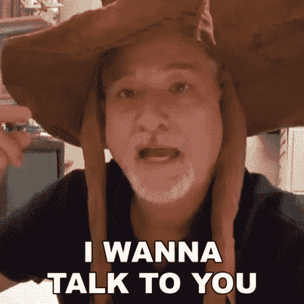

# django for Everybody——向 Chuck 博士学习流行的 Python 框架

> 原文：<https://www.freecodecamp.org/news/django-for-everybody-learn-the-popular-python-framework-from-dr-chuck/>

Django 是用 Python 创建全栈网站最流行的方式之一。

我们刚刚在 freeCodeCamp.org YouTube 频道上发布了一个 18 小时的 Django 课程。

Charles Severance(又名 Chuck 博士)创建了这个课程，以及流行的 Python for Everybody 课程。他是密歇根大学信息学院的临床教授，教授各种面向技术的课程，包括编程、数据库设计和 Web 开发。

本课程向 Python 程序员介绍了如何使用 Django 库构建网站。作为课程的一部分，你将学习 HTML、CSS、SQL、Django、JavaScript、jQuery 和 JSON Web 服务。

Dr. Chuck getting ready to teach you.

以下是该综合课程的所有部分:

*   为什么教姜戈？
*   Web 应用程序和请求/响应周期
*   探索超文本传输协议
*   使用套接字在 Python 中建立网络连接
*   用 Python 构建一个简单的 Web 浏览器
*   用 Python 构建一个简单的 HTTP 服务器
*   了解浏览器开发人员模式
*   Django 应用程序的结构
*   在 PythonAnywhere 上安装 Django
*   HTML -超文本标记语言(第 1 部分)
*   HTML -超文本标记语言(第二部分)
*   HTML 代码遍历
*   CSS -级联样式表-(第 1 部分)
*   CSS -级联样式表-(第 2 部分)
*   CSS -级联样式表-(第 3 部分)
*   CSS -示例代码演练(第 1 部分)
*   CSS 示例代码演练(第 2 部分)
*   通过 Django 和 PythonAnywhere 使用 GitHub
*   使用 ngrok 向 DJ4E 提交任务
*   数据库如何工作
*   结构化查询语言(SQL)简介
*   演示:基本 SQL
*   Django 模型介绍
*   Django 中的数据模型迁移
*   演示:Django 单表模型
*   重置 PythonAnywhere 上的 Django 数据库
*   Django 模型-多对一关系-音乐数据库
*   Django 中的模型视图控制器
*   Django 中的 URL 路由
*   Django 观点
*   Django 视图内部和在 Django 中转义的 HTML
*   在 Django 中使用模板
*   姜戈模板语言(DTL)
*   Django 模板中的继承
*   反转 Django 视图和 URL
*   理解 Django 通用视图
*   表单、GET、POST 和 HTTP
*   构建 HTML 表单
*   表单和跨站点请求伪造(CSRF)
*   在 Django 的 CSRF 支持
*   刷新后模式
*   浏览器和 Django 中的 Cookies
*   使用 Django 中的会话
*   一对多模型概述
*   删除一对多模型中的复制
*   在数据库中存储主键和外键
*   在 Django 中表示一对多模型
*   使用 Django Shell 探索一对多模型
*   使用 Django 批处理脚本加载一对多数据
*   在 Django 中创建和管理用户
*   Django 中的登录和注销 URL
*   在视图中使用 Django 登录
*   使用 Django 表单功能
*   DJ4E Autos 示例演练-通用 Django 编辑表单
*   用 Django 表单进行数据验证
*   探索本地主机上的 DIY Hello World Django 应用程序
*   探索 PythonAnywhere 上的 DIY Hello World Django 应用程序
*   Django 应用程序的虚拟主机
*   Django 中拥有的行-概览
*   Django 中拥有的行-一般视图检查
*   Django - owner.py 中拥有的行
*   浏览 DJ4E 我的文章(myarts)示例代码
*   遍历 DJ4E 引导菜单(菜单)示例代码
*   遍历 DJ4E Crispy 表单(crisp)示例代码
*   多对多概述
*   Django 中一个简单的多对多示例
*   课程和会员的多对多数据模型
*   构建 Django 批处理脚本以从 CSV 加载数据
*   JavaScript -概述和历史
*   JavaScript -在浏览器中
*   JavaScript -语言
*   JavaScript 函数和数组
*   JavaScript 条件和循环
*   JavaScript 面向对象的概念
*   JavaScript 面向对象的类
*   浏览 DJ4E 图片(pics)示例代码
*   浏览 DJ4E 论坛(论坛)示例代码
*   jQuery 和文档对象模型
*   使用 jQuery
*   浏览 DJ4E jQuery DOM 示例代码
*   浏览 DJ4E jQuery 设置示例代码
*   遍历 DJ4E jQuery 事件示例代码
*   走过 DJ4E jQuery DOM 修改
*   JSON/AJAX 概述
*   浏览 DJ4E JSON 示例代码
*   用 Django 构建 AJAX 聊天
*   浏览 DJ4E JSON(聊天)示例代码
*   浏览 DJ4E Favicon 示例代码
*   浏览 DJ4E 社交登录代码
*   浏览 DJ4E 收藏夹(favs)示例代码
*   遍历 DJ4E 搜索(井)示例代码
*   幕后:欢迎大家来到 Django-为什么是 Django？

观看 freeCodeCamp.org YouTube 频道的全部课程(18 小时观看)。

[https://www.youtube.com/embed/o0XbHvKxw7Y?feature=oembed](https://www.youtube.com/embed/o0XbHvKxw7Y?feature=oembed)