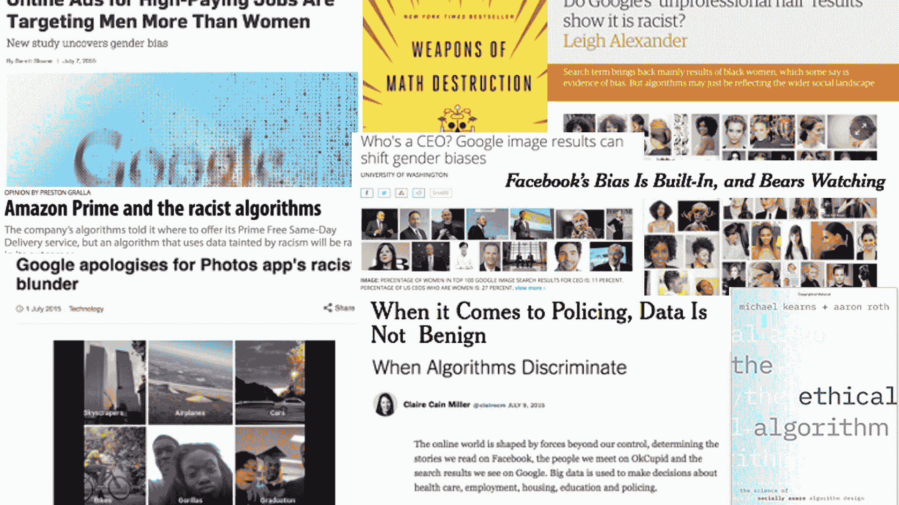
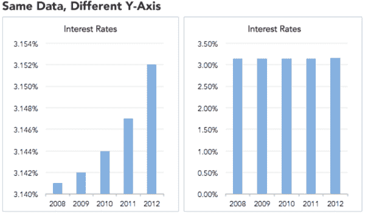
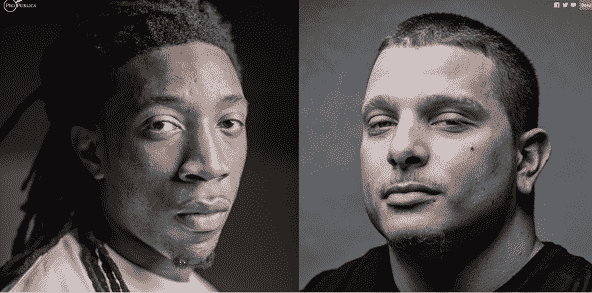

# 数据科学道德——什么可能出错以及如何避免出错

> 原文：<https://www.freecodecamp.org/news/the-ethics-of-data-science/>

数据科学模型就在你身边。

它们可能会影响你的入学，你是否被录用(或解雇)，你的工作时间表，你与谁约会，你是否获得贷款，给你看什么广告，你看到什么社交媒体帖子，等等。

我创建了一个讨论数据科学背后的伦理的讲座，从数据采集到建模和算法。

在本课程中，我将讨论从道德的角度来看什么会出错，在过去什么会出错，以及计算机科学界为打击不道德行为制定了什么指导方针。

本内容改编自 [OpenDS4All](https://github.com/odpi/OpenDS4All/tree/master/opends4all-resources) 。OpenDS4All 是一个旨在加速学术机构创建数据科学课程的项目。

OpenDS4All 试图提供讲座、复习或翻转课堂活动以及动手作业的组合，以提供数据科学和数据工程教育。

现在，让我们探讨一下伦理在现代数据采集和算法中是如何发挥作用的。

要深入了解数据科学的伦理，你可以在这里观看演讲。如果你想简单地了解更多关于数据科学中的道德规范，并理解演讲的内容，请继续阅读。

[https://www.youtube.com/embed/WU7McTUumxU?feature=oembed](https://www.youtube.com/embed/WU7McTUumxU?feature=oembed)

## 我们为什么要关心技术领域的伦理？

**“权力越大，责任越大”**。啊，彼得·帕克原则。数据科学现在对人们的生活有如此大的影响。一名优秀的数据科学家需要了解围绕他们获取或使用的数据、他们使用的算法及其对人类的影响的伦理问题。

人们做正确的事情有几个不同的原因。伦理在这里发挥了作用。道德是我们都自愿遵守的规则，因为它让我们所有人的世界变得更美好。

然而，有时甚至不清楚什么是正确的事情。有时候，只有回想起来才明显。然而，这些经历和后果塑造了我们对未来的理解和期望。

## 道德和数据

不断收集关于我们的数据。到处都有摄像头。手机会报告位置。社交媒体跟随我们的点击。

### 知情同意

在人体受试者研究中，有一个知情同意的概念。我们理解正在做的事情，我们自愿同意实验，并且我们有权在任何时候撤回同意。

然而，这在“日常业务行为”中更为模糊，例如 A/B 测试。例如，脸书可能在没有明确同意甚至不知情的情况下一直进行这些测试！

在视频中，我讨论了脸书在 2012 年做的情绪操纵实验和 OKCupid 在 2015 年做的“爱情是盲目的”实验。

知情同意往往隐藏在细则中，我们中的许多人不一定阅读那些冗长的条款和条件。此外，很难控制数据在未来的使用方式和控制方式。

此外，大数据集有时对于如何保护它们非常模糊。比如维基百科，Yelp，烂番茄，一个临床数据集，一个公司的数据，你的基因序列...

### 隐私

还有对隐私的担忧。隐私是人类的基本需求。当失去对个人数据的控制时，就会失去隐私。在视频中，我讨论了 2016 年 OKCupid 的一场争议，其中发布了用户资料数据。

在某些情况下，即使从数据中删除了可识别信息——如姓名、电话号码、地址等——也不足以保护个人身份。

已经有许多去匿名化的案例，其中 AOL 用户基于搜索历史被识别，或者人们的健康记录基于邮政编码、出生日期和性别被识别。

出于对已发布数据安全性的担忧，出现了“差别隐私”的概念。本质上，目标是提供尽可能多的统计信息，同时保证贡献个人的匿名性。

## 伦理和算法

算法不能是中立的。一个算法自然会对我们给它的偏见进行编码。例如，我们的训练数据可能不代表整个人口。过去的人口不一定代表未来的人口。

“好”的数据可能会产生“坏”的结果。

### 常见的算法失误

可能有相互关联的属性妨碍了我们。在视频中，我讨论了一个例子，当时 Staples 试图击败竞争对手，但最终向较富裕的社区提供了更便宜的交易。

此外，结果有时会以误导的方式呈现。在下面的示例中，我们可以看到 y 轴不同的相同数据如何导致不同的结论:

也有可能通过 p-hack 来发现数据中具有统计显著性的模式。但实际上，你可能只是对很多实验做了很多统计检验，只报告了那些有显著结果的。

如果你做无限多的实验，必然会有一个偶然得到重大结果。

### FAT *—公平、负责、透明

在计算机科学领域，一个重要的研究领域是 FAT*(公平、问责、透明)。这包括根据我们对社会公正、数据的道德使用以及机器学习的可解释决定的概念来确定公平的决定。

[这里的](https://geomblog.github.io/fairness)是深入了解这方面的一个很好的资源。

公平是目前理论计算机科学中的一个热门话题。可能发生的歧视有两种:对个人的歧视和对总体结果的歧视。

当来自目标群体的个人与来自非目标群体的其他方面相同的个人受到不同的待遇时，就可能发生对个人的歧视。

当目标群体的成功率与普通人群的成功率不同时，总结果中可能会出现歧视。

[这里的](https://www.quantamagazine.org/making-algorithms-fair-an-interview-with-cynthia-dwork-20161123)是进一步讨论的绝佳资源。

在视频中，我讨论了算法在量刑和假释中的争议性作用。这些算法似乎显示了有利于白人被告而不利于黑人被告的种族差异。

除了公平之外，我们还希望我们的算法具有可重复性。总的来说，“透明”意味着完全透明。数据收集、原始数据和研究分析的整个过程都应该公开，从而有助于潜在的再现性。

然而，有时数据不能共享，算法可能相当复杂和难以理解，尤其是如果它们是黑盒算法。

为了帮助解决这个问题,“公平”原则——可发现、可访问、可互操作、可重用——已经被提出。查看这篇[文章](https://www.nature.com/articles/sdata201618)了解更多信息。

## 想了解更多？

总之，研究的行为准则是相当好理解的。总的来说，实验希望获得知情同意，保护受试者的隐私，维护收集数据的保密性，同时将伤害降到最低。

相反，公平的概念稍微微妙一些。有时候，从数量的角度来看，不一定清楚什么是对一个群体的公平待遇。

在优化结果和避免歧视一个群体之间可能会有一个权衡。然而，计算机科学界一直在积极地制定指导方针来帮助保护个人、数据和模型。

想了解更多？观看演讲，深入了解数据科学中道德规范的细微差别！

[https://www.youtube.com/embed/WU7McTUumxU?feature=oembed](https://www.youtube.com/embed/WU7McTUumxU?feature=oembed)

谢谢 [OpenDS4All](https://github.com/odpi/OpenDS4All/tree/master/opends4all-resources) ！