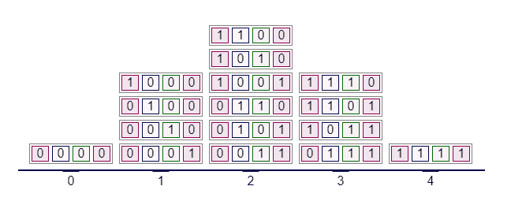
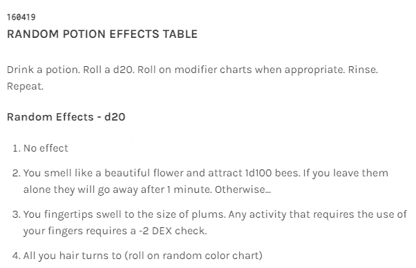
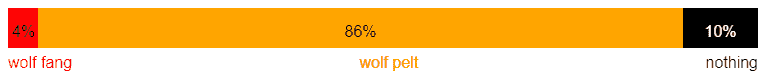

# RNG 含义——RNG 在游戏中代表什么？

> 原文：<https://www.freecodecamp.org/news/rng-meaning-what-does-rng-stand-for-in-gaming/>

如果游戏中的一切都是可预测的，那就没什么意思了。RNG 或随机数生成器是一种引入随机性和因果关系的方式，你需要增加它的味道。

在这篇文章中，我们将了解随机数生成器是如何工作的。

## 模拟随机数发生器如何工作

RNG 最简单的形式是掷骰子或掷硬币。

使用单个骰子或硬币意味着每个值出现的概率相同。相反，使用多个骰子或硬币将使最高值和较低值的概率较低，而中间值的概率较高。

已知最古老的桌面游戏，Ur 的皇家游戏使用四个四面骰子。每个骰子可以给出 0 或 1 的值，这意味着通过单次掷骰子获得的值可以从 0 到 4。



All the possible combinations obtained by throwing 4 dice, each can give a value of 0 or 1

有 16 种可能的组合，其中 1 给出值 0，4 给出值 1，6 给出值 2，4 给出值 3，1 给出值 4。

在这种情况下，有 1/16 或 6.25%的机会获得 0，1/4 或 25%的机会获得 1，3/8 或 37.5%的机会获得 2，1/4 或 25%的机会获得 3 和 1/16 或 6.25%的机会获得 4。

更复杂的游戏有满满一桌子的手册来随机决定一些事情。



Part of a table for random effects after drinking a potion. [Here's the whole table](https://luetkemj.github.io/160419/random-potion-effects-table).

任何使用骰子的游戏都有一个模拟随机数发生器。

## 视频游戏中随机数发生器的工作原理

在电子游戏中，RNG 不太明显，也更复杂，玩家可能甚至意识不到它们的存在。有很多种方法可以生成一个随机数，但是你实际上是如何使用的呢？

用最简单的术语来说，使用 RNG 和你在上面看到的用掷骰子来决定一张桌子的效果没有什么不同。你只是没看到骰子的投掷。

在视频游戏中，你可以使用 RNG 来确定倒下的敌人可能会掉落什么样的战利品，或者你可以在箱子中找到什么，或者什么样的随机遭遇将等待着你，甚至是天气将会如何。

例如，RNG 被用来实现开放世界游戏，而不需要开发者对森林、道路和沙漠的每一部分进行编码。相反，开发人员编写了一些可能性，并让机会决定当玩家到达地图中的某个点时会发生什么。

你会遇到一只熊，一群狼，或者一些强盗吗？这个游戏通过掷骰子来决定。

让我们看看如何编写一个随机数生成器的简单示例，以便更好地理解它们实际上是如何工作的。

## 如何编写随机数生成器

大多数编程语言都包含一个`random`函数。这个函数返回一个随机数，什么样的随机数取决于它的实现。

比如在 [JavaScript](https://www.freecodecamp.org/news/javascript-math-random-method-explained/) ， [`Math.random()`](https://www.freecodecamp.org/news/javascript-math-random-method-explained/) 中，返回一个介于 0(含)和 1(不含)之间的随机数。在 Python 中，`random`模块的`randint`返回一个范围内的整数(Python 也有一个函数，与 JavaScript 的`Math.random`功能相同)。

让我们来考虑一个非常常见的视频游戏场景:我们有一个敌人，他经常掉一个普通的物品，但偶尔也会掉一些罕见的东西。例如，这个敌人可能是一只会掉狼皮(普通)或狼牙(罕见)的狼。

你如何确定什么是“稀有”？这取决于你——可能 10 滴中有 1 滴是稀有物品，或者 100 滴中有 1 滴是稀有物品。对于稀有物品来说，中庸之道可能是 25 分之一的几率。更复杂的是，也有十分之一的几率没有任何物品。

在这种情况下，您需要一个返回值介于 0 和 1 之间的函数。

25 分之一的几率是 4%，10 分之一的几率是 10%。在十进制形式中，分别为 0.04 和 0.1。

在这种情况下，您可以说 0 到 0.04 范围内的数字表示稀有物品，0.9 到 1 范围内的数字表示无物品。



The percentage breakdown of the wolf drop

为了避免拘泥于一种语言，让我们先来看看如何使用[伪代码](https://www.freecodecamp.org/news/what-is-pseudocode-in-programming/)对此进行编码。这不是真正的编程语言，而是一种分解代码逻辑的方式。这就像记笔记一样，因为它是个人的，并且会根据写它的人的不同而有不同的语法。

```
FUNCTION wolfDrop
  randomNumber = random(0,1)
  IF
    randomNumber < 0.04
    THEN
     -> wolf fang
  ELSE IF
    randomNumber < 0.9
    THEN
     -> wolf pelt
  ELSE
    -> empty
  END IF
END FUNCTION
```

或者更详细的版本:

> 创建一个名为`wolfDrop`的函数，并在其中的`randomNumber`变量中存储一个介于 0(包含)和 1(不包含)之间的随机数。如果`randomNumber`的值小于`0.04`，掉落的将是狼牙，否则如果`randomNumber`的值小于`0.9`，掉落的将是狼皮，否则不会掉落。

有了伪代码，我们可以用任何语言实现代码片段。例如，让我们看看如何用几种不同的语言对其进行编码:

```
function wolfDrop () {
  const randomNumber = Math.random();
  if (randomNumber < 0.04) {
    return "Wolf fang";
  } else if (randomNumber < 0.9) {
    return "Wolf pelt";
  } else {
    return;
  }
}
```

JavaScript

```
import random
def wolfDrop():
  randomNumber = random.random()
  if randomNumber < 0.04:
    return "Wolf fang"
  elif randomNumber < 0.9:
    return "Wolf pelt"
  else
    return
```

Python

```
(defn wolf-drop []
  (let [random-number (rand)]
    (cond (< random-number 0.04) "Wolf fang"
          (< random-number 0.9) "Wolf pelt")))
```

Clojure

```
func wolfDrop() string {
    randomNumber := rand.Float64()
    switch {
        case randomNumber < 0.04:
            return "Wolf fang"
        case randomNumber < 0.9:
            return "Wolf pelt"
        default:
            return ""
    }
}
```

Golang

```
fun wolfDrop(): String {
    val randomNumber = Random.nextFloat()
    when {
        randomNumber < 0.04 -> return "Wolf fang"
        randomNumber < 0.9 -> return "Wolf pelt"
        else -> return ""
    }
}
```

Kotlin

```
def wolf_pelt() do
  random_number = :rand.uniform()
  cond do
    random_number < 0.04 -> "Wolf fang"
    random_number < 0.9 -> "Wolf pelt"
    true -> nil
  end
end
```

Elixir

```
string WolfPelt() {
  var random = new Random();
  double randomNumber = random.NextDouble();
  if (randomNumber < 0.04) return "Wolf fang";
  if (randomNumber < 0.9) return "Wolf pelt";
  return null;
}
```

C#

```
extern crate rand;

fn wolf_drop() -> &'static str {
  let random_number: f64 = rand::random();
  if random_number < 0.04 {
    "Wolf fang"
  } else if random_number < 0.9 {
    "Wolf pelt"
  } else {
    ""
  }
}
```

Rust

```
#include <stdlib.h>
#include <string.h>
#include <time.h>

int wolf_drop(char *drop_item) {
  srand((unsigned) time(0));
  double random_number = 1.0 * rand() / RAND_MAX;
  if (random_number < 0.04) {
    strncpy(drop_item, "wolf fang\0", 10);
  } else if (random_number < 0.9) {
    strncpy(drop_item, "wolf pelt\0", 10);
  } else {
    strncpy(drop_item, "\0", 1);
  }
  return 0;
}
```

C

```
function wolfdrop()
    randomnumber = rand()
    if randomnumber < 0.04
        return "wolf fang"
    elseif randomnumber < 0.9
        return "wolf pelt"
    else
        return ""
    end
end
```

Julia

(感谢 [alpox](https://forum.freecodecamp.org/u/alpox) 提供 Clojure、Golang、Kotlin、Elixir 和 C#中的代码片段，感谢 [Jeremy](https://www.freecodecamp.org/news/author/jeremylt/) 提供 Rust、C 和 Julia 中的代码片段。)

### math.random 的其他例子

如果你想进一步了解这些，你可以阅读这篇关于 JavaScript 中的 [Math.random 函数的文章，并创建一个掷骰子游戏。](https://www.freecodecamp.org/news/how-to-use-javascript-math-random-as-a-random-number-generator/)

你也可以阅读这篇关于使用随机漫步算法的文章，并用 JavaScript 创建一个随机地牢地图，用 RNG 做更多的实验。

## 结论

随机数发生器，或 RNG，在许多游戏中使用。在本文中，您了解了如何以及为什么使用它们，并且看到了一个示例实现。

下次你玩电子游戏时，你能发现 RNG 可能被用在哪里吗？