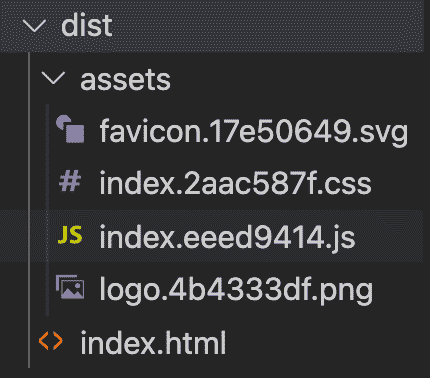
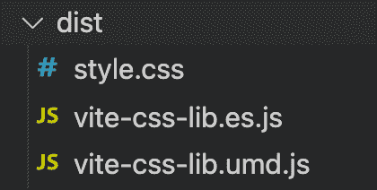
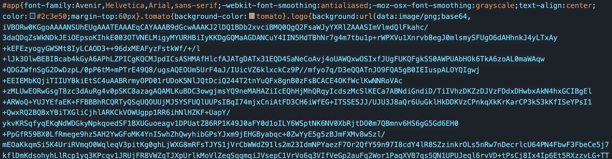
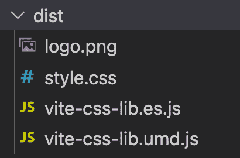

# 如何用 Vite.js 构建 CSS 库

> 原文：<https://www.freecodecamp.org/news/build-a-css-library-with-vitejs/>

构建 CSS 库可能看起来像是出于纯粹的好奇，只是为了学习和探索。但它可以比这多得多。

我见过定制的 CSS 库在任何地方使用，从大型组织到斗志昂扬的年轻创业公司。

## 什么是 CSS 库？

你可以把 CSS 库想象成一个可以跨多个项目使用的主题。如果您不想每次都重复样式或复制粘贴您的代码，这将很有帮助。如果你想让你的网络应用保持一致(这对你的品牌有好处)，这也很有用。

因此，一个共享的 CSS 库/主题将提高你的效率和开发速度，它可以帮助你在保持一致性的同时扩展你的产品。这也可以是更广泛的[设计系统](https://www.robertcreative.com/blog/what-is-a-design-system)的一部分。

这篇文章的重点是构建 CSS 库，而不是设计它的样式。输出将是一个概念类似于 [bootstrap](https://getbootstrap.com/) 的库，其中您可以使用 CSS 类和样式相关的 HTML 元素。

那么如何才能建立这样的库，需要使用哪些工具呢？

下面是我们将构建的内容的摘要:

*   使用 Vite 创建库版本，而不是 web 应用程序版本
*   处理 CSS 文件中使用的静态资产
*   构建库时使用 SASS 而不是 CSS
*   用 npm 打包库

## 如何设置项目

我们将使用 [Vite](https://vitejs.dev/) 来构建我们的 CSS 库。然后我们再用 npm 打包，最后用在一个新的前端项目中。

Vite 是一个开发服务器和构建工具，它使实现 web 项目成为一种快速而流畅的体验。

按照以下步骤开始:

*   运行`npm init @vitejs/app`
*   输入项目名称
*   选择一个框架(Vanilla、Vue、React 等。)–这里我们将选择“香草”，因为我们关注的是 CSS

这个项目的入口是 index.html。我们可以用这个文件来测试我们正在构建的东西。但是它不会被打包成我们正在创建的库的一部分。

### 如何更新样板代码

首先，让我们整理现有的样板代码。

我们将更新 HTML 文件，使其包含一个按钮和一个背景中带有徽标的 div 文件，如下所示:

```
<!DOCTYPE html>
<html lang="en">
  <head>
    <meta charset="UTF-8" />
    <link rel="icon" type="image/svg+xml" href="favicon.svg" />
    <meta name="viewport" content="width=device-width, initial-scale=1.0" />
    <title>Vite App</title>
  </head>
  <body>
    <div id="app">
      <div class="logo"></div>
      <button class="tomato">Click me</button>
    </div>
    <script type="module" src="/src/main.ts"></script>
  </body>
</html> 
```

然后，在“src”目录下，删除 main.ts 文件的内容，保留导入`style.css`的第一行

接下来，在`style.css`文件中，添加以下代码:

```
.tomato {
background-color: tomato;
}
.logo {
background: url(/logo.png) no-repeat;
height: 300px;
} 
```

我们需要复制项目的根文件夹下的 logo.png 文件(随意使用任何其他图像代替 logo.png，并相应地改变高度)。

## 如何建立我们的 CSS 库

在创建构建之前，让我们在本地运行应用程序。在您的终端中:

*   导航到项目的根文件夹
*   运行`npm install`来安装项目依赖项
*   运行`npm run dev`启动本地服务器

在浏览器中打开应用程序: [http://localhost:3000](http://localhost:3000) (通常，它在端口 3000 上，除非该端口已被另一个应用程序使用)。

现在是构建项目的时候了，所以只需键入`npm run build`。这将创建一个包含以下文件的`dist`文件夹:



### 如何配置构建

生成的文件夹看起来像是需要托管和服务的 web 应用程序的构建。但是我们想建一个图书馆。因此，我们需要添加一些配置来实现这一点:

在项目的根级别，创建一个新文件`config.vite.js`:

```
import { defineConfig } from "vite";
import path from "path";

module.exports = defineConfig({
build: {
    lib: {
    entry: path.resolve(__dirname, "src/main.ts"),
    name: "MyCssLib",
    },
},
}); 
```

再次运行`npm run build`。请注意 dist 文件夹的新结构:



在这种情况下，包中不再有 HTML 文件，我们的样式仍然在 styles.css 文件中。但是你会看到我们在 CSS 文件中引用的 logo 文件已经不存在了。

这里发生的事情是，Vite 将资产内联为 base64 数据 URL。因此，使用这个新的 CSS 文件仍然可以正常工作，类似于引用资产文件:



这很酷，但是在较大的项目中，如果 CSS 文件有多个被引用的资源，它可能会变得非常大。

### 如何处理资产

Vite 提供了一种简单的方法来处理资产，其中您保留相同的文件，CSS 中引用的路径仍然有效。

在项目的根目录下，创建一个`public`文件夹，并将`logo.png`文件移入其中。本地 web 应用程序仍将识别该徽标(检查这是否仍能在 [http://localhost:3000](http://localhost:3000) 上工作)。

再次运行`npm run build`。新的 dist 文件夹将如下所示:



请注意，徽标文件仍然在根级别。如果您打开 CSS 文件，它将引用相同的徽标文件。

这里有一个包含所有资产的资产文件夹很方便。您可以在`public`目录下创建该文件夹。记住更新 CSS 文件中资产的路径(在本例中是从`/logo.png`到`/assets/logo.png`)。

### 如何使用 SASS 进行造型

开发人员经常使用 [SASS](https://sass-lang.com/) 进行样式设计，因为它提供了很大的灵活性和组织性。Vite 开箱即用地处理 SASS。让我们来看看:

通过运行`npm install sass`安装 SASS。在“src”文件夹下，将`style.css`文件的名称改为`style.scss`

接下来，向`style.scss`文件添加一些 SASS 更改。例如，使用颜色变量:

```
$color: tomato;

.tomato {
background-color: $color;
} 
```

然后您将更新“main.ts”文件以指向`style.scss`而不是`style.css`。

运行`npm run build`创建一个新的构建，并检查在“dist”文件夹中生成的“style.css”文件——它具有正确的 css:

```
.tomato{background-color:tomato} 
```

## 如何打包库

现在是时候打包库了(dist 文件夹中生成的任何东西)。我们将使用 npm 来做到这一点。

首先，您需要更新“package.json”文件，以包含一个名为`files`的新属性。根据 [npm 文档](https://docs.npmjs.com/cli/v7/configuring-npm/package-json#files),`files`字段是一个文件模式数组，它描述了当您的软件包作为依赖项安装时要包含的条目。

我们只需要打包生成的 CSS 文件，所以“package.json”文件中的附加条目将是`files: [dist/style.css]`。

接下来，您将运行`npm pack`。这将创建一个新文件。本例中为“vite-CSS-lib-0.0.0.tgz”。

### 如何使用该软件包

首先创建一个新项目(您可以用与我们从 Vite 开始时相同的方式来完成)。完成后，请遵循以下步骤:

*   安装新创建的包:`npm install <path-to-lib>/vite-css-lib-0.0.0.tgz`
*   在您的“main.js”文件中，导入 CSS 文件:`import 'node_modules/vite-css-lib/dist/style.css`
*   在“index.html”文件中，添加一个带有“tomato”类的按钮:`<button class="tomato">Submit</button>`

运行您的应用程序。它应该有一个番茄背景颜色的按钮。

## 图书馆需要改进的地方

当然，这不是一个成品——它总是可以改进的。

您可以从导出 SASS 文件而不是编译的 CSS 文件开始，这样依赖于您的库的应用程序可以直接使用 SASS。你可以通过一个 Vite/Rollup 插件:`https://vitejs.dev/guide/api-plugin.html`

此外，当您使用 npm 打包库时，package.json 中的所有内容都将包含在包中。您可以整理 package.json 文件以停止包含任何不必要的脚本/依赖项。你可以在这里阅读更多关于[如何做到这一点。](https://stackoverflow.com/questions/48802204/npm-publish-removing-scripts-from-package-json)

最后，用一个 JS 文件建立一个包，该包导出创建的 CSS 文件，以便能够导入库，而不必引用 node_modules/lib/style.css。

我希望这篇文章是有帮助的。你将如何加强这一过程？你将如何构建一个 CSS 库？