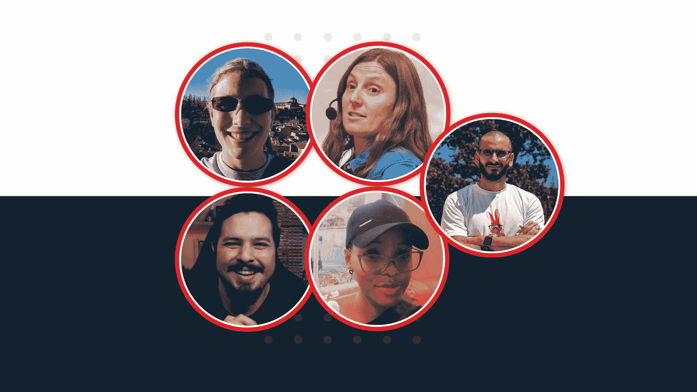

# 如何成为 GitHub 明星——来自 GitHub 明星的建议

> 原文：<https://www.freecodecamp.org/news/github-stars-answer-the-communitys-most-asked-questions/>

自从我在 2020 年成为 GitHub 明星和 [GitHub 年度明星](https://stars.github.com/profiles/eddiejaoude/)后，很多人问我他们如何才能成为一个。

没有明确的清单，你不能申请或提名自己。但是 GitHub 明星计划网站在审查他们收到的提名时，提供了一些有用的见解，让他们了解 GitHub 在明星身上寻找什么。

因此，虽然我无法给出这个问题的精确答案，但我邀请了几位 GitHub 明星与我一起分享他们的经历。

我有幸与以下人士交谈:

*   来自德国的 Gina hage，OctoPrint 的创造者和维护者
*   来自巴西的 Mario Souto 是 YouTube 上的 DevSoutinho
*   来自尼日利亚的后端开发人员 Ruth Ikegah
*   来自西班牙的 Debbie O'Brien 是 Bit 的首席开发者顾问。

From top left: Gina Häußge, Debbie O'Brien, Eddie Jaoude, Ruth Ikegah and Mario Souto

## 这些 GitHub 明星是谁？

我已经在我们专门的 Slack 频道和这些明星聊了一年多了，我很想多了解一些他们的背景。

对于吉娜来说，全职工作于她的项目[octo print](https://octoprint.org)——该项目自 2016 年以来完全由其用户群众筹——是一种令人惊叹的感觉。尤其是因为为 3D 打印机创建这个网络界面是从一个宠物项目开始的。

至于马里奥，他在 Nubank(拉丁美洲最大的金融科技银行)担任软件工程师的工作让他非常忙碌。但他仍然抽出时间通过他的 YouTube 频道建立了一个社区，在那里他喜欢教授和分享他的经验，告诉你如何才能推进你的职业生涯。

在被一位设计师朋友说服在疫情期间学习 Python 之后，Ruth 成为了开源的超级粉丝并为之做出了贡献。

来自 sunny Palma de Mallorca，Debbie 通过建立开源社区和让更多人参与到这个领域来帮助开发人员学习如何编码。

至于我，一个开源全栈和 DevRel 专家，我创建了 [EddieHub](https://www.eddiehub.org) :一个旨在鼓励和促进在包容和友好的环境中交流、最佳实践和技术专长的社区。

如你所见，没有一颗 GitHub 星是相同的。我们在科技领域的起步也千差万别，是灵感的来源。

我在大学学的是电子工程，对我来说，编程是在看了我的第一次黑客马拉松后开始的爱好。另一方面，吉娜——小时候父亲给了她一台电脑，并建议她“这不是玩具”——在大学里学习计算机科学。

Debbie 的工作范围很广，从西班牙舞台上的艺人，到教师，然后回到全日制学习，这样她就可以在一路上学到的 HTML 和 CSS 技能的基础上发展自己的 JavaScript 技能。

对于 Ruth 来说，她在微生物学方面的背景意味着她将与动物打交道作为她的“日常工作”，但是为开源做出贡献已经成为一种激情，Ruth 已经发现了一些语言可以如何应用于生物科学。

最后，对于马里奥来说，这一切都是从多人在线角色扮演游戏胫骨开始的，这使他在学习英语的同时为这个游戏社区做出了贡献。从那以后，他继续参加许多科技活动来提升自己的知识，并开设了自己的 YouTube 频道，在那里分享他的发现。

所以，如果我们不能回答你如何才能成为一个 GitHub 明星，也许我们的旅程和经历可以给你一些启示，如果你希望成为一个的话。

## 你会给一个有抱负的 GitHub 明星什么建议？

Debbie 分享道，任何渴望成为 GitHub 明星的人都应该考虑到，这是关于将他人置于自己之前并分享你的知识。

在露丝看来，她觉得为自己创造一个利基(在她的情况下，公开演讲)有助于她成为明星。

我的想法是，这两个因素是最佳组合:无论你在你的旅程中处于什么位置，在公共场合分享和学习都将帮助那些可能落后或刚刚起步的人。

所有 GitHub 明星都有一点是真的:我们做什么都不是为了成为明星。

用 Gina 自己的话说，无论你是在 YouTube 上分享你的知识，还是为开源项目做贡献，你都需要有“内在的动力”来做这些事情，而不是为了得到认可。

支持社区是最重要的。问题应该是，**我怎样才能帮助社区？**(而不是我怎么才能成为 GitHub 明星？)

## 成为 GitHub 明星如何帮助你为社区做贡献？

关于为社区做贡献的话题，很多人都很好奇成为 GitHub 明星是否帮助他们为社区做了更多的事情。

就我个人而言，我发现随着我的工作越来越为人所知，我能够收到更多的反馈。这反过来帮助我加快了学习速度，因为我接触到了以前从未想过的不同观点和想法。

鉴于 GitHub Stars 计划通过提名来运作，被选为明星给了 Debbie 一种被认可的感觉:社区认为她的工作是有意义的，她花在帮助人们上的所有时间都是值得的。

Gina 将是第一个说 3D 打印是一个利基领域的人。成为一名 GutHub 明星实际上让她走出了这个小圈子，扩大了她可以帮助的人的范围。

在 Gina 的案例中，她希望通过成为 GitHub 明星，她将作为开源领域的女性维护者获得更多的关注，并证明这对于年轻女性来说是一个令人兴奋和可行的职业选择。

## 你在成为 GitHub 明星的过程中有导师吗？

我们都没有打算成为 GitHub 明星。这是一个令人难以置信的荣誉，也是我们的工作和我们正在建设的社区的一个极好的平台，但没有人能教你如何成为一个这样的人。

事实上，黛比觉得这个问题需要重新表述为:“在你的旅程中，在你最终成为 GitHub 之星的旅程中，你有导师吗？”

答案是肯定的！无论是我们直接团队中的工作人员，还是刚刚开始旅程并提供新观点的社区成员。这些人教会了我们，引导我们用不同的方式去看待事物。

实际上，我不喜欢每个人只有一个导师的想法。认为你将从一个人那里学到你需要知道的一切，而那个人将是打开所有大门以促进你职业生涯的人，这似乎是不合理的。

在我看来，我们每个人一生中都有几个导师，他们每个人都对我们的知识和经历做出不同的贡献。

然而，在 Gina 看来，无论谁指导或教导你，最终都是你对开源的热情和对学习的热爱驱动着你——而不是其他任何人灌输给你的。

## 当你成为 GitHub 明星后，人们对你的看法或想法有所改变吗？

虽然我们这些明星还没有在街上被认出来…但是成为 GitHub 明星让我们的社区工作走到了最前沿。

在黛比看来，这给了明星们一个继续这项社区工作的平台，这是无价的。

被授予 GitHub Star 徽章的曝光意味着 Gina 已经能够潜入 3D 打印利基之外的不同领域。通过涉足新的领域，这给了她申请在会议上做更多演讲的信心。

在马里奥看来，这是一个与来自不同国家的人接触的机会，这代表了一个显著的不同。了解节目中的其他明星让他见识了很多他以前不知道的有趣的项目。

## 那么，GitHub 明星们的下一步是什么？

在不久的将来,“在现实世界中”相遇的机会将会是惊人的——无论在哪里！

总的来说，我们将继续在开源方面做更多的工作，在那里我们可以分享我们的知识并为社区做出贡献。总而言之，我们将“继续做我们正在做的事情”。

如果你想从这些 GitHub 明星身上学到更多，可以看看我关于如何成为 GitHub 明星的视频:

[https://www.youtube.com/embed/ahYUIGVgfJ8?feature=oembed](https://www.youtube.com/embed/ahYUIGVgfJ8?feature=oembed)