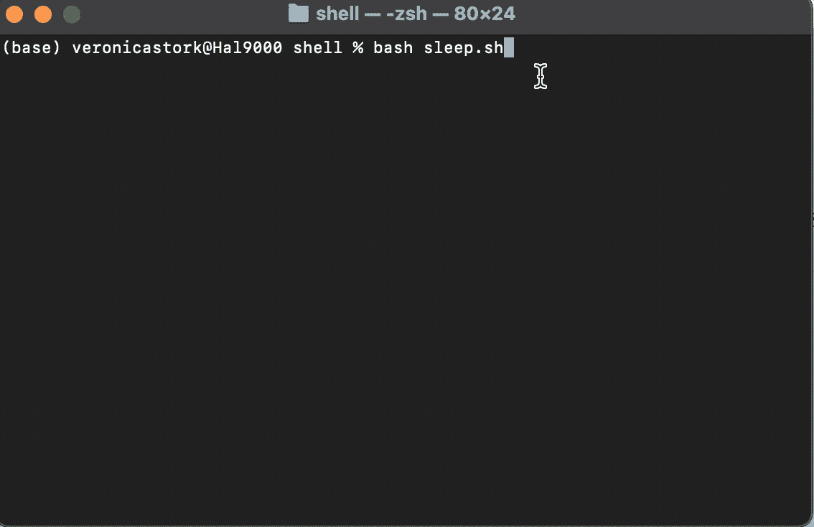

# bash Sleep——如何让 Shell 脚本等待 N 秒(示例命令)

> 原文：<https://www.freecodecamp.org/news/bash-sleep-how-to-make-a-shell-script-wait-n-seconds-example-command/>

当您编写一个 shell 脚本时，您可能会发现您需要等待一定的时间才能继续。例如，您可能希望脚本在进程完成时或在重试失败的命令之前等待。

为此，您可以使用非常简单的`sleep`命令。

## 如何使用 Bash Sleep 命令

`Sleep`是一个非常通用的命令，语法非常简单。就像敲`sleep N`一样简单。这将使你的脚本暂停`N`秒，其中`N`可以是正整数，也可以是浮点数。

考虑这个基本的例子:

```
echo "Hello there!"
sleep 2
echo "Oops! I fell asleep for a couple seconds!"
```

该脚本的结果将如下所示:



类似地，您可以使用浮点数来表示秒的分数。例如，`sleep .8`将暂停您的脚本 0.8 秒。

`sleep`命令的基本用法就是这样！

## 使用睡眠命令时要记住什么

`Sleep`的默认时间单位是**秒**，这就是为什么我们在上面的例子中不需要指定单位。

在某些类型的机器上(即 BSD 系统和 MacOS)，唯一支持的*时间单位是秒。其他类似 Unix 的操作系统可能支持以下时间单位:*

*   `s`:秒
*   `m`:分钟
*   `h`:小时
*   `d`:天数

也可以在`sleep`命令中使用多个参数。如果包含两个或更多数字，系统将等待相当于这些数字总和的时间。

例如，`sleep 2m 30s`将创建一个 2 分半钟的暂停。注意，为了在 MacOS 或 BSD 机器上获得相同的结果，您将运行等效的命令`sleep 150`，因为 2 分 30 秒等于 150 秒。

## 结论

`sleep`命令是在 Bash 脚本中添加暂停的一种有用方式。与其他命令配合使用，`sleep`可以帮助您创建定时提醒，以正确的顺序运行操作，间隔连接到网站的尝试，等等。因此，将这个简单而强大的工具放入您的 Bash 工具箱并编写代码吧！