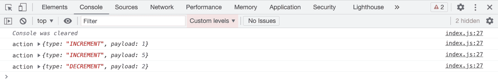
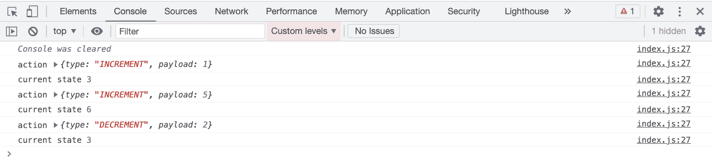

# Redux 中间件——它是什么以及如何从头开始构建它

> 原文：<https://www.freecodecamp.org/news/what-is-redux-middleware-and-how-to-create-one-from-scratch/>

在本文中，我们将探索 Redux 中的中间件是什么，为什么使用它，以及如何从头开始创建自己的中间件。

所以让我们开始吧。

## 什么是 Redux 中间件？

Redux 中间件允许您拦截发送给 reducer 的每个动作，这样您就可以更改动作或取消动作。中间件帮助你进行日志记录、错误报告、异步请求等等。

看看下面的代码:

```
import React from "react";
import ReactDOM from "react-dom";
import { createStore } from "redux";

const reducer = (state = 0, action) => {
  switch (action.type) {
    case "INCREMENT":
      return state + action.payload;
    case "DECREMENT":
      return state - action.payload;
    default:
      return state;
  }
};

const store = createStore(reducer);

store.subscribe(() => {
  console.log("current state", store.getState());
});

store.dispatch({
  type: "INCREMENT",
  payload: 1
});

store.dispatch({
  type: "INCREMENT",
  payload: 5
});

store.dispatch({
  type: "DECREMENT",
  payload: 2
});
```

这里有一个[代码沙盒演示](https://codesandbox.io/s/focused-cori-h9iwo)。

如果你想一步一步地理解上面的代码是如何工作的，可以看看我的 [Redux for 初学者](https://www.freecodecamp.org/news/redux-for-beginners/)的文章。

正如我在那篇文章中解释的那样，`createStore`函数接受三个参数:

*   第一个参数是一个函数，通常称为 reducer 必选参数
*   第二个参数是状态的初始值——可选参数
*   第三个参数是中间件——可选参数

## 如何在 React 中创建中间件

要创建一个中间件，我们首先需要像这样从 Redux 导入`applyMiddleware`函数:

```
import { applyMiddleware } from "redux";
```

假设我们正在创建一个`loggerMiddleware`。然后，为了定义中间件，我们需要使用以下语法:

```
const loggerMiddleware = (store) => (next) => (action) => {
  // your code
};
```

上面的代码等效于下面的代码:

```
const loggerMiddleware = function (store) {
  return function (next) {
    return function (action) {
      // your code
    };
  };
};
```

一旦创建了中间件函数，我们就像这样把它传递给`applyMiddleware`函数:

```
const middleware = applyMiddleware(loggerMiddleware); 
```

最后，我们将中间件传递给`createStore` 函数，如下所示:

```
const store = createStore(reducer, middleware);
```

尽管我们上面提到中间件是`createStore` 函数的第三个参数，但第二个参数(初始状态)是可选的。因此基于参数的类型，`createStore` 函数自动识别出传递的参数是一个中间件，因为它具有嵌套函数的特定语法。

下面是上面代码的更新的[代码沙盒演示](https://codesandbox.io/s/recursing-heyrovsky-q8zl7?file=/src/index.js)。

在上面的代码沙盒演示中，`loggerMiddleware`看起来像这样:

```
const loggerMiddleware = (store) => (next) => (action) => {
  console.log("action", action);
  next(action);
};
```

下面是上面代码沙盒演示的[预览链接](https://q8zl7.csb.app/)。

如果你检查控制台，你会看到如下输出:


在动作被分派到商店之前，中间件被执行，因为我们可以看到动作被记录到控制台。因为我们通过传递动作来调用`loggerMiddleware`中的`next`函数，所以 reducer 也将被执行，这导致了存储中的变化。

现在，如果我们不调用`loggerMiddleware`里面的`next`函数会怎么样？

则动作不会被发送到 reducer，因此存储不会被更新。

如果你使用过 Node.js，那么你可能会发现它类似于中间件在 Node.js 中的工作方式。

在 Node.js 中间件中，如果我们不调用 *next* 函数，请求将不会被转发。

这里有一个[更新的代码沙盒演示](https://codesandbox.io/s/dry-dew-6ybfy?file=/src/index.js)，去掉了*下一个*函数调用。

```
const loggerMiddleware = (store) => (next) => (action) => {
  console.log("action", action);
};
```

下面是上面代码沙盒演示的[预览链接](https://6ybfy.csb.app/)。

如果你检查控制台，你会看到如下输出:



如您所见，我们只将操作记录到控制台。并且由于动作没有被转发到 reducer，所以不会被执行——所以我们看不到`store.subscribe` 函数中的`console.log`。

如前所述，我们可以在动作被发送到缩减器之前修改来自中间件的动作。

这里有一个[更新的代码沙盒演示](https://codesandbox.io/s/currying-cherry-nuupf?file=/src/index.js)，在它被发送到 reducer 之前，我们改变了动作的有效负载。

中间件的代码如下所示:

```
const loggerMiddleware = (store) => (next) => (action) => {
  console.log("action", action);
  action.payload = 3;
  next(action);
};
```

下面是上面代码沙盒演示的[预览链接](https://nuupf.csb.app/)。



根据代码，一旦操作被记录到控制台，我们就将操作有效负载的值设置为 3。因此动作`type`保持不变，但`payload`发生了变化。

所以我们看到最初的状态改成了 3。然后它又增加了 3，也就是 6。最后，它递减 3，使最终状态值为 3。

在动作被发送到缩减器之前，我们的`loggerMiddleware`被调用，在那里我们改变有效载荷值，在它被发送到缩减器之前，我们总是把它设置为 3。因此，根据动作类型“增量”或“减量”,缩减量将始终以值 3 进行更改。

即使我们改变了上面代码中的动作，在这种情况下也没有问题，因为它是一个中间件，而不是一个缩减器。

> 减速器应该是一个纯函数，我们不应该对减速器内部的状态和动作做任何改变。你可以在我的[掌握 Redux 课程](https://master-redux.yogeshchavan.dev/)中详细了解。

在上面的代码示例中，我们创建了一个中间件。但是你可以创建多个中间件，并把它们传递给`applyMiddleware` 函数，如下所示:

```
const middleware = applyMiddleware(loggerMiddleware, secondMiddleware, thirdMiddleware); 
```

在`applyMiddleware`函数中提到的所有中间件将被一个接一个地执行。

## ******感谢阅读！******

本文内容是我[掌握 Redux](https://master-redux.yogeshchavan.dev/) 课程的一个小预告。

如果你想从头开始详细学习 Redux，并与[完整的点餐应用](https://www.youtube.com/watch?v=2zaPDfCKAvM)一起构建 3 个应用，请查看[掌握 Redux](https://master-redux.yogeshchavan.dev/) 课程。

在本课程中，您将学到:

*   基本和高级冗余
*   如何管理数组和对象的复杂状态
*   如何使用多个减速器管理复杂的冗余状态
*   如何调试 Redux 应用程序
*   如何在 React 中使用 Redux 使用 react-redux 库让你的 app 反应性。
*   如何使用 redux-thunk 库处理异步 API 调用
*   使用 Redux 构建 3 个不同的应用程序

还有更多。

最后，我们将从头开始构建一个完整的[订餐应用](https://www.youtube.com/watch?v=2zaPDfCKAvM)，集成 stripe 以接受支付，并将其部署到生产中。

**想要了解关于 JavaScript、React、Node.js 的最新常规内容吗？[在 LinkedIn 上关注我](https://www.linkedin.com/in/yogesh-chavan97/)。**