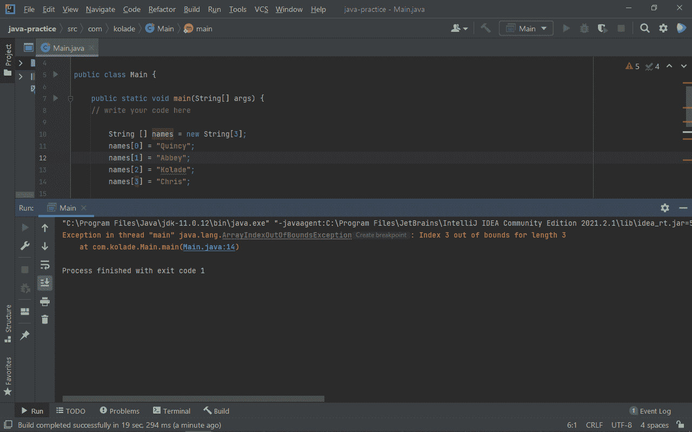
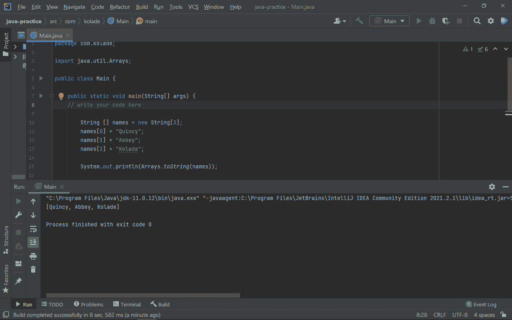
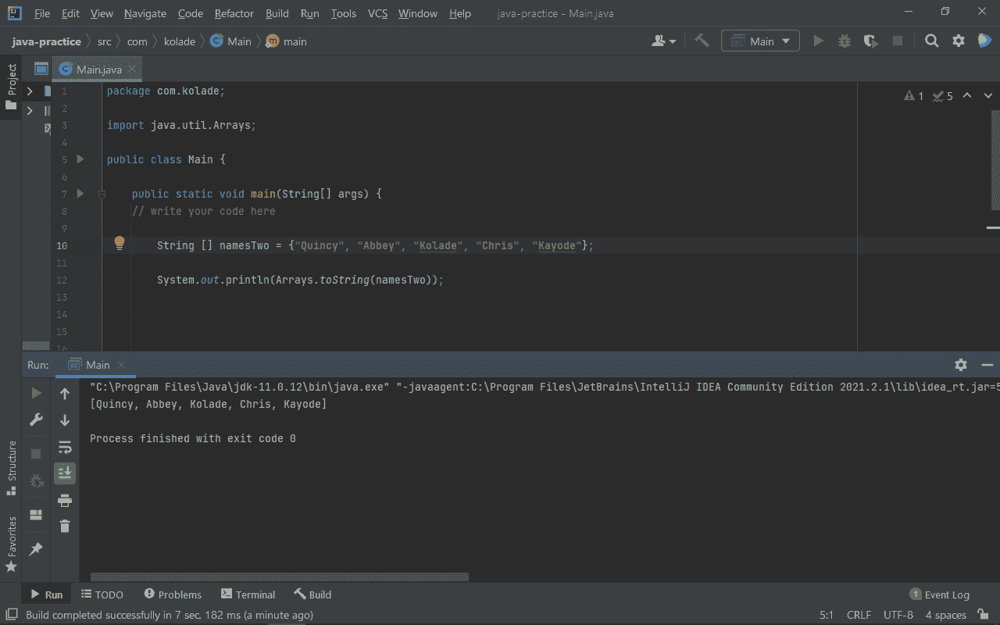
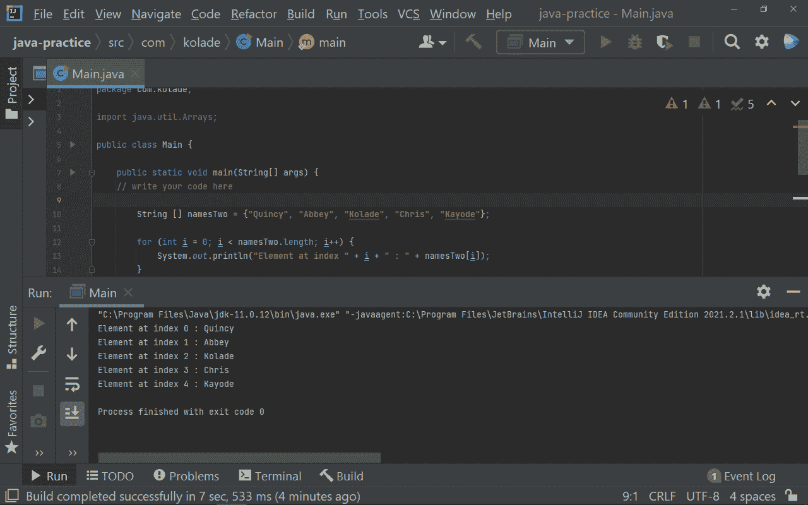
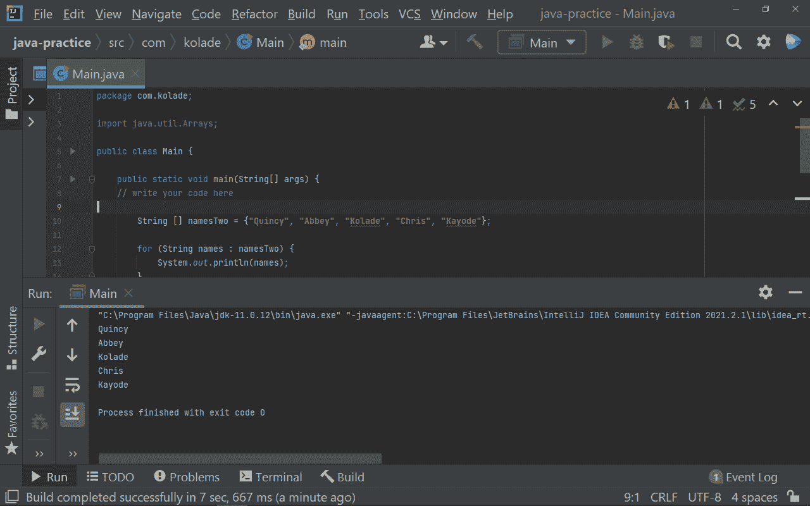

# Java 数组声明——如何用示例代码在 Java 中初始化数组

> 原文：<https://www.freecodecamp.org/news/java-array-declaration-how-to-initialize-an-array-in-java-with-example-code/>

数组是 Java 中基本数据结构的重要组成部分。它们在解决许多编程问题时非常有用。

## 什么是数组？

根据定义，数组是同一类型数据的集合。

一个数组通常被声明为在同一个内存中可以有多个值——不像变量在内存中只能有一个值。

因此，数组允许您创建一个保存不同值的变量，而不是为每个值声明一个变量。

数组中特定数据点的位置称为其索引，而数据本身称为元素。

在本教程中，我将向您展示如何声明一个数组，初始化它，并使用 for 循环和增强的 for 循环遍历它。然后您就可以开始在您的 Java 项目中使用它了。

我将使用 intelliJIDEA IDE 来编写代码。如果您愿意，可以使用它，也可以使用您选择的任何 IDE。

## 如何在 java 中声明和初始化数组

在 Java 中有两种方法可以声明和初始化数组。第一个是使用`new`关键字，您必须一个接一个地初始化这些值。第二种方法是将值放在花括号中。

### 如何用关键字`new`初始化数组

您可以使用下面的语法声明数组:

```
dataType [ ] nameOfArray; 
```

`dataType`:要放入数组的数据类型。这可以是字符串、整数、双精度等等。
`[ ]`:表示要声明的变量将包含一个数组值
`nameOfArrary`:数组标识符。

有了上面的信息，您只需要声明数组——您仍然需要初始化它。

以这种方式初始化数组的基本语法如下所示:

```
dataType [] nameOfArray = new dataType [size] 
```

大小通常用一个数字值来表示。它表示你想在数组中保存多少个值。它的值是不可变的，这意味着您不能在数组中放置超过指定大小的数字。

现在，您可以将值放入数组中，如下所示:

```
package com.kolade;

import java.util.Arrays;

public class Main {

    public static void main(String[] args) {
   // write your code here
String [] names = new String[3];
names[0] = "Quincy";
names[1] = "Abbey";
names[2] = "Kolade";
   }
} 
```

在上面的代码片段中，我初始化了一个名为 names(标识符)的字符串数组。大小为 3，所以只能容纳三个值。

总共有 3 个索引:

*   值`Quincy`位于索引`0`
*   值`Abbey`位于索引`1`
*   值`Kolade`位于索引`2`

不要被数字 0，1，2 迷惑。数组是零索引的，所以计数从 0 开始，而不是从 1 开始。

在上面的数组中，如果您添加额外的数据(例如，`names[3] = “Chris”`),您将会得到一个错误，因为您已经指定数组应该只包含 3 个值。如果你想增加更多的值，你必须增加数组的大小。



要将数组打印到控制台，可以使用内置的`toString()`方法:

```
System.out.println(Arrays.toString(names)); 
```



### 2.如何在一行中初始化一个数组

您可以用下面的基本语法在一行中初始化数组:

```
dataType [ ] nameOfArray = {value1, value2, value3, value4} 
```

使用这种方法，您不需要指定数组的大小，因此您可以将任意数量的值放入其中。

查看以下代码片段中的示例:

```
package com.kolade;

import java.util.Arrays;

public class Main {

    public static void main(String[] args) {
   // write your code here
     String [] namesTwo = {"Quincy", "Abbey", "Kolade", "Chris", "Kayode"};
  }
} 
```

将数组打印到控制台显示如下值:


## 如何在 Java 中循环遍历数组

在 Java 中，可以使用 for 循环和增强的 for 循环来遍历数组。使用 for 循环，您可以访问单个值的索引，但是使用增强的 for 循环，您却不能。

### 如何用`for`循环遍历一个数组

在 Java 中，可以使用基本语法如下的 for 循环:

```
for (dataType i = 0; i < nameOfArray.length; i++) {
    //   Code to execute
} 
```

然后，您可以像这样遍历`namesTwo`数组:

```
package com.kolade;

import java.util.Arrays;

public class Main {

    public static void main(String[] args) {
   // write your code here

        String [] namesTwo = {"Quincy", "Abbey", "Kolade", "Chris", "Kayode"};

        for (int i = 0; i < namesTwo.length; i++) {
            System.out.println("Element at index " + i + " : " + namesTwo[i]);
        }
    }
} 
```



### 如何使用增强的`for`循环遍历数组

增强的 for 循环是 for 循环的一个更干净的版本。缺点是，使用它，您无法访问数组中单个值的索引。

增强型 for 循环的基本语法如下所示:

```
for (dataType variable : nameOfArray) {
    // Code to execute
} 
```

```
package com.kolade;

import java.util.Arrays;

public class Main {

    public static void main(String[] args) {
   // write your code here

        String [] namesTwo = {"Quincy", "Abbey", "Kolade", "Chris", "Kayode"};

        for (String names : namesTwo) {
            System.out.println(names);
        }
    }
} 
```



## 结论

在本教程中，您学习了如何以两种不同的方式声明和初始化数组——使用 new 关键字和使用花括号。

您还学习了如何使用 for 循环和增强的 for 循环遍历数组，因此您不只是初始化一个数组，而对它什么也不做。

感谢阅读，继续编码。