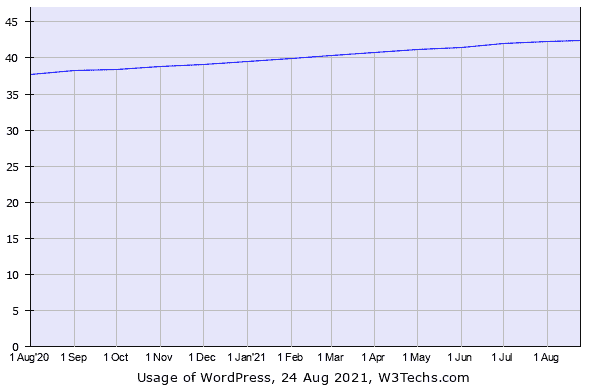
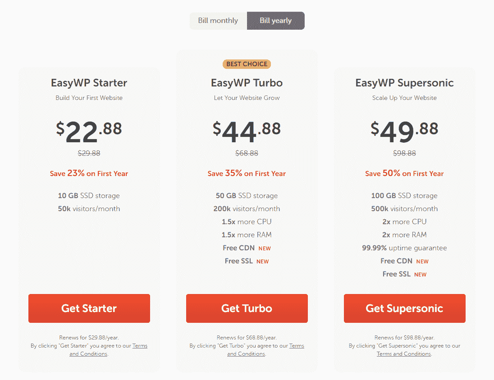
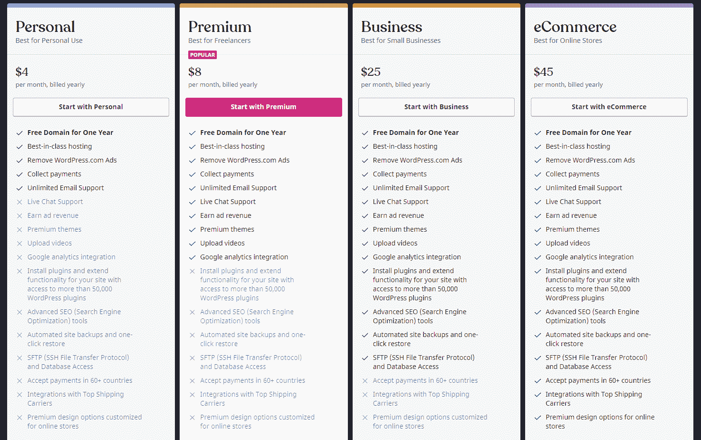
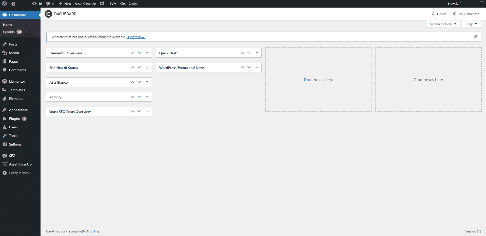
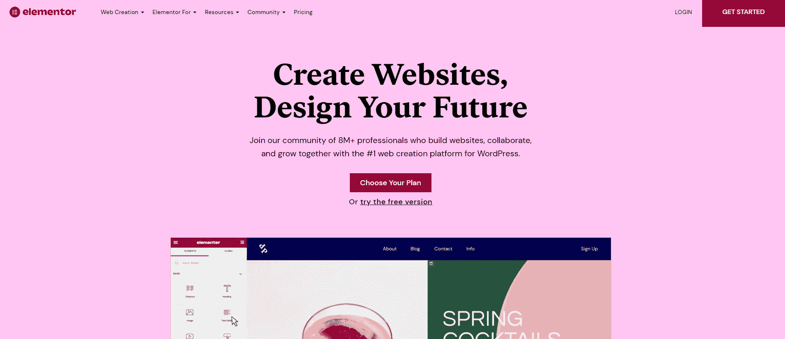
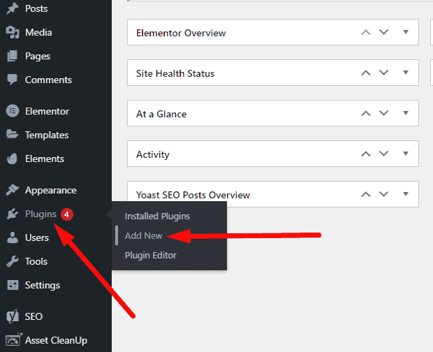
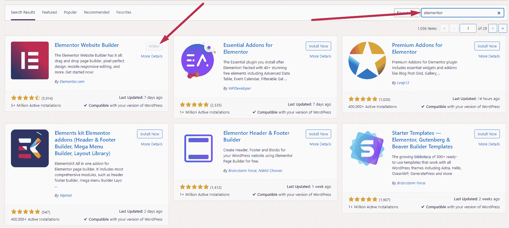
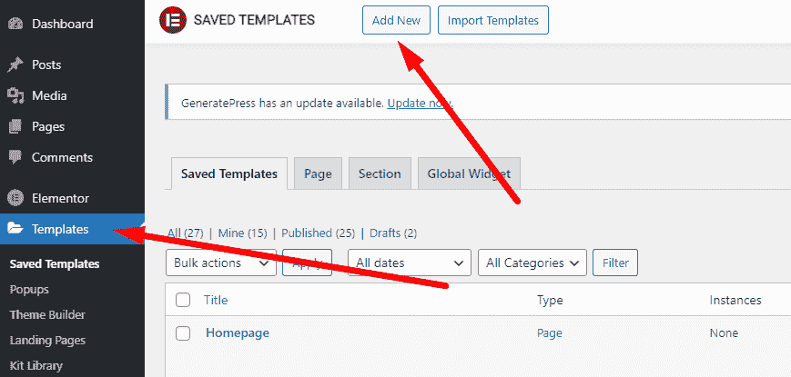
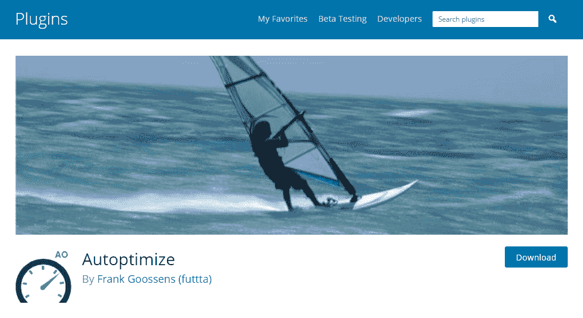
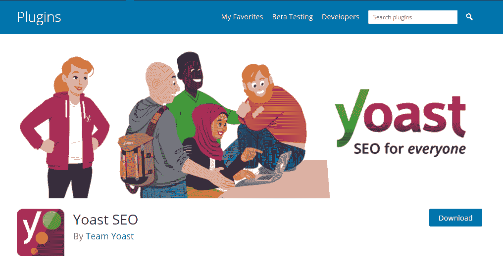

# WordPress 安装指南——如何开始使用 WordPress +最佳插件

> 原文：<https://www.freecodecamp.org/news/how-to-get-started-with-wordpress/>

互联网上超过 40%的网站都是由 WordPress 驱动的，这使得 WordPress 成为创建网站的全球首选。

许多人和企业选择用 WordPress 创建他们的网站，因为它的多功能性、速度和易用性。

WordPress 也是开源的，这意味着任何人都可以永远免费使用和编辑代码。你所需要的只是一个域名和主机提供商，这使得创建一个网站的成本低于一个咖啡和百吉饼套餐。

WordPress 可以在 PHP 和 MySQL 上运行，但是你不需要成为开发者就可以开始使用。因为它是开源的，许多组织在基础平台上构建了插件，这使得任何人都可以轻松地设计网站、创建论坛，甚至建立在线商店，而无需编写一行代码。

当你开始使用时，大多数插件都是免费的，费用会根据使用情况或你需要的额外功能而增加。在文章的后面，我将分享 3 个最流行的 WordPress 插件，它们将帮助你创建一个你想要的网站。

## 基于 WordPress 创建的流行网站

你可能认为 WordPress 只被个人和小企业使用，但这远非事实。

世界上一些最大的新闻出版物选择这个 CMS 和博客平台作为他们网站的基础。像 [TechCrunch](https://techcrunch.com/) 、 [BBC America](https://www.bbcamerica.com/) 和[New York Times](https://www.nytco.com/)这样的网站都使用 WordPress 作为他们的内容管理系统。

甚至白宫的网站也是建立在 WordPress 之上的。

我想指出的是，之前展示的网站使用的是 wordpress.org 上展示的 CMS 版本，而不是 wordpress.com 的版本。

### wordpress.org 和 wordpress.com 有什么不同？

WordPress 允许你下载 WordPress 的源代码，这样你就可以把它安装在你自己的服务器上。另一方面，Wordpress.com 允许你立即创建一个托管在他们平台上的网站。

## 如何开始使用 WordPress

我将介绍 3 种不同的方法来使用 WordPress 建立并运行你的网站。

最便宜的方法是获得一个共享的托管计划，自己建立你的网站。这需要一点技术知识或者谷歌搜索技巧。

最简单但有点贵的开始方式是去做一个专门的 WordPress 托管计划。在这种情况下，你需要做的就是购买一个域名，并将其链接到网站上。

第三种开始的方式是简单地去 wordpress.com 托管的网站。这是清单上最昂贵的选择。

### 开始使用 WordPress 最便宜的方法

这个选项起价为每月 2.32 美元，需要您使用 cPanel 并自己安装源代码。尽管这听起来很复杂，也很专业，但你只需要导航一个叫 cPanel 的东西，然后点击几个按钮。

如果你走这条路，你将需要购买主机和一个域名(否则你的网址将看起来像这样 https://100.100.8.8)。

近年来，主机和域名的价格都大幅下降。以 [Namecheap](https://www.namecheap.com/) 为例——他们卖。com 域名，每年起价 8.99 美元，也可以以每年 18.96 美元的价格托管您的网站。

这使得第一年运营一个网站的成本达到 27.95 美元，或者每月仅 2.32 美元。

### 托管你自己的 WordPress 网站的最简单方法

这个选项只比前一个选项多花了几分钱(每月 2.65 美元起)，但这是目前托管自己的网站最简单的方法。值得一提的是，价格还包括域名，不仅仅是主机。

这个例子考虑到了 EasyWP 托管 WordPress 托管的最便宜的方案。

你所要做的就是注册一个账户，完成 5 个步骤，你的网站就上线了。就是这样。

Starter 计划将您的网站限制为每月 50，000 名访问者，并为您提供 10 GB 的存储空间(用于图像、视频等)。这足以让你开始，记住，如果你的网站开始受到关注，你可以随时升级它。

### 创建网站的最快方法，不用担心托管

如果你不想担心托管，这个选项是给你的。我不建议走这条路，因为你的成本会开始迅速上升，尤其是如果你想充分利用 WordPress 的功能。

例如，你将被迫每月支付 25 美元来安装一个插件。这比之前的选项贵了将近 7 倍，而且还不包括域名！

如果你还想使用 wordpress.com，你所要做的就是注册一个账户(要么用你的邮箱创建一个账户，要么用你的谷歌或苹果账户)，选择一个域名(他们也提供免费的)，你就万事俱备了。

## WordPress 仪表板

不管你如何创建你的新 WordPress 网站，一旦你登录，你会看到相同的仪表板。大概是这样的:

上面截图中的网站安装了一些插件，比如 Elementor、Autoptimize 和 Yoast SEO，我将在下一节介绍这些插件。

## 在你的网站上安装 WordPress 插件

WordPress 因其多功能性而为超过 40%的网站提供支持。基本功能很棒，但是安装插件的能力让它更上一层楼。

您可以安装:

*   网站构建器插件(Elementor、WP Bakery、Beaver Builder 等等)
*   电子商务插件(WooCommerce，Easy Digital Downloads，WP Easy Cart 等等)
*   速度优化插件(a3 延迟加载，WP 火箭，W3 总缓存，等等)
*   SEO 插件(Yoast，重定向，排名数学，等等)

你可以在自己的网站上安装超过 54，000 个免费插件，更不用说付费的了。

有这么多的选择，要你选择你真正需要的可能有点难。所以我为最终的 WordPress 设置编辑了 3 个最重要的插件。

记住，你安装的每一个额外的插件都会让你的网站变慢，所以不要过度。

### Elementor 插件–网站构建器

WordPress 自带了一个名为 Gutenberg 的内置网站构建器，但这几乎不能帮助你得到你喜欢的网站。

这就是为什么 Elementor 是那些想要一个引人注目的网站而不需要编写一行代码的人的必备插件。

为了安装 Elementor(或任何其他插件)，你必须导航到你的 WordPress 仪表盘，悬停在插件项目上。然后只需点击“添加新的”选项:

在搜索框中输入“elementor”并安装第一个。稍等片刻，然后点击“激活”。这样，你会告诉 WordPress 你想尽快开始使用 Elementor。

成功安装 Elementor 后，将出现一个新的菜单项。要创建你的第一个页面，你必须点击“模板”菜单项(在“元素”下面的那个)，然后点击“添加新的”:

使用 Elementor，你可以设计任何东西，从单个页面到你的博客文章的外观。

这是一个最简单的拖放式网站构建插件，而且他们有一个很棒的资源库，可以让你很快上手。

### 自动优化插件速度优化

市场上有几十个甚至几百个速度优化插件，安装所有这些插件不会让你的网站更快(相反，它会让你的网站变慢)。

此外，取决于你选择了什么选项来托管你的网站，一些插件可以完全摧毁你的网站。

考虑到这一点，你应该格外小心你决定安装的速度优化插件。在安装任何插件之前，请务必咨询您的主机提供商。

然而，有一个插件可以在任何类型的主机上运行，并且肯定会提高你网站的速度，那就是 Autoptimize。

这个插件在速度方面做得很好:

*   缩小 CSS 和 JS(使你的网站代码更小)
*   Lazy 加载图像(只有当用户滚动到可以看到它们时，浏览器才会下载它们)
*   缓存你的 CSS 和 JS(浏览器加载它们的速度会更快)

自动优化会自动完成所有这些工作。你只需要安装并激活它，基本上就是这样。

当你的网站开始增长时，你可以使用 Autoptimize 的 API 来充分利用所有功能，但如果你刚刚开始，这个插件会让你的网站更快。

### Yoast 插件–SEO 优化

Yoast 是下载量最多的 WordPress 插件之一。它可以帮助你写出更好的内容，让人们和搜索引擎都能轻松阅读。

Yoast 可以通过组合一套不同的功能来帮助您的网站在搜索引擎上排名更高:

*   它可以为你的网站生成一个网站地图，让谷歌很容易理解你的网站结构
*   自动化技术搜索引擎优化改进，如规范的网址和元标签
*   一个深入的 Schema.org 整合，将增加您获得丰富成果的机会
*   实时可读性和搜索引擎优化分析，帮助你写更好的博客文章和复制

Yoast 非常容易设置。您所要做的就是安装并激活它，然后完成入职流程。只需添加您的网站名称、描述和类型(博客、电子商务等等)，Yoast 就会自动开始为您工作。

Elementor、Autoptimize 和 Yoast 是 WordPress 的三个基本插件。每一个都包含了你设计、优化和排名网站所需的所有功能。

## 结论

无论你是一个完全的初学者还是一个建立网站的专家，WordPress 无疑是 CMS 平台的最佳选择之一。它不仅易于安装，而且非常便宜，用途广泛。

所以，开始着手建立你的新项目吧，不管是网上商店、个人博客还是简历网站。有了 WordPress，你可以在一天之内完成所有的事情。