# CSS Flexbox 和网格教程——如何用 HTML 和 CSS 构建一个响应性的登录页面

> 原文：<https://www.freecodecamp.org/news/css-flexbox-and-grid-tutorial/>

在本教程中，我们将为一个名为 **Skilllz 的在线教育平台构建一个简单的登录页面。**

本教程将教你如何使用和实现 CSS Flexbox 和 CSS 网格对齐。我们还将涉及许多其他 CSS 概念。最后，我们将学习如何使页面具有响应性，以便它可以在所有屏幕尺寸上工作。

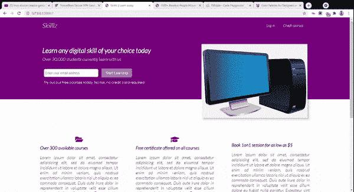

本教程分为五个部分:

*   如何构建导航栏
*   如何建立展示区
*   如何构建下半部分
*   如何构建页脚部分
*   如何使页面具有响应性

每一部分都会教你一些新的 CSS 和 web 开发技巧和工具。所以让我们直接开始吧。

## 如何创建 HTML 样板文件

如果您的 IDE 中安装了 emmet，您可以通过键入`!`并单击键盘上的`enter`或`tab`键来为您的项目生成 HTML 样板文件。

如果没有，您可以复制这个样板代码，并将其粘贴到您的代码编辑器中:

```
<!DOCTYPE html>
<html lang="en">
<head>
  <meta charset="UTF-8">
  <meta name="viewport" content="width=device-width, initial-scale=1.0">
  <meta http-equiv="X-UA-Compatible" content="ie=edge">
  <title>Document</title>
  <link rel="stylesheet" href="styles.css">
  <link rel="stylesheet" href="https://cdnjs.cloudflare.com/ajax/libs/font-awesome/5.15.4/css/all.min.css" integrity="sha512-1ycn6IcaQQ40/MKBW2W4Rhis/DbILU74C1vSrLJxCq57o941Ym01SwNsOMqvEBFlcgUa6xLiPY/NS5R+E6ztJQ=="
  crossorigin="anonymous" referrerpolicy="no-referrer" />
</head>
<body>

</body>
</html>
```

### 如何使用字体很棒的图标

正如您在其中一张照片中看到的，我们将使用一些字体图标来更好地展示我们的服务部分。

为此，我们将使用 CDN 中的字体 awesome。如果您自己创建了一个 HTML 生物模板，复制下面的`link`标签并粘贴到您的`head`标签中:

```
<link rel="stylesheet" href="https://cdnjs.cloudflare.com/ajax/libs/font-awesome/5.15.4/css/all.min.css" integrity="sha512-1ycn6IcaQQ40/MKBW2W4Rhis/DbILU74C1vSrLJxCq57o941Ym01SwNsOMqvEBFlcgUa6xLiPY/NS5R+E6ztJQ=="
  crossorigin="anonymous" referrerpolicy="no-referrer" />
```

This will allow you use Font Awesome icons in your project

## 我们开始吧

首先，确保您的样式表文件(。css)正确链接到您的 HTML 页面。

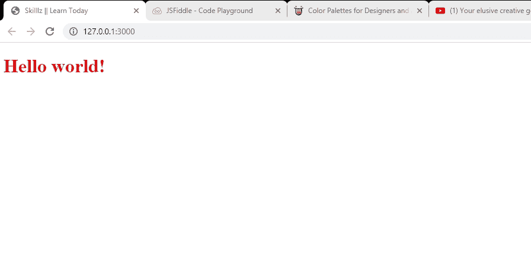

## 如何构建导航栏

导航栏部分将由我们网站的名称以及两个导航链接组成:`Log in`和`check courses`。

下面是我们的导航栏的标记:

```
<div class="navbar">
        <div class="container flex">
          <h1 class="logo">Skilllz</h1>
            <nav>
              <ul>
                <li class="nav"><a class="outline" href="">Log in</a></li>
                <li class="nav"><a href="" class="outline">Check courses</a 				</li>
              </ul>
            </nav>
        </div>
      </div>
```

在包装这个部分(navbar)中的元素的 div 上，我们注册了容器和 flex 类。

*   我们将在每个部分使用这个工具类来确保内部元素不超过我们在 CSS 中指定的宽度
*   `.flex`:我们将使用这个工具类，通过 CSS Flexbox 以水平对齐的方式(并排)显示子元素。

在`div`中，我们有一个带有`logo`类的`h1`和两个分别带有`outline`类的导航链接`li>a`。

在这一点上，我们的页面看起来像这样简单明了:

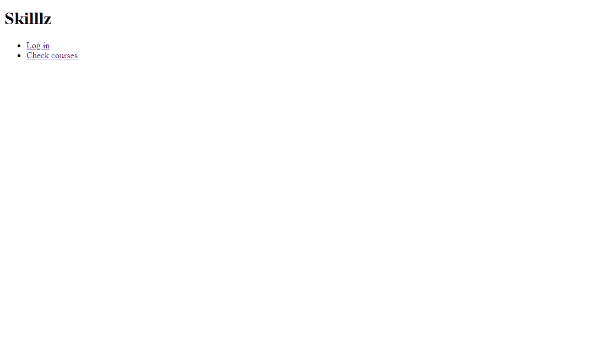

No CSS yet

### 如何将 CSS 样式应用到我们的页面

我们现在必须应用一些 CSS 规则来设计我们想要的导航部分。我们首先要做的是用下面的代码设置网页的基本样式:

```
/* Override default style and set padding and margin to nothing */

* {
  box-sizing: border-box;
  padding: 0;
  margin: 0
}

/* White text throughout */

body {
  font-family: "lato", sans-serif;
  color: white;
}

/* Make all link text black with no text decoration */
a {
  color: black;
  text-decoration: none;
}

h1 {
  font-size: 30px;
  font-weight: 600;
  margin: 10px 0;
  line-height: 1.2;
}

h2 {
  font-size: 25px;
  font-weight: 300;
  margin: 10px 0;
  line-height: 1.2;
}

p {
  font-size: 30px;
}

/* All images must not be larger than parent container */
img {
  width: 100%;
}

/* No styling on list items */
li {
  list-style-type: none;
}

p {
  font-size: 20px;
  margin: 10px 0;
} 
```

应用默认样式后，我们的页面将如下所示:

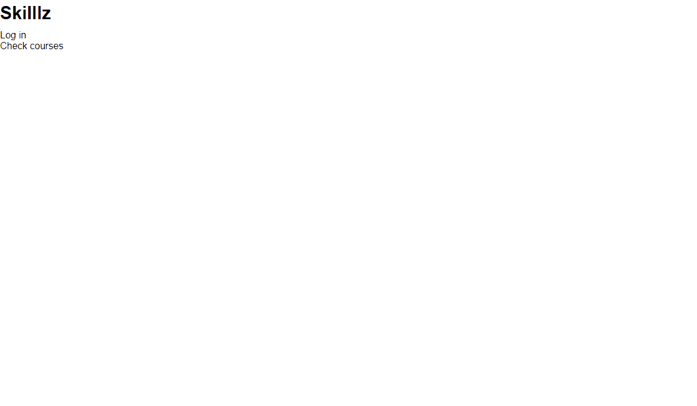

接下来，我们需要为容器类定义样式:

```
/* Centers it, sets a maximum width and makes sure elements can flow past it*/

.container {
  margin: 0 auto;
  max-width: 1200px;
  overflow: visible;
}
```

现在，我们的内容不会超过指定的最大宽度。

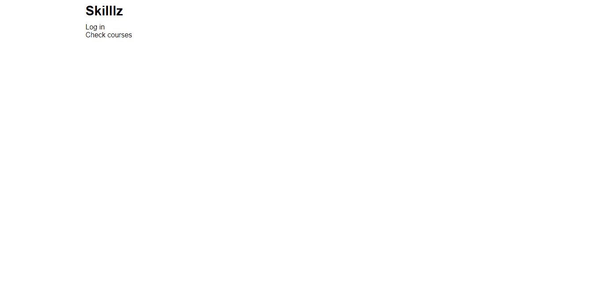

之后，我们需要将导航栏的背景颜色设置为紫色:

```
/* Sets background color, height and padding*/

.navbar {
  background-color: purple;
  height: 70px;
  padding: 0 30px;
}
```

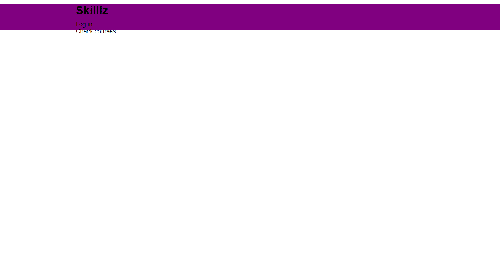

然后，我们只将目标指向`navbar`中的`h1`元素，并指定以下样式:

```
/* Sets font size, reduces font-weight, adds margin and line height */

.navbar h1 {
  font-size: 30px;
  font-weight: 300;
  margin: 10px 0;
  line-height: 1.2;
}
```

应用该样式后，我们的`h1`标题将如下所示:

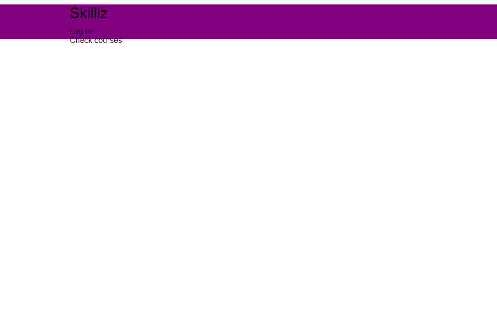

现在我们需要使用 Flexbox 并排显示容器`h1`和`nav`中的两个子元素。

```
.navbar .flex {
  display: flex;
  justify-content: space-between;
  align-items: center;
  height: 100%;
}
```

首先，我们将显示模式设置为`flex`。默认情况下，这将并排对齐元素**。**

**然后，我们调整内容，使用`space-between`值在每个项目之间添加相当大的空间。我们将项目对齐，使其出现在容器的中心(中间),并设置其高度以占据整个容器。**

**我们的页面现在应该是这样的:**

**

Cool right?** 

**然而，我们也不希望两个导航链接堆叠在一起。相反，我们希望它们并排显示。猜猜我们是怎么做到的？使用 Flexbox！**

```
`.navbar ul {
  display: flex;
}

/* Changes the color of both links to white, adds padding between them and margin as well */

.navbar a {
  color: white;
  padding: 9px;
  margin: 0 10px;
}`
```

**我们的页面现在看起来像这样:**

**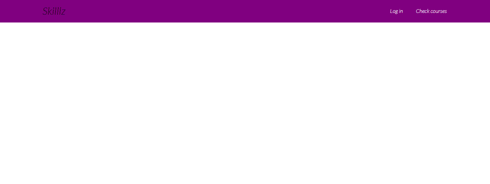

The power of CSS flexbox** 

**如果您观看了简短的介绍视频，您会注意到每当我将鼠标悬停在任何链接上时，文本颜色都会变为较浅的紫色，并且其下方会出现一个实心边框。**

**我们可以使用 CSS `:hover`伪元素来实现这个转换:**

```
`.navbar a:hover {
  color: #9867C5;
  border-bottom: 3px solid #9867C5;
}`
```

**现在看这个:**

**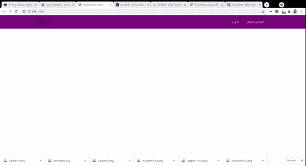

Hover effect on the links** 

**至此，我们已经完成了 navbar 部分。**

## **如何建立展示区**

**展示区将放置标题文本、支持文本、新用户注册表单以及标题图像。**

**这个部分将被分成两部分:左边和右边。换句话说，它将显示为两个单元的网格。**

**以下是该部分的标记:**

```
`<section class="showcase">
        <div class="container">
            <div class="grid">
              <div class="grid-item-1">
                <div class="showcase-text">
                  <h1>Learn any digital skill of your choice today</h1>
                  <p class="supporting-text"> Over 30,000 students currently learn with us</p>
                </div>
                <div class="showcase-form">
                  <form action="">
                    <input type="email" placeholder="Enter your email address">
                    <input type="submit" class="btn" value="Start Learning">
                  </form>
                  <p class="little-info">Try out our free courses today. No risk, no credit card required</p>
                </div>
              </div>

              <div class="grid-item-2">
                <div class="image">
                  
                </div>
              </div>
           </div>

        </div>
      </section>`
```

**目前，我们的应用程序看起来有点乱:**

**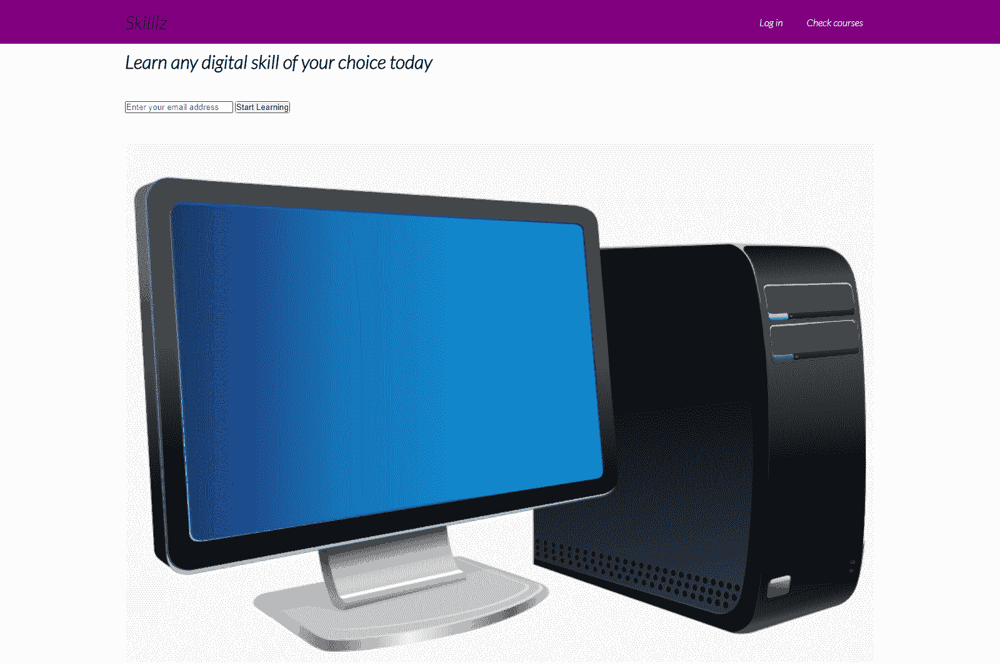**

### **如何将 CSS 样式应用到我们的展示区**

**首先，我们设置展示区的高度以及背景颜色:**

```
`.showcase {
  height: 300px;
  background-color: purple;
}`
```

**我们的应用程序现在看起来像这样:**

**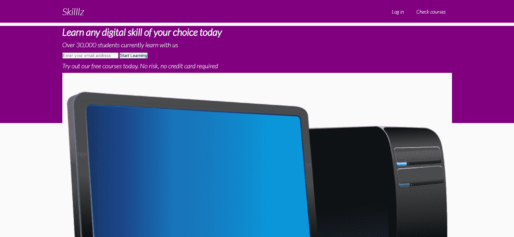

Still messy** 

> **注意:我把`h1`的颜色改成了白色**

**接下来，我们应用以下样式:**

```
`/* Adds margin below the text */
.showcase p {
  margin-bottom: 30px;
}

/* Adds a shadow below the image */
.showcase img {
  box-shadow: 7px 7px 7px rgba(0, 0, 0, 0.2);
}

/* Adds some padding on the form content */
.showcase-form {
  padding-left: 7px;
}`
```

**这就把我们带到了主要活动。如果您还记得，我说过我们将在 showcase 容器中创建两个部分(网格)。在容器上注册了 grid 类后，我们可以使用 CSS 网格显示来对齐它的内容，如下所示:**

```
`.grid {
  overflow: visible;
  display: grid;
  grid-template-columns: 60% 40%;
}`
```

**这将在我们的展示容器中创建两列。第一部分将占据容器的 60 %,第二部分将占据容器剩余的 40%。**

**可见的溢出将确保图像(如果比容器大)会溢出容器。**

**我们的应用程序现在看起来像这样**

**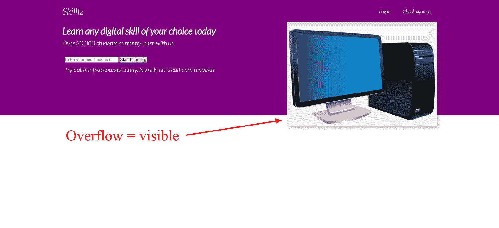**

**接下来，我们需要在导航区域和展示区域之间设置一些空间。**

```
`.grid-item-1,
.grid-item-2 {
  position: relative;
  top: 50px;
}`
```

**因此，它现在有点魂不守舍:**

**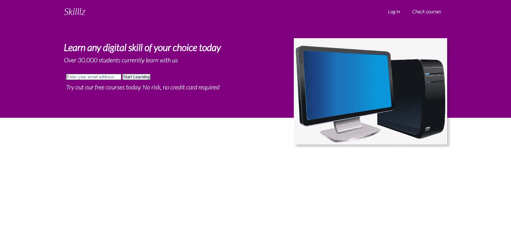**

**现在，我们需要设计两个表单输入的样式，因为它们看起来不太好。我们根据类型(email)选择第一个输入，根据类名`btn`选择第二个输入。**

```
`.showcase input[type='email'] {
  padding: 10px 70px 10px 0;
  font-size: 14px;
  border: none;
  border-radius: 6px;
  padding-left: 6px;
}

.btn {
  border-radius: 6px;
  padding: 12px 20px;
  background: #9867C5;
  border: none;
  margin-left: 10px;
  color: white;
  font-size: 16px;
  cursor: pointer;
  box-shadow: 0 10px 10px rgba(0, 0, 0, 0.2);
}`
```

**这种风格将把我们的表单输入转换成:**

**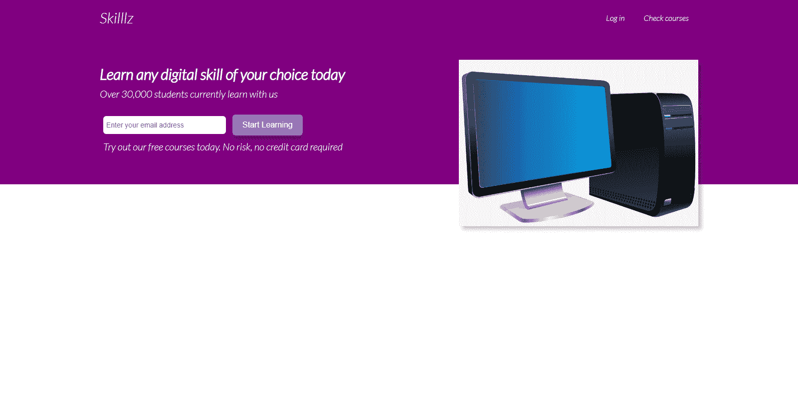

Form input styled better** 

**也可以更改支持文本的字体:**

```
`.showcase-form {
  margin: auto;
}

/* Change typeface and its size */
.little-info {
  font-size: 15px;
  font-family: "poppins", sans-serif;

}`
```

**这是我们展示区的最终外观:**

**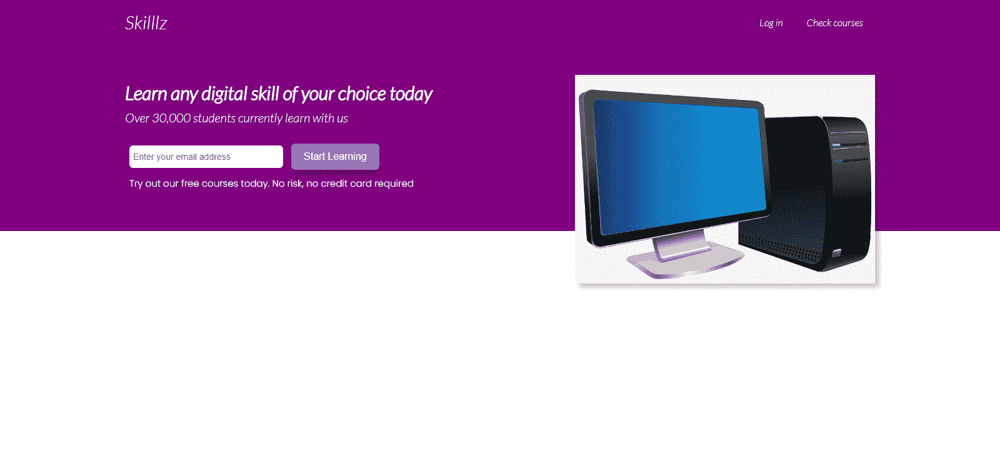

Final look of showcase section** 

**这一节到此为止！**

## **如何构建页面的下半部分**

**页面的下半部分将包含两个部分，即**统计数据**部分和**评价**部分。**

**显示由 **Skilllz** 提供的服务的 stats 容器将由三个`div`组成，每个包含一个字体很棒的图标、一个`title`类的`h3`和一个`text`类的`p`段。**

**证明书容器将保存三个随机的使用 Skillz 学习的人的证明书。我从 [unsplash](https://unsplash.com/s/photos/random-people) 上抢到的图片。**

### **如何构建统计部分**

**首先，我们将处理统计部分。该文本只是一个虚拟的“lorem50”文本，作为本演示的填充。**

**下面是它的标记:**

```
`<div class="lower-container container">
      <section class="stats">
        <div class="flex">
          <div class="stat">
            <i class="fa fa-folder-open fa-2x" aria-hidden="true"></i>
            <h3 class="title">Over 300 available courses</h3>
            <p class="text">Lorem ipsum dolor sit amet, consectetur adipisicing elit, sed do eiusmod tempor incididunt ut labore et dolore magna aliqua. Ut enim ad minim veniam, quis nostrud exercitation ullamco laboris nisi ut aliquip ex ea commodo consequat. Duis aute irure dolor in reprehenderit in voluptate velit esse cillum dolore eu fugiat nulla pariatur.
              Excepteur sint occaecat cupidatat non proident, sunt in culpa qui officia deserunt mollit anim id est laborum.</p>
          </div>
          <div class="stat">
            <i class="fa fa-graduation-cap fa-2x" aria-hidden="true"></i>
            <h3 class="title">Free certificate offered on all courses</h3>
            <p class="text">Lorem ipsum dolor sit amet, consectetur adipisicing elit, sed do eiusmod tempor incididunt ut labore et dolore magna aliqua. Ut enim ad minim veniam, quis nostrud exercitation ullamco laboris nisi ut aliquip ex ea commodo consequat. Duis aute irure dolor in reprehenderit in voluptate velit esse cillum dolore eu fugiat nulla pariatur.
              Excepteur sint occaecat cupidatat non proident, sunt in culpa qui officia deserunt mollit anim id est laborum.</p>
          </div>
          <div class="stat">
            <i class="fa fa-credit-card-alt fa-2x" aria-hidden="true"></i>
            <h3 class="title">Book 1on1 session for as low as $5</h3>
            <p class="text">Lorem ipsum dolor sit amet, consectetur adipisicing elit, sed do eiusmod tempor incididunt ut labore et dolore magna aliqua. Ut enim ad minim veniam, quis nostrud exercitation ullamco laboris nisi ut aliquip ex ea commodo consequat. Duis aute irure dolor in reprehenderit in voluptate velit esse cillum dolore eu fugiat nulla pariatur.
              Excepteur sint occaecat cupidatat non proident, sunt in culpa qui officia deserunt mollit anim id est laborum.</p>
          </div>
        </div>
      </section>`
```

**此部分将显示为空白页面。这是因为我们已经将整个文本的颜色设置为白色。所以我们必须增加一些造型。**

### **如何将 CSS 样式应用到 Stats 部分**

**首先，我们需要应用以下样式:**

```
`/* Centers the container, sets a maximum width
.lower-container {
  margin: 120px auto;
  padding: 0;
  max-width: 1400px;
}

/* Targets all h3 with class of title */
.title {
  color: black;
  font-size: 20px;
  text-align: left;
  padding-left: 10px;
  padding-top: 10px;
}

/* Targets the paragraphs with class name of text */
.text {
  color: black;
  font-size: 19px;
  width: 100%;
  padding: 10px;
  margin: 0, 20px;
  text-align: justify;
}`
```

**这将使我们的文本可见:**

****

**请注意，字体 Awesome 中的字体图标不可见。我们很快就会着手解决这个问题。**

**但是在那之前，我们需要做一些重要的事情。我们确实打算让所有三个 stat `div`水平对齐(并排)。为此，我们将再次使用 CSS Flexbox:**

```
`/* Display horizontally, put a little space around them */
.flex {
  display: flex;
  justify-content: space-around;
}

/* Add some padding around the container. Align text centrally */
.stats {
  padding: 45px 50px;
  text-align: center;
}

/* Set margin and width */
.stat {
  margin: 0 30px;
  text-align: center;
  width: 800px;
}`
```

**这是我们的应用程序现在的样子:**

**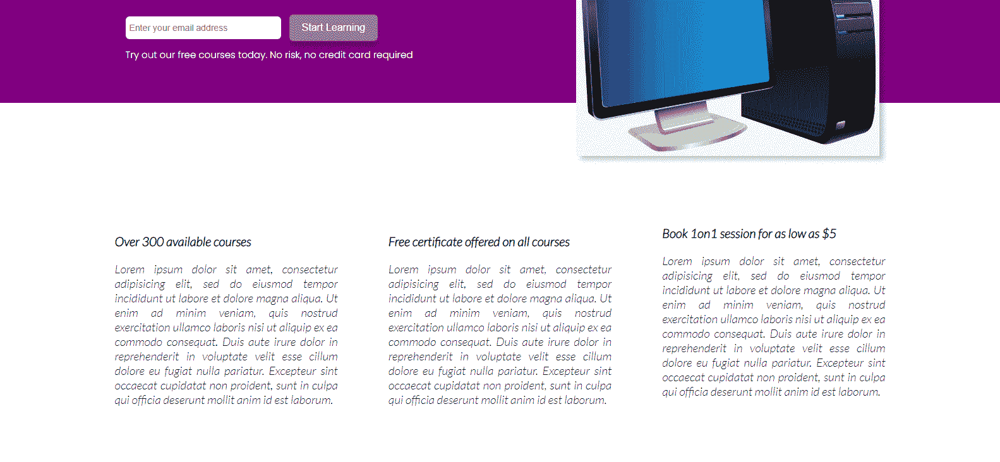**

**还是没有图标？是时候解决了！**

```
`.stats .fa {
  color: purple;
}`
```

**瞧！**

**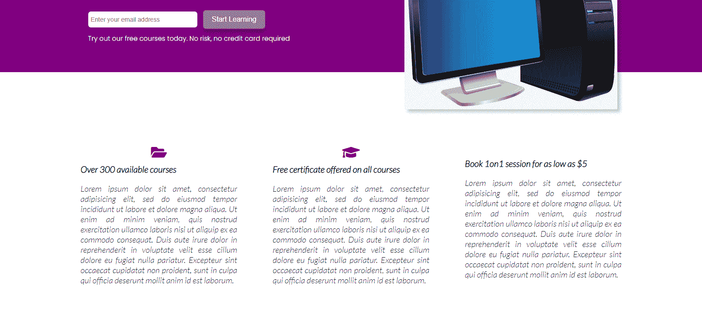**

### **如何建立客户评价部分**

**页面下部容器`div`内的第二部分是评价部分。这一部分将由三张卡片组成，每张卡片包含该人的图像(夹在一个圆圈内)、他们的姓名和该人的证明。**

**下面是它的标记:**

```
`<section class="testimonials">
      <div class="container">
        <div class="testimonial grid-3">
          <div class="card">
            <div class="circle">
              
            </div>
            <h3>Aston</h3>
            <p>I have learnt web development using this platfrom and I am going to say this is the best platform for learning. Absolutely
            worth the investment!</p>
          </div>
          <div class="card">
            <div class="circle">
              
            </div>
            <h3>Beth</h3>
            <p>I have learnt copywriting using this platfrom and I am going to say this is the best platform for learning. Absolutely
            worth the investment!</p>
          </div>
          <div class="card">
            <div class="circle">
              
            </div>
            <h3>Chris</h3>
            <p>I have learnt affilitate marketing using this platfrom and I am going to say this is the best platform for learning. Absolutely
            worth the investment!</p>
          </div>
        </div>
      </div>
    </section>`
```

### **如何对其应用 CSS 样式**

**首先，我们将文本颜色设置为黑色，这样我们就可以看到它:**

```
`.testimonial {
  color: black;
  padding: 40px;
}`
```

**应用时，它应该使文本可见，并向该部分添加一些填充:**

**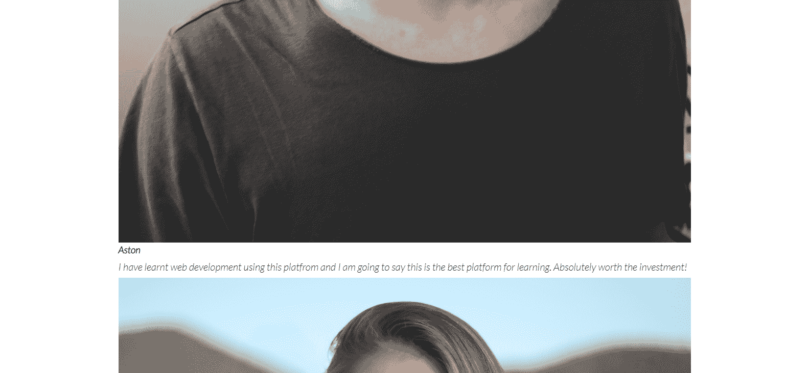**

**接下来，我们将图像设置为占据其父容器的高度:**

```
 `/* Wrap the image inside a cirle shape and set height to take up all of parent element */

.testimonial img {
    height: 100%;
    clip-path: circle();
}

/* Align text centrally */

.testimonial h3{
  text-align: center;
}` 
```

**如果您检查 gif 中的最终布局，您会注意到所有三张推荐卡都并排在同一行上。**

**因此，我们需要使用 CSS 网格排列创建一个包含三个相等列的 div。**

```
`/* Create a grid of three equal columns. Set a gap of 40 px between them */

.grid-3 {
  display: grid;
  grid-template-columns: repeat(3, 1fr);
  gap: 40px;
}

/* Create a white card with some shadow around it */
.card {
  padding: 10px;
  background-color: white;
  border-radius: 10px;
  box-shadow: -7px -7px 20px rgba(0, 0, 0, 0.2),
               7px  7px 20px rgba(0, 0, 0, 0.2)
}`
```

**应用了所有这些样式后，客户评价部分现在将如下所示:**

**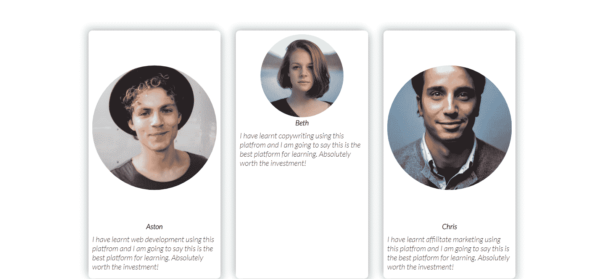**

**最后，我们使用 CSS 对圆形`div`进行样式化，并将其相对于卡片的上边框进行定位:**

```
`.circle {
    background-color: transparent;
    border:3px solid purple;
    height:90px;
    position: relative;
    top: -30px;
    left: 120px;
    border-radius:50%;
    -moz-border-radius:50%;
    -webkit-border-radius:50%;
    width:90px;
}`
```

**以下是我们浏览器中的所有内容:**

**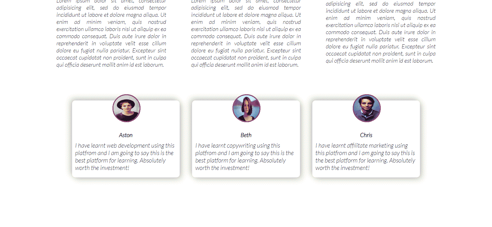

Final look** 

**好了，现在我们准备进入页脚部分。然后，我们将学习如何使网站响应。**

## **如何构建页脚部分**

**我们的登录页面构建过程的最后一部分是创建页脚部分。页脚部分将包含一些版权文本，三个额外的导航链接，以及一组来自字体 Awesome 的社交媒体图标。**

**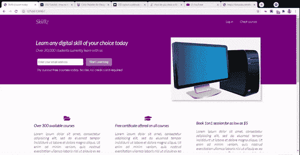**

**以下是我们登录页面页脚部分的 HTML 标记:**

```
`<footer>
   <div class="container grid-3">
     <div class="copyright">
       <h1>Skilllz</h1>
       <p>Copyright &copy; 2021</p>
     </div>
     <nav class="links">
       <ul>
         <li><a href="" class="outline">Home</a></li>
         <li><a href="" class="outline">Tutors</a></li>
         <li><a href="" class="outline">Categories</a></li>
       </ul>
     </nav>
     <div class="profiles">
       <a href=""><em class="fab fa-twitter fa-2x"></em></a>
       <a href=""><em class="fab fa-instagram fa-2x"></em></a>
       <a href=""><em class="fab fa-facebook fa-2x"></em></a>
       <a href=""><em class="fab fa-whatsapp fa-2x"></em></a>
     </div>
   </div>
 </footer>`
```

**如果没有任何样式，页脚部分将看起来没有吸引力:**

**

No CSS yet** 

**所以让我们改变这一点。**

### **如何设置页脚的样式**

**首先，我们需要将页脚部分的背景颜色(以及所有链接的颜色)设置为白色，如下所示:**

```
`/* Add padding around the footer as well */

footer {
  background-color: purple;
  padding: 20px 10px;
}

/* Sets all link texts to white and puts margin to the left and right */

footer a {
  color: white;
  margin: 0 10px;
}`
```

**现在页脚看起来像这样:**

**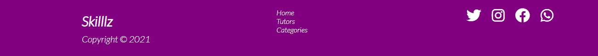

Footer** 

**如果你查看第一张 gif 图片，你会注意到当我将鼠标悬停在页脚内的任何链接上时，它们的颜色会变成浅紫色，并且在它们下面还会出现一个边框。**

**我们可以使用`:hover`选择器来实现这一点:**

```
`footer a:hover {
  color: #9867C5;
  border-bottom: 2px solid #9867C5;
}`
```

**页脚到此为止！**

## **如何设置媒体查询以使页面响应**

**现在是时候让我们的登录页面更具响应性了。当建立一个网站时，重要的是要记住用户将从不同的设备上浏览网站。因此，当务之急是使网站布局能够响应多种设备的用户体验。**

**在我们的 CSS 中，我们将定义媒体查询，为不同设备的不同屏幕宽度设置断点，并为每个屏幕尺寸映射一组 CSS 规则。**

### **如何为平板电脑和更小的屏幕设计**

**首先，我们将优化我们网站的布局，方便用户从平板电脑上浏览。在我们的 CSS 中，我们定义了以下样式:**

```
`/* Tablets and Under */

@media(max-width: 768px) {
  .grid,
  .grid-3 {
    grid-template-columns: 1fr;
  }`
```

**最初，我们为`.grid`类设置了两列，为`grid-3`类设置了三列。现在，我们要确保所有的网格项只占据一行。**

**因此，以前并排(水平)显示的表单和图像现在将依次(垂直)显示，如下所示:**

**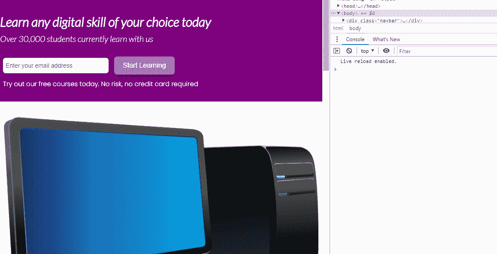**

**接下来，我们将应用以下样式:**

```
`/* Align all text to the center. This will move all text, including form centrally */

.showcase {
    height: auto;
    text-align: center;
  }

/* This resets the width of the image container and adds margin space to the left */ 

.image {
    width: 600px;
    margin-left: 80px;
  }

/* Changes the service sections from side-by-side orientation to each taking its own line. Aligns text to the center */

.stats .flex {
    flex-direction: column;
  }

  .stats {
    text-align: center;
  }

/* Makes sure each stat section does not exceed the width of parent */

.stat {
    width: 100%;
    padding-right: 80px;
  }

/* (re)Moves the cirle to the center of the card */

.circle {
      background-color: transparent;
      border:3px solid purple;
      height:90px;
      position: relative;
      top: -30px;
      left: 270px;
      border-radius:50%;
      -moz-border-radius:50%;
      -webkit-border-radius:50%;
      width:90px;
  }` 
```

**瞧！我们的网站现在可以在平板电脑和小屏幕上运行。**

**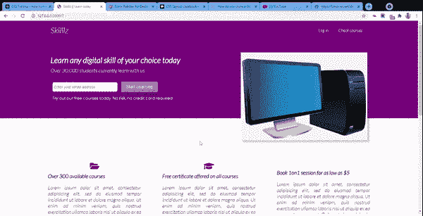

The result** 

### **如何为移动设备设计**

**许多人可能从移动设备上浏览网站，而移动设备通常是所有设备中屏幕尺寸最小的。因此，为手机大小的屏幕创建一个布局是非常重要的。**

```
`/* Mobile devices */
@media(max-width: 500px) {
  .navbar {
    height: 100px;
  }`
```

**首先，我们增加导航区域的高度。由于它将从一个较小的屏幕上观看，我们希望该地区为用户更突出。**

**然后，我们定义以下样式:**

```
`/* Changes the alignment. The logo title stays at the top, the nav links will be below it */

.navbar .flex {
    flex-direction: column;
  }

/* When hovered on, retain white color and change border to black */

  .navbar a:hover {
    color: white;
    border-bottom: 2px solid black;
  }

/* Set light purple background on nav links, make it a bit round and add some spacing */

  .navbar ul {
    background: #9867C5;
    border-radius: 5px;
    padding: 10px 0;
  }

/* Align text to center */

  .showcase {
    height: auto;
    text-align: center;
  }

/* Reduce font size */

.little-info {
    font-size: 13px;
  }

/* Reduce image width */

  .image {
    width: 350px;
    margin-left: 70px;
  }

  .stat {
    margin-bottom: 40px;
  }

/* Move circle once again */

.circle {
      background-color: transparent;
      border:3px solid purple;
      height:90px;
      position: relative;
      top: -30px;
      left: 150px;
      border-radius:50%;
      -moz-border-radius:50%;
      -webkit-border-radius:50%;
      width:90px;
  }
}`
```

**瞧！**

**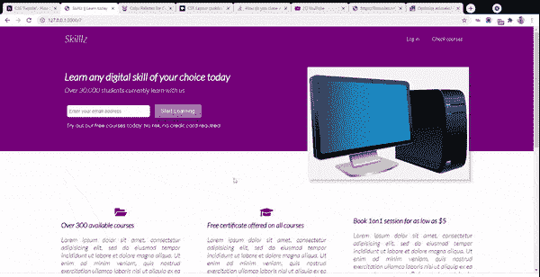**

## ****结束****

**FlexBox 和 Grid alignment 是非常强大的工具，可以按照你想要的样子来布局网页。**

**响应式网页设计可以说是网页开发中最重要的设计原则之一。我们必须考虑这样一个事实，即我们的网站将会被各种不同屏幕分辨率的设备浏览。针对不同屏幕优化我们网站的布局将会改善用户体验。**

**在本教程中，我们使用 CSS Flexbox、Grid 和许多其他 CSS 属性设计了一个简单的登录页面。我们还让页面在平板电脑和手机屏幕上看起来不错。**

**这个项目的完整代码可以从这个 [GitHub 库](https://github.com/KingsleyUbah/Skilllz)获得。**

**我希望你能从这篇教程中学到一些有用的东西。如果您有任何建议，请通过 [Twitter](https://twitter.com/UbahTheBuilder) 联系我。你也可以访问我的[博客](https://ubahthebuilder.tech/)来了解类似的帖子。**

**感谢您的关注，再见。**