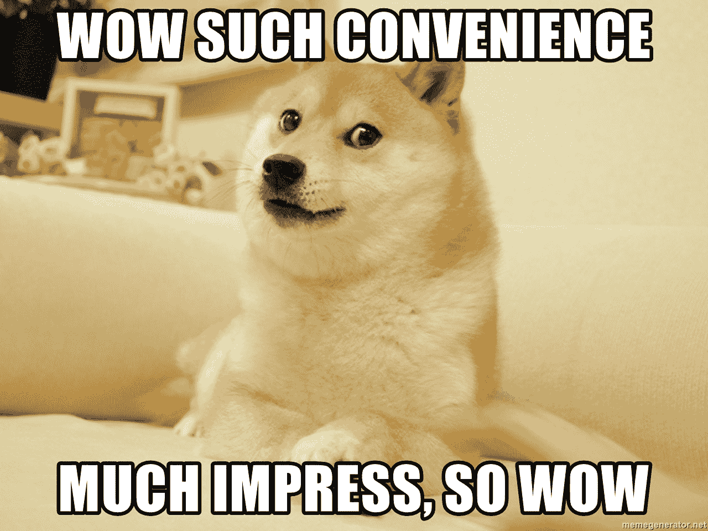
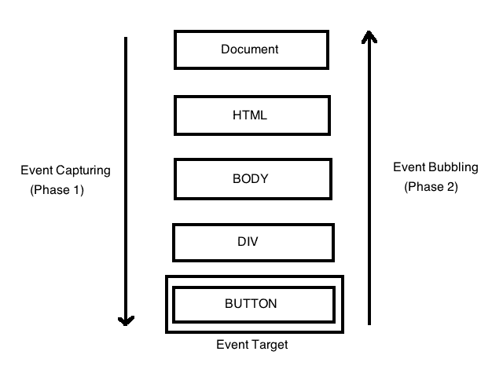
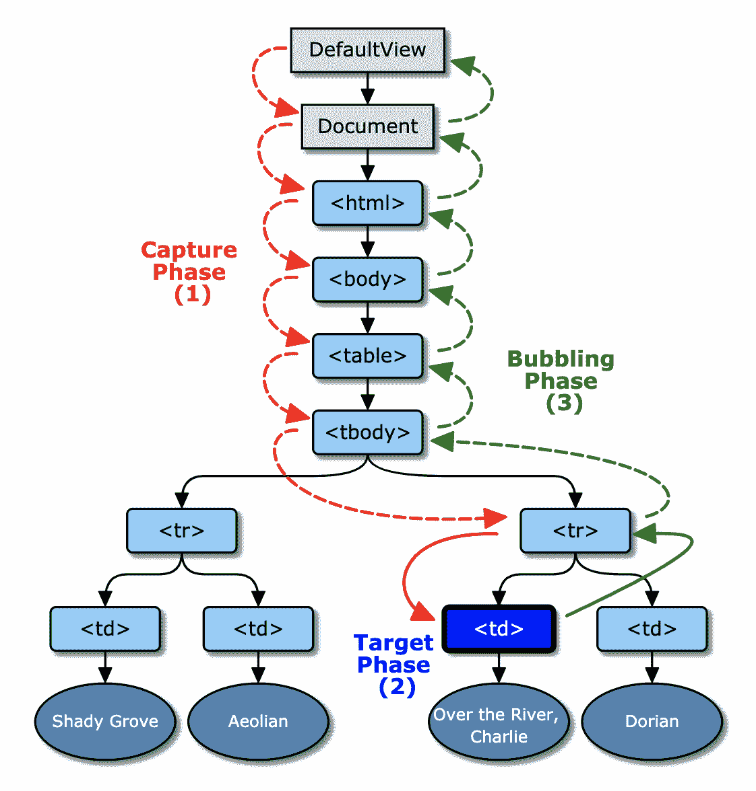
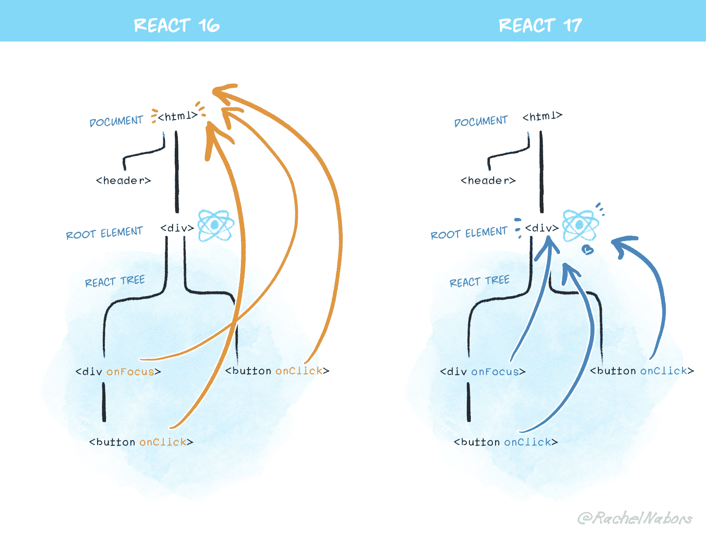
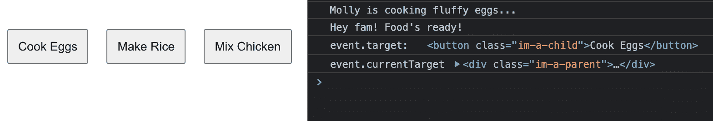
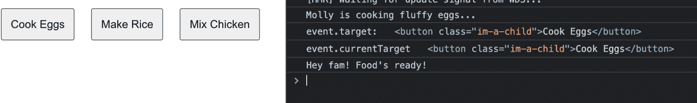
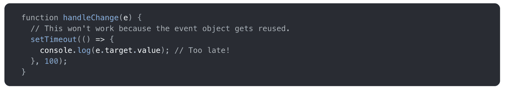
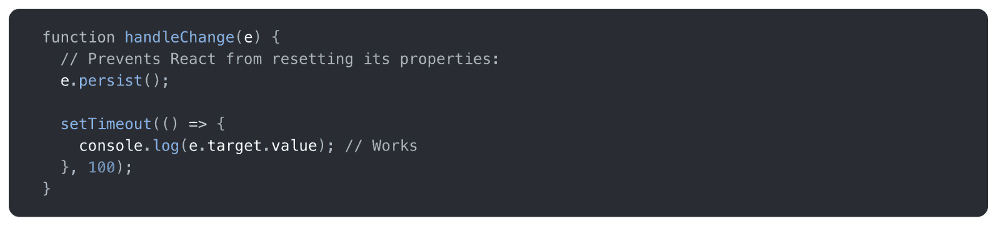
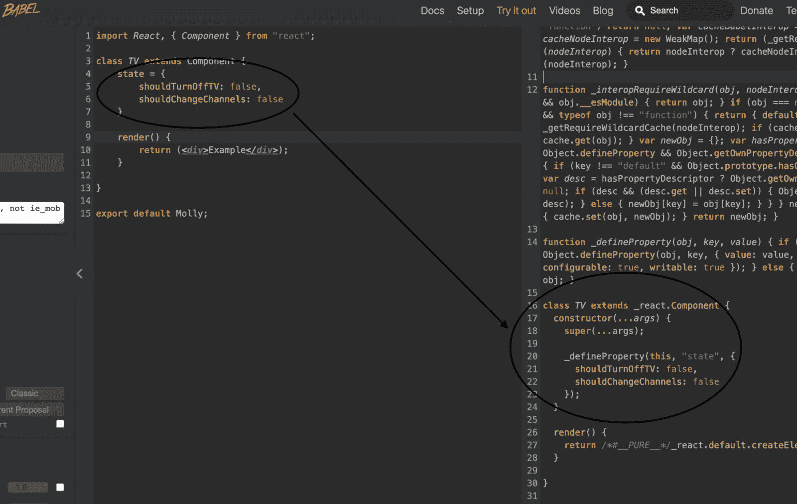

# JavaScript 和 React 中的事件冒泡和事件捕捉——初学者指南

> 原文：<https://www.freecodecamp.org/news/event-propagation-event-bubbling-event-catching-beginners-guide/>

在本文中，我将像专家一样帮助您理解事件冒泡和事件捕捉。我创建这个资源是为了帮助您理解事件传播以及它在 JavaScript 中是如何工作的，并以一种清晰易懂的方式做出反应。❤

一旦你完成了对事件冒泡和事件缓存的全面介绍，你应该能够马上开始在你的项目中应用你在这里学到的东西。

以下是你将学到的东西:

*   **✨**什么是事件委派？
*   ✨ [什么是事件冒泡？](#what-is-event-bubbling)
*   ✨[JavaScript 中事件冒泡是如何发生的](#how-event-bubbling-happens-in-javascript)
*   ✨ [事件冒泡是如何在 React](#how-event-bubbling-happens-in-react) 中发生的
*   ✨ [如何停止组件中的事件冒泡](#how-to-stop-event-bubbling-in-your-components)
*   ✨ [事件.目标 vs 事件.当前目标](#event-target-vs-event-currenttarget)
*   ✨ [更新了事件触发顺序，并在 JavaScript 中使用捕获参数](#updated-event-firing-order-and-usecapture-param-in-javascript)
*   ✨ [哪些事件没有泡沫，它们是如何处理的？](#which-events-do-not-bubble-and-how-are-they-handled)
*   React 版本 16 和 VS 版本 17 之前版本中的✨ [事件监听器+](#event-listeners-in-react-version-16-and-before-vs-version-17-)
*   ✨ [特殊边缘案例:如果你也需要一个外部父母来解雇呢？](#special-edge-case-what-if-you-need-an-outer-parent-to-fire-too)

## 什么是事件委托？

长话短说，事件委托就是一种强大的 JavaScript 技术，它允许更高效的事件处理。

### 👍优点(稍后详细介绍)

*   这种技术通常被认为是高性能的，因为在顶级父元素上只使用了一个事件侦听器函数，而不是每个子元素都使用一个。

### 👎缺点(稍后详述)

*   一旦内部子元素的事件被调用，它上面/下面的所有元素也将被调用(冒泡/捕获)。为了防止这种情况发生，必须调用`event`对象上的方法。

冒泡和**捕获**(稍后解释)允许我们实现事件委托模式。

## 什么是事件冒泡？

假设我们认识一个叫`Molly`的女孩，她也不是一个真实的人，而是——🥁drum·罗尔——一个 React 组件。哇——如此方便！



generated via [https://memegenerator.net/](https://memegenerator.net/)

她有一个带`onClick`事件处理程序的单亲`div`,当点击它时，它会把所有人叫到桌子旁吃她的食物。

在这个父元素`div`中有几个子元素`button`，当单击它们时，会创建一个虚拟的食物项目(即`console.log`的项目)。

```
import React, { Component } from "react";

class Molly extends Component {
    handleCallFamilyToEat() {
        console.log("Hey fam! Food's ready!");
    }

    handleCookEggs() {
        console.log("Molly is cooking fluffy eggs...");
    }

    handleMakeRice() {
        console.log("Molly is making some delicious jasmine rice...");
    }

    handleMixChicken() {
        console.log("Molly is mixing chicken with some yummy spicy sauce!");
    }

    render() {
        return (
            <div className="im-a-parent" onClick={this.handleCallFamilyToEat}>
                <button className="im-a-child" onClick={this.handleCookEggs}>Cook Eggs</button>
                <button className="im-a-child" onClick={this.handleMakeRice}>Make Rice</button>
                <button className="im-a-child" onClick={this.handleMixChicken}>Mix Chicken</button>
            </div>
        );
    }

}

export default Molly;
```

这是当你点击每一个时发生的事情:

[https://giphy.com/embed/eEVi5aB0WIv7rCTlhV](https://giphy.com/embed/eEVi5aB0WIv7rCTlhV)

如果你想沿着这条路走下去，这里有一个小的 codepen 版本:

[https://codepen.io/maariyadiminsky/embed/preview/MWobvZd?default-tabs=js%2Cresult&height=300&host=https%3A%2F%2Fcodepen.io&slug-hash=MWobvZd](https://codepen.io/maariyadiminsky/embed/preview/MWobvZd?default-tabs=js%2Cresult&height=300&host=https%3A%2F%2Fcodepen.io&slug-hash=MWobvZd)

[**event-bubbling-exampl**](https://codepen.io/maariyadiminsky/pen/MWobvZd)**e**

如你所见，每个孩子都会这样:

1.  首先，按钮的事件处理程序被触发。
2.  其次，父 div 的事件处理程序被触发。

在大多数情况下，您可能只想在单击按钮时调用按钮的事件处理程序。但是正如你看到的，父事件也被触发了...！？

这叫做**。**

**在接下来的几节中，我将讨论到底发生了什么以及我们如何解决它。**

## **JavaScript 中事件冒泡是如何发生的**

### **事件冒泡为什么会存在？**

**JavaScript 创建事件传播模式的目的之一是使从一个源(父元素)捕获事件更容易，而不是在每个内部子元素上设置一个事件处理程序。**

### **事件传播触发顺序**

**事件传播经历三个阶段:**

**

Image from [https://ehsankorhani.com/](https://ehsankorhani.com/)** 

1.  ****🟢捕获阶段**–这是事件实际触发时的第一个阶段。该事件首先“捕获”或传播最顶层的事件，即`window`对象，然后是`document`，然后是`html`元素，最后是最内层的元素。它一直向下，直到到达`event.target`(您点击的/事件触发的)。**
2.  **🟢 **目标阶段**——第二阶段是我们到达`event.target`的时候。例如，当用户单击一个按钮时，这就是实际的按钮元素。**
3.  **🟢 **冒泡阶段**——第三阶段。这个事件从`event.target`开始，向上传播，直到它再次到达顶层父节点(尽管顶层父节点的事件不再被调用)。**

**请注意，虽然有 3 个主要阶段，但目标阶段实际上并不是单独处理的。捕获和冒泡阶段的事件处理程序都在这里触发。**

**从技术上讲，还有另一个阶段叫做“无阶段”，即没有事件发生的阶段。您可以通过`[event.eventPhase](https://developer.mozilla.org/en-US/docs/Web/API/Event/eventPhase)`访问元件处于哪个阶段。**

**考虑到您刚刚学到的内容，请看下面的例子。**

**假设用户点击了`table`中的`td`元素。这里事件传播是如何发生的？**🤔**花点时间想一想。**

```
`<html lang="en">
  <head>
    <meta charset="utf-8" />
    <link rel="icon" href="%PUBLIC_URL%/favicon.ico" />
  </head>
  <body>
    <div id="root">
      <table>
        <tbody>
          <tr>
            <td>Shady Grove</td>
            <td>Aeolian</td>
          </tr>
          <tr>
            <td>Over the River, Charlie</td>
            <td>Dorian</td>
          </tr>
        </tbody>
      </table>
    </div>
  </body>
</html>` 
```

**这是实际发生的事情，按照刚才提到的顺序:**

**注意这里的`DefaultView`应该是`Window`对象。**

**

Image by [https://www.w3.org/](https://www.w3.org/)** 

## **React 中事件冒泡是如何发生的**

**另一方面，React 创建了一个叫做[合成事件](https://reactjs.org/docs/events.html)的东西。**

**这些只是浏览器事件对象的包装器。基本的用例是相似的，包括像`stopPropagation`和`preventDefault`这样的方法(我将在后面讨论)。最大的好处是它们在不同的浏览器上工作是一样的。**

**React 不将事件处理程序附加到节点上——而是附加到文档的根目录上。当事件被触发时，React 首先调用适当的元素(即您单击的目标阶段元素),然后它开始冒泡。**

**为什么 React 要这样做，而不是像原生 DOM 那样简单地处理事件？**

 **[https://giphy.com/embed/AqlX1TY49hTS8](https://giphy.com/embed/AqlX1TY49hTS8)

### 浏览器一致性

重要的是，事件在所有浏览器中的工作是相同的。React 创建的合成事件，以确保属性在不同的浏览器和平台之间保持一致。

当一个事件在一个浏览器中运行，但是一个用户在另一个浏览器中使用你的应用程序时，你不会想要创建一个应用程序，这是一个糟糕的用户体验。

### 从您实际想要触发的元素触发

设置事件处理程序的地方就是打算调用它的地方——在那个特定的元素上，而不是在其他地方(当然，为了首先理解基本概念，我在这里暂时忽略一些边缘情况)。

该事件最了解它所设置的元素，因此它应该是第一个触发的事件。之后，随着事件传播越往上，上面每个元素知道的越来越少。

以我们之前的`Molly`组件为例。我知道你很想她，所以她又来了:

[https://giphy.com/embed/eEVi5aB0WIv7rCTlhV](https://giphy.com/embed/eEVi5aB0WIv7rCTlhV)

🤔您注意到了吗，当单击一个按钮时，该按钮上的事件处理程序首先被调用，然后父事件处理程序才被调用。

它永远不会反向发生(也就是说，永远不会触发捕获阶段)。

这是因为 React 的合成事件只使用冒泡阶段(这里包括目标阶段)。如果目的是关注首先触发事件的`event.target`(本例中的按钮)，这是有意义的。

请记住，React 只是用这些合成事件来模拟 JavaScript 的本机冒泡和捕获阶段，这就是为什么随着时间的推移，您可能会注意到一些差异(本文将进一步解释)。

**⚠️合成事件**本身并不关注捕捉阶段，除非您专门将其设置为。要触发捕获阶段，只需将父`div`的事件处理程序`onClick`设置为`onClickCapture`:

```
import React, { Component } from "react";

class Molly extends Component {
    ...

    render() {
        return (
            <div className="im-a-parent" onClickCapture={this.handleCallFamilyToEat}> 
                <button className="im-a-child" onClick={this.handleCookEggs}>Cook Eggs</button>
                <button className="im-a-child" onClick={this.handleMakeRice}>Make Rice</button>
                <button className="im-a-child" onClick={this.handleMixChicken}>Mix Chicken</button>
            </div>
        );
    }

}

export default Molly;
```

请注意，下面触发的不是冒泡阶段，而是捕获阶段:

[https://giphy.com/embed/BETT2abn9nJdSjenq4](https://giphy.com/embed/BETT2abn9nJdSjenq4)

**⚠️** 最后，我想提一下，在 React 版本 16 和更低版本中，当冒泡阶段在合成事件中被触发时，它的行为类似于 JavaScript 的本机冒泡阶段，一直附加事件处理程序直到`Document`。

现在，在 React 版本 17+中，事件处理程序只能到达`root`元素。



Image by [React](https://reactjs.org/blog/2020/08/10/react-v17-rc.html)

## 如何停止组件中的事件冒泡

现在你已经理解了**事件传播**、**事件冒泡**和**事件捕获**的核心概念，让我们来讨论如何修复我们最初的问题。

您有一个按钮(或其他元素)，并且您希望只触发按钮的事件处理程序，而不应该触发其他父级。

🤔那么，我们如何才能阻止这种情况发生呢？您有几个选择:

### event.stopPropagation()

这将阻止任何父组件的事件触发。要使用它:

1.  确保将`event`对象作为参数传递。
2.  在事件处理函数中，对代码上方的事件对象使用`stopPropagation`方法。

注意，我将父代的`div`从`onClickCapture`改回了`onClick`:

```
import React, { Component } from "react";

class Molly extends Component {
    handleCallFamilyToEat() {
        console.log("Hey fam! Food's ready!");
    }

    handleCookEggs(event) {
        event.stopPropagation(); // USED HERE!
        console.log("Molly is cooking fluffy eggs...");
    }

    handleMakeRice() {
        console.log("Molly is making some delicious jasmine rice...");
    }

    handleMixChicken() {
        console.log("Molly is mixing chicken with some yummy spicy sauce!");
    }

    render() {
        return (
            <div className="im-a-parent" onClick={this.handleCallFamilyToEat}> 
                <button className="im-a-child" onClick={this.handleCookEggs}>Cook Eggs</button>
                <button className="im-a-child" onClick={this.handleMakeRice}>Make Rice</button>
                <button className="im-a-child" onClick={this.handleMixChicken}>Mix Chicken</button>
            </div>
        );
    }

}

export default Molly;
```

上面我只给`handleCookEggs`函数加了`stopPropagation`。因此，当点击`Cook Eggs`按钮时，它只会触发该元素的事件。

### event.stopImmediatePropagation()

假设在同一个元素上有多个事件。如果使用`event.stopPropagation()`，肯定会阻止任何父事件触发。但是如果在同一个元素上有多个事件，它们仍然会被触发。

为了防止同一元素上的其他事件触发，请使用`event.stopImmediatePropagation()`来代替。它将阻止父事件和相同的元素事件触发。

如果你处于`event.stopPropagation()`不适合你的情况，试试`event.stopImmediatePropagation()`吧。

注意:有时你的应用程序中可能会有第三方库，导致前者无法工作。当然，看看是什么导致后者工作而不是前者，这仍然是一个好主意，可能会给你另一个解决问题的线索。

### event.preventDefault()

根据事件处理程序和元素，您可能希望使用此。

例如:

*   如果您有一个表单，并且不想在提交时刷新页面。
*   您正在设置自己的路线功能，并且不想刷新页面。

## 事件.目标与事件.当前目标

理解`Event`对象上这两个目标属性之间的区别真的可以让你以后不再头疼。

请记住:触发事件的元素并不总是与附加了事件侦听器的元素相同。

**🤔**迷茫？别担心，让我们一起度过难关。

[https://giphy.com/embed/lT9Y1nrHdZWX9QoSH0](https://giphy.com/embed/lT9Y1nrHdZWX9QoSH0)

让我们以之前的例子为例，父 div 的事件处理程序中的`event.target`和`event.currentTarget`都是`console.log`。

```
import React, { Component } from "react";

class Molly extends Component {
    // CHECKING THE PARENT
    handleCallFamilyToEat(event) {
        console.log("Hey fam! Food's ready!");

        console.log("event.target:", event.target);
        console.log("event.currentTarget", event.currentTarget);
    }

    ...

    render() {
        return (
            <div className="im-a-parent" onClick={this.handleCallFamilyToEat}> 
                <button className="im-a-child" onClick={this.handleCookEggs}>Cook Eggs</button>
                <button className="im-a-child" onClick={this.handleMakeRice}>Make Rice</button>
                <button className="im-a-child" onClick={this.handleMixChicken}>Mix Chicken</button>
            </div>
        );
    }

}

export default Molly;
```

现在，当我们点击`Cook Eggs`按钮时，我们会看到什么？



Image by Mariya Diminsky(me)

注意父 div 的事件处理程序知道预期的`target`是按钮。

但是因为我们在检查父类的事件处理程序，我们看到父类 div 是`currentTarget`。

好吧，让我们深入研究一下。

如果我们采用相同的`console.log`并在实际按钮的事件处理程序中进行检查会怎么样？

🤔我们现在会看到什么？

```
import React, { Component } from "react";

class Molly extends Component {
    handleCallFamilyToEat(event) {
        console.log("Hey fam! Food's ready!");
    }

    // CHECKING A CHILD BUTTON
    handleCookEggs(event) {
        console.log("Molly is cooking fluffy eggs...");

        console.log("event.target:", event.target);
        console.log("event.currentTarget", event.currentTarget);
    }

    ...

    render() {
        return (
            <div className="im-a-parent" onClick={this.handleCallFamilyToEat}> 
                <button className="im-a-child" onClick={this.handleCookEggs}>Cook Eggs</button>
                <button className="im-a-child" onClick={this.handleMakeRice}>Make Rice</button>
                <button className="im-a-child" onClick={this.handleMixChicken}>Mix Chicken</button>
            </div>
        );
    }

}

export default Molly;
```



Image by Mariya Diminsky(me)

请注意，由于我们现在正在检查按钮的事件处理程序内部，我们看到`currentTarget`已经更改为按钮。

当然，由于我们正在点击按钮，我们已经知道`target`将再次成为`button`。

考虑到您刚刚学到的内容，现在您知道:

*   `event.target`是导致事件的嵌套最深的元素。
*   `event.currentTarget`是监听事件的元素(事件监听器连接到的位置)。

## 更新了 JavaScript 中的事件触发顺序和使用捕获参数

在 JavaScript 中，`EventTarget.addEventListener`将被用来添加一个事件处理程序。

当我们看一下 [MDN 文档](https://developer.mozilla.org/en-US/docs/Web/API/EventTarget/addEventListener)时，我们看到你可以在`options`对象中可选地设置`capture`，或者通过`useCapture`参数(现在也是可选的)，这做同样的事情。

```
// So you can do this:
yourElement.addEventListener(type, listener, { capture: true });

// or this:
yourElement.addEventListener(type, listener, useCapture: true);
```

⚠️:原因是除非你特别设置，否则捕获阶段将被忽略，取而代之的是，只有冒泡阶段(在目标阶段之后)会在 JavaScript 中被本地触发。MDN 也解释了这一点:

> 对于附加到事件目标的事件侦听器，事件处于目标阶段，而不是捕获和冒泡阶段。“捕获”阶段的事件侦听器在任何非捕获阶段的事件侦听器之前被调用。

请注意，`useCapture`参数在旧浏览器中并不总是可选的。确保在实施之前检查[caniuse.com](https://caniuse.com/?search=usecapture)。

## 哪些事件不会冒泡，如何处理？

虽然大多数事件都是泡沫，但你知道有几个不是吗？

[https://giphy.com/embed/T5QOxf0IRjzYQ](https://giphy.com/embed/T5QOxf0IRjzYQ)

下面是一些本地 JavaScript 的例子:

*   [模糊](https://developer.mozilla.org/en-US/docs/Web/API/Element/blur_event) ( [聚焦](https://developer.mozilla.org/en-US/docs/Web/API/Element/focusout_event)是一样的，但它实际上冒泡)。
*   [focus](https://developer.mozilla.org/en-US/docs/Web/API/Element/focus_event) ( [focusin](https://developer.mozilla.org/en-US/docs/Web/API/Element/focusin_event) 是一样的，但实际上是冒泡)。
*   [mouse leave](https://developer.mozilla.org/en-US/docs/Web/API/Element/mouseleave_event)([mouse out](https://developer.mozilla.org/en-US/docs/Web/API/Element/mouseout_event)是一样的但是实际上是冒泡的)。
*   [鼠标进入](https://developer.mozilla.org/en-US/docs/Web/API/Element/mouseenter_event) ( [鼠标悬停](https://transang.me/everything-about-event-bubbling/mouseover)是一样的，但它实际上是冒泡的)。
*   [加载](https://developer.mozilla.org/en-US/docs/Web/API/Window/load_event)，[卸载](https://developer.mozilla.org/en-US/docs/Web/API/Window/unload_event)，[中止](https://developer.mozilla.org/en-US/docs/Web/API/HTMLMediaElement/abort_event)，[错误](https://developer.mozilla.org/en-US/docs/Web/API/Element/error_event)，[卸载前](https://developer.mozilla.org/en-US/docs/Web/API/Window/beforeunload_event)。

⚠️当 `[Event](https://developer.mozilla.org/en-US/docs/Web/API/Event/Event)` [被创建](https://developer.mozilla.org/en-US/docs/Web/API/Event/Event)时，确实冒泡的事件在`bubbles`选项[上设置了`true`——尽管它们仍然经过捕获阶段。](https://developer.mozilla.org/en-US/docs/Web/API/Event/Event)

## React 版本 16 及之前版本 VS 版本 17+中的事件侦听器

正如您所了解到的，React 的合成事件并不总是与其原生 JavaScript 等效事件表现相同。

让我们了解一下这些差异以及 React 版本之间的变化。

### 你不会想到会发生的事件会有什么反应

例如，您可能会认为 React 的`onBlur`和`onFocus`不会冒泡，因为 JavaScript 的本地等价物不会冒泡，对吗？然而，React 故意让这些事件和其他事件继续冒泡。

⚠️虽然 React 版本 17 已经对某些事件[做了一些改变](https://reactjs.org/blog/2020/08/10/react-v17-rc.html#aligning-with-browsers)，比如不再冒泡的`onScroll`，但大多数事件仍然继续冒泡。

参见[这个答案](https://stackoverflow.com/questions/34926910/onfocus-bubble-in-react)和[这篇文章](https://www.quirksmode.org/blog/archives/2008/04/delegating_the.html)了解更多关于这个话题的细节。

### 曾经在异步函数中无效

在 React 版本 17 之前，如果你试图访问一个异步函数中的事件，你会注意到它是未定义的。

这是因为 React 的合成事件对象是池化的——这意味着在事件处理程序被调用后，您将无法再访问它们，因为它们将被重置并放回池中。

[https://giphy.com/embed/NsZbrSS0miha0](https://giphy.com/embed/NsZbrSS0miha0)



Image from [React](https://reactjs.org/docs/legacy-event-pooling.html)

这给需要在以后访问该事件中的信息的异步函数带来了问题。

⚠️在异步函数中保存这些信息的唯一方法是调用`event.persist()`:



Image from [React](https://reactjs.org/docs/legacy-event-pooling.html)

这样做的目的是提高性能。但是经过仔细检查，React 的团队发现它只是让开发人员感到困惑，实际上并没有真正提高性能，所以它完全被废弃了。

⚠️随着 React 版本 17 的发布，React 不再池化合成事件对象。因此，您可以期望在异步函数中接收预期的`event.target.value`，而不需要`event.persist()`。

请务必在此阅读更多关于此更新[的信息。](https://reactjs.org/blog/2020/08/10/react-v17-rc.html#no-event-pooling)

## 特殊边缘情况:如果你也需要一个外部双亲来激发呢？

让我们利用你所学到的一切，修复一个特殊的边缘案例，这样你就可以在你的下一个(或当前的)React 应用中应用它！

🤔假设我们希望在我们的应用程序中同时具备这两种功能:

1.  当用户点击内部 div/按钮等时。元素，我们希望只触发该事件(或者在下面的例子中，在电视上换频道)。
2.  当用户单击外部父 div 时，该父 div 的事件被触发(这对弹出模式很有用。当用户在模态之外点击时，你希望弹出窗口关闭——或者在我们下面的例子中，电视重新打开。

目前，您知道如果您单击父/子元素，React 的合成事件系统将触发冒泡。

你也知道我们可以使用`event.stopPropagation()`来阻止这种情况。

但是我们现在进退两难。

如果您希望一个事件处理程序在一种情况下触发(我们的#1)，而另一个事件处理程序在另一种情况下触发(#2)，该怎么办？

⚠️:如果我们使用`event.stopPropagation()`，它将阻止一个事件处理程序触发——但是这样你将永远无法在另一种情况下调用另一个事件处理程序。我们如何解决这个问题？

为了解决这个问题，让我们利用 React 的状态模式！

注意，我在这里使用了箭头函数，所以没有必要使用状态。如果你不确定这意味着什么，请随意阅读我写的另一篇关于这个话题的文章。

ℹ️下面我已经包括了一个 React 类组件版本和一个 React 钩子版本——用你喜欢的。请务必仔细阅读评论:

```
import React, { Fragment, Component } from "react";

import "./TV.css" // you can ignore this since this won't exist on your end

class TV extends Component {
    state = { channel: 1, shouldTurnOffTV: false };

    // the parent div triggered if TV is turned OFF
    // clicking change channel or turning off TV won't trigger at the same time  
    // because of event.stopPropagation() here
    handleTurnOnTV = (event) => {
        console.log("In HandleTurnOnTV");

        const { shouldTurnOffTV } = this.state;

        if (shouldTurnOffTV) {
            event.stopPropagation();

            // I reset the channel by 1, but you can do whatever you need here
            this.setState({ shouldTurnOffTV: false, channel: 1 });
        }
    }

    // the child change channel button triggered if TV is turned ON
    // clicking the parent div, or turning off TV won't trigger at the same time  
    // because of event.stopPropagation() here
    handleChangeChannel = (event) => {
        console.log("In HandleChangeChannel");

        const { channel, shouldTurnOffTV } = this.state;

        if (!shouldTurnOffTV) {
            event.stopPropagation();

            // I increase the channel by 1, but you can do whatever you need here
            this.setState({ channel: channel + 1 });
        }
    }

    // the turn off TV button is triggered
    // clicking the parent div or changing the channel won't trigger at the same time 
    // because of event.stopPropagation() here
    handleTurnOffTV = (event) => {
        console.log("In HandleTurnOffTV");

        event.stopPropagation();

        this.setState({ shouldTurnOffTV: true });
    }

    renderChannel = () => {
        const { channel, shouldTurnOffTV } = this.state;

        if (shouldTurnOffTV) {
            return (
                <div>That's it, no more TV time!</div>
            )
        }

        return (
            <Fragment>
                <div>Current Channel: {channel}</div>
                <button className="im-a-child-button" onClick={this.handleTurnOffTV}>Turn Off TV</button>
            </Fragment>
        )
    }

    render() {
        const { shouldTurnOffTV } = this.state;
        return (
            <div className="im-a-parent" onClick={this.handleTurnOnTV}> 
                {this.renderChannel()}
                <hr />
                <button 
                    disabled={shouldTurnOffTV}
                    className="im-a-child-button" 
                    onClick={this.handleChangeChannel}
                >
                    Change Channel
                </button>
            </div>
        );
    }

}

export default TV;
```

Example written as a Component Class

```
import React, { Fragment, useState } from "react";

import "./TV.css" // you can ignore this since this won't exist on your end

const TV = () => {
    const [channel, setChannel] = useState(1);
    const [shouldTurnOffTV, setTurnOffTV] = useState(false);

    // the parent div triggered if TV is turned OFF
    // clicking change channel or turning off TV won't trigger at the same time  
    // because of event.stopPropagation() here
    const handleTurnOnTV = (event) => {
        console.log("In HandleTurnOnTV");

        if (shouldTurnOffTV) {
            event.stopPropagation();

            // I reset the channel by 1, but you can do whatever you need here
            setTurnOffTV(false);
            setChannel(1);
        }
    }

    // the child change channel button triggered if TV is turned ON
    // clicking the parent div, or turning off TV won't trigger at the same time  
    // because of event.stopPropagation() here
    const handleChangeChannel = (event) => {
        console.log("In HandleChangeChannel");

        if (!shouldTurnOffTV) {
            event.stopPropagation();

            // I increase the channel by 1, but you can do whatever you need here
            setChannel(channel + 1);
        }
    }

    // the turn off TV button is triggered
    // clicking the parent div or changing the channel won't trigger at the same time 
    // because of event.stopPropagation() here
    const handleTurnOffTV = (event) => {
        console.log("In HandleTurnOffTV");

        event.stopPropagation();

        setTurnOffTV(true);
    }

    const renderChannel = () => {
        if (shouldTurnOffTV) {
            return (
                <div>That's it, no more TV time!</div>
            )
        }

        return (
            <Fragment>
                <div>Current Channel: {channel}</div>
                <button className="im-a-child-button" onClick={handleTurnOffTV}>Turn Off TV</button>
            </Fragment>
        )
    }

    return (
        <div className="im-a-parent" onClick={handleTurnOnTV}> 
            {renderChannel()}
            <hr />
            <button 
                disabled={shouldTurnOffTV}
                className="im-a-child-button" 
                onClick={handleChangeChannel}
            >
                Change Channel
            </button>
        </div>
    );

}

export default TV;
```

Example written as a Functional Component utilizing React Hooks

🤔下面是我们运行代码时发生的情况:

[https://giphy.com/embed/WsHmCK3B52FzQkl80s](https://giphy.com/embed/WsHmCK3B52FzQkl80s)

1.  当我们点击`Change Channel`时，频道增加。请注意，其他两个事件处理程序不运行。
2.  当我们单击`Turn Off TV`时，UI 会改变，如果我们试图单击父 div 之外的任何地方，其他两个事件处理程序不会运行。
3.  当我们在电视关闭的情况下单击外部父 div 时，只有一个事件处理程序在运行。

请注意:在我上面的例子中，我使用的是`state = {}`而不是`constructor(){...}`。这是因为当`Babel`(一个 JavaScript 编译器)转换你的 React 代码时，它会吐出一个`constructor`，里面什么都有。如果你知道这一点，请随意跳过下图:



Screenshot by Mariya Diminsky taken from [Babel](https://babeljs.io/)

### 更简单的解决方法

这是解决问题的一种方法——但是还有一个更简单的方法！

只需检查事件处理程序内部的`target`(点击的内容)是否与`eventTarget`(监听事件的事件处理程序)相同。

如果是一样的，那你就直接叫`stopPropagation`好了。下面是一个简单的例子:

```
...

const Modal = ({ header, content, cancelButtonText, confirmButtonText, history, handleConfirm }) => {
    const handleCancel = (event) => {
        stopEventPropagationTry(event);

        // do something here
    }

    const handleConfirmButton = (event) => {
        stopEventPropagationTry(event);

        // do something here
    }

    // so elements with multiple event handlers aren't unnecessarily 
    // called more than once(ie. SyntheticEvent Bubbling)
    export const stopEventPropagationTry = (event) => {
        if (event.target === event.currentTarget) {
            event.stopPropagation();
        }
    }

    return createPortal(
        <div onClick={handleCancel} className="ui dimmer modals visible active">
            <div className="ui tiny modal visible active">
                <div className="header">{header}</div>
                <div className="content">{content}</div>
                <div className="actions">
                    <button onClick={handleCancel} className="ui button">{cancelButtonText}</button>
                    <button onClick={handleConfirmButton} className="ui red button">{confirmButtonText}</button>
                </div>
            </div>
        </div>,
        document.getElementById("modal")
    );
}
```

## 你做到了！✨🎉✨

您已经完成了这篇文章，现在希望您能像专家一样理解事件冒泡和事件捕获。耶！

[https://giphy.com/embed/SVs0cQ0nLRsLNUadmn](https://giphy.com/embed/SVs0cQ0nLRsLNUadmn)

现在你知道了:

*   事件委托意味着什么，事件冒泡和事件捕获是如何工作的。
*   JavaScript 和 React 中事件传播的不同工作方式。
*   您对 React 中事件处理的好处和注意事项有了更好的理解。
*   您可以使用几种方法来解决特定情况下可能出现的问题。
*   `Event.target`和`Event.currentTarget`之间的区别以及触发的事件并不总是与附加了事件监听器的事件相同。
*   事件传播在现代 JavaScript 中是如何发生的，以及如果需要使用捕获阶段，如何使用`useCapture`参数。
*   您了解了并非所有事件都在本机 JavaScript 中冒泡，它们的一些别名也会冒泡。
*   您还了解了几乎所有 React 的合成事件(React 版本 17 中的一些更新除外)都会冒泡。
*   最后，您现在更好地理解了如何利用 React state 在不停止其他事件处理程序的情况下处理外部父类需要触发的边缘情况。

### 更多资源/延伸阅读:

*   [https://www.youtube.com/watch?v=Q6HAJ6bz7bY](https://www.youtube.com/watch?v=Q6HAJ6bz7bY)
*   [https://javascript.info/bubbling-and-capturing](https://javascript.info/bubbling-and-capturing)
*   [https://www . w3 . org/tr/uievents/](https://www.w3.org/TR/uievents/)
*   [https://Chris RNG . svbtle . com/event-propagation-and-event-delegation](https://chrisrng.svbtle.com/event-propagation-and-event-delegation)
*   [https://jsbin.com/hilome/edit?js,output](https://jsbin.com/hilome/edit?js,output)

👋🏻你好。👩🏻‍💻我是玛利亚·迪明斯基，一个热情的自学成才的软件工程师。我做过全栈工程师、前端开发人员(我💖React)，以及一名 Unity/C#开发人员。我也是 [TrinityMoon 工作室](https://trinitymoonstudios.com/)的创始人和[知道时间的女孩](https://play.google.com/store/apps/details?id=com.trinitymoonstudios.thegirlwhoknewtime)的创作者。

✨🥰:如果你喜欢这本书，并想了解更多关于各种反应/系统设计的主题和更多，请考虑关注以获取最新的更新。🎉**