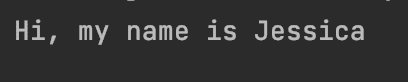
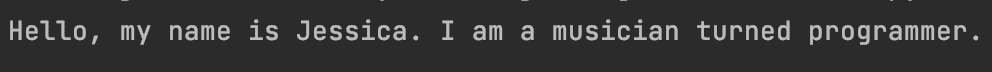
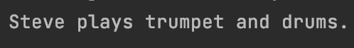
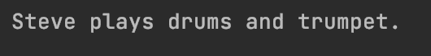
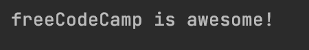
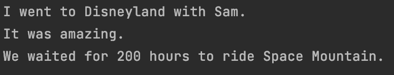
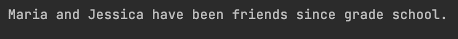
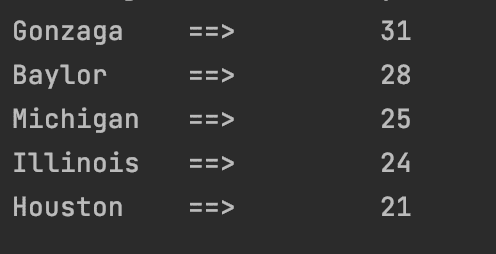
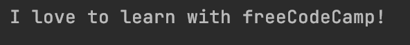

# Python 字符串格式–Python 的打印格式示例

> 原文：<https://www.freecodecamp.org/news/python-string-format-python-s-print-format-example/>

在 Python 中，有几个选项可以用来格式化字符串。在本文中，我将讨论`str.format()`、格式化字符串和模板字符串。

但是首先，让我们看看什么被认为是格式化字符串的“老方法”。

## Python 中的% string 格式是什么？

Python 中格式化字符串的一种老方法是使用`%`操作符。

下面是基本语法:

```
"This is a string %s" % "string value goes here"
```

您可以创建字符串并在该字符串中使用`%s`,它就像一个占位符。然后你可以写`%`,后面是你想要使用的实际字符串值。

下面是一个使用`%`字符串格式的基本例子。

```
print("Hi, my name is %s" % "Jessica")
```



这种方法通常被称为“旧”方法，因为 Python 3 引入了`str.format()`和格式化字符串文字。

## Python 中的`str.format()`方法是什么？

下面是`str.format()`方法的基本语法:

```
"template string {}".format(arguments)
```

在模板字符串中，我们可以使用`{}`作为参数的占位符。参数是将在字符串中显示的值。

在这个例子中，我们想要打印`"Hello, my name is Jessica. I am a musician turned programmer."`

在字符串中，我们总共有三个`{}`，它们将作为杰西卡、音乐家和程序员的值的占位符。这些被称为格式字段。

```
"Hello, my name is {}. I am a {} turned {}."
```

在这些用于`str.format()`的括号中，我们将使用“杰西卡”、“音乐家”和“程序员”的值。

```
.format("Jessica", "musician", "programmer")
```

下面是完整的代码和打印的句子:

```
print("Hello, my name is {}. I am a {} turned {}.".format("Jessica", "musician", "programmer"))
```



### 位置参数

您可以使用`{}`中的索引号来访问这些参数的值。

在这个例子中，我们在`.format()`中有两个参数`"trumpet"`和`"drums"`。

```
.format("trumpet", "drums")
```

我们可以通过引用索引号来访问字符串中的那些值。`{0}`是指`"trumpet"`的第一个自变量，`{1}`是指`"drums"`的第二个自变量。

```
"Steve plays {0} and {1}."
```

下面是完整的代码和打印的句子:

```
print("Steve plays {0} and {1}.".format("trumpet", "drums")) 
```



我们可以修改这个例子并交换字符串中的索引号。你会注意到句子变了，参数的位置也换了。

```
print("Steve plays {1} and {0}.".format("trumpet", "drums")) 
```



### 关键字参数

这些参数由一对`key` `value`组成。我们可以通过使用`{}`中的`key`来访问论点的`value`。

在这个例子中，我们有两个键叫做`organization`和`adjective`。我们将在字符串中使用这些键。

```
"{organization} is {adjective}!"
```

在`.format()`里面，我们有`key` `value`对。

```
.format(organization="freeCodeCamp", adjective="awesome")
```

这是完整的代码和打印的句子。

```
print("{organization} is {adjective}!".format(organization="freeCodeCamp", adjective="awesome")) 
```



### 如何混合关键字和位置参数

在`str.format()`中，你可以混合关键字和位置参数。

在这个例子中，我们将创作一个关于去迪斯尼乐园的小故事。

我们首先要为名字、数字、形容词和迪士尼乐园游乐项目创建一些变量。

```
name = "Sam"
adjective = "amazing"
number = 200
disney_ride = "Space Mountain"
```

然后，我们希望使用关键字和位置参数来创建字符串。我将添加`\n`来告诉计算机在每个句子后创建一个新行。

```
"I went to {0} with {name}.\nIt was {adjective}.\nWe waited for {hours} hours to ride {ride}."
```

在`str.format()`的括号内，我们将把变量分配给`name`、`adjective`、`hours`和`disney_ride`的键。`{0}`将具有`"Disneyland"`的值。

```
.format("Disneyland", name=name, adjective=adjective, hours=number, ride=disney_ride)
```

下面是完整的代码和打印的句子:

```
name = "Sam"
adjective = "amazing"
number = 200
disney_ride = "Space Mountain"

print("I went to {0} with {name}.\nIt was {adjective}.\nWe waited for {hours} hours to ride {ride}."
      .format("Disneyland", name=name, adjective=adjective, hours=number, ride=disney_ride))
```



## 什么是格式化字符串？

格式化字符串文字(或 f 字符串)允许您在字符串中包含表达式。就在字符串前面，你放置一个`f`或`F`，告诉计算机你想使用一个`f-string`。

下面是基本语法:

```
variable = "some value"
f"this is a string {variable}"
```

下面是一个打印句子`Maria and Jessica have been friends since grade school.`的基本示例

```
name = "Jessica"
print(f"Maria and {name} have been friends since grade school.")
```

如果我在字符串前使用大写字母`F`,效果是一样的。

```
name = "Jessica"
print(F"Maria and {name} have been friends since grade school.")
```



您还可以使用`f-string`来格式化字典中的数据。

在这个例子中，我们有一个字典，它表示男子大学篮球队的最高排名以及他们在 32 场比赛中赢了多少场。

```
rankings = {"Gonzaga": 31, "Baylor": 28, "Michigan": 25, "Illinois": 24, "Houston": 21} 
```

我们可以使用一个`for loop`和`items()`方法来遍历`rankings`字典中的每一个`key value`对。

```
for team, score in rankings.items(): 
```

在`for loop`中，我们可以使用一个`f-string`来格式化打印结果。

对`{team:10}`和`{score:10d}`使用`:`告诉计算机创建一个 10 个字符宽的字段。这将为数据创建偶数列。

这里的`{score:10d}`里面的`d`是指十进制整数。

```
 print(f"{team:10} ==> {score:10d}")
```

下面是完整的代码和打印输出:

```
rankings = {"Gonzaga": 31, "Baylor": 28, "Michigan": 25, "Illinois": 24, "Houston": 21}

for team, score in rankings.items():
    print(f"{team:10} ==> {score:10d}")
```



## 什么是模板字符串？

模板字符串是使用占位符表示真实值的 Python 字符串。

下面是基本语法:

```
Template("$placeholder").substitute(placeholder="real value")
```

让我们看一个例子来更好地理解它是如何工作的。

在这个例子中，我们想要使用模板字符串打印`I love to learn with freeCodeCamp!`。

为了使用模板字符串，首先必须从标准库中导入`Template`类。

```
from string import Template 
```

然后可以使用`Template`类并在括号内提供一个字符串。我们将在`name`前面放置一个`$`，它稍后将被实际值替换。

```
Template("I love to learn with $name!")
```

然后，我们将`.substitute`添加到模板中，并将`freeCodeCamp`的值赋给`name`。

```
.substitute(name="freeCodeCamp")
```

下面是完整的代码和打印输出:

```
from string import Template

print(Template("I love to learn with $name!").substitute(name="freeCodeCamp"))
```



## 结论

在 Python 中有很多方法来格式化你的字符串。

格式化字符串的老方法是使用`%`操作符。

```
"This is a string %s" % "string value goes here" 
```

`%s`充当实际值的占位符。您将实际值放在`%`操作符之后。

这种方法通常被称为“旧”方法，因为 Python 3 引入了`str.format()`和格式化字符串文字(f 字符串)。

在`str.format()`方法中，您使用`{}`作为占位符，并将真实值放在括号内。这个方法可以接受位置和关键字参数。

```
"template string {}".format(arguments)
```

格式化字符串文字(或 f 字符串)允许您在字符串中包含表达式。就在字符串前面，你放置一个`f`或`F`，告诉计算机你想使用一个`f-string`。

```
variable = "some value"
f"this is a string {variable}"
```

还可以通过从标准库中导入`Template`类来使用模板字符串。模板字符串是使用占位符表示真实值的 Python 字符串。

```
Template("$placeholder").substitute(placeholder="real value")
```

我希望这篇文章对您有所帮助，并祝您在 Python 之旅中好运。