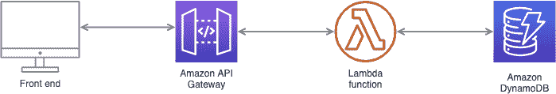
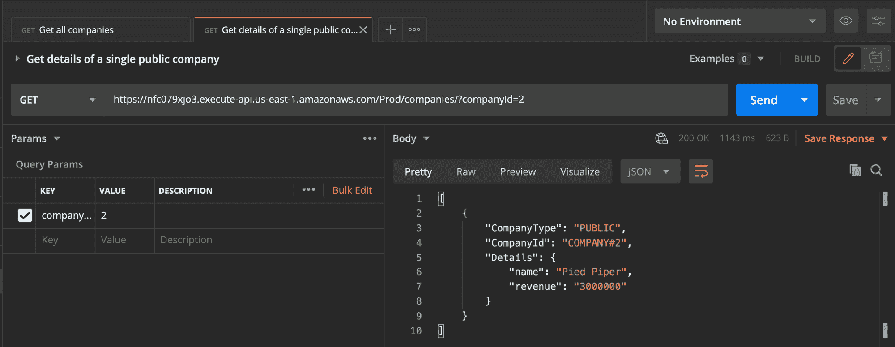
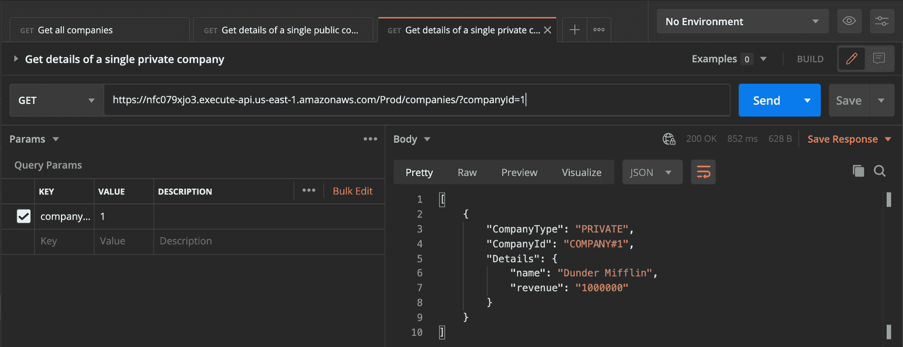
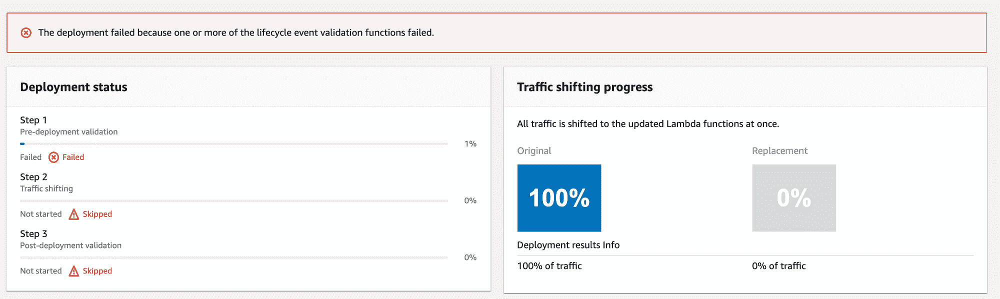
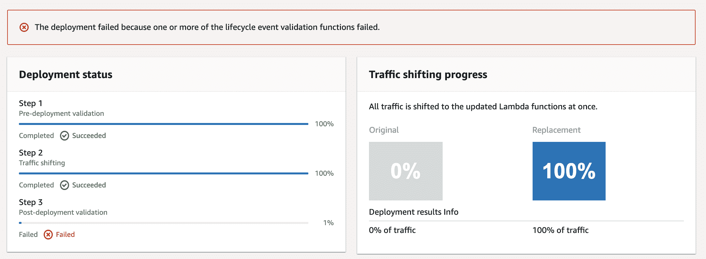

# 如何在 AWS 中测试无服务器应用程序

> 原文：<https://www.freecodecamp.org/news/how-to-test-serverless-applications-in-aws/>

在过去的几年里，无服务器架构变得非常流行。这在很大程度上是因为它消除了管理基础架构(如服务器、存储、数据库、可扩展性等)的负担。

当人们第一次开始使用术语“无服务器”时，它在行业中造成了一些混乱。一些人开玩笑地想知道没有服务器他们如何运行应用程序。

服务器仍然存在，但是它们的管理和操作由云提供商代表你来处理。

使用无服务器架构使组织和工程师能够专注于重要的事情——构建出色、高性能且经济高效的应用程序，在市场中脱颖而出。

## 如何测试无服务器架构？

虽然无服务器在构建和发布软件的过程中引入了许多简单性，但是在测试过程中会出现一些挑战。

首先，本地测试很复杂，因为无服务器应用依赖于云服务。对于单元测试和集成测试来说都是如此，在单元测试和集成测试中，您需要模拟和存根服务来确保应用程序正常工作。

尽管这可能是一点额外的工作，但它提供了一种更好的隔离测试方法，并且您的管道将会因为代码中的问题而开始失败，而不是依赖关系。

其次，集成测试更加困难和重要，因为有多个服务/组件集成在一起。除了潜在的现有代码缺陷之外，这增加了产生配置/设置错误的风险。

那我们应该测试什么？我们如何在单元级和集成级测试我们的应用程序？

考虑到我们在本地开发时嘲笑了其他服务，我们如何确保我们的应用程序在真实环境中正常工作？

我们如何在不测试服务本身的情况下测试与云服务(本例中是 AWS 服务)的交互？

本文旨在回答这些问题，以帮助您有效地测试您的无服务器应用程序。所以让我们开始吧。

## 我们在建造什么？

AWS 提供一套无服务器服务(在云中运行的服务，在我们不管理的硬件和系统上运行)。这篇文章将涉及其中的一些:

*   λ(云函数)
*   API 网关
*   DynamoDB

由于这篇文章主要关注测试无服务器应用程序，我们将使用我以前开发的一个应用程序作为例子。这个应用程序返回虚假上市公司的列表。

该架构将如下所示:



随意看看运行在 AWS 上的[演示应用](https://companies-data-demo.s3.amazonaws.com/index.html)(请原谅 UI 设计)。

该应用程序有一个前端，它对后端进行 restful API 调用。这些调用通过 API 网关到达 Lambda，Lambda 查询公开上市公司的 DynamoDB 并返回结果。

所有后台代码都在`api`文件夹下。我们将开始孤立地查看每个组件，然后测试集成。首先，[克隆这里的库](https://github.com/AHaydar/companies-data-demo)。

让我们测试一下这个应用程序。

## 对应用程序进行单元测试

正如我前面提到的，我们的后端有三个组件:DynamoDB、Lambda 和 API Gateway。在这一节中，我们将介绍如何对这些组件进行单元测试。

### 如何在 DynamoDB 上运行单元测试

构建 DynamoDB 的基础架构代码如下所示:

```
 Resources:
  CompaniesTable:
    Type: AWS::DynamoDB::Table
    Properties:
      TableName: companies
      AttributeDefinitions:
        - AttributeName: CompanyId
          AttributeType: S
        - AttributeName: CompanyType
          AttributeType: S
      KeySchema:
        - AttributeName: CompanyId
          KeyType: HASH
        - AttributeName: CompanyType
          KeyType: RANGE
      ProvisionedThroughput:
        ReadCapacityUnits: 5
        WriteCapacityUnits: 5
      Tags:
        - Key: author
          Value: ali

  CompaniesTableReadOnlyAccessPolicy:
    Type: AWS::IAM::ManagedPolicy
    Properties:
      Description: Policy for Read only companies table
      ManagedPolicyName: companies-readonly-access
      Path: /
      PolicyDocument:
        Version: 2012-10-17
        Statement:
          - Sid: CompaniesReadOnlyAccess
            Effect: Allow
            Action:
              - 'dynamodb:Scan'
              - 'dynamodb:GetItem'
              - 'dynamodb:Query'
            Resource:
              - !GetAtt CompaniesTable.Arn 
```

通过导航到 AWS CloudFormation 并上传模板，我们将提供一个 DynamoDB 表，主要是由“CompanyId”和“CompanyType”字段组成的主键。我们还将有一个 IAM 策略，允许我们访问表。

那么这里有什么需要测试的吗？

DynamoDB 模式主要是基于访问模式定义的。这就是我们如何创建主键，决定散列键和排序键，等等。

例如，如果一个字段(或字段组合)不是主键，我们就不会得到记录，除非我们在那个字段上定义一个辅助索引。因此，当我们测试 Dynamo DB 的设置时，我们应该关注我们的业务用例。

请记住，我们并不是在测试 DynamoDB 本身的功能(AWS 在这方面做得非常好)。相反，我们在测试我们如何与之互动。

可以导航到 AWS，添加一些项目，然后确保它们在 AWS 控制台上可见并可过滤。够了吗？这种可访问性模式将以编程方式发生。在现实生活中，Lambda 函数(下一节)将尝试访问数据库。

我通常编写一个小的 bash 脚本，在提供表之后执行，并检查访问模式是否工作正常。例如:

```
#!/bin/bash

# Insert a record into the dynamoDB table
aws dynamodb put-item \
 --table-name companies \
 --item '{
  "CompanyId": { "S": "COMPANY#4" },
  "CompanyType": { "S": "PRIVATE" },
  "Details": { "M": {
    "name": { "S": "Awesome Company" },
    "revenue": { "S": "1000000" }
    } }
  }' \
 --return-consumed-capacity TOTAL \
 --return-item-collection-metrics SIZE

 # Query the added record from the table
 RESULT=$(
 aws dynamodb get-item \
 --table-name companies \
 --key file://key.json \
 --return-consumed-capacity TOTAL
 )
 echo $RESULT
### OUTPUT ###
#  {
#   "Item": {
#     "Details": {
#       "M": { "name": { "S": "Kousa" }, "revenue": { "S": "1000000" } }
#     },
#     "CompanyType": { "S": "PRIVATE" },
#     "CompanyId": { "S": "COMPANY#4" }
#   },
#   "ConsumedCapacity": { "CapacityUnits": 0.5, "TableName": "companies" }
# }

# parse the name and verify it's correct
NAME=$(jq -r '.Item.Details.M.name.S' <<< "$RESULT")
echo $NAME

if [ "$NAME" = "Awesome Company" ]; then
    echo 'The item was retrieved correctly.'
    exit 0
else
    echo 'Something went wrong. Double-check the schema or the query.'
    exit 1
fi

# Delete the added item
aws dynamodb delete-item \
--table-name companies \
--key file://key.json 
```

但是，除了编写 bash 脚本之外，还有一些额外的工作，包括:

*   我们应该什么时候执行脚本？
*   它也会在测试数据库上执行吗？有风险吗？
*   如果数据库已经被使用了(例如，我们在表中添加了一个索引)，该怎么办？
*   这个脚本的执行依赖于将 AWS 凭证作为环境变量提供——可能它们已经是 CI/CD 管道的一部分
*   这是否涵盖了允许访问表的 IAM 策略的测试？

写这种测试有价值吗？这是一件需要具体情况具体分析的事情。大多数情况下，我们需要权衡自动化基础设施配置测试的好处和我们在开发和维护这些测试上花费的时间。

例如，假设我们在多个团队中使用这个表用于多个目的。在这种情况下，将表基础设施代码和测试放在一个单独的存储库中可能是值得的，在对表的任何更改部署到生产环境之前，我们在那里执行测试。

我们不想破坏任何可能依赖于此表的功能。为了不因为新的更改而导致测试环境中断或损坏表数据，我们可以在 AWS 中提供一个带有更改的临时表，运行我们的测试，并且只有在这些测试通过时才更新测试数据库。

综上所述，我们的 CI/CD 渠道做了以下工作:

*   在 AWS 测试环境中提供一个新的临时表(不接触真实的测试数据库)
*   在临时表上运行 bash 测试
*   成功时，删除临时表并更新实际测试表
*   失败时，删除临时表并停止进一步的更改

### 如何在 Lambda 上运行单元测试

查看原始代码，它看起来并不理想，因为它包含了 Lambda 处理程序中的所有逻辑(这是一个做多种事情的大函数):

```
const { DynamoDB } = require('@aws-sdk/client-dynamodb'); // importing library from aws-sdk that allows the interaction with dynamodb
const { unmarshall } = require('@aws-sdk/util-dynamodb'); // importing unmarshall function, which converts a DynamoDB record into a JavaScript object

exports.lambdaHandler = async (event, context) => {
  try {
    console.log('here is the event received', event);
    const dynamodb = new DynamoDB({ region: 'us-east-1' }); // creating a new instance of DynamoDB
    const params = {
      TableName: 'companies',
    };

    // if no query parameter was passed to the function, then update the dynamodb params to query all companies
    if (!event.queryStringParameters) {
      params.ExpressionAttributeValues = {
        ':companyType': {
          S: 'PUBLIC',
        },
      };
      params.FilterExpression = 'CompanyType = :companyType';
    }
    // if the companyId query paramater was passed, then update the dynamodb params to filter according that company exactly
    else {
      params.ExpressionAttributeValues = {
        ':companyId': {
          S: `COMPANY#${event.queryStringParameters.companyId}`,
        },
      };
      params.FilterExpression = 'CompanyId = :companyId';
    }

    const results = await dynamodb.scan(params); // get the results from dynamodb according to the previously set params
    console.log('results', results);
    let unmarshalledResults = [];

    // unmarshall every record returned (convert it into a JS object)
    for (const item of results.Items) {
      const unmarshalledRecord = unmarshall(item);
      unmarshalledResults.push(unmarshalledRecord);
    }

    console.log('unmarshalled results', unmarshalledResults);

    return {
      statusCode: 200,
      headers: {
        'Content-Type': 'application/json',
        'Access-Control-Allow-Origin': '*',
      },
      body: JSON.stringify(unmarshalledResults),
    };
  } catch (e) {
    console.error('something went wrong', e);
    return {
      statusCode: 500,
      body: 'Something has gone wrong, please contact the support team',
    };
  }
}; 
```

请注意，在 DynamoDb 上使用扫描操作需要在生产环境中仔细考虑，因为它对整个表进行操作。这可能会导致性能问题或消耗为表保留的读取容量。

那么这段代码在做什么呢？

为了更好的可测试性，最好将关注点分开，所以我们将创建一个新函数来处理与 DynamoDb 的交互，并让 lambda 处理程序在需要时调用它。

所以我们取出了查询 DynamoDB 并将结果转换成 JS 对象的那部分。新文件和函数如下所示:

```
const { DynamoDB } = require('@aws-sdk/client-dynamodb');
const { unmarshall } = require('@aws-sdk/util-dynamodb');

const dynamodb = new DynamoDB({ region: 'us-east-1' });

const scanAndFilterData = async (params) => {
    const results = await dynamodb.scan(params);
    console.log('results', results);
    let unmarshalledResults = [];

    for (const item of results.Items) {
      const unmarshalledRecord = unmarshall(item);
      unmarshalledResults.push(unmarshalledRecord);
    }

    console.log('unmarshalled results', unmarshalledResults);
    return unmarshalledResults;
}

module.exports = { scanAndFilterData } 
```

Lambda 处理程序将只处理接收事件并将其传递给与数据库交互的函数。

### 如何对代码进行单元测试

对`scanAndFilterData`函数进行单元测试需要模仿我们正在使用的@aws-sdk 库。否则，我们也会在测试中覆盖库本身，这是我们不希望的。

此外，这可能会增加访问 DynamoDB 表的复杂性，这将由库自动完成(例如，我们需要在测试中处理凭证)。因此，我们要么必须 stub dynamo db，要么模仿与之交互的函数。

```
const { scanAndFilterData } = require('../dynamoDbData');

jest.mock('@aws-sdk/client-dynamodb', () => {
    return {
        DynamoDB: jest.fn().mockReturnValue({scan: jest.fn().mockReturnValue({Items: ['item1', 'item2']})})
    }
})

jest.mock('@aws-sdk/util-dynamodb', () => {
    return {
        unmarshall: jest.fn().mockReturnValue('test')
    }
})

describe('scanAndFilterData', () => {
    it('should scan the dynamoDB table and unmarchall the returned records', async () => {
        const mockedDynamoDBInstance = require('@aws-sdk/client-dynamodb').DynamoDB;
        const params = 'test'
        const result = await scanAndFilterData(params);
        expect(mockedDynamoDBInstance.mock.results[0].value.scan).toHaveBeenCalledWith(params);
        const mockedUnmarshall = require('@aws-sdk/util-dynamodb').unmarshall;
        expect(mockedUnmarshall).toHaveBeenNthCalledWith(1, 'item1');
        expect(mockedUnmarshall).toHaveBeenNthCalledWith(2, 'item2');

        expect(result).toEqual(['test','test']);

    })
}) 
```

旁注:注意我们测试的是代码而不是行为。当我开始编写单元测试时，我花了一段时间来改变我的思维模式并以这种方式看待它。

这与 E2E 测试不同，后者通常更关注行为。基本上，我们查看每一行代码，并在测试中验证它写得是否正确(例如，调用了一个函数)。

但是我们仍然可以混合代码和行为测试。我们可以根据具体情况决定测试的风格——我通常倾向于在代码有依赖关系时测试代码，在函数是纯函数时测试行为。

类似于我们如何测试`scanAnFilterData`函数，我们将测试 lambda 处理函数。测试应该是这样的(请注意，测试并不完整，但足以让人理解这个想法):

```
const { lambdaHandler } = require("../app");

jest.mock('../dynamoDbData', () => {
    return {
        scanAndFilterData: jest.fn()
    };
})

describe('lambda handler', () => {
    it('should only filter by compay type and return the result accordingly', async ()=> {
        const event = {}
        const result = await lambdaHandler(event);
        const mockedScanAndFilterData = require('../dynamoDbData').scanAndFilterData
        expect(mockedScanAndFilterData).toHaveBeenCalledWith({"ExpressionAttributeValues": {":companyType": {"S": "PUBLIC"}}, "FilterExpression": "CompanyType = :companyType", "TableName": "companies"});
    })
    it('should filter by passed company ID and return the result accordingly', async ()=> {
        const event = {queryStringParameters: {companyId: '1'}};
        const result = await lambdaHandler(event);
        const mockedScanAndFilterData = require('../dynamoDbData').scanAndFilterData
        expect(mockedScanAndFilterData).toHaveBeenCalledWith({"ExpressionAttributeValues": {":companyId": {"S": "COMPANY#1"}}, "FilterExpression": "CompanyId = :companyId", "TableName": "companies"});
    })
}) 
```

## 如何在应用上运行集成测试

我们已经跳过了单独测试 API Gateway 组件，因为我们将在集成测试中讨论它。

我们将把集成测试分成两部分:全流程测试和 Lambda 集成测试。

### 全流量测试

全流程测试是涵盖 API 网关、Lambda 和 DynamoDB 表的 API 测试。

我们可以使用任何工具来执行这些测试(比如 Postman、摩卡/Chai/Cucumber 的组合等等)。下面是几个场景:

*   获取所有上市公司:


*   获取单个上市公司的详细信息:



*   获取单个私营公司的详细信息:



最后一个场景显示了一个安全缺陷，用户可以通过在请求的 path 参数中选择一个随机 ID 来获取一家私人公司的信息。

个人观点——我宁愿将 API 测试作为代码的一部分来构建，而不是使用外部工具，比如 Postman。

Postman 为 API 测试提供了优秀的工具。但是在同一个存储库或版本控制之外管理集合和请求不便于团队之间的协作，也不会鼓励开发人员编写这种测试。

为了执行这些测试，我们需要一个正确配置并包含必要数据的环境。不同的团队会使用各种方法来创建数据:

*   让数据在环境中始终可用，假设我们只是检索数据。
*   一个 API 创建数据，另一个 API 删除数据。作为测试的一部分，我们可以依靠这些 API 来准备和清理数据。这是我的首选方法，因为它消除了对现有环境和数据的任何依赖或假设。

我将这组测试视为 E2E 测试，因为它们覆盖了功能，并隐藏了我们项目中三个组件之间的任何内部集成。

有些人会不同意，因为这并没有涵盖我们正在测试的应用程序的前端，这是一个很好的观点。

然而，另一种方法是单独添加一些 UI 测试，一些契约测试，并将它们与这些 API 测试结合起来，以覆盖整个系统的功能。

### λ集成测试

本节将讨论 Lambda 部署，以及我们如何控制流量以实现更安全的部署。这与测试 Lambda 与其他服务(本例中是 DynamoDB)的集成密切相关。

我们将使用“CodeDeploy”服务，依靠 lambda 的“流量前”和“流量后”挂钩来研究流量转移。

这些流量挂钩是独立的 lambda 函数，在运行之前和之后进行健全性检查，将流量转移到我们已经实现的 Lambda 的新版本。这将有助于避免部署后的任何停机和中断。

钩子允许我们决定部署应该通过还是失败。预流量挂钩使我们能够在新部署的 Lambda 被使用之前(在任何流量转移之前)对其进行测试。一段代码如下所示:

```
 exports.handler = (event, context, callback) => {

  const deploymentId = event.DeploymentId;
  const lifecycleEventHookExecutionId = event.LifecycleEventHookExecutionId;
  const functionToTest = process.env.NewVersion;

  // Create parameters to pass to the updated Lambda function that
  // include the newly added "time" option. If the function did not
  // update, then the "time" option is invalid and function returns
  // a statusCode of 400 indicating it failed.
  const lambdaParams = {
    FunctionName: functionToTest,
    InvocationType: "RequestResponse",
  };

  const lambdaResult = "Failed";
  lambda.invoke(lambdaParams, function (err, data) {
    if (err) {
      console.log(err, err.stack);
      lambdaResult = "Failed";
    } else {
      const result = JSON.parse(data.Payload);
      if (result.statusCode != "400") {
        console.log("Validation succeeded");
        lambdaResult = "Succeeded";
      } else {
        console.log("Validation failed");
      }

      var params = {
        deploymentId: deploymentId,
        lifecycleEventHookExecutionId: lifecycleEventHookExecutionId,
        status: lambdaResult, // status can be 'Succeeded' or 'Failed'
      };

      codedeploy.putLifecycleEventHookExecutionStatus(
        params,
        function (err, data) {
          if (err) {
            console.log("CodeDeploy Status update failed");
            console.log(err, err.stack);
            callback("CodeDeploy Status update failed");
          } else {
            console.log("CodeDeploy status updated successfully");
            callback(null, "CodeDeploy status updated successfully");
          }
        }
      );
    }
  });
}; 
```

在这段代码中，我们调用了 main 函数，如果状态代码不同于 400，则将状态更新为 Failed。这只是一个例子——在这种情况下，我们可以做任何检查，比如验证从数据库返回的响应，等等。

一旦我们得到了我们需要的(或不需要的)响应，我们就通知 CodeDeploy 使用`codedeploy.putLifecycleEventHookExecutionStatus`更新状态。如果状态为失败，则“代码部署”停止任何未来的流量转移，并保持原始的λ:



类似地，在“流量之后”钩子中，我们可以在流量被重定向到新版本之后进行必要的检查。我通常使用 After Traffic hooks 来测试 API，使用诸如 [axios](https://github.com/axios/axios) 之类的库，这与我们在 Postman 中测试的非常相似。代码如下所示:

```
exports.handler = (event, context, callback) => {
  const deploymentId = event.DeploymentId;
  const lifecycleEventHookExecutionId = event.LifecycleEventHookExecutionId;
  let lambdaResult = "Failed";
  axios
    .get(
      "https://nfc079xjo3.execute-api.us-east-1.amazonaws.com/Prod/companies"
    )
    .then(function (response) {
      if (response.data.length == 2) {
        lambdaResult = "Succeeded";
      }
    })
    .catch(function (error) {
      console.log("An error occured", error);
    })
    .then(function () {
      const params = {
        deploymentId: deploymentId,
        lifecycleEventHookExecutionId: lifecycleEventHookExecutionId,
        status: lambdaResult, // status can be 'Succeeded' or 'Failed'
      };
      codedeploy.putLifecycleEventHookExecutionStatus(
        params,
        function (err, data) {
          if (err) {
            // Validation failed.
            console.log("AfterAllowTestTraffic validation tests failed");
            console.log(err, err.stack);
            callback("CodeDeploy Status update failed");
          } else {
            // Validation succeeded.
            console.log("AfterAllowTestTraffic validation tests succeeded");
            callback(null, "AfterAllowTestTraffic validation tests succeeded");
          }
        }
      );
    });
}; 
```

这足以取代 API 测试吗？

在 after 挂钩失败时，CodeDeploy 将回滚 Lambda 的先前版本。



## 结论

确保我们开发的应用程序是高质量的是至关重要的。测试是证实这一点的方法之一。

按照测试金字塔，编写尽可能多的测试来覆盖基础(单元测试)，测试集成，最后用 E2E 测试覆盖整个流程。

在无服务器应用中，测试仍然是一样的，围绕集成测试和部署做了一些额外的调整。这种配置支持流量转移，并可能在让您的客户满意方面发挥重要作用。

您可能仍然希望在本地环境中测试您的应用程序。有像 [localstack](https://github.com/localstack/localstack) 这样的工具可以帮助解决这个问题。

您如何测试您的无服务器应用程序？

## 参考

[https://docs . AWS . Amazon . com/white papers/latest/server less-architectures-lambda/welcome . html](https://docs.aws.amazon.com/whitepapers/latest/serverless-architectures-lambda/welcome.html)

[https://www . server less . com/framework/docs/providers/AWS/guide/testing/](https://www.serverless.com/framework/docs/providers/aws/guide/testing/)

[https://docs . AWS . Amazon . com/server less-application-model/latest/developer guide/automating-updates-to-server less-apps . html](https://docs.aws.amazon.com/serverless-application-model/latest/developerguide/automating-updates-to-serverless-apps.html)

[https://blog.outwiththeold.info/posts/testable-lambda/](https://blog.outwiththeold.info/posts/testable-lambda/)