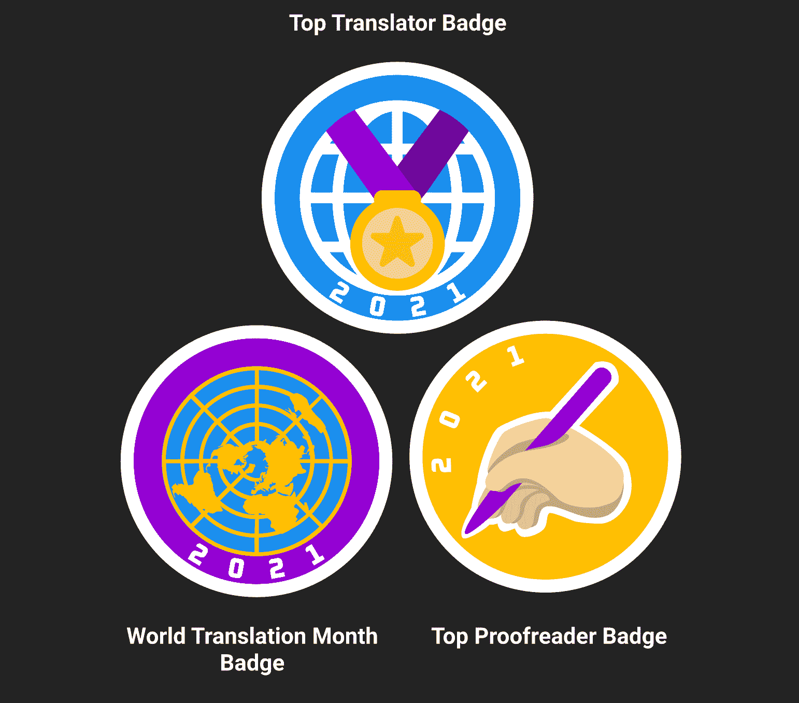
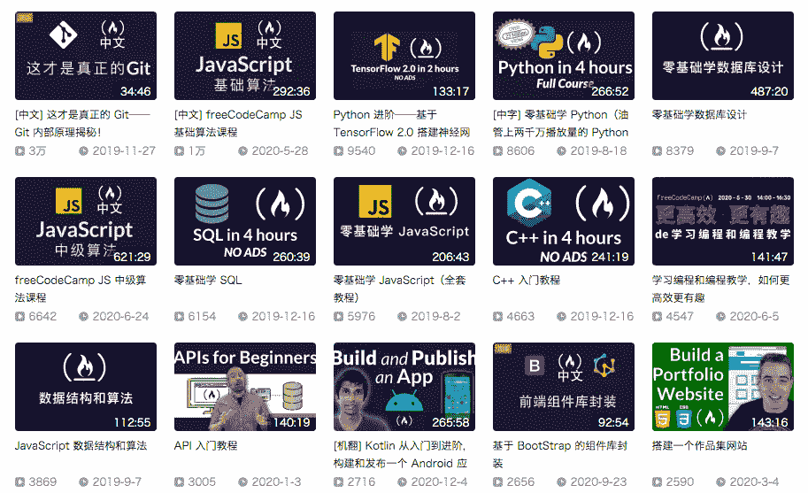
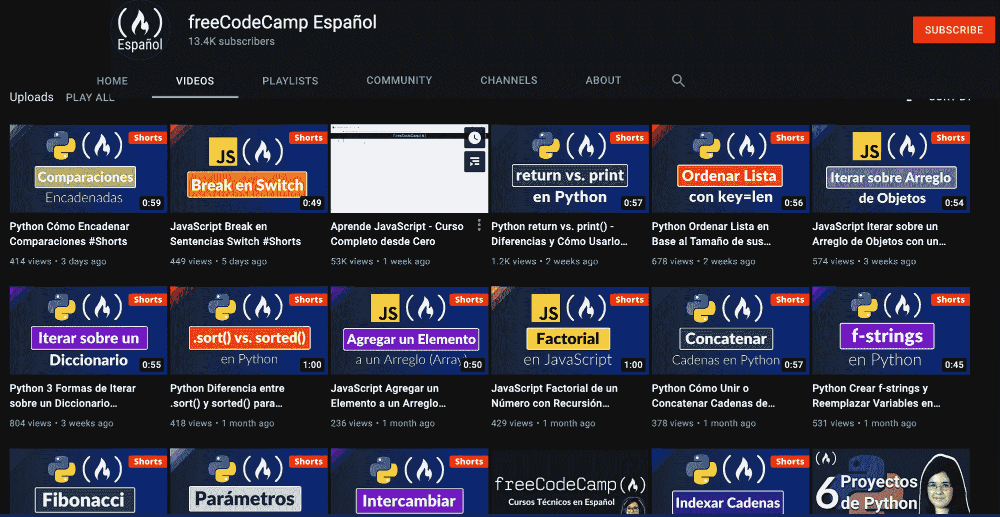
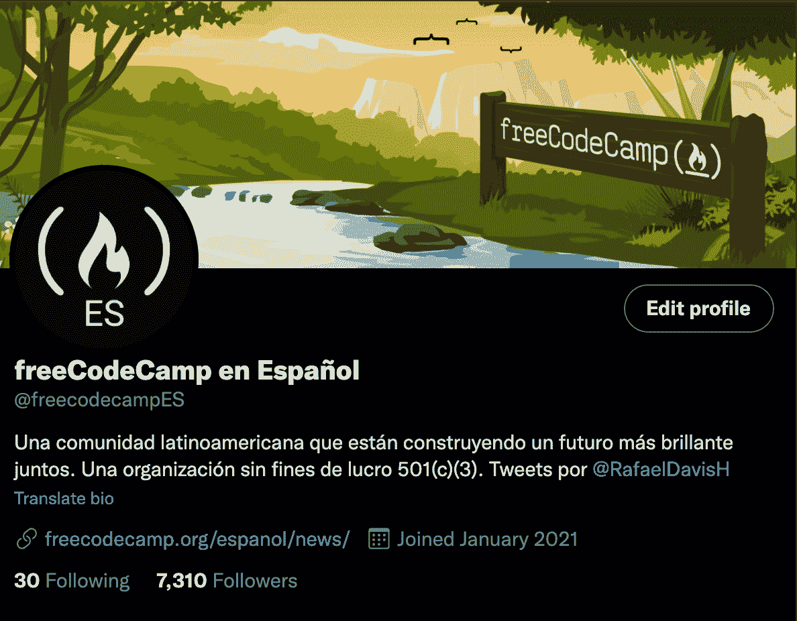

# 世界翻译月——帮助我们将 freeCodeCamp 翻译成您的母语

> 原文：<https://www.freecodecamp.org/news/world-translation-month-event/>

我们认为，每个人都有权获得用自己母语进行的免费编程教育。因此，我们将国际翻译日(9 月 30 日)扩展为一个月。

在过去的几年里，数百名志愿者贡献者已经将 freeCodeCamp 翻译成了世界上主要的语言。二月份， [Quincy 宣布【freeCodeCamp 已经成功推出了西班牙语版和中文版。葡萄牙语和意大利语紧随其后。](https://www.freecodecamp.org/news/world-language-translation-effort/)

在世界翻译月期间，我们将庆祝我们共同取得的成就，以及我们将为世界各地的每个人实现的成就。观看这段一分钟的发布视频:

[https://www.youtube.com/embed/i2XjBz_U28E?feature=oembed](https://www.youtube.com/embed/i2XjBz_U28E?feature=oembed)

*如果你有兴趣参与将 freeCodeCamp 翻译成任何一种世界语言，你可以[访问我们的贡献者频道，了解更多](https://chat.freecodecamp.org/channel/contributors)。*

## 最新翻译成果

如今，我们已经成功推出了意大利语和巴西葡萄牙语课程。我们渴望看到这些活跃社区的未来。

乌克兰社区的翻译工作已经开始起步。他们有八个认证完全翻译，两个接近 100%，几乎都在一个月内完成。见证每一个语言群体所表现出的奉献精神和毅力是非常了不起的。

我们有多个其他社区和个人正在将课程翻译成他们的母语。您可以在这里查看所有活动翻译的当前状态及其进度。

## 当前翻译进度

| 世界语 | 课程% | 文档% |
| --- | --- | --- |
| 阿非利堪斯语 | 1% | 59% |
| 阿拉伯语 | 11% | 29% |
| 阿塞拜疆人 | 2% | 1% |
| 孟加拉语 | 27% | 1% |
| 加泰罗尼亚语 | 3% | 1% |
| 中国人 | 65% | 56% |
| 捷克人 | 1% | 17% |
| 丹麦的 | 1% | 18% |
| 荷兰人 | 4% | 23% |
| 结束 | 1% | 17% |
| 法语 | 20% | 45% |
| 德国人 | 31% | 98% |
| 希腊的 | 1% | 1% |
| 希伯来人 | 1% | 1% |
| 印地语 | 1% | 11% |
| 匈牙利的 | 1% | 1% |
| 印度尼西亚的 | 7% | thirty percent |
| 意大利的 | 80% | 100% |
| 日本人 | 79% | 99% |
| 韩国的 | 1% | 1% |
| 挪威的 | 1% | 17% |
| 波斯人 | 12% | 5% |
| 抛光剂 | 1% | 19% |
| 葡萄牙语-BR | 79% | 100% |
| 罗马人 | 48% | 31% |
| 俄语 | 15% | 95% |
| 西班牙语 | 44% | 84% |
| 斯瓦希里语。亦称 KISWAHILI | 1% | 1% |
| 瑞典的 | 1% | 19% |
| 泰米尔人 | ！% | 34% |
| 泰卢固语 | 1% | 4% |
| 土耳其的 | 3% | 4% |
| 乌克兰的 | 77% | 74% |
| 越南人 | 1% | 4% |

目前，世界各地的志愿者正在将 freeCodeCamp 的课程翻译成 28 种世界语言。

这些世界语言中有许多显示出显著的进步，尤其是法语、罗马尼亚语、日语和德语社区。继续努力吧！

## 世界翻译月活动的目标是什么？

freeCodeCamp 的目标是为每个人提供将课程翻译成母语的工具。此外，我们将为这一活动奉献我们所有的努力和时间，以实现每一种世界语言的重大进步。

我们目睹了少数几个贡献者为了一个单一的目标能够一起做些什么。我们希望世界翻译月将成为一年一度的活动，届时所有世界语言都可以庆祝获得由他们的社区为他们的社区翻译的免费编程教育。

## 我们的奖励系统🥇

freeCodeCamp 希望让每一个参与的贡献者都有一个难忘的经历。

在 WTM 活动期间，我们将为所有参与者颁发世界翻译月徽章。此外，在活动结束时，我们将向做出最大贡献的顶级翻译和顶级校对人员颁发特殊徽章。

如果您愿意，您可以在您的 freeCodeCamp 课程和论坛个人资料中显示这些徽章。

2021 World Translation Month badges

## freeCodeCamp 本地化路线图

freeCodeCamp 课程已经有中文和西班牙文版本。除此之外，由于数百名贡献者的努力，这些社区还拥有许多其他资源。

例如，说中文的社区已经将几乎所有的认证翻译成中文。他们还翻译了近 600 篇文章，有 10 个 freeCodeCamp 的视频教程带有关于[哔哩哔哩](https://space.bilibili.com/335505768/video)的字幕，他们还在大学和高中组织了数百次聚会、黑客马拉松、会议、现场编码活动和编码研讨会。

freeCodeCamp bilibili 频道

西班牙语社区有前两个可用的西班牙语认证，他们已经翻译了大约 250 篇文章。社区成员还撰写了大约 20 篇原创文章，创建了 3 个原创全长视频教程， [Estefania](https://www.freecodecamp.org/news/p/fc63f178-c627-414a-8ae6-877eb3458261/@EstefaniaCassN) 为西班牙 YouTube 频道创建了 24 个短视频。

在 YouTube 和 T2 的 Twitter 上，西班牙语社区的反应非常显著。由于 Estefania 通过在 YouTube 上发布帖子和短视频与社区互动，该频道现在有超过 12，000 名粉丝。freeCodeCamp 的推特账户 en espaol 已有 7 300 名追随者，并在继续增长。

YouTube Channel freeCodeCamp en Español

Twitter freeCodeCamp en Español

## 翻译蓝图

正如昆西在[世界语言翻译努力](https://www.freecodecamp.org/news/world-language-translation-effort/)文章中提到的，freeCodeCamp 的“*...长期目标是让这些语言社区各得其所。*

我们将采取与繁荣的西班牙语和汉语社区以及世界其他语言社区相同的步骤。

计划是为这些语言社区推出本地化出版物、YouTube 频道、分论坛和 Twitter 账户，每个社区都有自己的贡献者和工作人员。

## 感谢所有的译者、撰稿人和校对人员！

最后，我想感谢校对人员和翻译人员，他们花了大量的时间来翻译和校对。

### 活跃的翻译者

| 名字 | 世界语 | 翻译字符串 |
| --- | --- | --- |
| 阿齐兹·梅克纳西 | 阿拉伯语 | four |
| 达马尼萨拉赫丁 | 阿拉伯语 | Eighteen |
| elmadhdi1962 年 | 阿拉伯语 | four |
| 法蒂玛 | 阿拉伯语 | Two |
| Gehad Salem | 阿拉伯语 | Eleven |
| 哈立德·本杰隆 | 阿拉伯语 | three |
| 润迪瓦迪 | 阿拉伯语 | Thirty-eight |
| 时髦的比拉 | 孟加拉语 | five |
| nr072 | 孟加拉语 | Seventy-seven |
| 帕比特拉·亚娜 | 孟加拉语 | one |
| Raihan Mahmud | 孟加拉语 | Seventy |
| 萨尔曼·舒沃 | 孟加拉语 | Forty-seven |
| 成君。我会的 | 中国人 | forty-nine |
| 更寒冷的 | 中国人 | Twenty-six |
| 杨士宁 | 中国人 | one |
| xhksun | 中国人 | One hundred and sixty-six |
| ztftrue | 中国人 | one |
| 汉·克林 | 捷克人 | Twenty-eight |
| 约马尔 | 荷兰人 | Three hundred and thirty-nine |
| cbnrd | 法语 | Forty-three |
| 大卫·赫斯勒 | 法语 | One hundred and nine |
| 菲欧 | 法语 | one |
| 朱利安·李 | 法语 | Four hundred and forty-nine |
| 玛丽费 | 法语 | Fourteen |
| MNE | 法语 | Twenty-nine |
| 雷米·别尔默 | 法语 | one |
| srasay2 | 法语 | one |
| 安德鲁·拉塞尔 | 德国人 | Twenty-eight |
| (Aw)人名 | 德国人 | Eighty-four |
| 朱莉娅·威格迈尔 | 德国人 | Two hundred and forty-eight |
| 马丁·塞伯特 | 德国人 | one |
| 菲利普·普罗库奇 | 德国人 | three |
| 飞利浦 | 德国人 | Three hundred and twelve |
| 病毒 | 希腊的 | Ten |
| 约德·路易斯 | 海地克里奥尔语 | one |
| 阿眉语 | 希伯来人 | Twenty-eight |
| 巴赫多尔 24 | 希伯来人 | four |
| 好奇心 _17 | 印地语 | one |
| 贾普莫汉·库马尔 | 印地语 | one |
| 抗利尿激素 | 印度尼西亚的 | Two hundred and ninety-nine |
| Arief Darmawan | 印度尼西亚的 | Five hundred and three |
| 岘港 Aprias Noor Fadilla | 印度尼西亚的 | Forty-six |
| 迪奇·贾尼尼 | 印度尼西亚的 | Ninety-four |
| Dyah Achwatiningrum | 印度尼西亚的 | Three hundred and sixty-eight |
| 法赫米·阿迪蒂亚 | 印度尼西亚的 | Fifty |
| Hendra Bangun Dwi R | 印度尼西亚的 | eight |
| 里夫奇 | 印度尼西亚的 | one |
| 第二次免费 | 印度尼西亚的 | six |
| 看守人 | 印度尼西亚的 | One hundred and fifteen |
| iuri86 | 意大利的 | Ten |
| 托马斯·德·康斯坦佐 | 意大利的 | Thirty-five |
| 电磁干扰（electro magnetic interference 的缩写） | 日本人 | seven |
| 朱莉·帕克 | 韩国的 | Nineteen |
| 存储区域网 | 韩国的 | nine |
| 塞武克汉 | 韩国的 | six |
| 泽罗罗 | 挪威的 | three |
| m_golzar | 波斯人 | eight |
| najme | 波斯人 | Five hundred and seventy-one |
| 詹姆斯·西维 | 抛光剂 | Twenty-seven |
| 大脑数学 | 葡萄牙语、巴西语 | Ten |
| 克洛维斯·古拉特 | 葡萄牙语、巴西语 | Three hundred and forty |
| 卡西乌斯·巴特 | 葡萄牙语、巴西语 | one |
| fcc_javascript_4linux | 葡萄牙语、巴西语 | one |
| 费利佩·桑托斯 | 葡萄牙语、巴西语 | eight |
| 伊莎贝拉·利马 | 葡萄牙语、巴西语 | three |
| 朱利亚纳卢齐亚 | 葡萄牙语、巴西语 | Thirty-six |
| 莱斯·戈林 | 葡萄牙语、巴西语 | one |
| 卢福莱恩 | 葡萄牙语、巴西语 | one |
| 干草堆 | 葡萄牙语、巴西语 | Two |
| Silvano RM | 葡萄牙语、巴西语 | Seventeen |
| 克洛维斯·古拉特 | 葡萄牙语，葡萄牙 | Thirty-seven |
| 佩德罗·冈萨尔维斯 | 葡萄牙语，葡萄牙 | Sixty-five |
| Ghenadie Tofan | 罗马尼亚的 | Four hundred and twenty-two |
| 亚历山大·菲尔夫 | 俄语 | One hundred and fourteen |
| 伯利兹 | 俄语 | Twenty-six |
| 切雷普宁 | 俄语 | Ninety-seven |
| 校正者 | 俄语 | Eighty-seven |
| 法里德 | 俄语 | Two |
| Helge Kim | 俄语 | five |
| 克诺彭蒂亚 | 俄语 | three |
| 帕维尔·梁赞采夫 | 俄语 | seven |
| 丽塔·斯温格 | 俄语 | Twenty-five |
| 韦科托夫 | 俄语 | Twenty-eight |
| Виктор Сударинен | 俄语 | one |
| 提摩西卤水 | 俄语 | One hundred and ninety-eight |
| daca | 塞尔维亚的 | six |
| 阿贝尔校园 | 西班牙语 | Thirteen |
| 阿尔代尔·阿瓦洛斯 | 西班牙语 | Eighty-six |
| 阿尔瓦罗·阿加梅斯 | 西班牙语 | One hundred and fifty-nine |
| 安德烈斯 | 西班牙语 | Two |
| 阿迪里奥·加西亚·佩佐 | 西班牙语 | four |
| 克里斯蒂安·卡拉卡什 | 西班牙语 | Thirteen |
| 戴维布 | 西班牙语 | one |
| 德西德里奥 | 西班牙语 | Twenty-three |
| 漂流现场 | 西班牙语 | one |
| 埃里克 | 西班牙语 | four |
| 埃尔南·戴维·库伊·萨尔塞多 | 西班牙语 | Twenty |
| 哈维尔·科罗纳多·贝拉斯克斯 | 西班牙语 | Three hundred and seventy-seven |
| 忘记 | 西班牙语 | Two |
| 卡洛斯·阿罗约·费尔南德斯 | 西班牙语 | eight |
| 劳拉 | 西班牙语 | one |
| 路易斯·卡洛斯·菲格罗亚·韦利兹 | 西班牙语 | Ten |
| 马尔科·塞古拉 | 西班牙语 | five |
| 马里亚诺·埃斯基维尔 | 西班牙语 | Twenty |
| 马丁·迪亚兹 | 西班牙语 | one |
| 马克西米利亚诺·罗梅罗 | 西班牙语 | four |
| 内斯特·普拉森西亚 | 西班牙语 | one |
| 伦佐冲 | 西班牙语 | Two |
| Rumen Zaechki | 西班牙语 | six |
| 圣地亚哥·科雷亚·阿尔瓦雷斯 | 西班牙语 | Eighteen |
| 塞尔希奥·费兹 | 西班牙语 | Twenty-one |
| 索菲娅皮科 | 西班牙语 | Two |
| 尤利西斯洛佩兹 | 西班牙语 | Twelve |
| Chaandha Raghav | 泰米尔人 | One hundred and twenty-eight |
| 拉维拉吉·萨勃拉曼尼亚 | 泰米尔人 | seven |
| 你这个乡巴佬 | 土耳其的 | eight |
| 库比拉伊西塔克 | 土耳其的 | Eighteen |
| Mehmet 肯定是艾瑞莎 | 土耳其的 | Two |
| 阿林娜·博夫苏尼夫斯卡 | 乌克兰的 | Two hundred and seventeen |
| alina_farafonova | 乌克兰的 | Fifteen |
| alx_man_ | 乌克兰的 | One hundred and twenty-two |
| 安娜斯塔西娅·特里厄斯 | 乌克兰的 | Three hundred and four |
| 阿纳斯塔西娅 | 乌克兰的 | One hundred and thirty-one |
| 安德烈，刀 | 乌克兰的 | Two |
| 安吉丽娜·亚雷姆丘克 | 乌克兰的 | Two hundred and forty-two |
| 给我一个动词 | 乌克兰的 | One hundred and eighty-three |
| anna.linevych | 乌克兰的 | One hundred and six |
| 安雅·菲利普丘克 | 乌克兰的 | one |
| 库拉科娃 | 乌克兰的 | One hundred and eighty-five |
| Cофія Назарчук | 乌克兰的 | One hundred and ninety-nine |
| 达里娅·戴涅金娜 | 乌克兰的 | One hundred and fifty-six |
| 达里娜·戈里琴科 | 乌克兰的 | Three hundred and seventy-three |
| 达里纳米洛娃 | 乌克兰的 | One hundred and sixty-eight |
| 黛玲 | 乌克兰的 | Two hundred and seventy |
| 月形蝴蝶 | 乌克兰的 | One hundred and sixty-nine |
| Dmytro Zubenko | 乌克兰的 | Five hundred and thirty-four |
| 医生瘟疫 | 乌克兰的 | One hundred and ten |
| 没有经常 | 乌克兰的 | one |
| 伊琳娜·洛布科 | 乌克兰的 | Two hundred and twelve |
| 伊万·亚当丘克 | 乌克兰的 | Three hundred and sixty-six |
| Ivanka_Kvasna | 乌克兰的 | Two hundred and two |
| 朱莉娅·谢尔比年科 | 乌克兰的 | Two hundred and eighty-three |
| 卡特里娜飓风 | 乌克兰的 | Thirty-six |
| 卡特林纳斯克 | 乌克兰的 | Four hundred and ten |
| 卡蒂亚贝科夫 | 乌克兰的 | One hundred and ninety |
| Khristina Konvaliuk | 乌克兰的 | Ninety-one |
| Liubov Kot | 乌克兰的 | nine |
| 玛丽亚·盖达尔日 | 乌克兰的 | One hundred and sixty-two |
| 玛利亚娜敏子 | 乌克兰的 | Three hundred and nineteen |
| 玛丽·摩洛丝 | 乌克兰的 | One hundred and twenty-four |
| 明卡夫 | 乌克兰的 | Two hundred and sixty-two |
| 纳塔 | 乌克兰的 | One hundred and forty-three |
| 娜塔莉佳米克希 4 号 | 乌克兰的 | Three hundred and fourteen |
| nathuzovata | 乌克兰的 | Two hundred and fifty-seven |
| ol_kvasna | 乌克兰的 | One hundred and ninety-eight |
| 奥莱娜·泰什凯维奇 | 乌克兰的 | Three hundred and twenty-one |
| 奥莱娜·卡皮娜 | 乌克兰的 | Two hundred and nine |
| 奥利维亚 | 乌克兰的 | Two hundred and twenty-eight |
| 帕维尔提普阿 | 乌克兰的 | Three hundred and twenty |
| Roksolana Khanas | 乌克兰的 | Three hundred and thirteen |
| 索罗米亚 2108 Kotiai | 乌克兰的 | Three hundred and thirty |
| 索洛米亚·斯图帕克 | 乌克兰的 | Two hundred and twenty-eight |
| 苏菲 _20861 | 乌克兰的 | Seventeen |
| 索菲娅 | 乌克兰的 | Three hundred and forty-nine |
| 泰蒂亚纳基纳舒克 | 乌克兰的 | Two hundred and seventy-two |
| 弗德尼斯科 | 乌克兰的 | One hundred and sixty-four |
| 维多利亚·法恩肯 | 乌克兰的 | Three hundred and fifty-three |
| 维多利亚购物中心 | 乌克兰的 | Seventy-nine |
| vitka-kvitka | 乌克兰的 | One hundred and ninety-nine |
| 雅罗斯拉夫·斯特雷洪 | 乌克兰的 | Two hundred and ninety-one |
| 尤利亚卢岑科 | 乌克兰的 | Two |
| Zhandm | 乌克兰的 | Twenty-six |
| Аліна Соловій | 乌克兰的 | Three hundred and thirty-four |
| Андрій Андрійович Сукнацький | 乌克兰的 | Two hundred and seventy-one |
| Андрій Біленко | 乌克兰的 | Two hundred and seventy-five |
| Богдана Вознюк | 乌克兰的 | six |
| Вікторія Мельник | 乌克兰的 | One hundred and forty-five |
| Дарія Фадєєва | 乌克兰的 | Two hundred and ten |
| Кристина Єщенко | 乌克兰的 | Fifty-nine |
| Таня Щадило | 乌克兰的 | Three hundred and thirty-nine |
| 提摩西卤水 | 乌克兰的 | one |
| Тоня Маркиш | 乌克兰的 | Ninety-eight |
| Ілона Єщенко | 乌克兰的 | Sixty-seven |
| 阿努什卡最低点 | 乌尔都语 | Seventeen |
| 穆罕默德·阿里 | 乌尔都语 | Fifty-four |
| 沙拉夫 A | 乌尔都语 | Twelve |

### 活跃的校对者

| 名字 | 世界语 | 翻译字符串 | 批准的字符串 |
| --- | --- | --- | --- |
| 刘 | 中国人 | Eighteen | Two thousand five hundred and forty-seven |
| 罗一航 | 中国人 | Five hundred and sixty-seven | Four hundred and eighty |
| 克里斯托夫·托马斯 | 法语 | Five hundred and thirty-seven | Three hundred and seventy-two |
| 盖儿盖儿盖儿盖儿盖儿盖儿盖儿盖儿盖儿盖儿盖儿盖儿盖儿盖儿盖儿盖儿盖儿盖儿盖儿盖儿盖儿盖儿盖儿盖儿盖儿盖儿盖儿 | 法语 | Five hundred and seventy-two | One thousand four hundred and ninety-two |
| 斯捷潘·施拉德霍夫特 | 德国人 | One thousand and seventy | One thousand one hundred and forty-four |
| Michaelsndr | 德国人 | Five hundred and eighty-six | Eight hundred and nine |
| 迪奇·贾尼尼 | 印度尼西亚的 | Eighty-three | Four hundred and ninety-two |
| 安德莉亚·罗斯 | 意大利的 | Eight hundred and seventy-five | fifty-two |
| 马戈尼冬青 | 意大利的 | Four hundred and five | Eighteen |
| 阿莱瓦尼 19 | 意大利的 | Eleven |  |
| 西登特 | 日本人 | One hundred and sixty-two | One hundred and seventy-five |
| 丹尼尔·罗莎 | 葡萄牙语、巴西 | One thousand four hundred and twenty-seven | One thousand eight hundred and thirty-nine |
| 里卡多·帕斯 | 葡萄牙语、巴西 | Seventy-seven |  |
| fcc_javascript_4linux | 葡萄牙语、巴西 | one |  |
| Sam_3877 | 罗马尼亚的 | One thousand six hundred and ninety-six |  |
| 胡安·卡里略 | 西班牙语 | Two hundred and forty-one | One thousand nine hundred and fifty-one |
| choidavid4 | 西班牙语 | Three hundred and fifty-seven | Three hundred and forty-nine |
| 敬波希米亚人 | 乌克兰的 | One hundred and three | One hundred and thirty-seven |

同时，感谢世界翻译月视频的所有校对人员和参与者:

*   安德莉亚·罗斯-意大利校对
*   丹尼尔·罗莎 -葡萄牙语-BR 校对
*   [【Stephan dark hoft】](https://twitter.com/stephandue)和 Michael Franz-german prooforers
*   [Sidemt(洋子)](https://twitter.com/sideyoks)——日语校对
*   Adina Solomon -罗马尼亚校对
*   Khalid -阿拉伯语校对
*   胡安·卡里略——西班牙语校对
*   [S1ng S1ng](https://github.com/S1ngS1ng) 、[、](https://github.com/iLtc)、[、](https://github.com/ZhichengChen)、[詹](https://github.com/zhannicholas)、[、](https://twitter.com/miyaliu666)——翻译/校对

*如果你有兴趣参与将 freeCodeCamp 的课程翻译成任何一种世界语言，你可以[访问我们的贡献者频道，了解更多](https://chat.freecodecamp.org/channel/contributors)。*