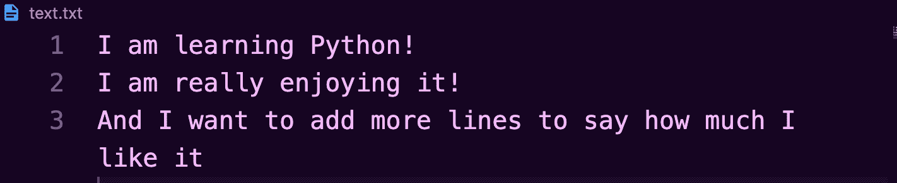
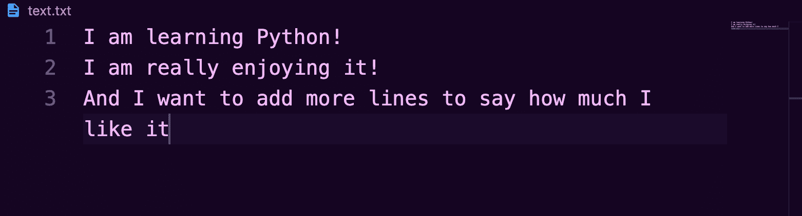
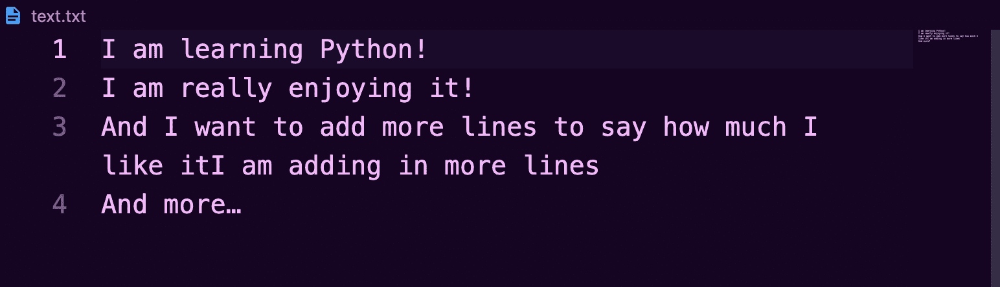
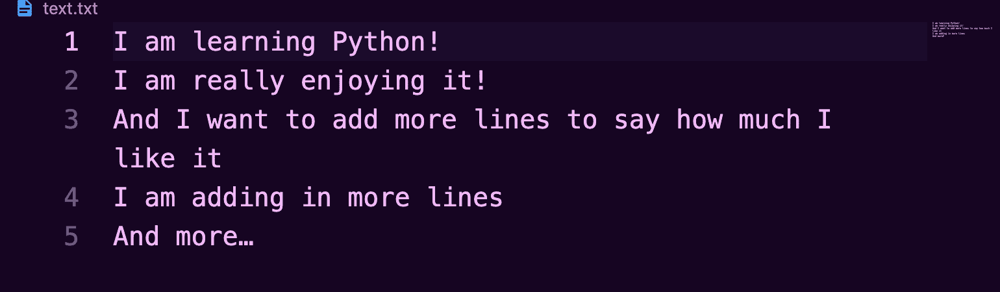
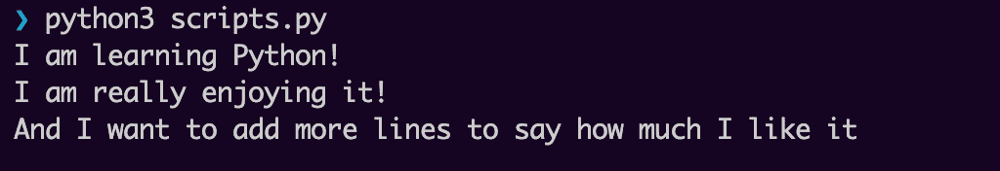
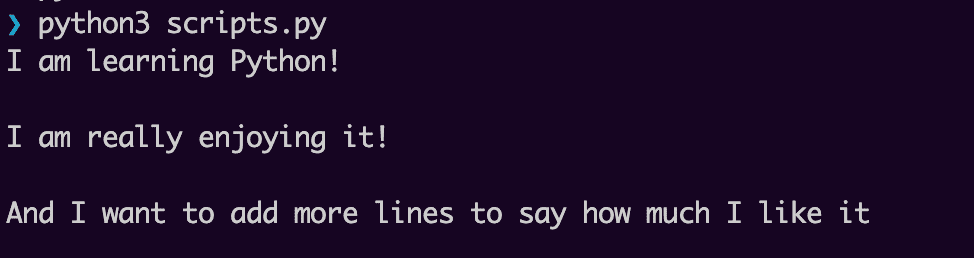

# Python 创建文件——如何追加和写入文本文件

> 原文：<https://www.freecodecamp.org/news/python-create-file-how-to-append-and-write-to-a-text-file/>

在编码中，文件用于存储数据。然后，您可以随时轻松访问这些数据。

在 Python 中读、写和编辑文件是一项常见的任务，因为该语言为我们提供了允许我们这样做的内置函数。

在本文中，我将创建一个简单的项目，我将在其中写入、追加内容，最后用 Python 从一个文本文件中读取内容，向您展示这是如何完成的。

你可以跟着我一起走，经历和我一样的步骤。

我们开始吧！

## 如何设置项目的结构

第一步是建立项目的目录结构。

选择一个要创建新目录的位置，并按照下面的步骤操作。

我正在我的主目录中创建项目。

```
#this command moves you into your home directory if you're not there already
cd 

#create a new directory and give it a name
mkdir python_text

#move into the directory you just created
cd python_text

#create two empty files in the same directory: one text file and one to hold your Python scripts
touch text.txt scripts.py

#open Visual Studio Code to edit
code . 
```

此时，文本文件是空的:


我们来补充一下。

## 如何用 Python 写文本文件

在 Python 中写入、追加和读取文本文件的最佳实践是使用`with`关键字。

一般语法如下所示:

```
with open("path_to_and_name_of_file","mode") as variable_name:
    variable_name.write('What I want to write goes here') 
```

情绪完全失控

*   首先从关键字`with`开始。
*   接下来，打开文本文件。`open()`函数返回一个 file 对象并接受两个参数:文件的路径和您想要打开的文件本身的名称。本例中的文件与 Python 脚本位于同一个目录中，因此路径很简单。第二个参数是打开文件的模式。写入文件时，`write`的模式为`w`。
*   然后我们有了`as`关键字。
*   接下来，变量名充当将要存储的文本内容的临时存储位置。
*   `.write()`方法用于写入文本文件，并添加您想要的字符串内容。

因此，要向文本文件添加一些文本，在`scripts.py`中添加:

```
with open("text.txt","w") as file:
    file.write("I am learning Python!\n")
    file.write("I am really enjoying it!\n")
    file.write("And I want to add more lines to say how much I like it") 
```

要在不同的行上添加文本，就像我在上面的例子中所做的那样，您必须自己显式地添加换行符`\`。

在 Visual Studio 代码(`Control ~`)中打开内置终端，通过键入:`python3 scripts.py`运行代码。

检查`text.txt`，它应该添加了以下内容:



值得注意的是，每次使用`.write()`方法并运行代码时，之前的所有文本都将被覆盖。

假设当我第一次创建文件`text.txt`时，我已经有了一些虚拟文本:


如果我运行前面的代码:

```
with open("text.txt","w") as file:
    file.write("I am learning Python!\n")
    file.write("I am really enjoying it!\n")
    file.write("And I want to add more lines to say how much I like it") 
```

它现在看起来像这样:



我已经丢失了所有以前的数据。

## 如何在 Python 中追加文本文件

附加工作类似于写作。

但是这一次，你打开文本文件进行追加，其中`open()`函数中的模式参数为`a`代表`append`:

```
with open("text.txt","a") as file:
    file.write("What I want to add on goes here") 
```

`.write()`方法中的任何内容都将被添加到文本文件的末尾。

因此，为了给`text.txt`添加更多的文本，您需要添加以下内容:

```
with open("text.txt","a") as file:
    file.write("I am adding in more lines\n")
    file.write("And more…") 
```

再次运行代码后，`text.txt`现在应该是这样的:



之前的文本不会被删除。

新文本会立即添加到旧文本之后，并且您必须再次显式添加一个换行符:

```
with open("text.txt","a") as file:
    file.write("\n")
    file.write("I am adding in more lines\n")
    file.write("And more…") 
```



## 如何用 Python 读取文件

要读取一个文件，再次使用带有两个参数的`with`关键字和`open()`函数:第一个参数是文件的路径和名称，第二个参数是打开文件的模式。

打开文本文件时，`read`的模式为`r`。

然后，`print()`函数打印到控制台，并将变量名作为`read()`函数的参数。

```
with  open('text.txt','r') as file:
    print(file.read()) 
```

输出:



要用 Python 读取文件，您还可以创建一个`for`循环来遍历文本文件中的每一行:

```
with open("text.txt","r") as file:
    for line in file:
        print(line) 
```

输出:



用这种方法，每行都是单独打印出来的。

## 结论

本文展示了一些简单的例子，说明如何用 Python 编写、编辑和读取文件。

如果你想学习更多关于 Python 编程语言的知识，freeCodeCamp 有一个免费的 [Python 认证](https://www.freecodecamp.org/learn/scientific-computing-with-python/)，在这里你可以从基础开始学习，然后学习更复杂的语言。最后，您将构建五个项目来实践您所学到的内容。

感谢阅读，快乐学习！