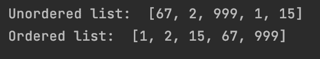
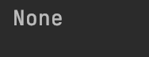
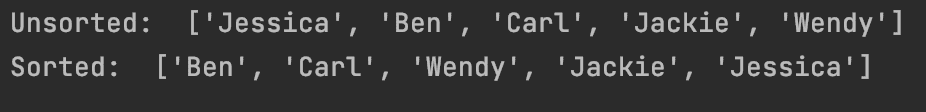
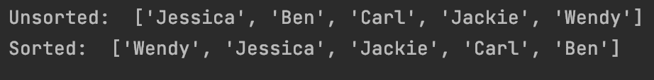
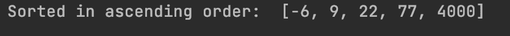
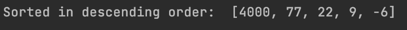
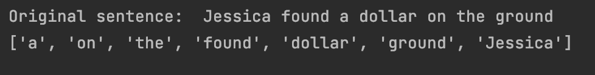
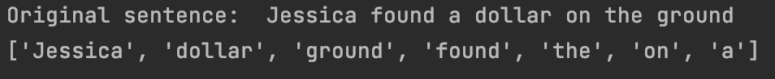
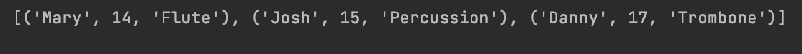
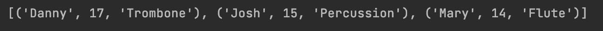

# Python 排序列表-如何按降序或升序排序

> 原文：<https://www.freecodecamp.org/news/python-sort-list-how-to-order-by-descending-or-ascending/>

在 Python 中，可以使用`sorted()`方法或`sort()`方法对数据进行排序。

在本文中，我将为`sorted()`和`sort()`方法提供代码示例，并解释两者之间的区别。

## Python 中的 sort()方法是什么？

这个方法接受一个列表并对其进行排序。此方法没有返回值。

在这个例子中，我们有一个数字列表，我们可以使用`sort()`方法对列表进行升序排序。

```
my_list = [67, 2, 999, 1, 15]

# this prints the unordered list
print("Unordered list: ", my_list)

# sorts the list in place
my_list.sort()

# this prints the ordered list
print("Ordered list: ", my_list)
```



如果列表已经排序，那么它将在控制台中返回 None。

```
my_list = [6, 7, 8, 9, 10]

# this will return None because the list is already sorted
print(my_list.sort())
```



`sort()`方法可以接受两个可选参数，称为`key`和`reverse`。

`key`具有将在列表中的每一项上调用的函数值。

在这个例子中，我们可以使用`len()`函数作为`key`参数的值。`key=len`会告诉电脑按照长度从最小到最大对名单进行排序。

```
names = ["Jessica", "Ben", "Carl", "Jackie", "Wendy"]

print("Unsorted: ", names)
names.sort(key=len)
print("Sorted: ", names)
```



`reverse`有一个布尔值`True`或`False`。

在这个例子中，`reverse=True`将告诉计算机按照相反的字母顺序对列表进行排序。

```
names = ["Jessica", "Ben", "Carl", "Jackie", "Wendy"]

print("Unsorted: ", names)
names.sort(reverse=True)
print("Sorted: ", names)
```



## 如何在 Python 中使用 sorted()方法

这个方法将从 iterable 返回一个新的排序列表。列表、字符串和元组就是可迭代的例子。

`sort()`和`sorted()`的一个关键区别是`sorted()`会返回一个新列表，而`sort()`会对列表进行排序。

在这个例子中，我们有一个按升序排列的数字列表。

```
sorted_numbers = sorted([77, 22, 9, -6, 4000])

print("Sorted in ascending order: ", sorted_numbers)
```



`sorted()`方法还接受可选的`key`和`reverse`参数。

在这个例子中，我们有一个降序排列的数字列表。告诉计算机从最大到最小反转列表。

```
sorted_numbers = sorted([77, 22, 9, -6, 4000], reverse=True)

print("Sorted in descending order: ", sorted_numbers)
```



`sorted()`和`sort()`的另一个关键区别是`sorted()`方法接受任何可迭代的对象，而`sort()`方法只处理列表。

在这个例子中，我们使用`split()`方法将一个字符串分解成单个单词。然后我们用`sorted()`把单词按长度从小到大排序。

```
my_sentence = "Jessica found a dollar on the ground"

print("Original sentence: ", my_sentence)
print(sorted(my_sentence.split(), key=len))
```



我们也可以修改这个例子，加入`key`和`reverse`参数。

这个修改后的示例现在将从最大到最小对列表进行排序。

```
my_sentence = "Jessica found a dollar on the ground"

print("Original sentence: ", my_sentence)
print(sorted(my_sentence.split(), key=len, reverse=True))
```



我们也可以在`tuples`上使用`sorted()`方法。

在这个例子中，我们有一个代表乐队学生的姓名、年龄和乐器的集合`tuples`。

```
band_students = [
    ('Danny', 17, 'Trombone'),
    ('Mary', 14, 'Flute'),
    ('Josh', 15, 'Percussion')
]
```

我们可以用`sorted()`的方法将这些数据按照学生的年龄进行排序。`key`有一个`lambda`函数的值，它告诉计算机按年龄升序排序。

`lambda`函数是没有名字的匿名函数。您可以通过使用`lambda`关键字来定义这种类型的函数。

```
lambda student: student[1]
```

要访问`tuple`中的值，可以使用括号符号和想要访问的索引号。由于我们从零开始计数，年龄值将是`[1]`。

这是一个完整的例子。

```
band_students = [
    ('Danny', 17, 'Trombone'),
    ('Mary', 14, 'Flute'),
    ('Josh', 15, 'Percussion')
]

print(sorted(band_students, key=lambda student: student[1]))
```



我们可以修改这个示例，改为按仪器对数据进行排序。我们可以用`reverse`把乐器按字母顺序倒过来排序。

```
band_students = [
    ('Danny', 17, 'Trombone'),
    ('Mary', 14, 'Flute'),
    ('Josh', 15, 'Percussion')
]

print(sorted(band_students, key=lambda student: student[2], reverse=True)) 
```



## 结论

在本文中，我们学习了如何使用 Python 的`sort()`和`sorted()`方法。

`sort()`方法只适用于列表，并对列表进行排序。它没有返回值。

`sorted()`方法可以处理任何 iterable 并返回一个新的排序列表。列表、字符串和元组就是可迭代的例子。

这两种方法都有两个可选参数`key`和`reverse`。

`key`具有将在列表中的每一项上调用的函数值。

`reverse`有一个布尔值`True`或`False`。