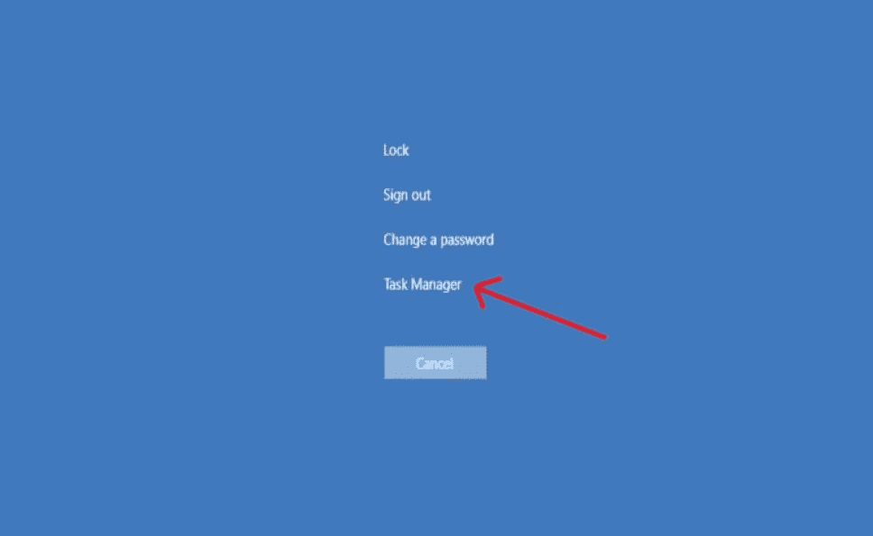
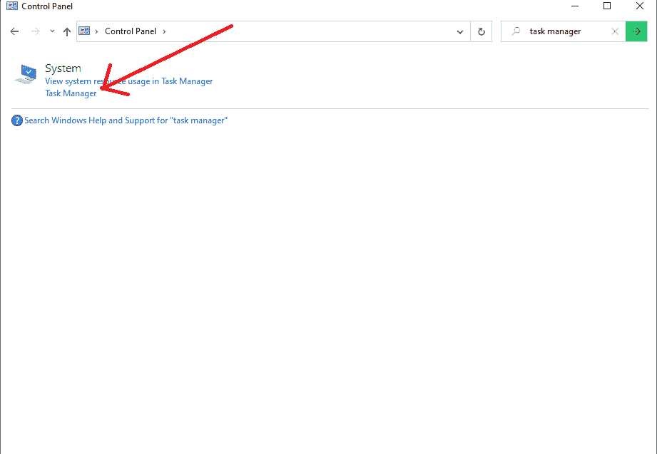
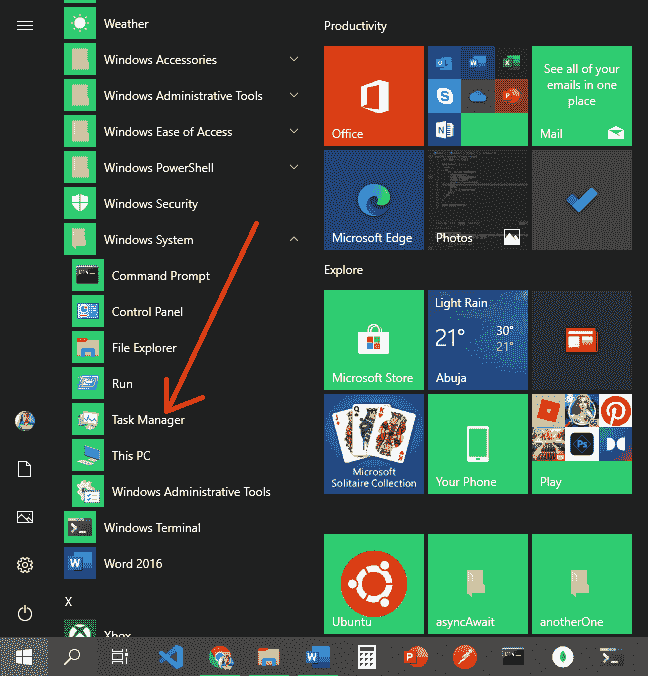
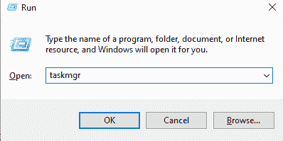
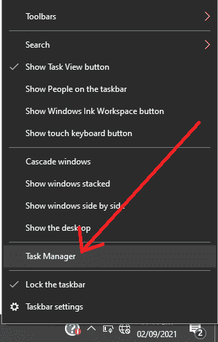

# 如何在 Windows 10 中打开任务管理器

> 原文：<https://www.freecodecamp.org/news/how-to-open-task-manager-in-windows-10/>

Windows 任务管理器是一个高级实用工具，可帮助您管理正在运行的应用。

“任务管理器”可让您查看哪些应用程序是打开的，以及您正在使用哪些应用程序。还可以看到哪些不是你自己打开的应用在后台运行。

您可能想要打开任务管理器的一个重要原因是停止导致 windows 无响应的应用程序。

打开任务管理器有几种不同的方法。所以在这篇文章中，我将带你了解在 Windows 10 上打开任务管理器的 7 种方法。

## 1.如何用 Windows 搜索打开任务管理器

在 Windows 机器上找到任何东西最简单的方法就是搜索。任务管理器也不例外。

*   单击搜索图标，然后在搜索栏中键入“任务管理器”。
*   任务管理器将作为搜索结果弹出，你可以从那里打开它。

## 2.如何使用键盘快捷键打开任务管理器

一些应用程序可能会进入流氓状态并停止 Windows 响应，因此在这种情况下，您可能无法访问 Windows 搜索。

Windows 有两种不同的组合键，如果您想查看正在运行的应用程序或停止应用程序，可以使用它们打开任务管理器。

*   同时按下`Ctrl + Shift + Esc`可以打开任务管理器。这将直接打开任务管理器
*   您也可以通过按住`Ctrl + Alt + Del`从 GINA 屏幕打开任务管理器。

一些应用程序可能会阻止您使用 Ctrl + Shift + Esc 访问任务管理器，但按下`Ctrl + Alt + Del`将始终为您打开图形识别和认证(GINA)屏幕，因此您可以从那里选择并打开任务管理器。

## 3.如何通过控制面板打开任务管理器

您可以使用控制面板搜索选项打开任务管理器。

在搜索栏中输入“任务管理器”，你会在“系统”下看到一个到任务管理器的链接。

## 4.如何通过开始菜单打开任务管理器

很多人更喜欢从开始菜单打开应用程序。您也可以从那里打开任务管理器。

*   点击 Windows 图标，或按键盘上的`WIN`键。
*   滚动到底部，打开 Windows 系统文件夹
*   任务管理器将显示在其他一些应用程序旁边——只需选择它打开它。

## 5.如何使用运行命令打开任务管理器

在 Windows 10 上，许多应用和文件夹都可以通过运行对话框打开。这里也有一个打开任务管理器的命令。

*   按键盘上的`WIN + R`键打开运行对话框
*   键入“taskmgr”并单击“确定”打开任务管理器。

## 6.如何从任务栏打开任务管理器

您也可以从任务栏打开任务管理器。

右键单击任务栏中的空白区域，然后选择“任务管理器”。

## 7.如何从 Windows 超级用户菜单打开任务管理器

除了我们已经看到的 6 种方法之外，您可以通过右键单击 Windows 徽标，然后从弹出的菜单中选择“任务管理器”来打开任务管理器。

您也可以通过按住键盘上的`Win + X`键，然后从菜单中选择“任务管理器”来实现。

## 结论

Windows 任务管理器是一个非常强大的工具，可以大大提高您的生产力。有了它，您可以看到哪些应用程序正在运行，并阻止那些导致问题的应用程序。

在本文中，您已经了解了在 Windows 10 上打开任务管理器的几种方法，因此您可以更好地使用它。

感谢您的阅读，祝您愉快。