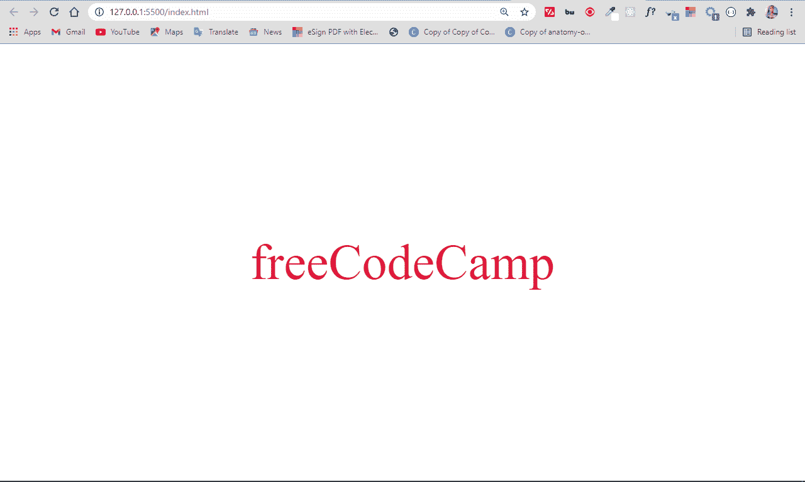
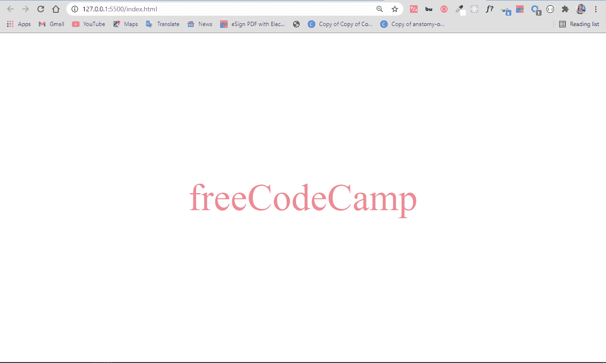
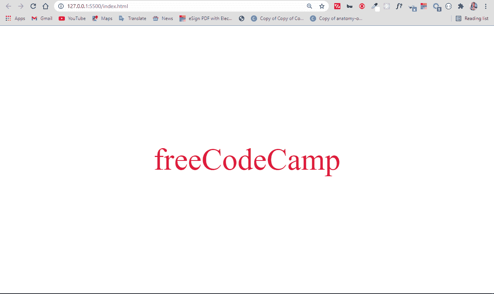
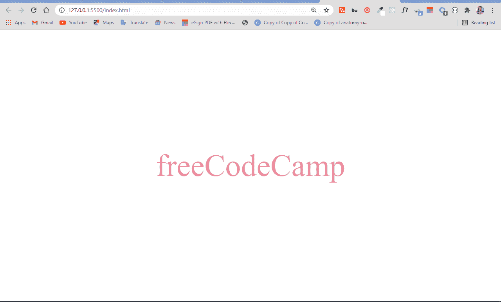

# CSS 字体颜色–如何在 HTML 中设置文本样式

> 原文：<https://www.freecodecamp.org/news/css-font-color-how-to-style-text-in-html/>

一开始，在你正在创建的网站上设置文本颜色可能会令人困惑。但是在本文中，您将学习如何做到这一点。

## 如何在 HTML 中设置文本颜色

在 CSS 中，`background-color`属性对于设置任何东西的背景颜色来说都非常简单。

那么如果你想设置页面上某个东西的前景色呢？尤其是文本，在正常情况下你不会想要设置背景颜色。

CSS 中没有`foreground-color`属性，所以使这成为可能的是`color`属性。

在本文中，我将带您了解如何使用 color 属性设置文本的颜色。我们还会看看它获取值的各种方式。

color 属性以 4 种不同的方式获取值:命名颜色、十六进制颜色、RGB 颜色和 HSL 颜色。现在让我们来看看每一个。

## 命名颜色

顾名思义，您引入了 color 属性，并通过命名您想要的颜色来应用该值。这可能是红色、绿色、蓝色、橙色、深红色、青色或任何其他命名的颜色。浏览器可以识别大约 147 种命名颜色。

基本语法如下所示:

```
element {
    color: colorName
} 
```

```
<p>freeCodeCamp</p> 
```

```
 p {
     color: crimson;
} 
```


## 十六进制颜色(或只是十六进制颜色)

十六进制值用于表示总共 6 个字符的颜色。它们以英镑/数字符号(#)开始，然后是从 0 到 9 的任何数字，最后是从 A 到 f 的任何字母。

前两个值代表红色，后两个值代表绿色，最后两个值代表蓝色。对于十六进制值，您可以使用的颜色深浅没有限制。

```
<p>freeCodeCamp</p> 
```

```
 p {
    color: #dc143c;
 } 
```

## RGB Colors

RGB 代表红色、绿色和蓝色。使用 RGB colosr，您可以根据想要的红色、绿色和蓝色的多少来指定颜色。三者都用 0 到 255 之间的数字表示。

有一种 RGB 叫做`rgba`。额外的“a”代表 alpha，它允许您指定颜色的不透明度。它采用 0.0 到 1.0 之间的值–0.0 表示 0%不透明度，0.5 表示 50%不透明度，1.0 表示 100%不透明度。

基本语法是`rgba(amountOfRed, amountOfGreen, amountOfBlue, alpha)`。

如果不想要 alpha 值，可以限制为`rgba(amountOfRed, amountOfGreen, amountOfBlue)`。

以下是常规 RGB 值的语法:

```
<p>freeCodeCamp</p> 
```

```
 p {
   color: rgb(220, 20, 60);
 } 
```



这里展示的是 50% (0.5)不透明度下的 alpha 值:

```
p {
    color: rgb(219, 20, 60, 0.5);
} 
```



## HSL 颜色

HSL 代表色调、饱和度和亮度。这是在 CSS 中为文本(以及任何需要颜色的东西)指定颜色的另一种方式。

*   色相代表 360°中的色轮。所以，0 是红色，120 是绿色，240 是蓝色。
*   饱和度是颜色中的灰色量，以百分比表示。0%是灰色的阴影，100%是颜色本身。
*   明度是颜色的暗度和明度，以百分比表示。0%是黑，100%是白。

就像 RGB 颜色一样，您也可以设置颜色的不透明度。所以，还有 hsla。

完整的基本语法是`hsl(colorDegree, saturationPercentage, lightnessPercentage, alpha)`。如果您不想要 alpha 值，可以将其限制为`hsl(colorDegree, saturationPercentage, lightnessPercentage)`。

```
<p>freeCodeCamp</p> 
```

```
 p {
   color: hsl(348, 83%, 47%);
 } 
```



您可以对 hsl 颜色应用特定的不透明度，如下所示:

```
 p {
   color: hsla(348, 83%, 47%, 0.5);
  } 
```



## 应该使用命名颜色、十六进制颜色、RGB 颜色还是 HSL 颜色来指定颜色？

CSS 的一个奇妙之处在于，做同一件事有多种方式。通过对文本应用颜色，您已经看到了这一点。

因为你可以用 4 种不同的方式来应用颜色，你一定想知道哪种是最好的。

当你使用命名的颜色时，你在应用不同深浅的颜色时会受到一定的限制。红色、绿色、蓝色、黄色或任何其他命名的颜色都有很多变化，这些变化是你无法用命名的颜色来获得的。你只能使用浏览器识别的大约 147 种预定义的颜色。

十六进制颜色非常动态。它们是开发人员中最常用的，因为你的极限是你的创造力。使用十六进制颜色，您可以使用各种色调，甚至可以使用一种从未使用过的颜色。

RGB 颜色和十六进制颜色一样动态。除了能够从 0 到 255 之间指定你想要多少红色、绿色和蓝色，你还可以用额外的 alpha 值设置你想要颜色的透明度。

HSL 是最有活力的。你可以在色轮中从 0 到 360 度范围内指定你想要的确切颜色，设置你想要的饱和度和暗度的百分比，还可以设置不透明度从 0.0 到 1.0。

因此，实际上，这取决于您和您的用例，以及您想要获得的创造性或具体性。

## 结论

对文本应用颜色有助于使您的网站对访问者更具吸引力。正确的颜色组合也可以帮助你的内容变得更具可读性。

在本文中，您已经学习了如何使用 color 属性的 4 种不同的值将颜色应用到文本。

感谢阅读，继续编码。