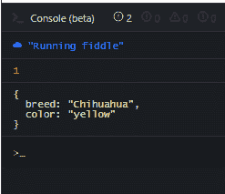

# JavaScript Array.find()教程——如何遍历数组中的元素

> 原文：<https://www.freecodecamp.org/news/javascript-array-find-tutorial-how-to-iterate-through-elements-in-an-array/>

当您使用数组集合时，有时您只需要找出数组中是否存在某个项，这样就可以检索它。并且您不会关心在同一个数组中有多少其他的项(如果有的话)。

嗯，我们可以使用`find()`方法来做到这一点。

## Array.find()方法的工作原理

`find()`方法是一个`Array.prototype`(也称为内置)方法，它接受一个回调函数，并为它所绑定的数组中迭代的每一项调用该函数。

当它找到一个匹配时(换句话说，回调函数返回`true`)，该方法返回那个特定的数组项，并立即中断循环。所以`find()`方法返回数组中满足回调函数的第一个元素。

回调函数可以接受以下参数:

*   `currentItem`:这是数组中当前正在迭代的元素。
*   `index`:这是`currentItem`在数组中的索引位置。
*   `array`:表示目标数组及其所有项目。

## **如何在 JavaScript** 中使用`find()`方法

在下面的例子中，我将演示如何使用`find()`方法从一个数组中检索符合 JavaScript 中指定条件的第一项。

### 如何用 find()获取单品

让我们假设你有一只狗不见了。你向有关当局报告，他们会召集一群失而复得的狗。

为了能够找到你的狗，你需要提供关于它的唯一信息。例如，你的狗的品种(吉娃娃)可以用来识别它。

我们可以使用数组集合在 JavaScript 中表达这个场景。名为`foundDogs`的数组将包含所有找回的狗的名字以及它们各自的品种。我们将使用`find()`方法从数组中找到一只吉娃娃狗。

```
let foundDogs = [{
    breed: "Beagle",
    color: "white"
  },

  {
    breed: "Chihuahua",
    color: "yellow"
  },

  {
    breed: "Pug",
    color: "black"
  },
]

function findMyDog(dog) {
  return dog.breed === "Chihuahua"
}

let myDog = foundDogs.find(dog => findMyDog(dog));

console.log(myDog);

/*

{
  breed: "Chihuahua",
  color: "yellow"
}

*/
```

当找到匹配时，find 方法停止迭代。

关于`find()`，有一点需要记住:一旦回调函数返回一个`true`语句，它就停止执行。

为了说明这一点，我们将再次使用丢失的狗的例子。这一次，我们假设找到了两只吉娃娃。

但是`find()`方法将只返回它在数组中发现的 Chihuahua 的第一个实例。任何其他实例随后都将被忽略。

通过将该项目的索引位置记录到控制台中，我们也可以很容易地看到这一点:

```
let foundDogs = [{
    breed: "Beagle",
    color: "white"
  },

  {
    breed: "Chihuahua",
    color: "yellow"
  },

  {
    breed: "Pug",
    color: "black"
  },

  {
    breed: "Chihuahua",
    color: "yellow"
  }
]

function findMyDog(dog, index) {
	if (dog.breed === "Chihuahua") console.log(index);
  return dog.breed === "Chihuahua"
}

let myDog = foundDogs.find((dog, index) => findMyDog(dog, index));

console.log(myDog);

/* 
1

{
  breed: "Chihuahua",
  color: "yellow"
}

*/
```

Returns the first instance which has an index of 1



### 如何使用析构赋值

通过结合析构赋值和箭头函数表达式，可以使代码更加简洁。

我们将使用析构只从对象中提取 name 属性，然后将它作为参数传递给回调函数。

我们会得到同样的结果:

```
let foundDogs = [{
    breed: "Beagle",
    color: "white"
  },

  {
    breed: "Chihuahua",
    color: "yellow"
  },

  {
    breed: "Pug",
    color: "black"
  },
]

let myDog = foundDogs.find(({breed}) => breed === "Chihuahua");

console.log(myDog);

/*

{
  breed: "Chihuahua",
  color: "yellow"
}

*/
```

### 如何通过索引查找项目

在这个例子中，我们将使用数组的唯一索引值从数组中查找并返回属于' David '的点。这演示了一种我们可以通过`find()`方法在`callback`函数中使用`index`属性的方法:

```
let reservedPositions = [{
    name: "Anna",
    age: 24
  },

  {
    name: "Beth",
    age: 22
  },

  {
    name: "Cara",
    age: 25
  },

  {
    name: "David",
    age: 30
  },

  {
    name: "Ethan",
    age: 26
  }
]

function findByIndex(person, index) {
  return index === 3
}

let myPosition = reservedPositions.find((person, index) => findByIndex(person, index));

console.log(myPosition);

/*
{
  age: 30,
  name: "David"
}
*/
```

## 您可以将上下文对象与 find()一起使用

除了回调函数，`find()`方法还可以接受一个上下文对象。

```
find(callback, contextObj)
```

然后我们可以在每次迭代中从**回调**函数内部引用这个对象，使用`this`关键字作为引用。这允许我们访问上下文对象中定义的任何属性或方法。

### 如何通过 find()使用上下文对象

假设我们有一系列的工作申请，我们想选择第一个符合所有标准的申请人。

所有标准都在名为`criteria`的上下文对象中定义，该对象随后作为第二个参数传递给`find()`方法。然后，从回调函数内部，我们访问该对象来检查申请人是否符合那里指定的所有标准。

```
let applicants = [
    {name: "aaron", yrsOfExperience: 18, age: 66},
    {name: "beth", yrsOfExperience:  0, age: 18},
    {name: "cara", yrsOfExperience: 4, age: 22},
    {name: "daniel", yrsOfExperience: 3, age: 16},
    {name: "ella", yrsOfExperience: 5, age: 25},
    {name: "fin", yrsOfExperience: 0, age: 16},
    {name: "george", yrsOfExperience: 6, age: 28},
]

let criteria = {
	minimumExperience: 3,
  lowerAge: 18,
  upperAge: 65
}

let luckyApplicant = applicants.find(function(applicant) {
	return applicant.yrsOfExperience >= this.minimumExperience && applicant.age <= this.upperAge
  && applicant.age >= this.lowerAge ;
}, criteria)

console.log(luckyApplicant);

/*
{
  age: 22,
  name: "cara",
  yrsOfExperience: 4
}
*/
```

从技术上讲，三名申请人(Cara、Ella 和 George)都符合标准。也就是说，他们三个至少 18 岁，不大于 65 岁，至少有 3 年工作经验。

然而，由于`find()`方法总是只返回第一个评估为真的实例，其他两个将被忽略，循环将被中断。

## **结束**

`find()`方法是一个`Array.prototype`方法，它接受一个回调函数，并为绑定数组中的每一项调用该函数。

当回调函数计算结果为`true`时，该方法返回当前项并中断循环。它只返回第一个匹配——数组中存在的任何其他匹配都将被忽略。

除了回调函数，`find()`方法还可以接受一个上下文对象作为第二个参数。这将使您能够使用`this`从回调函数中访问它的任何属性。

我希望你能从这篇文章中得到一些有用的东西。

********我 ********如果你想了解更多关于 Web 开发的知识，欢迎访问我的******** [博客 ********。********](https://ubahthebuilder.tech/the-ultimate-tutorial-on-javascript-dom-js-dom-with-examples)********

感谢您的阅读，再见。

> ******************************点击这里查看。******************************