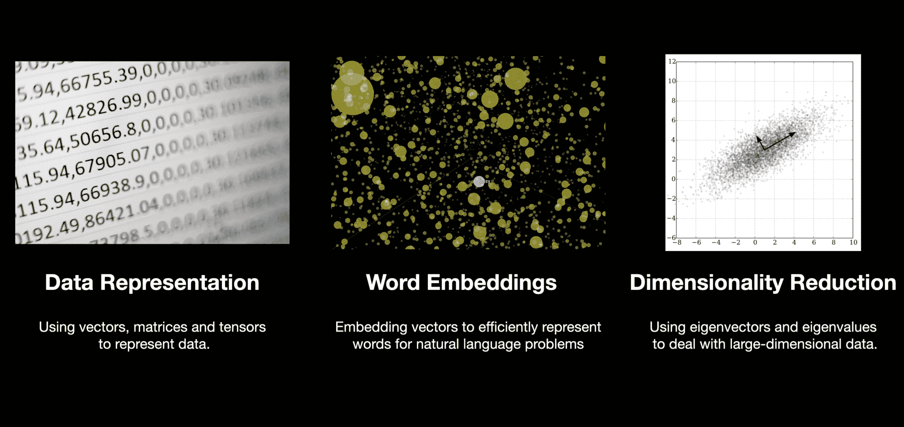
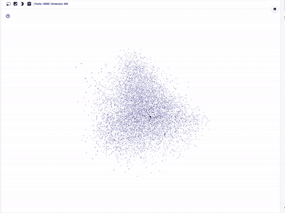
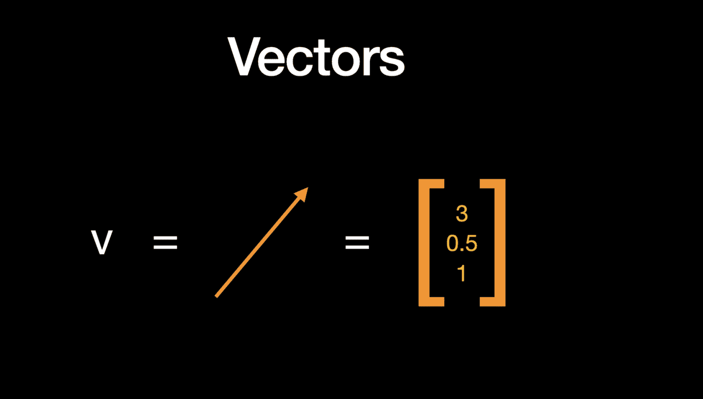
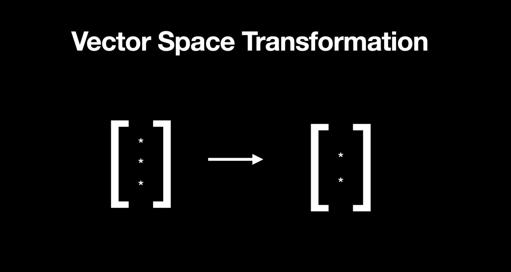
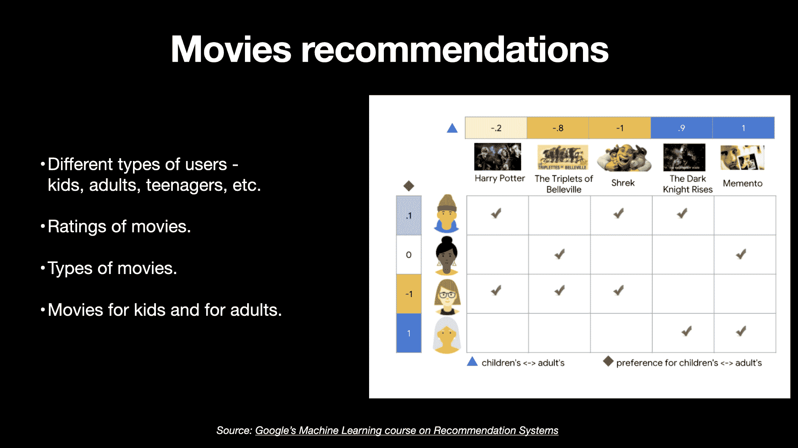
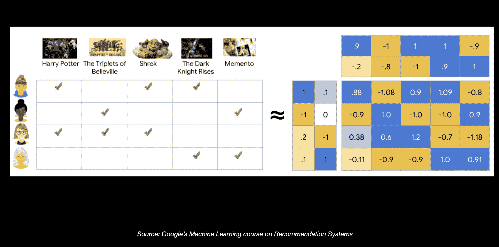
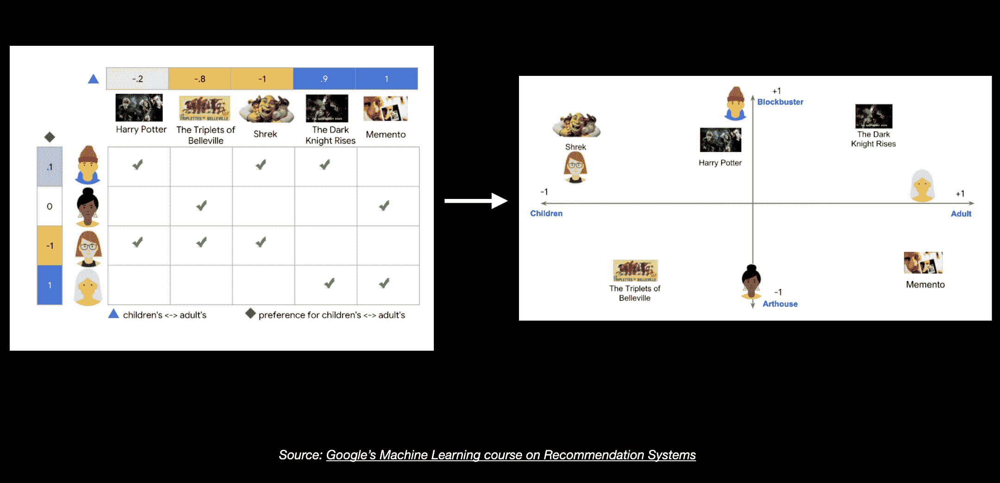

# 机器学习如何使用线性代数解决数据问题

> 原文：<https://www.freecodecamp.org/news/how-machine-learning-leverages-linear-algebra-to-optimize-model-trainingwhy-you-should-learn-the-fundamentals-of-linear-algebra/>

机器或计算机只理解数字。这些数字需要以某种方式表示和处理，让机器通过从数据中学习而不是从预定义的指令中学习来解决问题(就像编程一样)。

所有类型的编程都在某种程度上使用数学。机器学习涉及对数据进行编程，以学习最能描述数据的函数。

利用数据寻找函数最佳参数的问题(或过程)在 ML 中称为**模型训练**。

因此，简而言之，机器学习就是编程以优化可能的最佳解决方案——我们需要数学来理解该问题是如何解决的。

ML 学习数学的第一步是学习线性代数。

线性代数是解决在机器学习模型中表示数据以及计算的问题的数学基础。

**这是数组**的数学——技术上称为向量、矩阵和张量。

## 常见应用领域—线性代数的应用

Source: [https://www.wiplane.com/p/foundations-for-data-science-ml](https://www.wiplane.com/p/foundations-for-data-science-ml)

在 ML 环境中，开发模型的所有主要阶段都有线性代数在幕后运行。

线性代数支持的重要应用领域有:

*   数据和学习模型表示
*   单词嵌入
*   降维

### 数据表示法

**ML 模型的燃料，也就是**数据**，需要转换成数组才能馈入你的模型。在这些阵列上执行的计算包括像矩阵乘法(点积)这样的操作。这进一步返回输出，该输出也表示为数字的变换矩阵/张量。**

### **单词嵌入**

**不要担心这里的术语——它只是用一个较小的维度向量来表示大维度的数据(想想数据中的大量变量)。**

****

**自然语言处理(NLP)处理文本数据。处理文本意味着理解大量单词的含义。每个单词代表不同的意思，可能与另一个单词相似。线性代数中的向量嵌入允许我们更有效地表示这些单词。**

### **特征向量**

**最后，像特征向量这样的概念允许我们减少数据的特征或维度的数量，同时使用一种叫做**主成分分析的方法保持所有特征或维度的本质。****

## **从数据到向量**

**

Source: [https://www.wiplane.com/p/foundations-for-data-science-ml](https://www.wiplane.com/p/foundations-for-data-science-ml)** 

**线性代数基本上处理的是向量和矩阵(不同形状的数组)以及这些数组上的运算。在 NumPy 中，向量基本上是一个一维的数字数组，但是从几何学上来说，它们既有大小又有方向。**

**

Source: [https://www.wiplane.com/p/foundations-for-data-science-ml](https://www.wiplane.com/p/foundations-for-data-science-ml)** 

**我们的数据可以用向量来表示。在上图中，该数据中的一行由一个特征向量表示，该向量具有代表 3 个不同维度的 3 个元素或分量。向量中的 n 个条目使其成为 n 维向量空间，在这种情况下，我们可以看到 3 维。**

## **深度学习——流过神经网络的张量**

**我们可以看到线性代数在今天所有主要应用中的作用。例子包括 LinkedIn 或 Twitter 帖子上的情感分析(嵌入)，从 x 光图像中检测一种肺部感染(计算机视觉)，或任何语音到文本机器人(NLP)。**

**所有这些数据类型都用张量中的数字表示。我们运行矢量化运算，使用神经网络从中学习模式。然后，它输出一个处理过的张量，该张量又被解码以产生模型的最终推断。**

**每个阶段对这些数据阵列执行数学运算。**

## **降维——向量空间变换**

**

Source: [https://www.wiplane.com/p/foundations-for-data-science-ml](https://www.wiplane.com/p/foundations-for-data-science-ml)** 

**说到嵌入，你基本上可以认为一个 n 维向量被另一个属于更低维空间的向量所取代。这更有意义，也是克服计算复杂性的方法。**

**例如，这里有一个三维向量，它被一个二维空间所取代。但是你可以把它推广到真实世界的场景中，在那里你有非常多的维度。**

**减少维度并不意味着从数据中删除特征。相反，它是关于寻找作为原始要素的线性函数的新要素，并保留原始要素的方差。**

**寻找这些新的变量(特征)转化为寻找主成分(PCs)。然后，这收敛到解决特征向量和特征值问题。**

### **推荐引擎——利用嵌入**

**你可以把嵌入想象成嵌入三维空间的 2D 平面，这就是这个术语的来源。你可以把你所站的地面想象成一个嵌入你所居住的空间的 2D 平面。**

**只是给你一个真实世界的用例来联系所有关于矢量嵌入的讨论，所有给你个性化推荐的应用都以某种形式使用矢量嵌入。**

****

**例如，上面是谷歌推荐系统课程中的一张图表，我们从中获得了不同用户及其偏好电影的数据。有些用户是孩子，有些是成年人，有些电影是经典之作，而有些则更具艺术性。一些电影是针对年轻观众的，而像 memento 这样的电影是成年人喜欢的。**

**现在，我们不仅需要用数字来表示这些信息，还需要找到能够很好地捕捉所有这些特征的新的更小维度的向量表示。**

****

**理解我们如何完成这项任务的一个非常快速的方法是理解一种叫做矩阵分解的东西，它允许我们将一个大矩阵分解成更小的矩阵。**

**暂时忽略数字和颜色，试着理解我们是如何将一个大矩阵分解成两个小矩阵的。**

**例如，这个 4X5、4 行和 5 个特征的矩阵被分解成两个矩阵，一个是 4X2，另一个是 2X5。我们基本上为用户和电影提供了新的更小维度的向量。**

****

**这让我们可以在 2D 向量空间上画出它。这里你会看到用户#1 和电影《哈利·波特》更接近，用户#3 和电影《怪物史莱克》更接近。**

**向量的**点积(矩阵乘法)**的概念告诉我们更多关于两个向量的相似性。并且它在相关/协方差计算、线性回归、逻辑回归、PCA、卷积、PageRank 和许多其他算法中具有应用。**

### **大量使用线性代数的行业**

**到目前为止，我希望你相信线性代数正在推动当今许多领域的 ML 计划。如果没有，这里有一个列表来列举几个:**

*   **统计数字**
*   **化学物理学**
*   **基因组学**
*   **单词嵌入**
*   **机器人学**
*   **图像处理**
*   **量子物理学**

## **ML / DL 入门应该了解多少线性代数？**

**现在，重要的问题是，你如何学习编程这些线性代数的概念。答案是你不需要重新发明轮子，你只需要通过计算理解向量代数的基础知识，然后学习用 NumPy 编程这些概念。**

**NumPy 是一个科学计算包，它让我们能够访问线性代数的所有基本概念。它运行编译过的 C 代码很快，并且有大量我们可以使用的数学和科学函数。**

### **推荐资源**

*   **3Blue1Brown 关于线性代数的播放列表——非常吸引人的可视化，解释了线性代数及其应用的本质。对初学者来说可能有点难。**
*   **伊恩·古德菲勒的《深度学习》一书&约舒阿·本吉奥**——**学习人工智能和应用数学的绝佳资源。读一读吧，很少有人会觉得这本书一开始就太专业，太难记了。**

**[**数据科学基础& ML —**](https://www.wiplane.com/p/foundations-for-data-science-ml) 我创建了一门课程，让你对编程、数学(基础代数、线性代数&微积分)、统计有足够的了解。学习 DS/ML 第一步的完整包。**

**👉您可以使用代码`**FREECODECAMP10**`获得 10%的折扣。**

**点击此处查看课程大纲:**

 **[https://www.youtube.com/embed/ZHCFVwq2Dgk?feature=oembed](https://www.youtube.com/embed/ZHCFVwq2Dgk?feature=oembed)**