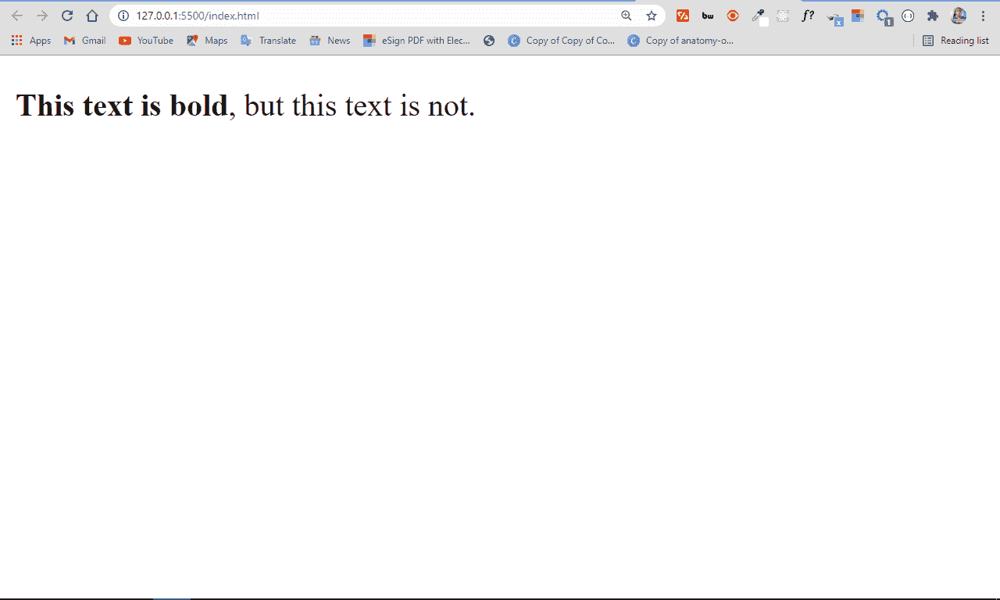
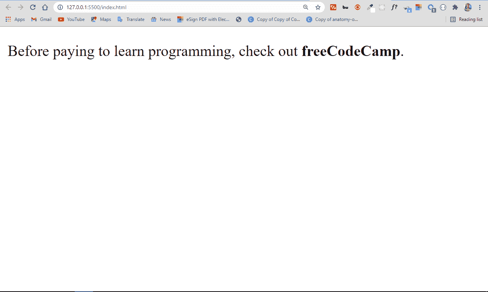
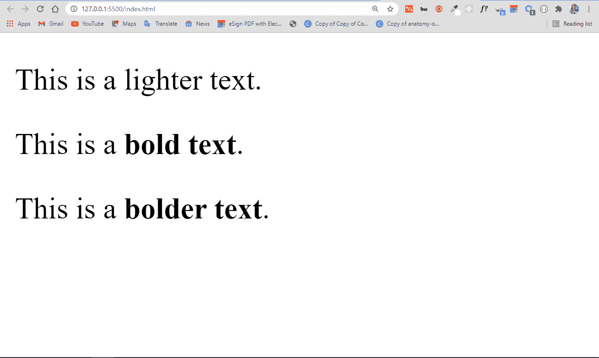

# HTML 中的粗体字–字母的字体粗细

> 原文：<https://www.freecodecamp.org/news/bold-font-in-html-font-weight-for-letters/>

当你建立一个网站时，你可能想特别强调某些文本，让用户知道它的重要性。

您可以在 HTML 中使用各种文本格式标签来实现这一点。

在这篇文章中，我将带你了解如何通过加粗来强调某些文本。

在 HTML 中，有三种主要的方法可以用来加粗文本。你可以使用`<b>`标签、`<strong>`标签，或者你可以在 CSS 中使用`font-weight`属性。让我们更详细地看一下每种方法。

## 如何用 HTML 中的`<b>`标签加粗文本

HTML 为我们提供了使文本加粗的`<b>`标签。要使用此标签使文本加粗，您需要像这样将它环绕在文本周围:

```
<p><b>This text is bold</b>, but this text is not.</p> 
```



正如您在图像中看到的，标签突出了部分文本。

## 如何用 HTML 中的`<strong>`标签加粗文本

有了`<strong>`标签，你不仅仅是让文本变得加粗——你是在唤起人们对它的特别关注。

`<strong>`也使文本加粗，就像`<b>`标签一样，但是两者之间有细微的差别。我将在本文后面讨论这一点。

就像`<b>`标签一样，您需要将`<strong>`标签放在文本周围，使文本加粗。

```
<p>
   Before paying to learn programming, check out
   <strong>freeCodeCamp</strong>.
</p> 
```



有了`<strong>`标签，`freeCodeCamp`文本不仅仅是粗体，它还有语义含义和强调。

## 如何用 CSS `font-weight`属性将文本加粗

字体粗细属性以`lighter`、`bold`和`bolder`为值。它也接受从 100 到 900 的数字。所以，有了它，你不仅可以让文本加粗，还可以让它比周围的文本更亮。

要使用 font-weight weight 属性使某些文本加粗，您需要选择文本及其类、id(如果有)或元素，然后应用您想要的值。它是这样工作的:

```
<p>This is a <span class="lighter">lighter text</span>.</p>

<p>This is a <span class="bold">bold text</span>.</p>

<p>This is a <span class="bolder">bolder text</span>.</p> 
```

```
 .lighter {
    font-weight: lighter;
}

.bold {
    font-weight: bold;
}

.bolder {
    font-weight: bolder;
} 
```



## 应该用`<b>`、`<strong>`还是`font-weight`来加粗文本？

您可能想知道使用哪一个来加粗文本-`<b>`、`<strong>`或 CSS `font-weight`属性。

你通常应该避免使用`<b>`，因为它已经是一种风格了。当您使用`<b>`标签将文本加粗时，您明确地告诉浏览器将 HTML 中的文本加粗。

`<strong>`也使文字显得加粗，但有语义。有了它，你就不是从 HTML 开始设计样式了(HTML 本来就没有这个意思)，而是告诉浏览器让文本看起来比周围的其他文本更强。

CSS `font-weight`属性可以让你更好的控制文本的粗细。值`lighter`、`bold`和`bolder`是一个开始，但是您可以通过应用像`100`、`300`、`400`、`500`、`600`、`700`、`800`和`900`这样的数字/权重作为值来更进一步，这给出了不同的轻盈和大胆的变化。

## 结论

粗体帮助你强调 HTML 中的某些单词。在本文中，您已经了解了使文本加粗的三种不同方法，以及哪一种最适合使用。

感谢阅读，继续编码。