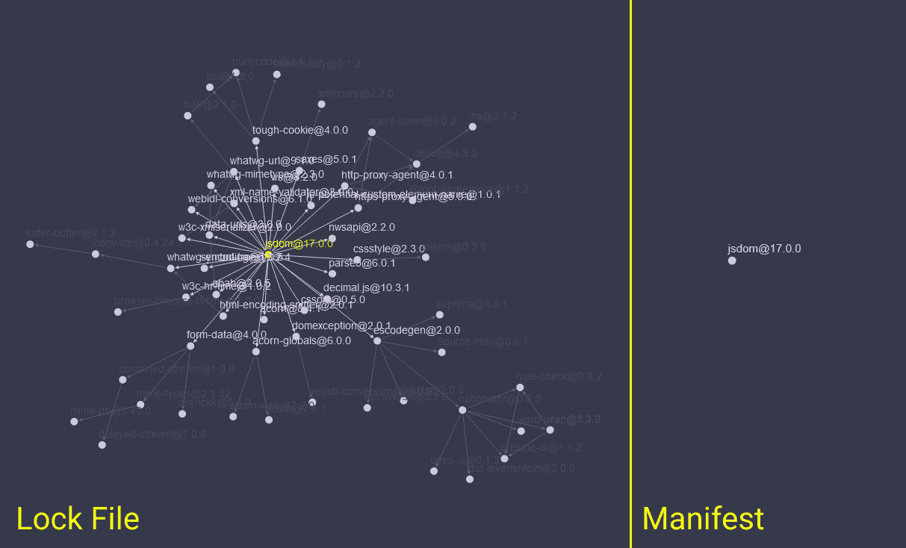

# 现代软件开发的发布管理——如何为初学者管理依赖关系、版本和构建系统

> 原文：<https://www.freecodecamp.org/news/release-management-modern-software-development/>

发布现代软件可能看起来令人畏惧和复杂。在本文中，我将详细阐述这个过程中涉及的概念，从管理依赖关系到在云中构建。

文章和教程通常涵盖特定的工具，并在打下基础知识之前深入研究。在本文中，我将通过介绍这些工具中的概念来提供这个基础。

我将涉及的主题包括依赖关系管理(以及什么是真正的依赖关系！)，构建系统，以及锦上添花的持续集成系统。拥有这样的背景会帮助你为即将到来的事情做好准备。

## 什么是图书馆？

假设你正在尽职尽责地完成任务。您创建了一组实用程序来简化您的工作。然后，您被分配到一个不同的项目，在这个项目中，您需要相同的实用程序，并复制它们。恭喜，您刚刚创建了一个库，并在两个项目中使用它！😁

库是开发人员用来优化任务的预写代码的集合。它们通过提取无聊和重复的东西来提高我们的生产力。Numpy、Matplotlib、Lodash、jQuery 和 React 都是流行的开源库的例子。

您可能已经注意到，这些库(或任何其他库)都有一个版本号。它通常由几个用句点分隔的数字字段构成:`v1.0.0`或仅仅是`1.0.0`。这些数字不是随机的！有许多定义产品版本的方案。

一些产品使用由编译器或 CI/CD 工具生成的内部版本号(我们马上会研究这些)。其他产品使用构建日期而不是构建号。其他的使用构建[散列](https://www.freecodecamp.org/news/p/70791fa1-2b5b-4ebc-9927-0e1c06895d4c/%5B%3Chttps://en.wikipedia.org/wiki/Hash_function%3E%5D(%3Chttps://en.wikipedia.org/wiki/Hash_function%3E))。

最突出的版本化方案被称为*语义版本化*。这是大多数(如果不是全部)代码库使用的。

## 什么是语义版本控制(Semver)？

语义版本化是一种版本化方案，其中有 3 个字段，每个字段用点分隔。现在，我们将第一个字段(在左侧)称为*大调*，中间的字段称为*小调*，最后一个字段称为*补丁*。看起来和这个一模一样，有一些衍生:`Major.Minor.Patch`。

根据 Semver 标准，所有字段只能递增。你不能减少其中任何一个。当父版本增加时，所有子版本都会重置。所以递增*大调*重置*小调*和*补丁*为 0。

### 补丁版本

*补丁*版本是变化最频繁的编号。当这个数字增加时，它表示没有添加新功能或破坏现有功能的更改。这些可能是安全修复、性能优化、错误修复等等。

对*补丁*版本的更改总是双向兼容的，只要父版本是相同的。写在`v1.0.1`上的代码将在`v1.0.0`和`v1.0.2`上运行。

### 次要版本

*小调*版本是第二个变化最频繁的数字。对此数字的更改表示功能更新不会破坏现有功能。

只要主版本相同，对次版本的更改总是向前兼容的。

用`v1.1.0` *编写的代码将*与`v1.2.0`一起工作，但是*可能*不能与`v1.0.0`一起工作，因为你可能会使用最近版本中添加的特性。

### 主要版本

*专业*版本是三者中优先级最高，也是最“危险”的领域。当这个数字增加时，表示发生了重大变化。这些通常是 API/接口更改和/或实体重命名和删除。

一个新的主要版本并不意味着与任何其他主要版本兼容，所以不要期望`v1.0.0`与`v2.0.0`一起工作，反之亦然。你的代码*可能会在升级后*编译，但那只是纯粹的运气。

有些情况下，库作者会破坏底层逻辑而不影响您使用的公共 API，因此不会破坏您的代码。但这些都是例外。

Python 2 和 Python 3 是突破性变化的例子。Python 2 打印语句在 Python 3 解释器上不起作用，反之亦然。其中一些可能有用，比如循环和其他基本结构，但仅此而已。

建议您尽可能保持最新的*补丁*版本。如果你需要新功能，升级你的*小*版本。*专业*的变化预示着巨大的变化。所以升级的时候要小心。

您应该遵循的每个主要版本通常都有一个迁移指南。你可以在[官方文档](https://www.freecodecamp.org/news/p/70791fa1-2b5b-4ebc-9927-0e1c06895d4c/%5B%3Chttps://semver.org/%3E%5D(%3Chttps://semver.org/%3E))中阅读更多关于 Semver 的内容。

因此...首先，我们如何安装和使用其他人编写的外部库？

## 如何管理项目的依赖关系

在过去，我们能做的最好的事情就是将我们正在使用的库的源代码复制到我们的项目中。我们对库的代码进行修改，在发布之前修复错误，并控制代码。

但是这种通常被称为 *vendoring* 的做法，由于多种原因已经失宠。

如果您已经应用了更改并且发布了新版本，您必须再次重新应用所有这些更改。这是一个手动过程，需要在每次更新或下载库时进行。这很麻烦，需要很多时间，而且可能会破坏您添加的额外功能。

当增加项目的复杂性和规模时，这很快就会失去控制，这给我们留下了更好的选择:*依赖管理器*。

### 什么是依赖性管理器？

依赖项是您的项目需要工作的库或实用工具。简单地说，如果程序 A 需要程序 B 编译和/或运行，那么程序 A 依赖于程序 B。一个程序可以依赖于多个其他程序。

依赖项管理器是一种自动跟踪项目依赖项的工具。它允许您在终端中运行简单的命令来安装、更新和删除依赖项。NPM、纱、作曲家、格雷尔和邦德勒都是依赖性管理器的例子。

不要将这些与包管理器混淆，因为它们是管理系统级包的工具。apt-get、yum、Homebrew 和 Chocolatey 是包管理器。

一些包管理器可以管理系统范围的包和项目依赖。NPM 和纱就是这样的例子。

### 依赖性管理器是如何工作的？

依赖性管理器使用两个主要文件:一个清单文件和一个锁文件。

清单是项目的直接依赖项的列表。它列出了您在安装时直接指定的依赖项。因此，当您运行`npm install jsdom`时，它会将`jsdom`包添加到项目清单的依赖项列表中。

但是光有清单是不够的。一个依赖关系可能有依赖关系，那些依赖关系也可能有依赖关系，以此类推，形成一个*依赖关系图*。清单只包括*的直接*依赖项。

因此，当您运行`npm install jsdom`时，清单将只列出`jsdom`，尽管 jsdom 有自己的其他依赖项。那么，依赖关系管理器如何跟踪整个依赖关系图呢？

### 什么是锁文件？

锁文件是一个日志，它列出了所有项目的依赖关系。这包括直接依赖关系(在清单中列出)和整个依赖关系图。它列出了特定版本的每一个依赖项、从中提取依赖项的存储库以及其他详细信息。

这张图片显示了`jsdom`的依赖图(在锁文件中列出)和直接依赖列表(在清单中列出)之间的比较，这是许多 web 测试标准的 JavaScript 实现。



好吧，我们知道确切的依赖图，但那又怎样？所以一切！我们经常有多个开发人员在同一个项目上工作。如果多个开发人员仅使用清单安装项目的依赖项，则依赖项管理器可能会安装不同版本的库。

一个锁文件将图中的每一个依赖项锁定到一个特定的版本，允许我们在不同的机器上进行可重复的构建*。这意味着每次有人运行`npm install`，代码*保证*工作。这也使得通过在报告中包含一个锁文件来报告错误变得更加容易。*

*锁文件还允许依赖项管理器重用缓存的包，而不是每次构建项目时都下载最新版本。*

*因此，我们已经了解了什么是库、语义版本和依赖管理器。现在是时候构建我们的项目了。*

## *什么是构建系统？*

*每个构建过程在某种程度上都是一个构建系统。构建系统是一组将源转换成工件的转换。它可能是启动编译器的简单命令，从文本文件生成 pdf 的脚本，甚至是构建项目并生成二进制文件的 GUI 解决方案。*

*构建系统通常由 3 个组件组成:*

*   *目标*
*   *属国*
*   *规则*

*目标是期望的输出。如果你想要一个名为“test.exe”的二进制文件，那么你的目标就是这个。依赖项是项目依赖项，可能包括环境实用程序，如安装 C++编译器、可用的 npm 等等。规则定义了如何从源到目标。它们也可能是所使用的命令。*

*构建系统可能被配置为在构建之前测试您的应用程序、生成覆盖率报告和 lint 源，这是其规则的一部分。但是默认情况下，构建系统是手动和本地的。您必须自己启动它，它只在您的本地机器上产生一个输出。*

*因此...如果您希望多个开发人员能够逐步发布您的应用程序版本，该怎么办？这就是 CI/CD 的用武之地！*

## *持续集成系统*

*简而言之，持续集成(CI)是一种不断验证产品变更的范式。CI 系统自动构建和测试每一个变更，以避免在等待发布时可能出现的问题。*

*连续交付(CD)是自动化发布过程的实践。主要版本自动部署到试运行和生产环境中，提供了自动化的发布流程。*

*连续部署(CD)是连续交付的升级。这是自动部署每个变更的实践，如果它通过了生产管道的所有阶段，不需要等待任何明确的批准。这种实践强调测试自动化和用户反馈，经常导致一个月、一周、甚至一天的多次软件更新！*

*这是一个宽泛的概念，你可以在本文中了解更多。现在，我们将托管这些实践的系统统称为持续集成系统。*

*持续集成系统(简称 CI)是云中的构建系统，它按需自动激活项目的构建系统。这是敏捷团队成功的基石。*

*配置项由三个主要组件组成:*

*   *扳机*
*   *行动*
*   *方法*

*触发器是 CI 侦听以启动构建系统的事件。这些事件可能是主分支上的提交、功能预览的拉请求或许多其他事件中的一个。每个平台支持几个事件。*

*动作是由触发器启动的命令和脚本。你可以用系统语言说:“在主分支上提交时构建项目”。*

*配方是指定触发器和动作、环境设置、环境变量、构建系统和系统依赖性的配置。它们是系统的语言。*

> *请注意，您可以在同一个配置项上拥有多个构建系统，每个系统都有不同的目标和规则。*

*TravisCI、Jenkins、CircleCI、GitHub Actions 和 GitLab CI/CD 是我们每天都会遇到的 CI 示例。下面是一个 GitHub Actions recipe 的例子，用来发布一个程序的新版本，并把它们发送到 GitHub Releases:*

```
*`on:
  push:
    branches:
      - main // will start the CI when a push to branch main is made

jobs:
  release_linux:
    runs-on: ubuntu-latest // must be run on ubuntu@latest

    steps:
      - name: check out git repository
        uses: actions/checkout@v1

      - name: install Node.js, npm and yarn // required env tools
        uses: actions/setup-node@v1

      - name: install deb packages // required env dependencies
        run: sudo apt-get install fakeroot dpkg rpm

      - name: build and release app
        uses: kl13nt/action-electron-forge@master
        with:
          // release to github releases after successful build
          release: ${{ startsWith(github.ref, 'refs/tags/v') }}`*
```

*An example recipe*

*我在这里省略了大量的配置内容，但是您已经明白了。我将触发器指定为“主”分支上的提交，以及克隆项目的存储库、安装 NodeJS、npm、yarn 和其他环境依赖项的操作。*

*构建阶段将运行一个 [npm-scripts](https://docs.npmjs.com/cli/v7/commands/npm-run-script/) 构建系统，该系统将在构建之前 lint 并测试代码。CI 然后将输出二进制文件发送到项目的 GitHub Releases 页面。*

*当推送到配置项时，锁文件也会发挥作用！如果 CI 安装的依赖项版本与您本地安装的版本不同，它可能会失败。这就是为什么锁文件对 CI 和对开发人员一样必要，所以您可以放心，在您的机器上工作的代码在 CI 上将会以同样的方式工作。*

## *结论*

*如果你已经做到了这一步，我真的希望这是一个鼓舞人心的(和温柔！)学习经历。你可以在我的[网站](https://iamnabil.netlify.app/)上找到更多我的内容。感谢阅读！*

## *进一步阅读*

*   *[什么是包锁](https://snyk.io/blog/what-is-package-lock-json)*
*   *[计算机科学教育中缺失的一学期——元编程](https://missing.csail.mit.edu/2020/metaprogramming)*
*   *[包清单和锁文件的简单魔法](https://blog.tidelift.com/the-simple-magic-of-package-manifests-and-lockfiles)*