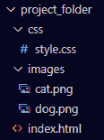
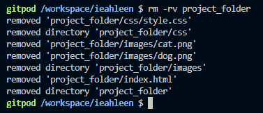
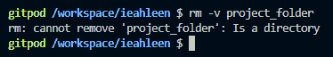
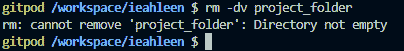
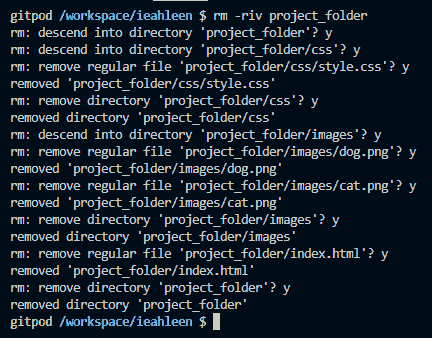
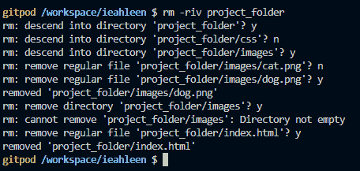
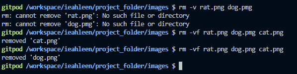

# 在 Linux 中删除目录——如何从命令行删除目录和内容

> 原文：<https://www.freecodecamp.org/news/remove-a-directory-in-linux-how-to-delete-directories-and-contents-from-the-command-line/>

Linux 是一种流行的开源操作系统，它的特性通常在您的开发环境中就可以使用。如果你能学会它的基本命令，它会让你作为一个开发者的生活变得更加容易。

在本指南中，您将学习如何从 Linux 命令行删除目录和文件。

# Linux 的`rm`命令

`rm`(remove 的缩写)命令非常有用。让我们学习它的语法，并通过几个例子来看看它的实际应用。

## `rm`命令语法

语法如下所示，`args`是任意数量的参数(文件夹或文件)。

```
rm [options] args
```

没有`options`你可以用它来删除文件。但是要删除目录，您需要使用这个命令的`options`。

选项如下:

*   `-r`、“递归”——此选项允许您删除文件夹，并先递归移除其内容
*   `-i`，“交互”——使用这个选项，每次在你删除东西之前，它都会要求确认
*   `-f`，“强制”——忽略不存在的文件，覆盖任何确认提示(本质上和`-i`相反)。如果目录写保护，它不会从目录中删除文件。
*   `-v`，“verbose”——它打印命令在终端上执行的操作
*   `-d`，“目录”——允许您删除一个目录。只有当目录为空时，它才起作用。

## Linux `rm`命令示例

我们以一个`project_folder`目录为例。里面有这些文件和文件夹:



让我们使用这个目录来展示各种选项是如何工作的。

你可以给所有的命令添加选项`-v`，这样它就会一步一步地写下正在发生的事情。

所以，我们从第一个选项`-r`开始。您刚刚了解到这将递归地删除文件和文件夹。你可以像这样使用`rm -r project_folder`或者`rm -rv project_folder`作为详细选项。



它已经按照显示的顺序删除了`project_folder`目录和其中的所有内容。

让我们重新创建文件夹，然后重试。

如果您不使用`-r`选项，而是试图删除目录，会发生什么？它不允许这样做，而是显示一个错误:



要删除目录，您可以使用`-d`选项，但是如果您试图在这种情况下使用它，它会给出一个错误，因为文件夹不是空的。



`-i`选项使得它单独询问每个动作。

并且你需要在每次查询后按下`y`或`n`然后再按下`Enter`。

如果您为所有查询选择`y`，将会删除所有内容:



相反，如果你决定不删除一些文件或文件夹，用`n`它会保留这些文件，并继续处理其余的文件:



最后一个我们目前还没有看到的选项是`-f`，它会抑制错误。

例如，如下所示，您将尝试删除两个不存在的文件——没有一个`rat.png`文件，并且`dog.pmg`有一个打印错误，它给出了两个错误。使用`-f`选项，您将看不到错误。



# 结论

如果您是开发人员，Linux 命令行非常有用。在本文中，您已经看到了它的一个可能的命令，`rm`，您可以用它来删除目录和文件。

享受你的武器库中的这个新工具吧！