# React 教程–用 React 和 HarperDB 构建一个电影列表生成器

> 原文：<https://www.freecodecamp.org/news/react-tutorial-build-a-movie-list-generator-with-react-and-harperdb/>

在本教程中，我们将构建一个简单的电影生成器，它每 40 秒自动生成一部新电影。它还将包含一个名为“生成新电影”的按钮，以根据需要显示另一部电影。

这个应用程序将显示一部电影及其标题、上映日期、粉丝评分、持续时间、简短描述、演员阵容、导演姓名，最后还有一个链接到电影 IMDb 页面的按钮。

您可以从这个项目的 [Github](https://github.com/KingsleyUbah/harperdb-movie-generator) 存储库中访问这个项目的完整代码。

## 我们该如何建造它？

与大多数其他 web 应用程序一样，这个应用程序将由前端和后端组成。

前端是用户看到并与之交互的部分。在我们的应用程序中，我们的前端将由电影的封面图像、信息和一个链接到电影 IMDb 页面的按钮组成。

后端是我们的电影数据——如电影标题、描述、演员、图片等——的来源。

该应用程序将每 40 秒自动生成一部新的随机电影。

我们将使用 React 构建应用程序的前端。React 是一个前端 JavaScript 库，用于构建可重用的 UI 组件，如按钮、导航菜单、图像、卡片等。

我们还将使用纯 CSS 来设计我们的组件。

### 我们将如何构建后端

网站的后端通常包含一个数据库，这是一个用来存储和管理数据的程序。该数据库还必须通过 API 访问，以便我们的前端可以访问数据，并显示给用户。

为了实现这一点，我们将使用一个有趣的工具，名为 **HarperDB** 。

### **什么是 HarperDB？**

HarperDB 是一款速度惊人的数据库和数据管理软件——它甚至被证明比 MongoDB 快 37 倍。

数据库的速度指的是它能以多快的速度读写数据，并对这些数据进行计算。

HarperDB 也非常灵活。它允许您执行以下操作:

*   对单个端点进行查询
*   使用 SQL 和 NoSQL 查询您的数据库
*   用 JSON 和 SQL 查询上传数据。

如果您正在处理大量数据，您可以在一个 CSV 文件中一步导入所有数据。相当整洁！

您不必为您的数据定义数据类型，因为 HarperDB 会动态地为您定义。更不用说它们简单的界面，可以轻松管理您的云实例。

如我所说，非常灵活。

## 本教程的先决条件

为了构建这个应用程序，我假设您对以下语言和工具有一些基本的了解:

Npm 或任何其他包管理器 : 我们将需要它来安装 React 和 React HarperDB 挂钩 [use-harperdb](https://www.npmjs.com/package/use-harperdb) 到您的项目中。

NPM 代表节点包管理器。这是一个将你的本地项目连接到 npm 注册中心的工具，那里有数百万个公共代码包，比如 React 和`useharperdb`。一旦安装完毕，它还可以帮助您管理这些代码。

确保在您的计算机上安装了至少 12.xx 版本的节点。您可以使用此命令检查您的节点版本:`node -v`

在这个项目中，我们将只使用一两个基本的查询，所以如果你不太了解 SQL，也不用担心。

SQL 代表结构化查询语言。它是一种用于查询关系数据库的流行语言。我们将在钩子中使用它来查询 HarperDB 云实例的数据。

React:我们的用户界面将会用 React 来构建。如果你懂 JavaScript，那么学习 React 就相对容易。

一个 HarperDB 账户:如果你没有 HarperDB 账户，你需要[创建一个](https://studio.harperdb.io/sign-up)。别担心，完全免费。下面我将向你展示如何创建一个帐户。

最后，CSS: 我们将使用一点 CSS 来设计我们的元素。

## 什么是 React 钩子？

过去，要处理 React 组件中的数据，必须将组件定义为类组件。当 React 引入钩子时，这种情况发生了变化。

简单地说，钩子是允许您在非类(即函数)React 组件中处理数据的函数。

得益于此，您不必仅仅为了管理其中的状态数据而定义一个 React 类组件。

`use-harperdb`钩子允许你把你的应用挂接到你的云数据库实例来获取数据。可以把它想象成 React 应用程序(前端)和 HarperDB 数据库(后端)之间的桥梁。

## 如何建立数据库

正如我前面提到的，HarperDB 是一个灵活的数据库。它允许您通过设置自己的本地 HarperDB 服务器或使用无服务器架构来使用它的服务。

在这个项目中，我们将使用无服务器架构。这意味着我们不会在本地机器上实现服务器(也就是后端)。相反，我们将利用 HarperDB 的云基础设施来管理我们的电影数据，并将其用于我们的应用程序。

### 设置 HarperDB 云实例

首先，我假设你已经像我之前问的那样创建了你的免费账户。如果你还没有，那就去[注册](https://studio.harperdb.io/sign-up)。

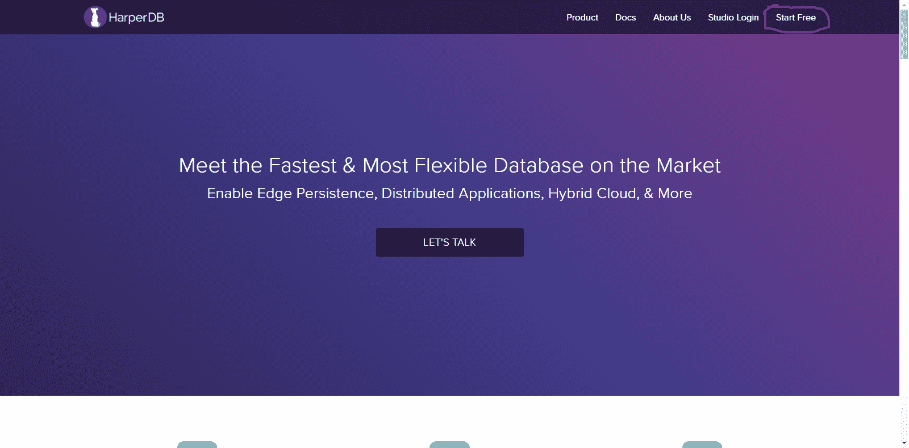

Sign Up for HarperDB

您将被要求提供您的姓名、有效的电子邮件和您的云实例的子域名。有了它，HarperDB 会为你创建一个子域名。

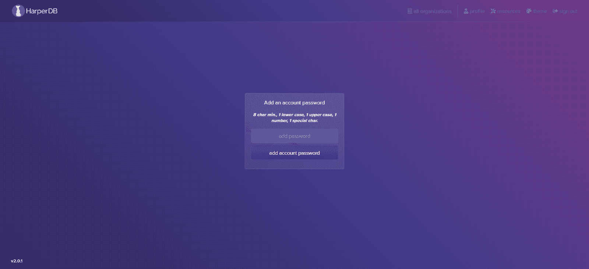

Make sure to choose a strong password

接下来，我们将创建一个云实例:

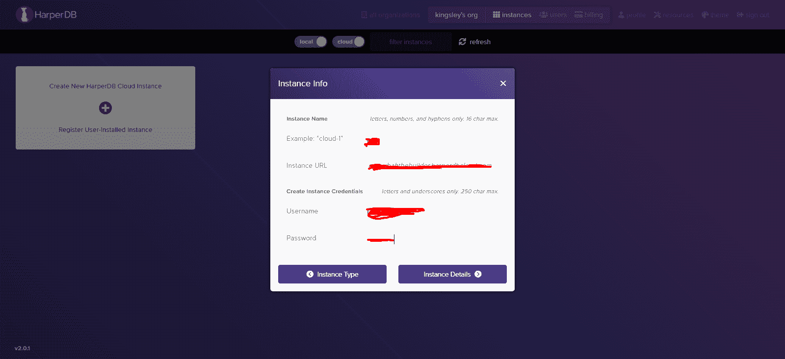

*Fill in your details*

这里，您将被要求添加一个实例名。不要担心，你可以给它起任何你容易记住的名字，但是最好是描述性的。

为了创建您的实例 URL，您将在应用程序中查询数据时需要它，HarperDB 会将您的实例名称与您的子域名相结合。还会提示您设置实例凭据(用户名和密码)。

接下来，我们选择实例规范。为了这个教程，我们将采用免费计划。此外，您需要为您的实例选择一个区域。

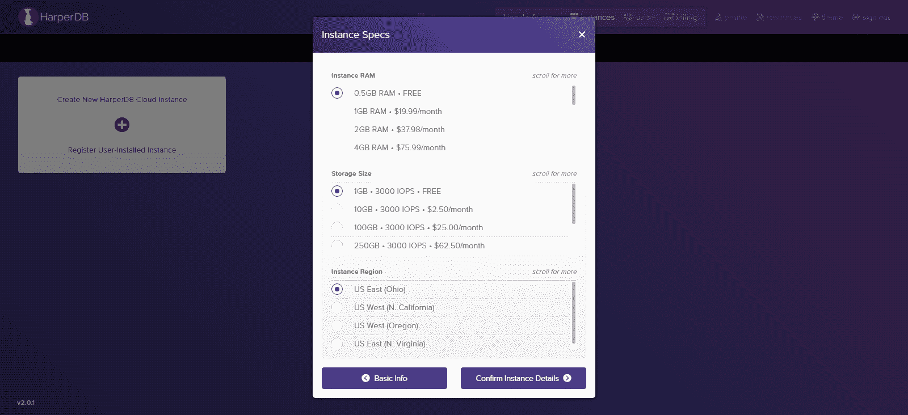

Choosing the free plans

单击“确认实例详细信息”,您将转到包含所有实例信息的页面。现在，复制您的实例 URL、用户名和密码，并将其保存在某个地方，因为您稍后会需要它。


*Save your URL, username and password*

完成后，单击“添加实例”按钮。您将进入显示您的实例卡的页面。在您可以使用它之前，您的实例将需要一些时间进行初始设置，但是我们可以在等待的时候做一些事情。

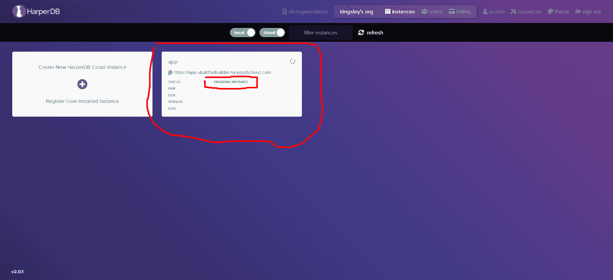

Setting it up

## 如何设置 React 应用程序

虽然我们的云实例仍在设置中，但我们可以借此机会为我们的应用程序设置项目目录。

首先，我们通过在任何命令终端上运行以下命令来初始化我们的项目:

```
npx create-react-app harperdb-movies-generator
```

这个命令将创建一个名为 harperdb-movies-app 的文件夹，并安装我们的项目所需的所有依赖项。这包括 React 和 ReactDOM，所以我们不必手动操作。

接下来，我们将运行命令，将 use-harperdb 挂钩引入我们的项目。这个钩子将帮助我们连接到我们的云实例。要安装它，我们在命令行上运行以下命令:

```
npm install use-harperdb
```

**设置完毕！**

### 如何将 HarperDB 集成到 React 应用程序中

既然已经安装了 use-harperdb 挂钩，我们还需要做一件事来访问数据库中的数据并对其进行 CRUD 操作:我们必须将您的应用程序连接到您的云实例。我们将使用 HarperDBProvider 来完成这项工作。

在此之前，我们必须先做一些事情。当构建一个 CRUD 应用程序时，向其他人公开私有凭证(比如我们的 API 密匙)并不是一个好的做法，尤其是如果我们打算将代码推送到一个像 GitHub 这样的公共 repo 中。

为了保护任何敏感凭证，我们需要将它们存储为环境变量。这只是一个文件，我们在其中存储敏感的凭证，如密码、API 密钥，在我们当前的情况下，还有我们的云实例凭证(URL、用户名和密码)。

在你的根目录下创建一个`.env`。在代码编辑器中创建这个文件，右键单击根目录(harperdb-movie-generator)并选择“创建新文件”选项。

将该文件命名为`.env`并按回车键。这将在 harperdb-movie-generator 中创建一个. env 文件。此后，定义以下变量:

```
REACT_APP_DB_URL=**
REACT_APP_USER=**
REACT_APP_PASSWORD=** 
```

确保使用相同的格式，并传递关于您自己的云实例的正确细节，而不是双星号。填写您的实例 URL、您的实例用户名和您的实例密码，我之前告诉您保存在某个地方。

React 将读取所有使用 REACT_APP 作为前缀的环境变量，然后在需要的地方动态传入值。

与。env 文件创建后，我们的下一个动作是将整个 React 应用程序包装在导入的 HarperDBProvider 中

HarperDBProvider 将确保我们的应用程序拥有 HarperDB 数据库的上下文。

为了将 React 应用程序包装在提供者中，我们将转到项目中的 index.js，导入提供者，并将这些环境变量安全地传递给提供者。这让它知道将我们的前端连接到哪个实例:

```
import React from 'react';
import ReactDOM from 'react-dom';
import './index.css';
import App from './App';
import { HarperDBProvider } from 'use-harperdb';

ReactDOM.render(
  <React.StrictMode>
    <HarperDBProvider
    url={process.env.REACT_APP_DB_URL}
    user={process.env.REACT_APP_USER}
    password={process.env.REACT_APP_PASSWORD}
    >
      <App />
    </HarperDBProvider>
  </React.StrictMode>,
  document.getElementById('root')
); 
```

## 如何用数据填充我们的数据库

如果您还记得的话，我们在云实例还在建立的时候就离开了它。现在，我们应该已经设置好了实例，并准备好提供数据。在这种情况下，您将在实例上看到 OK 状态:

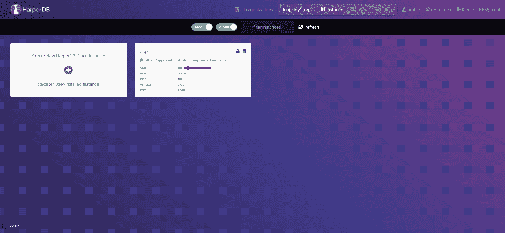

Instance now set

您的云实例应该是易于使用的，并且您的前端也连接到您的实例。但是，如果前端没有任何数据(即电影)显示给用户，它将毫无用处。

所以首先我们需要用数据填充我们的数据库。

但是在此之前，我们需要为我们的电影数据创建一个模式。您可以将模式视为数据库中的一组表。我简单地称我自己的模式为“集合”:

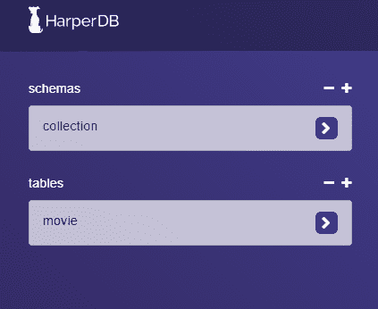

Creating our schema and a table inside of it

接下来，我们将创建我们的表。我把我的叫做“电影”。一个表将由单个电影的记录组成。

每个电影记录必须有一个 hash_attribiute。hash_attribute 只是一个具有唯一键的列，它标识特定的数据行并将其与下一行区分开来。我们只是使用“id”列作为 hash_attribute。

因为我们正在创建一个包含多部电影的应用程序，所以我们的表将包含多行电影(即数据记录)。此外，由于每部电影都有许多属性，如标题、年份、上映日期等等，因此它将有不止一个信息字段。

您可以使用单个 JSON 对象逐个上传电影，或者使用一组 JSON 对象上传完整的电影集合。

HarperDB 允许您以三种主要方式上传数据:

1.  通过 SQL 或 NoSQL 查询在我们的数据库上创建数据。
2.  通过定义单个 JSON 对象(仅针对一条记录)和一组 JSON 数据(针对多条记录)
3.  通过用 CSV 文件导入和加载数据

为了上传一部电影的数据，我们创建了一个 JSON 对象，其中包含了所有的电影信息。以下是 JSON 数据的一个示例:

```
{
  cover: 'https://res.cloudinary.com/ubahthebuilder/image/upload/v1627129180/avengers_endgame_ilqzqj.png',
  date: 2017,
  description: 'After the devastating events of Avengers: Infinity War (2018), the universe is in ruins. With the help of remaining allies, the Avengers assemble once more in order to reverse Thanos actions and restore balance to the universe.',
  directors: [
    'Anthony Russo',
    'Joe Russo'
  ],
  genres: [
    'Action',
    'Adventure',
    'Drama'
  ],
  hours: 3,
  id: 1,
  minutes: 1,
  rating: 8.4,
  stars: [
    'Robert Downey',
    'Chris Evans',
    'Mark Ruffalo'
  ],
  title: 'Avengers: End Game',
  website: 'https://www.imdb.com/title/tt4154796/',
  writers: [
    'Christopher Markus',
    'Stephen McFeely'
  ]
} 
```

导航到集合内的电影表，并单击页面右上角的+号，该符号在下图中突出显示:


Adding a new movie record into our table

复制先前定义的 JSON 对象，并将其粘贴到提供的空间中，出于格式原因，替换那里的所有内容。单击绿色按钮将信息保存到电影表中。

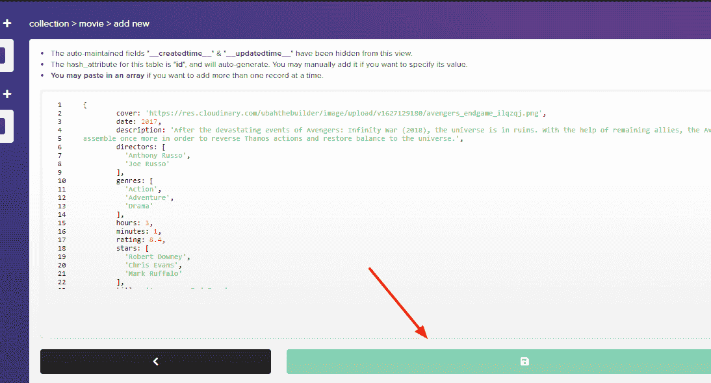

Paste in the JSON object

一旦我们完成上传，我们的表应该看起来像这样:

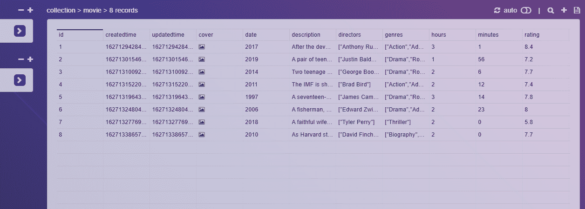

Eight Movies inside of our table

请注意，您可以利用这个项目的 [GitHub 存储库](https://github.com/KingsleyUbah/harperdb-movie-generator/blob/master/data/movies.json)中的数据一次插入多条电影记录。

## 如何建立我们的用户界面和查询数据库

现在数据已经准备好了，我们需要在我们的前端显示它，供用户查看和交互。

首先，我们需要修改 app.js 文件:

```
import React from 'react';
import './App.css';
import Movie from './components/Movie';

function App() {
  return (
    <div className="App">
      <div className="main-container">
        <header>
          <h1 className="heading">Movie List</h1>
          <h3> A Simple Movie Generator built with React and HarperDB</h3>
        </header>
        <div>
          <Movie />
        </div>
      </div>
    </div>
  );
}

export default App; 
```

这将是我们项目中的顶级组件。

接下来，我们将为整个应用程序导入 React 和 React DOM 库以及样式表 App.css。

接下来，在 App.css 文件中，我们定义了返回标题元素和电影组件的 App 组件。

这是我们整个应用程序的风格:

```
@import url('https://fonts.googleapis.com/css2?family=Lato:wght@300&display=swap');
@import url('https://fonts.googleapis.com/css2?family=Roboto:wght@500&display=swap');

/* Base Styles */

body {
  font-family: "lato", sans-serif;
  color: white;
  background-color: #082032;
}

a {
  color: black;
  font-family: "roboto", sans-serif;
  font-size: 50px;
  text-decoration: none;
  display: inline-block;
}

h1 {
  text-align: center;
  font-family: "roboto", sans-serif;
  font-size: 60px;
  font-weight: 80px;
}

h3 {
  text-align: center;
}

p {
  font-weight: 400px;
}

span {
  color: #FFF338;
}

ul {
  list-style-type: none;
  display: flex;
  margin-left: 339px;
}

li {
  outline-color: #2C394B;
  outline-style: inset;
  outline-width: 2px;
  outline-offset: 5px;
  margin: 11px;
  padding: 0px, 20px;
}

img {
  height: 500px;
  width: 100%;
}

/* Classes */

.movie-cover {
  max-width: 800px;
  width: 800px;
  background-color: #2C394B;
  margin: 0 auto;
  border-radius: 10px;
}

.circle {
    background-color: transparent;
    margin-right: 37px;
    text-align: center;
    margin-top: 50px;
    border:3px solid #FFF338;
    height:90px;
    border-radius:50%;
    -moz-border-radius:50%;
    -webkit-border-radius:50%;
    width:90px;
}

.ratings {
  font-size: 30px;
  margin-top: 12px;
}

.big-half , .small-half {
  font-family: "roboto", sans-serif;
  font-style: oblique;
  color: white;
}

.small-half {
  color: #DAD0C2;
  font-size: 19px;
}

.visit-movie-button {
  margin: 30px, 20px;
  padding: 10px, 30px;
  position: relative;
  top: 50px;
  left: 120px;
  font-size: 20px;
  outline-style: solid;
  color: #FFF338;
  outline-color: #FFF338;
  outline-offset: 10px;
}

.generate-movie-button {
background-color: #FFF338;
padding: 0.5em 1.2em;
font-size: 20px;
text-decoration: none;
position: relative;
top: 50px;
left: 250px;
text-transform: uppercase;
}

.action-buttons {
  width: inherit;
}

.title {
  font-size: 50px;
  padding-top: 40px;
  padding-left: 30px;
  margin-bottom: 0;
}

.top-information {
  display: flex;
  justify-content: space-between;
}

.supporting-info {
  padding-left: 30px;
  font-weight: bold;
  margin-bottom: 20px;
}

.lower-information {
  font-family: "roboto", sans-serif;
  width: 800px;
  max-width: 800px;
  margin-left: 380px;
} 
```

同样，您可以从其 [Github](https://github.com/KingsleyUbah/harperdb-movie-generator) 存储库中访问该项目的完整代码。

### 如何添加电影组件

我们现在需要添加我们的电影组件。我们将首先在“src”目录下创建一个名为`component`的新文件夹。然后我们需要在这个名为‘movie . js’*的新文件中创建一个新文件。*这是辛辣事物开始发生的地方。

除了 React 和 ReactDOM 库，我们还将导入 use-harperdb 挂钩(函数)。

我们将执行 use-harperdb 函数，将一个对象作为参数传入。在对象内部，我们至少需要提供一个查询属性。这个属性决定了我们想要在数据库上执行什么样的操作。

```
import React from 'react';
import { useHarperDB } from 'use-harperdb';

function Movie() {
let [data, loading, error, refresh] = useHarperDB({
    query: {
      operation: 'sql',
      sql: `select * from collection.movie where id = ${Math.floor(Math.random() * 8) + 1}`
    },
    interval: 40000 // 40 Seconds
  }
  )

  // CODE CONTINUES 
```

第一个属性是 operation 属性，指定如何查询数据。在我们的示例中，我们将使用一个 SQL 命令来完成。

查询中的第二个属性是 SQL 属性。这是我们为任何想要执行的 CRUD 操作编写 SQL 查询的地方。在我们的例子中，我们只想从数据库中从 1-8 之间随机选择的电影中选择所有字段，我们用下面的 SQL 子句表示:

```
select * from collection.movie where id = ${Math.floor(Math.random() * 8) + 1}`
```

在查询之后，我们可以定义的另一个可选属性是 interval 属性。使用此属性，您可以指定希望应用程序在自动生成对数据库的新查询之前等待多长时间。

使用正确传入的参数执行`useHarperDB`函数将返回一个包含一些重要内容的数组。以下是我们将从`useHarperdDB`获得的四个重要项目:

*   `loading`:这是一个布尔值，指定数据库是否仍在处理数据。这样，您可以选择显示一个“加载”微调器
*   `error`:表示查询数据库时是否遇到错误。
*   `refresh`:假设你没有设置 interval 属性，你可以在任何你想获取新数据的时候调用这个函数。
*   `data`:主要的东西。如果一切顺利，HarperDB 将把我们的数据返回给这个变量。

## 如何在我们的前端显示数据

现在，我们的数据已经从数据库中成功返回，是时候将它传递到我们的 React 模板中了:

```
if(loading) {
    return <div> Loading... </div>
  }

if(data) {
      return (
<>
<div className="movie-cover">
  <div className="top-information">
    <h2 className="title">{data[0].title}</h2>
    <div className="circle">
      <div className="ratings">
        <span className="big-half">{data[0].rating}</span>/<span className="small-half">10</span>
      </div>
    </div>
  </div>

  <div className="supporting-info">
    <span className="year">{data[0].date}</span> -
    <span className="time">{data[0].hours}h:{data[0].minutes}m</span>
  </div>
  <div className="image">
    
  </div>
</div>

<div className="genres">
  <ul className="movie-genres">
    {data[0].genres.map((genre, index) => {
    return (
    <li key={index}><span className="movie-genre-item">{genre}</span></li>
  )
    })}
  </ul>
</div>

<div className="lower-information">
  <p>{data[0].description}</p>

  <hr />
  <p> Starring: {data[0].stars.map((star, index) => {
    return (
    <span key={index}>{star} - </span>
    )
    })}
  </p>
  <hr />
  <p> Writers:
    {data[0].writers.map((writer, index) => {
      return (
    <span key={index} className="writer">{writer} - </span>
    )
    })}
  </p>
  <hr />
  <p>Directors:
    {data[0].directors.map((director, index) => {
      return (
    <span key={index} className="director">{director} - </span>
    )
    })}
  </p>
  <hr />
  <div className="action-buttons">
    <a href={data[0].website} className="visit-movie-button">Visit Movie</a>
    <a href="" className="generate-movie-button" onClick={refresh}>GENERATE NEW MOVIE</a>
  </div>
</div>
</>
)
} else {
    return (
      <div>Sorry No Data
        {error}
      </div>
  )
}

} 
```

如果你熟悉 React，你应该不会感到陌生。但是我还是要解释一下我们在这里做了什么:

*   正如我所说的，`useHarperDB`函数将返回我们的数据。如果您查询获取所有的电影，它将返回一个电影数组。因为我们只查询了一部电影，所以它将返回一个包含一部电影数据的对象。
*   接下来，我们必须检查数据是否被返回。如果没有数据，我们显示一个简单的 div，显示“对不起，没有数据”消息。
*   因为我们确实收到了数据，所以我们将数据传递到模板中。我们从对象中提取每个字段，并将其传递到正确的模板中。

完成后，我们在命令行上运行以下命令:

```
npm start
```

这应该在 [https://localhost:3000](https://localhost:3000) 启动我们的开发服务器。如果一切顺利，我们应该可以在浏览器上看到我们的应用程序和一些很酷的电影数据！


How our app should look


**这就是我们的应用程序！**

## 如何将应用程序部署到 GitHub 页面

欢迎来到本教程的最后一部分。我们将把我们的新应用程序部署到 GitHub 页面上，让全世界都能看到。

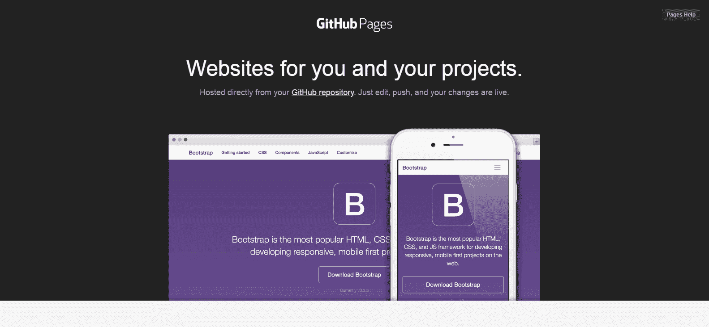

Deploy on GitHub Pages

如果你有另一个主机提供商，那么你绝对可以在那里部署你的应用。如果你不想，或者你想要免费的东西，那么 GitHub Pages 是很棒的。

首先，你需要有一个 GitHub 账户。如果没有，您可以在这里为自己创建一个[。](https://github.com/join)

此外，您需要在本地机器上安装 Git 版本控制软件。这是每个软件开发人员都应该具备的。但是，如果没有，可以从[这里](https://git-scm.com/downloads)安装。

首先要做的是在您的 GitHub 帐户上为您的项目创建一个新的资源库:

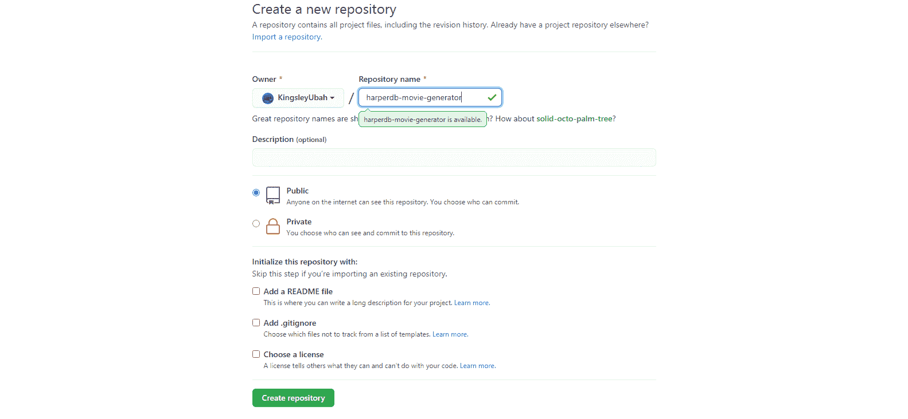

Creating a new GitHub repo

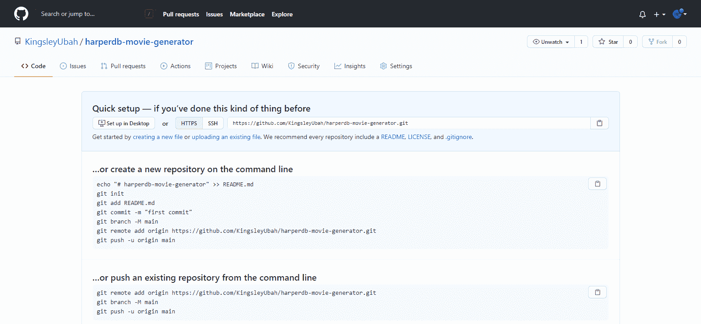

然后返回终端，运行以下命令:

```
npm install gh-pages --save-dev
```

这将把 GitHub 页面作为开发依赖项保存到您的项目中。

完成后，转到项目文件夹并打开 package.json 文件。您应该会发现 gh-page 安全地安装在 dev 依赖项下:

```
"devDependencies": {
    "gh-pages": "^3.2.3"
  } 
```

接下来，我们将做以下三件事:

1.  导航到您的项目目录(harperdb-movie-generator)并选择 package.json 文件。在 json 包的顶部，您将添加以下数据(用您的模板替换模板):

```
"homepage":  https://{Your GitHub username here}.github.io/{Your Project Name}.git
```

要找到您的 GitHub 用户名和存储库名称，请导航到 GitHub 上新创建的存储库。在顶部，你可以找到你的 GitHub 用户名和旁边的项目名称。将它们都复制下来，并将其填入前面提到的模板中——确保附加。git 放在项目名称的末尾。

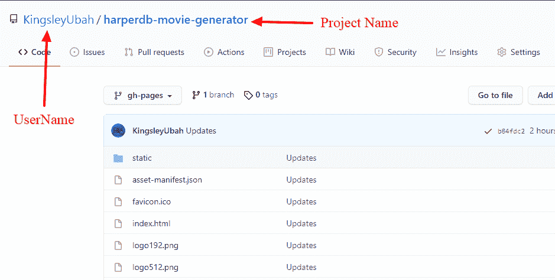

Github information for your package.json

添加“主页”字段的本质是指定我们的应用程序最终将被托管的 URL。确保在末尾加一个逗号，这样您的包 json 将被正确解析。

2.转到同一个文件中的“scripts”字段，传入以下数据，确保保持适当的缩进:

```
"predeploy": "npm run build",
"deploy": "gh-pages -d build" 
```

当您准备好部署到 GitHub 页面时，这就是您将运行的内容。

3.最后，您将在项目中初始化 Git。为此，只需在命令行上导航到您的项目目录，并运行以下命令:

```
cd projects/harperbd-movie-generator

git init 
```

现在，一切都准备好了！

剩下唯一要做的就是将你的应用程序部署到 GitHub 页面。为此，请运行以下命令:

```
npm run deploy
```

瞧！您的应用将立即部署到 GitHub 页面。

## 如何查看您的实时应用程序

你的应用程序现在是活的，但你必须看到它是什么样子。所以你必须得到它的网址。

转到您的 GitHub 配置文件，然后单击 repository 选项卡。选择您新创建的 repo，转到设置页面，向下滚动一点。您会发现 GitHub 页面部分。点击“查看这里！”

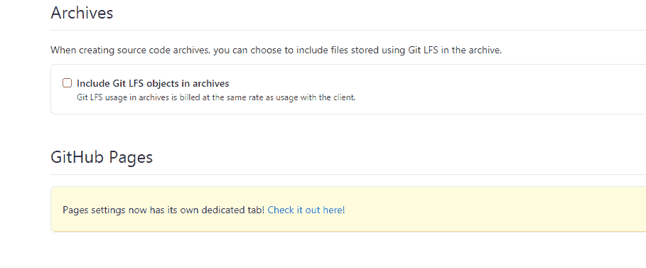

在下面的页面中，在 Source 中，将分支切换到“gh-pages ”,将文件路径切换到“root”。几分钟之内，你的应用就会全部设置好。从页面复制 URL 并粘贴到新的浏览器窗口中。

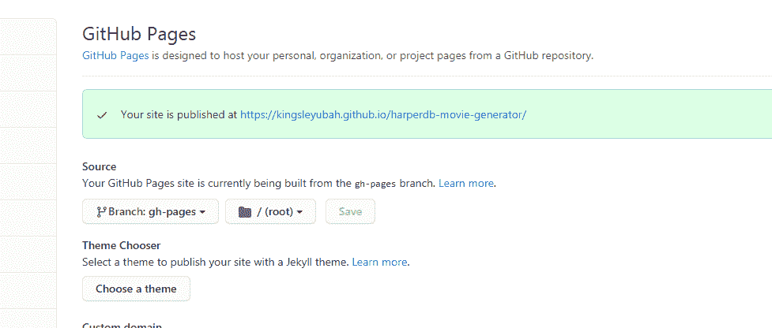

Project now live at the provided URL

瞧，你会看到你的活项目。

## 包扎

我们用 React 和 HarperDB 构建了这个项目。HarperDB 是数据管理和后端操作的绝佳选择。

正如我们在本教程中看到的，它不仅灵活，而且非常容易集成。

你不应该停在这里。您可以通过使用相同的堆栈构建其他一些很酷的项目来提高您的技能。多亏了 HarperDB 的免费计划，你不用支付任何费用。

您可以从其 [GitHub 库](https://github.com/KingsleyUbah/harperdb-movie-generator)中获取该项目的代码。

想寻求建议吗？你可以在推特上找到我

就是这样。感谢您的关注，祝您度过愉快的一周。