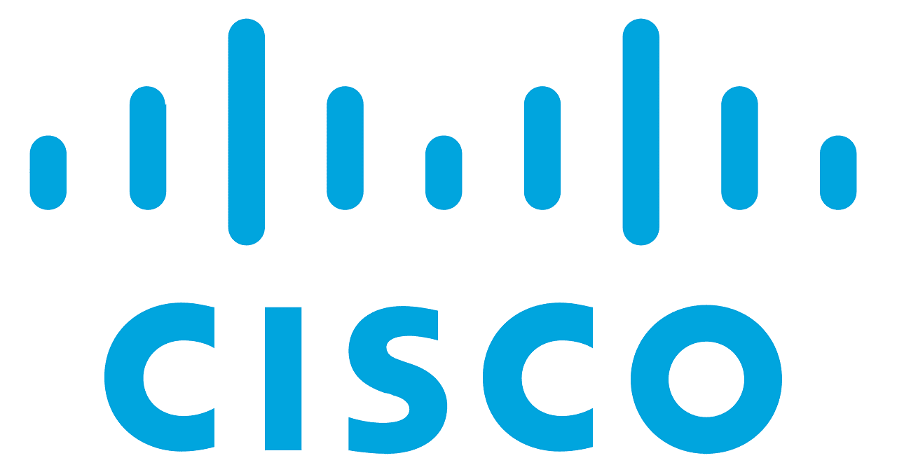

# 高级软件工程师面试问题——帮助你准备工作面试的技巧

> 原文：<https://www.freecodecamp.org/news/senior-software-engineer-interview-questions-how-i-got-a-job-as-an-sde-3-and-how-you-can-prepare-for-the-rounds/>

我于 2021 年 7 月 28 日刚刚加入[思科系统](https://www.cisco.com/)，担任高级软件工程师(SDE 三)。作为一名 UI 开发人员，我在[思科客户体验](https://www.cisco.com/c/m/en_us/customer-experience/index.html)团队工作。

从申请工作到接受工作的整个过程长达两个月。我希望分享我的面试经验，这将有助于你准备一个高级 UI 工程师的角色。

## 你会从这篇文章中得到什么？

在这篇文章中，我将谈谈我的旅程，从获得工作推荐到接受聘用。

我将讲述我经历的不同轮次的面试过程，以及在面试中我被问到的问题。我在这里分享的问题将帮助你为 Angular 开发角色做好准备。

我还会分享一些你可以问面试官和人力资源代表的问题，这些问题会帮助你更多地了解公司和项目。

那么，让我们开始吧！

## 我是如何发现招聘启事的

找工作的第一步是让你的简历被你想要的职位选中。我是从 Alex Okrushko 分享的一条推文中发现这个机会的。

> 好消息！
> 为了寻找顶尖的[#棱角分明的](https://twitter.com/hashtag/Angular?src=hash&ref_src=twsrc%5Etfw)人才，我们在印度[#招聘](https://twitter.com/hashtag/hiring?src=hash&ref_src=twsrc%5Etfw)中级&高级人才(全国范围)
> 
> 此外， [@Ionicframework](https://twitter.com/Ionicframework?ref_src=twsrc%5Etfw) 的高级和技术主管的机会也被添加到列表中
> 
> 最终，美国/加拿大的更多中级&高级职位得到了✅
> 
> DM me😀[https://t.co/kCmeHhpaXp](https://t.co/kCmeHhpaXp)
> 
> — Alex Okrushko (@AlexOkrushko) [February 25, 2021](https://twitter.com/AlexOkrushko/status/1365064874599079947?ref_src=twsrc%5Etfw)