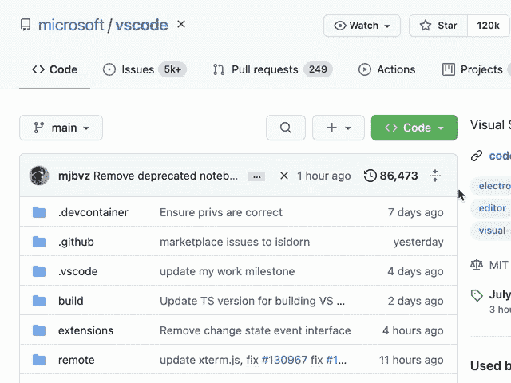
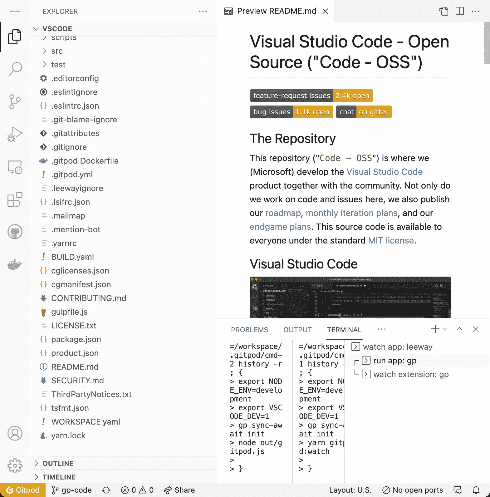
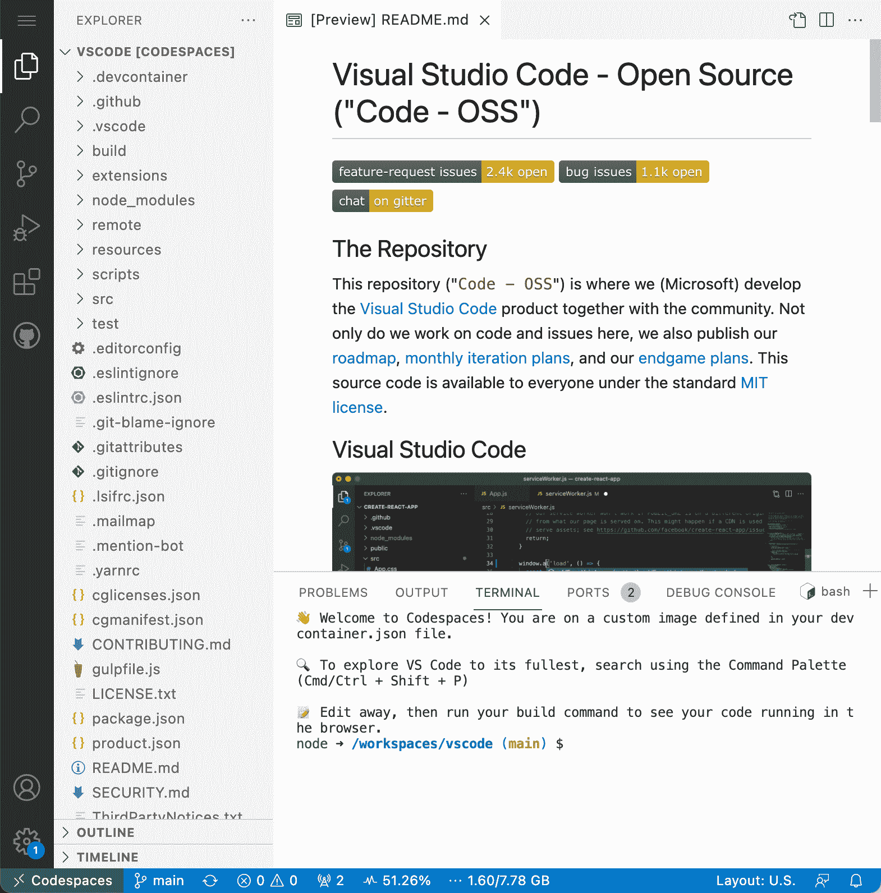
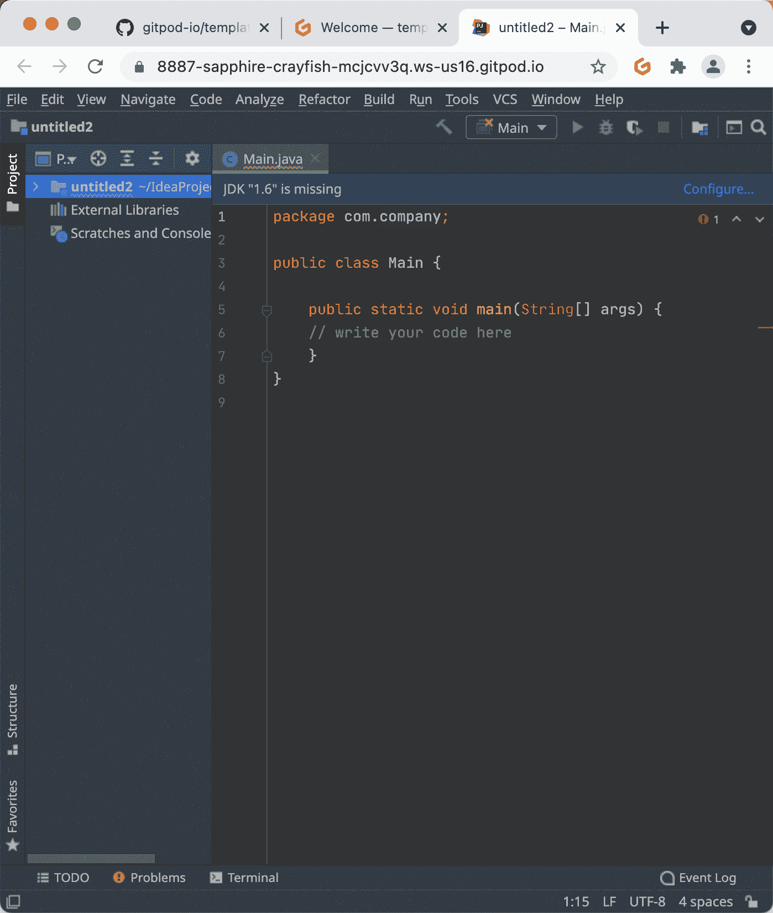

# GitHub 代码空间 vs git pod——全栈开发转向云

> 原文：<https://www.freecodecamp.org/news/github-codespaces-vs-gitpod-cloud-based-dev-environments/>

[Gitpod](https://www.gitpod.io/) 和 [GitHub Codespaces](https://github.com/features/codespaces) 是基于云的开发人员环境，允许您在几秒钟内启动高性能的自动化开发环境。

在过去的几个月里，我已经进入了基于云的开发环境的兔子洞。我正在将我的几个项目转移到云上，这样开发者只需点击一下鼠标就可以部署项目，就像[这个全栈 NFT 市场](https://github.com/dabit3/polygon-ethereum-nextjs-marketplace)。

作为一名教师和内容创建者，这对于我帮助开发人员学习如何编码特别有帮助。现在，这些开发人员可以部署示例项目，而不必设置他们的本地环境，因此，如果他们刚刚开始，就少了一个障碍。

这也是整体生产力和效率的提升，因为我在进行更新时不必再在本地克隆和设置项目。相反，我只需点击一个按钮，它就准备好了。

在这篇文章中，我将分享我对生态系统的看法，并比较实现这一目标的两个领先选项——GitHub code spaces 和 Gitpod。

为了透明起见，Gitpod 还是我的 YouTube 频道的赞助商。也就是说，我只选择接受我已经喜欢使用的项目的赞助。

## **基于云的开发——这就是方法**

作为开发人员，我们喜欢将事情自动化。我们加快了自己的工作流程，自动化了基础设施和 CI/CD 管道，甚至创建了自己编写代码的工具。

如果你看看现代软件管道，有一个领域我们还没有自动化:我们的开发环境。它们仍然很脆弱，依赖于本地机器，需要伤脑筋的设置和维护工作，这会分散我们的创造力和生产力。

开发环境是入职和持续开发期间的一个持续的摩擦源(还记得您上一次“在我的机器上工作”的讨论吗)。

作为帮助新开发人员学习如何编码的教师和内容创建者，最常见的问题之一不是教程或内容本身。更确切地说，这是开发人员的本地环境没有被正确设置，而且通常甚至不是他们的错。

必须考虑到操作系统和应用程序版本的无数差异。

随着时间的推移，本地开发环境带来的痛苦只会变得更糟:更大的工作负载、更多的数据、更多的依赖性、更多的测试、多服务和多轨道开发都是难以解释的事情。

## **GitHub Codespaces 和 Gitpod 引领了一批基于云的开发环境**

几年前，Cloud9 作为第一代浏览器 ide 进入了这个领域。尽管他们的想法朝着正确的方向发展，但是技术和社区还没有准备好。

从那以后，很多事情都变了。除了 VS 代码的出现和迅速崛起，容器和 VM 技术也有很大的飞跃，使得在云中运行开发人员环境变得更快、更安全、更可伸缩和更实用。

毫不奇怪，我们看到像谷歌、脸书、Shopify 和最近的 GitHub 这样的公司通过内部解决方案将软件开发完全转移到云上。

该领域有一些参与者已经利用了这些发展——尽管有些人可能会认为其他现有的解决方案更侧重于特定语言的原型和游戏工作，而不是本地开发的完全替代。

当谈到基于云的开发环境来进行日常专业软件开发时，有两个主要选项: [Gitpod](https://www.gitpod.io/) 和 [GitHub Codespaces](https://github.com/features/codespaces) 。

那么他们会怎么做呢？实际上，它们让你可以在任何 Git 环境中在云端构建基于任务的开发环境。一旦你完成了，你只要关上它们。

这是对生产力的巨大推动。考虑多轨道开发(当切换上下文以审查拉式请求时，不改变开发环境设置)、入职、一致性或只是远程工作。你可以在任何电脑、Chromebook 或平板电脑上工作。

在本文中，我们将深入了解这两款产品，并根据以下类别对其进行评估:

*   工作流和协作
*   集成驱动电子设备
*   运行时间
*   自动化
*   开源和生态系统
*   可用性和定价

让我们开始吧！

## GitHub 代码空间与 Gitpod 工作流

GitHub Codespaces 和 Gitpod 都是服务，允许你做与你在本地 Linux 机器上所能做的完全一样的事情，除了一个主要的附加:你的开发者环境可以被配置为代码，因此是受版本控制的、可复制的和自动化的。

GitHub Codespaces 允许你用一个 [devcontainer.json](https://code.visualstudio.com/docs/remote/devcontainerjson-reference) 文件和一个 [.gitpod.yml](https://www.gitpod.io/docs/references/gitpod-yml) 文件来做这件事，你可以把它们放到你的存储库中(后面会有更多的介绍)。两者本质上做同样的事情，比如定义使用什么 Docker 容器，运行什么脚本，它们控制什么扩展在你的代码空间(GitHub) /工作空间(Gitpod)中可用。

这两个产品都包含一个软件开发流程，使开发人员能够从任何 Git 上下文(Issue、PR/MR、branches 等)中启动一个开发人员环境，只需针对您正在处理的特定任务进行一次单击。

这种基于任务的开发流程最终说服了我从本地开发转向真实世界的项目，并且在使用它之后，感觉很难再回到没有它的状态。

开发人员环境变成了一些资源，我可以按需启动，如果我完成了我的任务，就关闭并忘记它。Gitpod 在工作流方面表现出色，并围绕它开发了他们的产品。

阅读来自 GitHub 工程团队的[博客文章](https://github.blog/2021-08-11-githubs-engineering-team-moved-codespaces/),感觉他们内部采用了类似的工作流程，然而这并不是 Codespaces 现在固有的。

## 与代码空间 vs Gitpod 的协作

GitHub Codespaces 和 Gitpod 都提供了协作的方式，但它们的方法不同。

在这两个平台上，当您的开发环境运行时，您可以向 internet 公开或私下公开任何 TCP 端口。这使得工作流可以将指向 web 服务器或 API 服务器的链接作为标准 URL 进行共享。

Gitpod 提供了与同事共享工作区快照的功能，但 GitHub Codespaces 没有。

当安装了 [LiveShare 扩展](https://visualstudio.microsoft.com/services/live-share/)时，GitHub Codespaces 提供了交互配对程序的能力，而 Gitpod 提供了与合作者共享工作空间本身的能力。

一旦 Gitpod 启用了本地 VS 代码支持(撰写本文后的 1-2 周)，您也可以将 LiveShare 与 Gitpod 一起使用。

这里有一些进一步的资源，您可以从中了解更多相关信息。

*   [https://www . git pod . io/blog/I-say-goodbye-to-local-development-and so-can-you # develop-a-new-feature](https://www.gitpod.io/blog/i-said-goodbye-to-local-development-and-so-can-you#develop-a-new-feature)
*   [https://github . blog/2021-08-11-githubs-engineering-team-moved-code spaces/](https://github.blog/2021-08-11-githubs-engineering-team-moved-codespaces/)
*   [https://visualstudio.microsoft.com/services/live-share/](https://visualstudio.microsoft.com/services/live-share/)

## Gitpod 与代码空间 IDE

Gitpod 和 Codespaces 都是上游版本，stock VS Code 是它们在浏览器中运行的默认 IDE。它的感觉、行为和你在桌面上使用的 VS 代码完全一样。不过要注意 cmd+W:)。

由于 GitHub 归微软所有，我知道 VS 代码团队大量参与了 GitHub 代码空间的构建。

Gitpod 背后的团队在开源开发者工具方面有很长的背景，他们最初创建了[忒伊亚](https://theia-ide.org/)(也是基于 VS 代码)。但是最近，他们转向了股票 VS 代码，并维护了一个非常轻量级的 VS 代码分支，这个分支也继续被业内的其他团队采用(【https://github.com/gitpod-io/vscode/】)。

## VS 代码空间和 Gitpod 的代码扩展市场

拥有产品背后的 VS 代码团队，并能够通过微软控制的 Visual Studio Marketplace 访问所有专有扩展(例如 Liveshare ),这对代码空间来说是一个优势。

作为回应，Gitpod 创建了[https://open-vsx.org/](https://open-vsx.org/)(现在托管在 Eclipse Foundation 下)，这是一个由 Eclipse Foundation 为 VS 代码扩展运营的供应商中立市场，可通过 Gitpod 访问。

尽管对于最流行的 VS 代码扩展来说，几乎有同等的扩展，但是微软的(优秀的)专有扩展还没有找到打开 VSX 的方法。

如果在 OpenVSX 上找不到开源扩展，可以通过向[https://github.com/open-vsx/publish-extensions](https://github.com/open-vsx/publish-extensions)发送拉请求来触发发布自动化。

### 从桌面与代码进行远程开发

我非常喜欢能够从我的本地桌面 VS 代码连接到在别人的计算机上运行的开发环境。

这两个产品都提供了这个特性，但是 Codespaces 开箱即用的流程比 Gitpod 的方法更好。

虽然你可以用 Gitpod 的[本地应用](https://www.gitpod.io/blog/local-app)达到同样的效果，但从用户的角度来看，设置需要更多的工作和摩擦。就此询问 Gitpod 团队，得到的反馈是他们将在 8 月底发布类似的一键体验。

### VS 代码以外的其他 ide 呢？

对于 GitHub 代码空间，除了 VS 代码，我找不到其他 ide 的任何信息。鉴于微软是这两个项目的幕后支持者，我预计他们可能会关注 VS 代码。

相比之下，Gitpod 试图强调他们所构建的在架构层面上是独立于 IDE 的，并且允许你运行任何你可以在他们的容器中远程运行的 IDE 映像。

我在他们的 GitHub Repo 中发现了一些模板，可以让你运行 Jetbrains 产品车队(基于[https://github.com/JetBrains/projector-installer](https://github.com/JetBrains/projector-installer))。

那里的开发者体验仍然感觉有点笨拙。深入挖掘一下，我发现这个有趣的[讨论](https://youtrack.jetbrains.com/issue/IDEA-226455#focus=Comments-27-5125731.0-0)围绕着 Jetbrains 社区中最受欢迎的一个特性，该特性将通过 SSH 实现开箱即用的远程支持。我希望看到 Gitpod 和 Codespaces 支持这一点。

以下是一些可供进一步阅读的资源:

*   [https://www . the register . com/2021/04/08/git pod _ talks _ up _ importance _ of/](https://www.theregister.com/2021/04/08/gitpod_talks_up_importance_of/)
*   [https://www.gitpod.io/blog/local-app](https://www.gitpod.io/blog/local-app)
*   https://www.gitpod.io/docs/integrations/jetbrains

## 代码空间与 Gitpod 运行时

GitHub Codespaces 运行在虚拟机上，这些虚拟机开箱后具有很好的隔离性，并且更易于供应和管理。然而，它们也承担了整个操作系统的开销，使它们更大，启动更慢，成本也更高。

Gitpod 运行在轻量级容器上，这些容器可以快速旋转，并享受更高的云密度(因为更多的进程可以在相同的底层硬件上并行运行，所以空闲计算更少)。这使得 Gitpod 工作空间可以更快地运转，并且更加节约资源，即成本和能源。

容器的缺点是，默认情况下，它们没有虚拟机提供的隔离/安全优势。

去年之前，sudo-rights(以及 docker-in-docker)在 Gitpod 工作区是不可能的。今年早些时候，他们实现了名称空间隔离特性，使这两种事情成为可能(见他们的[工程主管解释他们是如何实现的](https://www.youtube.com/watch?v=iYLCHQgj0fE&t=274s))。

Codespaces 和 Gitpod 都支持 docker-in-docker，用于 docker 组合场景和嵌套虚拟化，从而能够在您的浏览器中运行操作系统或设备。

这里有更多这方面的资源:

*   [https://www.gitpod.io/blog/root-docker-and-vscode](https://www.gitpod.io/blog/root-docker-and-vscode)
*   [https://github.com/gitpod-io/template-nixos](https://github.com/gitpod-io/template-nixos)

## 使用代码空间和 Gitpod 实现自动化

两者都很大程度上接受了开发环境的概念，即最初由 vagger 创造、Gitpod 进一步构建的代码。

背后的基本思想是将来自基础设施的想法作为代码应用到开发环境中。Codespaces 使用一个 [devcontainer.json](https://code.visualstudio.com/docs/remote/devcontainerjson-reference) 格式作为配置文件，而 Gitpod 使用一个. gitpod.yml。

鉴于 Codespaces 和 VS 代码的影响力和分布能力，我的预测是， [devcontainer.json](https://code.visualstudio.com/docs/remote/devcontainerjson-reference) 格式将长期作为配置开发人员环境的行业标准。正如他们的[路线图](https://github.com/gitpod-io/roadmap/issues/16)所列，Gitpod 也计划支持这一点。现在他们没有，而是在一个 [.gitpod.yml](https://www.gitpod.io/docs/references/gitpod-yml) 上运行。

创建和设置您的 dev-env-as-code 只是实现完全自动化的单任务开发环境的第一步。因为您不希望每次启动开发人员环境时都要等待下载依赖项和构建代码，所以甚至在开始之前就需要预先构建工作区/代码空间。

Gitpod 为此支持[预构建](https://www.gitpod.io/docs/prebuilds)(把它们想象成 CI/CD 服务器，Gitpod 在这里预构建完整的工作空间/在每次提交 Git 时运行自动化)。自动化只有在频繁执行的情况下才能发挥作用。

Codespaces 目前在 GA 中没有预编译，但是他们已经在内部使用了。因此，他们公开发布该功能应该是几个月以后的事了。

您可以在此阅读更多信息:

*   [https://www . git pod . io/screen casts/continuously-pre build-your-project](https://www.gitpod.io/screencasts/continuously-prebuild-your-project)
*   [https://github . blog/2021-08-11-githubs-engineering-team-moved-code spaces/](https://github.blog/2021-08-11-githubs-engineering-team-moved-codespaces/)

## 代码空间和 Gitpod 开源和生态系统

两者最大的区别在于 Gitpod 是开源的，每个人都可以为项目做贡献。你可以在 [GKE](https://www.gitpod.io/docs/self-hosted/latest/installation/on-gke) 、 [EKS](https://www.gitpod.io/docs/self-hosted/latest/installation/on-amazon-eks) 和香草库伯内特斯上自主举办。

他们的路线图和开发工作是公开的，每个人都可以为项目做出贡献。除此之外，开源项目的维护者和核心贡献者[免费获得 git pod](https://www.gitpod.io/docs/professional-open-source)。

通过 GitHub，微软拥有了市场领先的开发者社交平台，他们将 GitHub Codespaces 作为一等公民整合到 GitHub 的开发者体验中。这意味着默认情况下，GitHub 中的 UI 向您显示一个在代码空间中打开的按钮，它很好地嵌入到您的开发工作流中。

为了让 Gitpod 达到同样的集成度，你需要下载[浏览器扩展](https://www.gitpod.io/docs/browser-extension/)或者[书签](https://www.gitpod.io/docs/browser-bookmarklet)。GitLab 与 Gitpod 有着[战略合作关系](https://about.gitlab.com/blog/2021/07/19/teams-gitpod-integration-gitlab-speed-up-development/)，并且在 GitLab UI 中内置了一个“在 Gitpod 中打开”按钮。

与微软相反，Gitpod 遵循一种策略，默认情况下它是中立的，不归大型科技公司所有，并且在设计上与开发人员想要使用的任何工具相集成。

这意味着它不仅适用于 GitHub，还适用于其他 Git 提供商，如 GitLab 和 Bitbucket，并且您可以在自己的基础设施上部署它。

## Codespaces 与 Gitpod 的可用性、定价和规格

Gitpod 已经推出了 2.5 年多，而 GitHub Codespaces 于 2021 年 8 月 11 日面向拥有 GitHub 团队或 GitHub Enterprise 订阅的客户推出了测试版。

根据首席执行官 Nat Friedman 的一条推文，我们可以预计个人开发者将在今年年底访问 GitHub 代码空间。

GitHub Codespaces 目前对 GitHub 团队或 GitHub Enterprise 订阅的所有组织免费，直到 9 月 10 日。计费增量是指工作空间处于活动状态的分钟数，以及在用户删除工作空间之前每个工作空间在磁盘上使用的存储量。

你可以[在这里](https://docs.github.com/en/codespaces/codespaces-reference/understanding-billing-for-codespaces)了解更多信息。

Gitpod 对公共和私人存储库是免费的，每月 50 小时。成熟开源项目的维护者和核心贡献者可以申请代金券，将他们的帐户升级到每月无限小时。

在以下资源中阅读有关 Gitpod 定价的更多信息:

*   [https://www . git pod . io/blog/cloud-based-development-for-every one](https://www.gitpod.io/blog/cloud-based-development-for-everyone)
*   [https://www.gitpod.io/pricing](https://www.gitpod.io/pricing)
*   [https://www.gitpod.io/docs/professional-open-source](https://www.gitpod.io/docs/professional-open-source)

为了简化对 GitHub Codespaces 和 Gitpod 产品的比较，这里有三个不同的场景，每个用例使用相同数量的 CPU、内存和存储。

| 
 | 产品经理 | 开发商 | 动力开发者 |
| 工作时间 | 每天 2 小时，每月 21 个工作日 | 每天 5 小时，每月 21 个工作日 | 每天 10 小时，每月 21 个工作日。 |
| 每月总时数 | 42 小时 | 105 小时 | 210 小时 |
| CPU 数量 | 8 核 | 8 核 | 8 核 |
| 内存量 | 12GB | 12GB | 12GB |
| 存储量 | 64Gb | 64Gb | 64Gb |
| 
 | 
 | 
 | 
 |
| GitHub 代码空间的总成本 | $30.24 美元/月的计算费用和$2.24 美元/月的额外存储费用(每个工作区前 32GB 免费) | $75.6 美元/月的计算费用和$2.24 美元/月的额外存储费用(每个工作区前 32GB 免费) | $151.2 美元/月的计算费用和$2.24 美元/月的额外存储费用(每个工作区前 32GB 免费) |
| git pod 上的总成本 | $9 美元/月 | $25 美元/月 | $39 美元/月 |

在 GitHub Codespaces 中，启动的每个工作空间的 CPU 和内存量是可配置的，它们提供多达 32 个 CPU 核心和 64GB RAM 的 SKU。Gitpod 目前还没有提供一种拥有更多或更少计算资源的方法。

## **看看它的实际效果**

我希望您在第一次听说将开发环境作为云中代码的概念后，和我一样兴奋！两种都试一试，自己看看有多喜欢。现在我更喜欢 Gitpod，因为它对我的用例来说是免费的，有预编译，任何想使用它的人都可以访问，是开源的，可以与任何 Git 提供商一起使用，包括 GitHub。

### 如何开始使用 [Gitpod](http://gitpod.io) :

*   在任何 GitLab、GitHub 或 Bitbucket 的 URL 前面加上 gitpod.io/#就可以直接进入了
*   或者使用他们的[浏览器扩展](https://www.gitpod.io/docs/browser-extension/)或[浏览器书签](https://www.gitpod.io/docs/browser-bookmarklet)从任何 git 上下文启动工作区
*   或者试试他们的[快速入门模板](https://github.com/gitpod-io?q=template-)
*   查看我的指南[这里](https://www.youtube.com/watch?v=tXSF7lIQouQ)和[这里](https://www.youtube.com/watch?v=hUSzdIOrlY4)

### 如何开始使用[代码空间](https://github.com/features/codespaces):

*   如果你是 GitHub 团队或企业客户，在回购旁边寻找“在 GitHub 中打开”按钮
*   个人开发者需要等到它更广泛地推出
*   查看[这段](https://www.youtube.com/watch?v=dMs-8QY1URw)视频，了解概况。