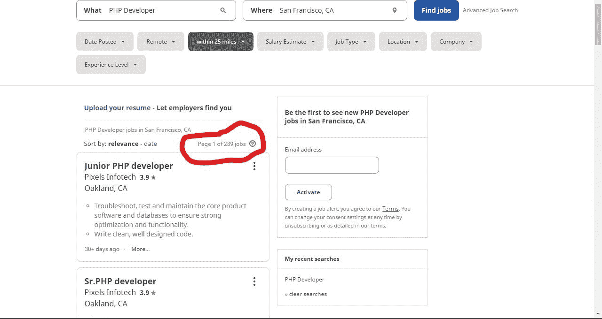
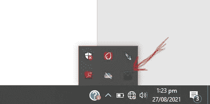
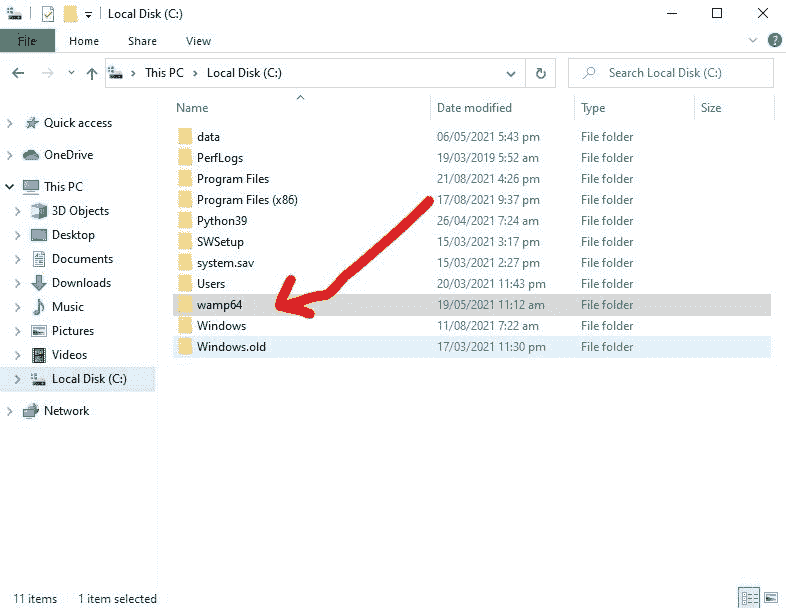
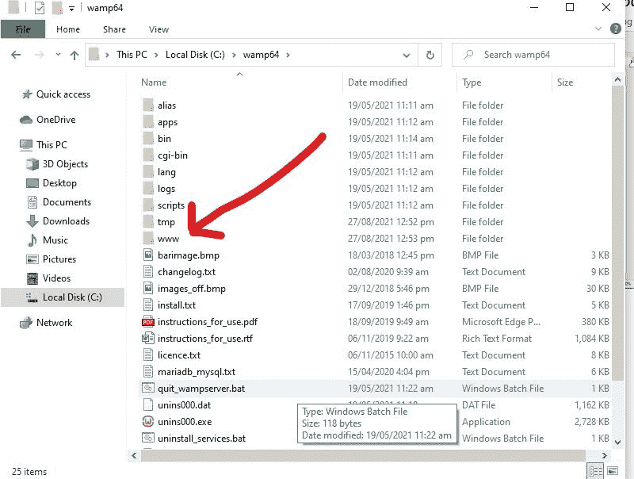
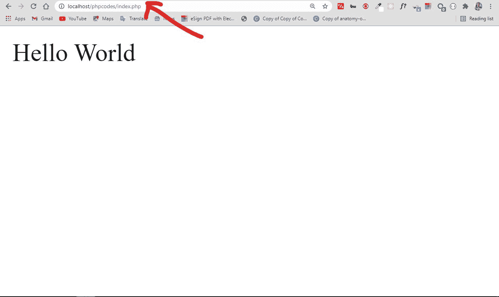
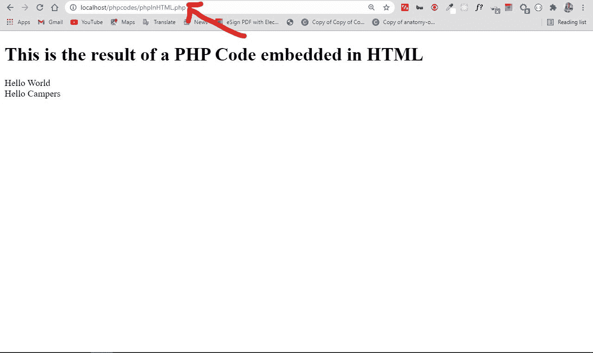

# PHP 是什么？PHP 编程语言含义解释

> 原文：<https://www.freecodecamp.org/news/what-is-php-the-php-programming-language-meaning-explained/>

PHP 是一种开源的服务器端脚本语言，许多开发人员将其用于 web 开发。它也是一种通用语言，可以用来开发许多项目，包括图形用户界面(GUI)。

在本文中，我将帮助您探索 PHP 的世界，这样您就可以了解它是如何工作的以及它的基本特性。最后，你将能够用 PHP 编写你的第一个 Hello World 程序。

## PHP 是什么意思？

缩写 PHP 最初代表个人主页。但现在它是超文本预处理器的递归首字母缩略词。(从第一个单词本身是缩写的意义上来说，它是递归的，所以完整的意思不跟随缩写。)

PHP 的第一个版本于 26 年前推出。现在它在 2020 年 11 月发布的第 8 版上，但第 7 版仍然是使用最广泛的。

PHP 运行在 Zend 引擎上，这是最流行的实现。还有一些其他的实现，像 parrot，HPVM (Hip Hop 虚拟机)，以及脸书创建的 Hip Hop。

PHP 主要用于制作网络服务器。它可以在浏览器上运行，也可以在命令行中运行。因此，如果您不想在浏览器中显示代码输出，可以在终端中显示。

## PHP 的优势

PHP 有一些使它如此受欢迎的优势，并且它已经成为 web 服务器的首选语言超过 15 年了。以下是 PHP 的一些好处:

*   跨平台:PHP 是独立于平台的。使用它不需要特定的操作系统，因为它可以在任何平台上运行，无论是 Mac、Windows 还是 Linux。

*   开源:PHP 是开源的。原始代码对任何想在其上构建的人都是可用的。这也是其框架之一 Laravel 如此受欢迎的原因之一。

*   易学:PHP 对于绝对初学者来说并不难学。如果你已经掌握了编程知识，你可以很好地掌握它。

*   PHP 与所有数据库同步:您可以轻松地将 PHP 连接到所有数据库，无论是关系数据库还是非关系数据库。因此它可以立即连接到 MySQL、Postgress、MongoDB 或任何其他数据库。

*   支持性社区:PHP 有一个非常支持性的在线社区。官方文档提供了如何使用这些功能的指南，您可以在遇到问题时轻松解决问题。

## 谁使用 PHP

许多老牌公司和科技巨头使用 PHP 运行他们的服务器，做出了许多令人难以置信的事情。

*   脸书:脸书使用 PHP 开发其网站。反过来，该公司通过创建一个名为 Hip Hop for PHP 的实现对社区做出了贡献。

*   维基百科:世界上最大的任何主题的信息来源之一，维基百科是用 PHP 开发的。

*   内容管理系统(CMSs):世界上最流行的内容管理系统 WordPress 是用 PHP 开发的。其他内容管理系统如 Drupal、Joomla 和 Magento 也是用 PHP 构建的。Shopify 也运行在 PHP 上。

*   虚拟主机平台:许多虚拟主机平台，如 BlueHost、Site ground 和 Whogohost 都使用 PHP 运行它们的主机服务器。

## PHP 是不是要死了？

如今，关于 PHP 是否在走下坡路有一场激烈的争论。这是因为适合服务器端的其他语言的出现和日益流行，如 JavaScript (Node JS)、Python、Golang 等。

这实际上导致了许多针对 PHP
的有趣迷因

但是 PHP 真的要死了吗？答案是否定的。尽管有些人抨击它，声称它正在衰落，但 PHP 仍然被用来运行今天几乎 80%的网站的服务器。所以，如果你一天访问 10 个网站，有可能其中 8 个使用 PHP。

就工作可用性而言，PHP 确实比工作平台上的许多其他编程语言排名更好。许多 PHP 开发人员每年通过制作 WordPress 主题和插件过着不错的生活——美国 PHP 开发人员的平均年收入为 86，000 美元。



## 如何用 PHP 编写你的第一个 Hello World 程序

既然您已经了解了 PHP 及其优势，是时候用它编写您的第一个 Hello World 程序了！

首先，你必须在本地机器上安装 PHP。您可以通过安装 XAMP(跨平台、Apache、MySQL 和 PHP)或 WAMP (Windows、Apache、MySQL 和 PHP)服务器来实现。

XAMP 可以在所有操作系统上运行，而 WAMP 只能在 Windows 上运行。我会用 WAMP。

打开 WAMP 或 XAMP 服务器，确保所有服务都在运行。如果您使用的是 WAMP，WAMP 徽标应该会以绿色显示在任务栏上。



打开你的`C`驱动器，寻找你的 WAMP 服务器的安装目录。我的情况是`wamp64`。



打开安装目录，然后打开`www`文件夹。



在那里创建一个文件夹，并随意命名，然后用代码编辑器打开该文件夹。

创建一个`index.php`文件并粘贴以下代码:

```
<?php

echo "Hello World";

?> 
```

您还可以将“Hello World”文本放在一个变量中，然后使用 echo 系统在浏览器中显示它。

在 PHP 中，可以用美元符号($)声明一个变量。除了最后一条语句，您的语句也必须以分号结束。

```
<?php

$greeting = "Hello World";
echo $greeting

?> 
```

要在浏览器中运行您的代码，打开浏览器并在地址栏`localhost/the-folder-of-your-php-file/php-file.php`中写下，然后点击 enter。

请确保您的 WAMP 或 XAMP 服务器正在运行，否则它将无法工作。



您可以看到代码成功地在浏览器中运行，因为我得到了正确的文件路径。

PHP 的另一个优点是你可以把它嵌入到 HTML 中。你可以这样做:

```
<!DOCTYPE html>
<html lang="en">
<head>
    <meta charset="UTF-8">
    <meta http-equiv="X-UA-Compatible" content="IE=edge">
    <meta name="viewport" content="width=device-width, initial-scale=1.0">
    <title>PHP Code</title>
</head>
<body>
    <h1> This is the result of a PHP Code embedded in HTML</h1>

        <?php 
            $greeting = "Hello World";
            $campers = "Hello Campers";

            echo $greeting;
            echo "<br>";
            echo $campers
        ?>
</body>
</html> 
```



## 结论

PHP 仍然是 web 开发中相关且广泛使用的语言。尽管存在对它是否仍然有价值的嘲笑和争论，PHP 开发人员仍然通过使用这种语言赚得盆满钵满。所以，PHP 看起来不会很快走向任何地方。

现在，去写一些 PHP 代码吧！

感谢阅读，继续编码。