# NodeJS 中的事件循环——同步和异步代码初学者指南

> 原文：<https://www.freecodecamp.org/news/nodejs-eventloop-tutorial/>

NodeJS 是一个异步事件驱动的 JavaScript 运行时环境，旨在构建可伸缩的网络应用程序。

这里的异步指的是 JavaScript 中所有那些在后台处理的函数，不会阻塞任何其他请求。

在本文中，您将学习并理解 NodeJS 如何工作，以及如何处理发送到服务器的所有功能或请求，无论是同步发送到服务器的*、异步发送到服务器的*还是异步发送到服务器的*。*

## 什么是事件循环？

您可能猜对了——Node 在 NodeJS 环境中使用一个**事件循环**来处理请求。但首先，让我们了解一些基本术语，这将有助于我们理解整个机制。

事件循环是一个**事件监听器**，它在 NodeJS 环境中运行，并且总是准备好监听、处理和输出一个*事件*。

事件可以是从鼠标点击到按键或超时的任何事件。

## 什么是同步和异步编程？

**同步编程**意味着代码按照定义的顺序运行。在同步程序中，当一个函数被调用并返回某个值时，只有这时才会执行下一行。

让我们用这个例子来理解:

```
const listItems = function(items) {
  items.forEach(function(item) {
    console.log(item)
  })
}

const items = ["Buy milk", "Buy coffee"]

listItems(items) 
```

```
The output will look like this:

"Buy milk"
"Buy coffee" 
```

在这个例子中，当调用`listItems(items)`函数时，它将遍历项目数组。对于数组的第一项，首先调用`console.log(item)`函数，并打印出`"Buy milk"`。然后`console.log(item)`再次被执行，这次它传递数组的第二项并打印`"Buy coffee"`。

所以你可以说这个函数是按照它被定义的**序列**执行的。

**异步编程**则是指不按顺序执行的代码。这些功能不是按照它们在程序中定义的顺序执行的，而是只有在满足某些条件时才执行。

例如，`setTimeOut()`在某个预定义毫秒数的延迟后执行任务。

```
setTimeOut(function(){
    return( console.log("Hello World!") )
}, 3000) 
```

这些函数不会逐行运行，而是只在需要运行时才运行，与函数声明无关。在这种情况下，当所有同步功能执行完毕后，该功能将在 3 秒钟后自动运行。

*注意:异步功能只有在所有同步功能执行完毕后才会运行和执行。在此之前，它们将在后台处理。*

如果你想了解更多关于 NodeJS 和异步编程的知识，可以参考这篇[文章](https://www.freecodecamp.org/news/node-js-what-when-where-why-how-ab8424886e2/)

但是，NodeJS 是如何在后台处理异步函数，先运行所有同步函数的呢？用 NodeJS 事件循环可以很容易地解释所有这些机制。

## 事件循环是如何工作的？

现在让我们看看 Nodejs 事件循环如何使用 NodeJS 事件循环图执行一个简单的同步程序。然后我们将逐行检查 Node 是如何执行程序的。

在我们学习这一部分的过程中，你会开始理解你在这里看到的东西:
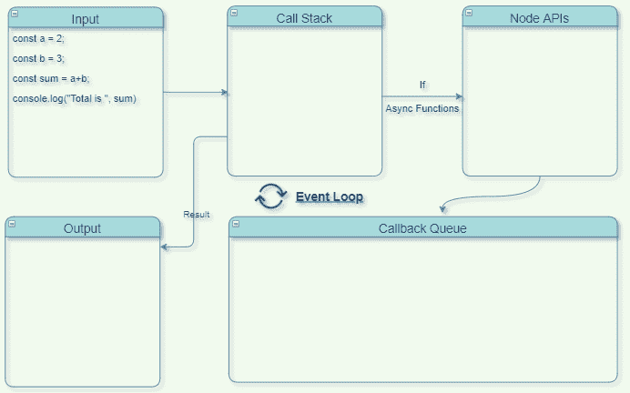

在左上角，有一个将要执行的节点文件。在左下角，你有一个程序的输出终端。然后是*调用栈、节点 API 和回调队列。*所有这些共同构成了 NodeJS 环境。

对于同步编程，您只需要关注调用堆栈。这是 NodeJS 环境中唯一可以在这种情况下工作的部分。

回调堆栈是一种数据结构，用于跟踪程序内部运行的所有函数的执行情况。这个数据结构只有一个添加或删除顶层项目的开放端。

当程序开始执行时，它首先被包装在一个匿名的`main()`函数中。这是由 NodeJS 自动定义的。所以`main()`首先被推送到回调堆栈。

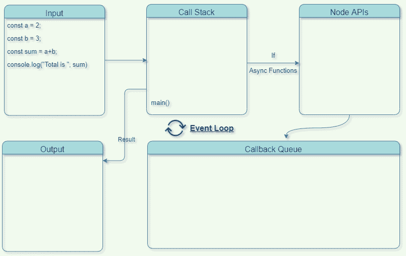

接下来，变量`a`和`b`被创建，它们的总和被存储在变量`sum`中。所有这些值都存储在内存中。

现在，`console.log()`是一个在回调栈中被调用和推送的函数。它被执行，你可以在终端屏幕上看到输出。

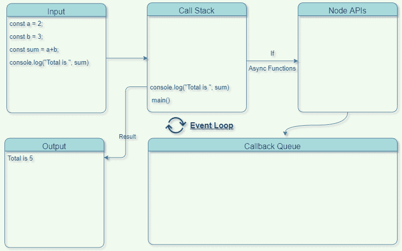

在这个函数被执行后，它被从回调栈中移除。然后`main()`也被删除，因为程序中没有什么可调用的了。这就是同步程序的执行方式。

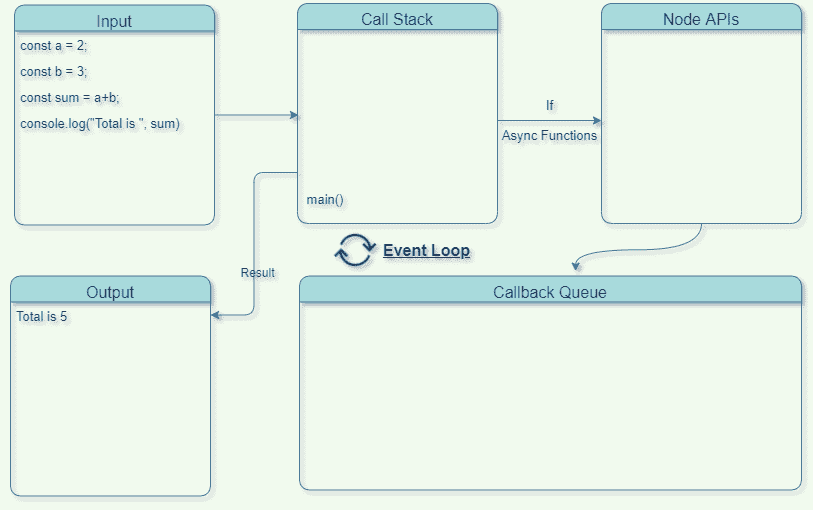


现在，让我们看看异步函数或程序是如何在 NodeJS 内部执行的。我们需要回调栈、节点 API 和回调队列一起处理异步函数。

让我们从看这个例子开始:

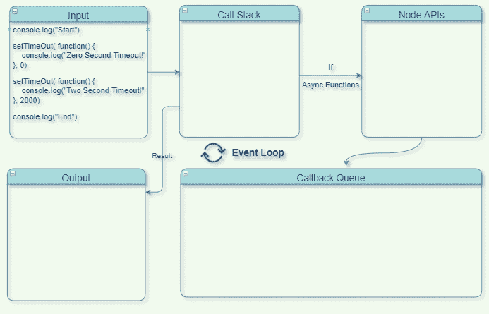

通常，当程序开始执行时，首先将`main()`函数添加到回调堆栈中。然后调用`console.log("Start")`并将其添加到回调堆栈中。处理之后，输出在终端上可见，然后从回调栈中移除。

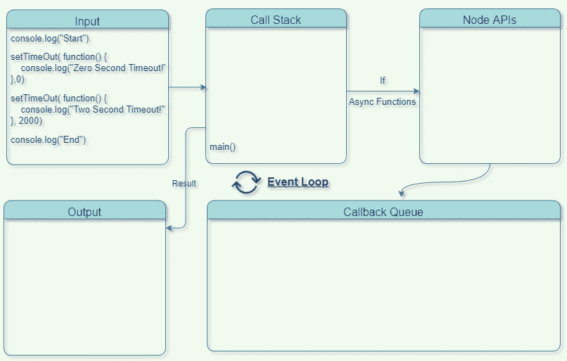


接下来是添加到回调堆栈中的`setTimeOut(...Zero...)`函数。

由于这是一个异步函数，它将**而不是**在回调栈中被处理。然后将它从回调栈添加到节点 API，在那里注册一个事件，并设置一个回调函数在后台处理。

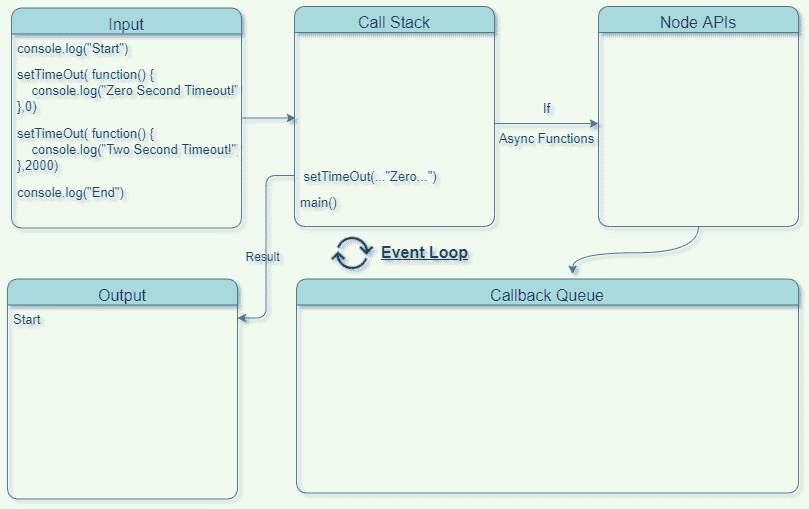


接下来是`setTimeOut(...Two..)`，它也被从回调栈添加到节点 API，因为它是一个异步函数。然后，另一个回调函数被设置为在后台超时 2 秒后处理。在此之前，可以执行其他功能。

这被称为**非阻塞**行为，其中所有同步功能首先被处理和执行，异步功能在后台处理，同时等待它们被执行。


接下来，`console.log("End")`函数最终在回调栈中被调用，并在这里得到处理。您可以在终端上看到输出。现在，所有的同步函数都被处理了，并且`main()`被从回调栈中移除。

在后台，所有的异步函数得到处理，它们的回调存储在回调队列中。首先被处理的那个将首先被添加到队列中，以便在回调堆栈中执行。

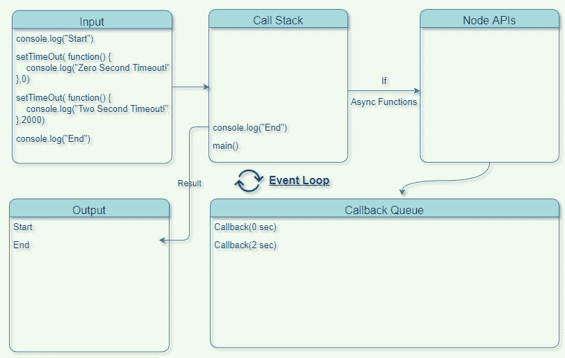
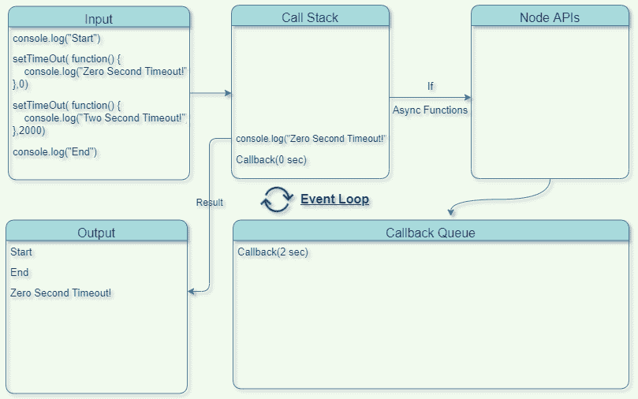


*注意:异步函数不能在回调栈中运行，直到它被清空。这意味着在从调用栈中移除了`main()`之后，所有的异步函数才能开始执行。*

现在，使用**事件循环**将它们一个接一个地推入回调堆栈，并最终执行。每次调用`console.log()`函数时，每个回调函数都会打印值。

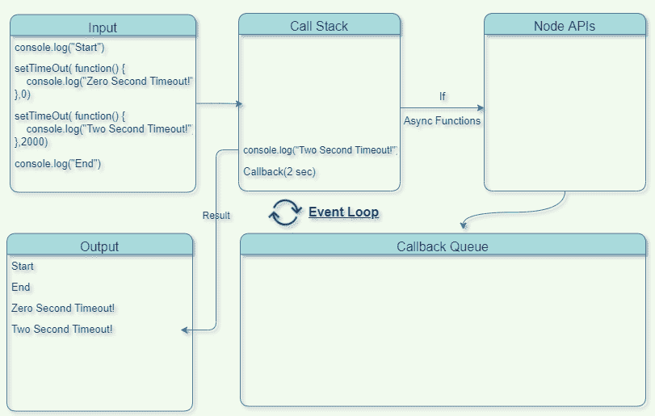

最后，它们在被执行后也被移除，现在回调栈是空的。

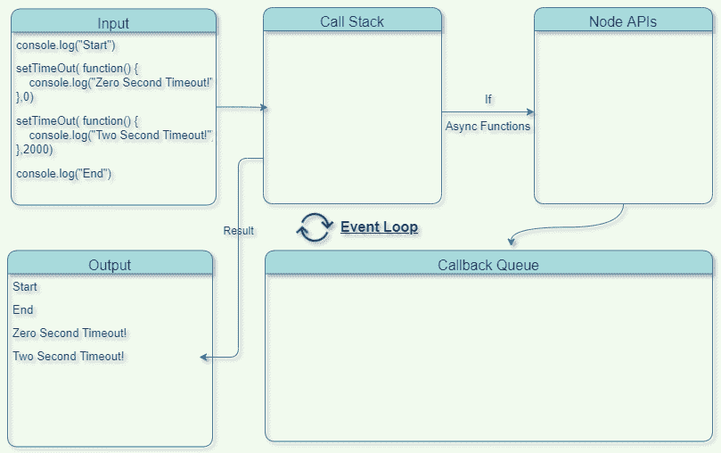

这就是 NodeJS 如何在环境中执行同步和异步函数，以及事件循环如何设法调用异步函数。

## 结论

在本文中，您了解了 NodeJS 的内部工作方式，并看到了异步程序是如何执行的。

现在你应该明白为什么两秒钟的延时功能不会阻止程序的其余部分执行。你也知道为什么零秒延迟函数在“End”打印之后最后打印出值。

仅此而已！我希望你喜欢阅读这篇文章，并学到一些新的东西。如果你觉得这篇文章有用，一定要分享。